# 快速入门：尝试基于云的远程监视解决方案

本快速入门介绍了如何部署 Azure IoT 远程监视解决方案加速器。 在这个基于云的解决方案中，请使用“仪表板”页在地图上直观显示模拟设备，并使用“维护”页对模拟的冷却器设备发出的压力警报做出响应。   可以将此解决方案加速器用作你自己的实现的起点，或者将其用作学习工具。

初始部署为名为 Contoso 的公司配置解决方案加速器。 作为 Contoso 的操作员，你管理不同物理环境中部署的各种不同设备类型，例如冷却器。 冷却器设备将温度、湿度和压力遥测数据发送到远程监视解决方案加速器。

本快速入门部署**基本**版解决方案加速器，以便进行测试和演示，最大程度降低成本。 若要详细了解可供部署的不同版本，请参阅[基本部署和标准部署](iot-accelerators-remote-monitoring-deploy-cli.md#basic-and-standard-deployments)。

若要完成本快速入门，需要一个有效的 Azure 订阅。

如果没有 Azure 订阅，请在开始之前创建一个[免费帐户](https://azure.microsoft.com/free/?WT.mc_id=A261C142F)。

## 部署解决方案

将解决方案加速器部署到 Azure 订阅时，必须设置一些配置选项。

使用 Azure 帐户凭据登录到 [azureiotsolutions.com](https://www.azureiotsolutions.com/Accelerators)。

单击“远程监视”磁贴。  在“远程监视”页上，单击“立即试用”：  

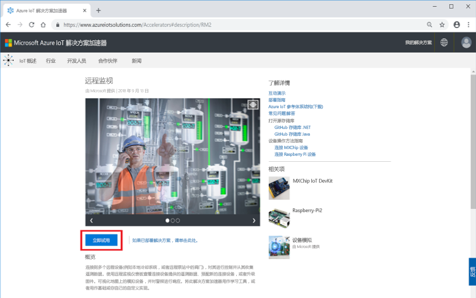

选择“C# 微服务”作为“部署选项”。   Java 和 C# 实现具有相同的功能。

确保为远程监视解决方案加速器输入唯一的**解决方案名称**。 对于本快速入门，我们将其命名为 **contoso-rm**。

选择要用于部署解决方案加速器的**订阅**和**区域**。 通常，我们会选择离自己最近的区域。 对于本快速入门，我们将使用“美国东部”。 
可以选择 **Visual Studio Enterprise**，但必须是[全局管理员或用户](iot-accelerators-permissions.md)才能这样做。

若要开始部署，请单击“创建”。  此过程至少需要五分钟才能完成运行：

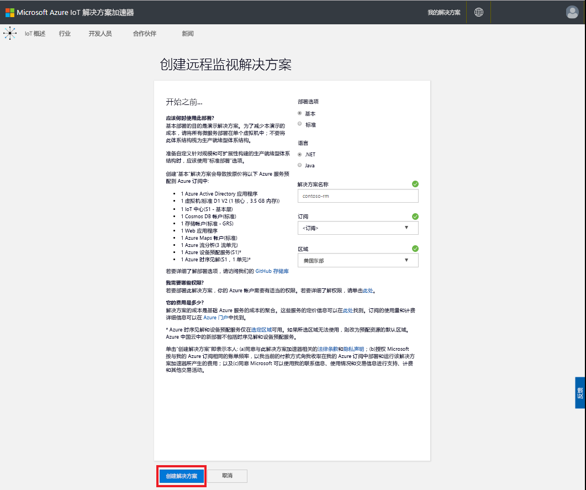

## 登录到解决方案

完成部署到 Azure 订阅后，解决方案磁贴上会出现一个绿色的对号和“就绪”  。 现在，你可以登录到你的远程监视解决方案加速器仪表板。

在“预配的解决方案”  页上，单击新的远程监视解决方案加速器：

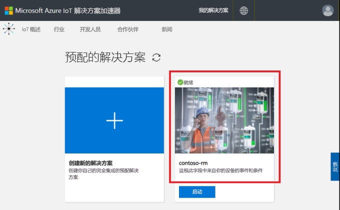

可以在显示的面板中查看有关远程监视解决方案加速器的信息。 选择“转到解决方案加速器”  ，查看远程监视解决方案加速器：

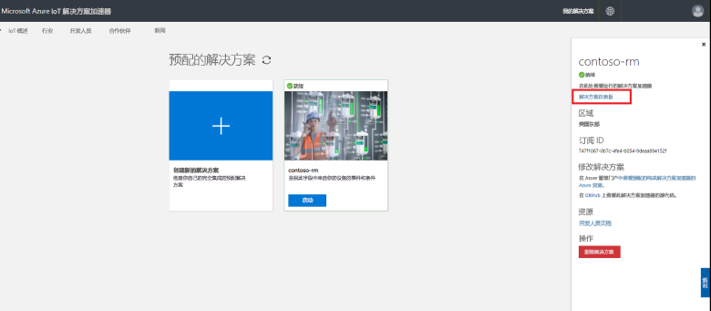

单击“接受”以接受权限请求，远程监视解决方案仪表板会在浏览器中显示： 

[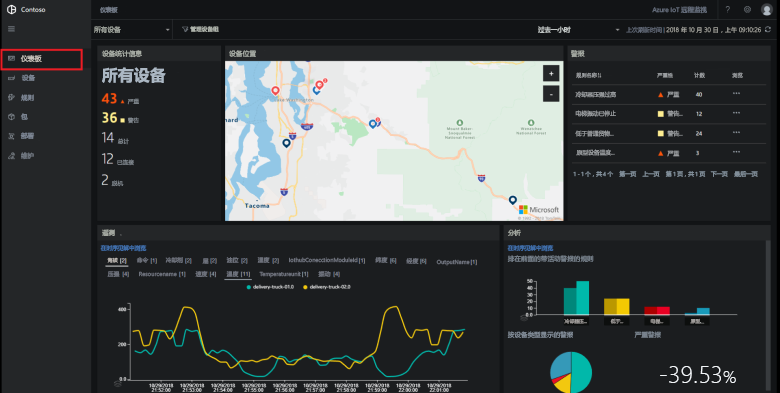](./media/quickstart-remote-monitoring-deploy/solutiondashboard-expanded.png#lightbox)

## 查看设备

解决方案仪表板显示有关 Contoso 的模拟设备的以下信息：

* “设备统计信息”面板显示有关警报和设备总数的摘要信息。  在默认部署中，Contoso 有 10 个不同类型的模拟设备。

* “设备位置”面板显示设备的物理位置。  当设备发出了警报时，图钉会以彩色显示。

* “警报”面板显示设备发出的警报的详细信息。 

* “遥测”面板显示设备发出的遥测数据。  单击顶部的遥测类型可以查看不同的遥测数据流。

* “分析”面板显示设备发出的警报的组合信息。 

## 响应警报

Contoso 的操作员可以通过解决方案仪表板监视设备。 “设备统计信息”面板显示已有许多严重警报，“警报”面板显示其中的大多数警报来自某个冷却器设备。   对于 Contoso 的冷却器设备而言，内部压力超过 250 PSI 即表示设备工作不正常。

### 识别问题

在“仪表板”页上的“警报”面板中，可以看到“冷却器压力过高”警报。    该冷却器在地图上对应于一个红色图钉（可能需要平移和放大地图）：

[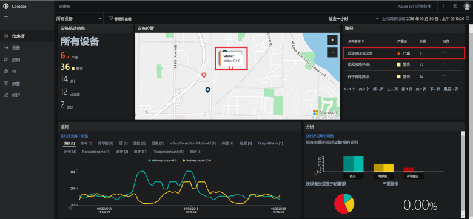](./media/quickstart-remote-monitoring-deploy/dashboardalarm-expanded.png#lightbox)

在“警报”面板中，单击“冷却器压力过高”规则旁边的“浏览”列中的“...”。     执行此操作后，会显示“维护”页，可在其中查看触发警报的规则的详细信息。 

“冷却器压力过高”维护页显示触发警报的规则的详细信息。  该页面还会列出警报的发生时间，以及触发这些警报的设备：

[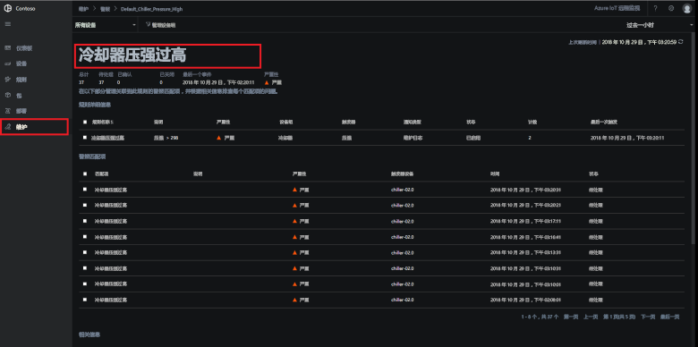](./media/quickstart-remote-monitoring-deploy/maintenancealarmlist-expanded.png#lightbox)

现已识别触发警报的问题和关联的设备。 作为操作员，你要执行的后续步骤是确认警报并解决问题。

### 解决问题

若要向其他操作员指出你正在处理警报，请选择该警报，并将“警报状态”更改为“已确认”：  

[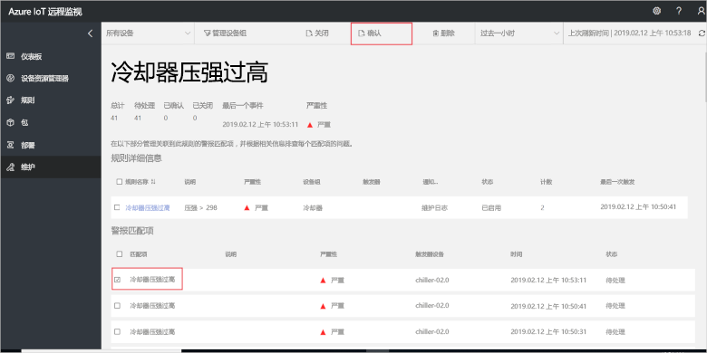](./media/quickstart-remote-monitoring-deploy/maintenanceacknowledge-expanded.png#lightbox)

状态列中的值将更改为“已确认”。 

若要对冷却器采取措施，请向下滚动到“相关信息”，在“发出警报的设备”列表中选择冷却器设备，然后选择“作业”：   

[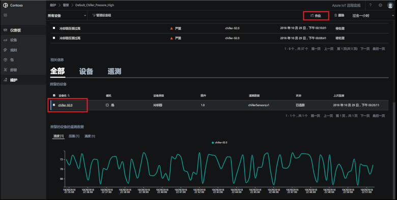](./media/quickstart-remote-monitoring-deploy/maintenanceschedule-expanded.png#lightbox)

在“作业”  面板中，选择“运行方法”  ，然后选择“EmergencyValveRelease”方法。  添加作业名称“ChillerPressureRelease”  ，单击“应用”。  这些设置会为你创建一个可立即执行的作业。

若要查看作业状态，请返回“维护”页，并在“作业”视图中查看作业列表。   可能需要等待几秒钟才能看到该作业已运行：

[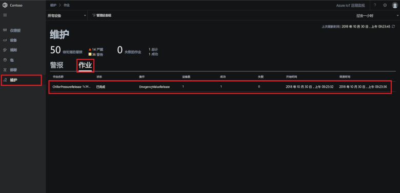](./media/quickstart-remote-monitoring-deploy/maintenancerunningjob-expanded.png#lightbox)

### 检查压力是否恢复正常

若要查看冷却器的压力遥测数据，请导航到“仪表板”页，在遥测面板中选择“压力”，并确认 **chiller-02.0** 的压力已恢复正常： 

[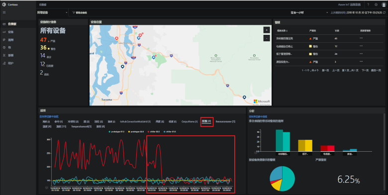](./media/quickstart-remote-monitoring-deploy/pressurenormal-expanded.png#lightbox)

若要关闭事件，请导航到“维护”页，选择警报，将状态设置为“已关闭”：  

[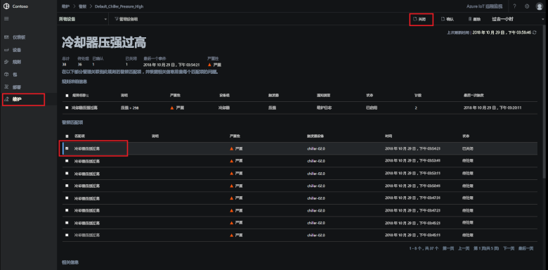](./media/quickstart-remote-monitoring-deploy/maintenanceclose-expanded.png#lightbox)

状态列中的值将更改为“已关闭”。 

## 清理资源

如果打算继续学习教程，请将远程监视解决方案加速器保持为部署状态。

如果不再需要该解决方案加速器，请从[预配的解决方案](https://www.azureiotsolutions.com/Accelerators#dashboard)页中选择它，然后单击“删除解决方案”  以将其删除：

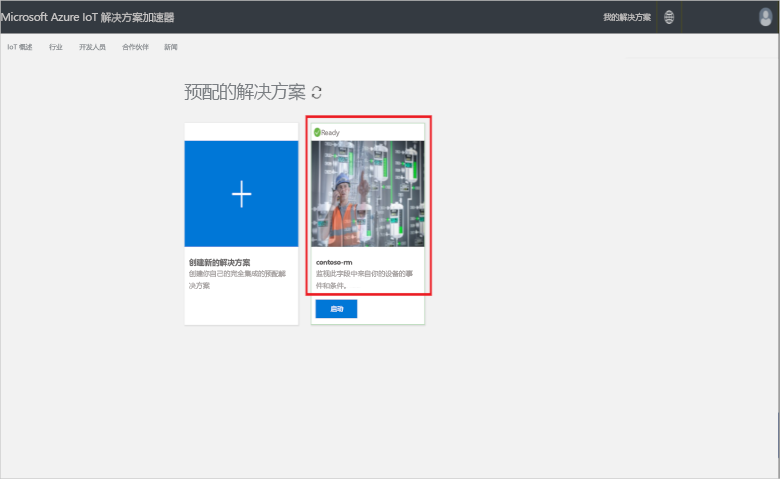

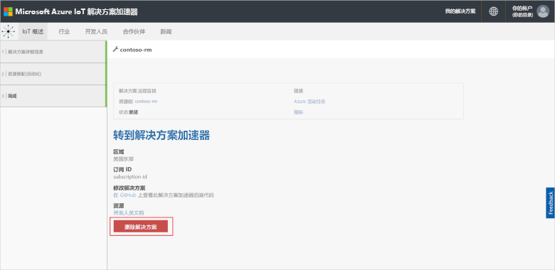

## 后续步骤

在本快速入门中，我们已部署远程监视解决方案加速器，并使用默认 Contoso 部署中的模拟设备完成了监视任务。

若要详细了解使用模拟设备的解决方案加速器，请继续阅读以下文章。

> [!div class="nextstepaction"]
> [教程：监视 IoT 设备](iot-accelerators-remote-monitoring-monitor.md)