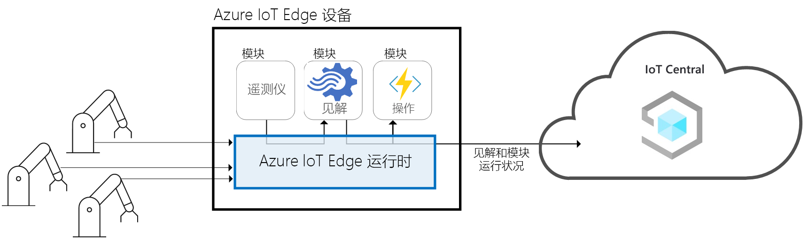
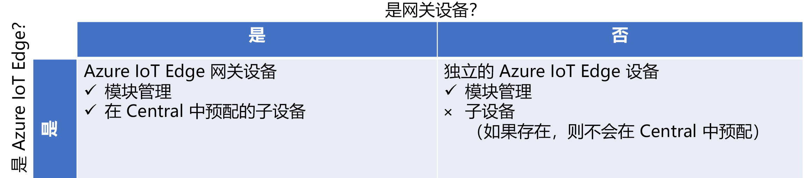
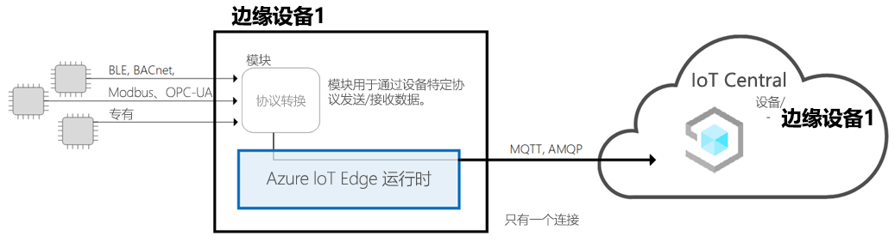
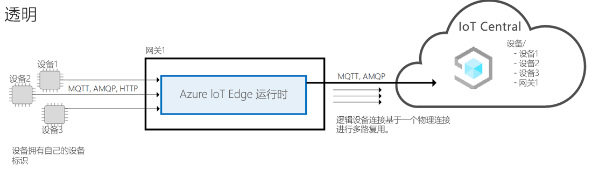
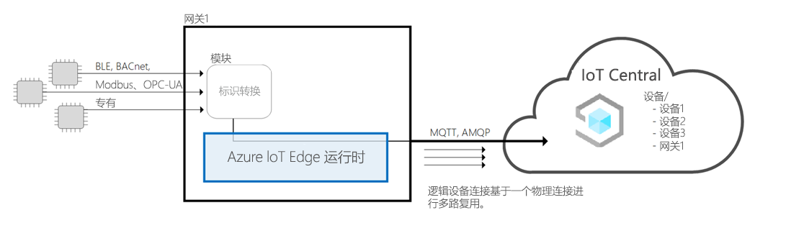
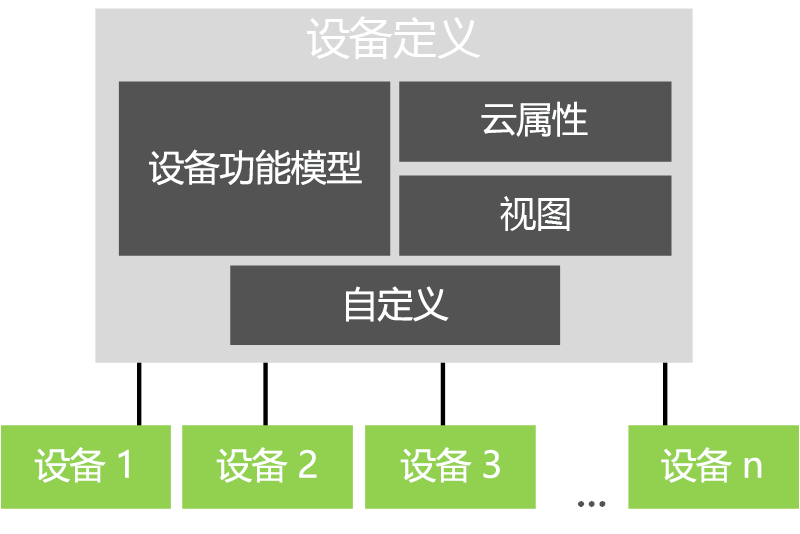

# Azure IoT Central 体系结构

本文概述 Microsoft Azure IoT Central 体系结构。

## 设备

设备与 Azure IoT Central 应用程序交换数据。 设备可以：

- 发送度量，例如遥测。
- 与应用程序同步设置。

在 Azure IoT Central 中，设备可以与应用程序交换的数据在设备模板中指定。 有关设备模板的详细信息，请参阅[元数据管理](#metadata-management)。

若要详细了解设备如何连接到 Azure IoT Central 应用程序，请参阅[设备连接](concepts-get-connected.md)。

## Azure IoT Edge 设备

除了使用 [Azure IoT SDK](https://github.com/Azure/azure-iot-sdks) 创建的设备之外，还可以将 [Azure IoT Edge 设备](../../iot-edge/about-iot-edge.md)连接到 IoT Central 应用程序。 IoT Edge 使你可以直接在 IoT Central 管理的 IoT 设备上运行云智能和自定义逻辑。 IoT Edge 运行时使你能够：

- 在设备上安装和更新工作负荷。
- 在设备上维护 IoT Edge 安全标准。
- 确保 IoT Edge 模块始终处于运行状态。
- 将模块运行状况报告给云以进行远程监视。
- 管理下游叶设备与 IoT Edge 设备之间、IoT Edge 设备上的模块之间以及 IoT Edge 设备与云之间的通信。

IoT Central 为 IoT Edge 设备启用以下功能：

- 用于描述 IoT Edge 设备功能的设备模板，例如：
  - 部署清单上传功能，可帮助你管理各种设备的清单。
  - IoT Edge 设备上运行的模块。
  - 每个模块发送的遥测。
  - 每个模块报告的属性。
  - 每个模块响应的命令。
  - IoT Edge 网关设备功能模型和下游设备功能模型之间的关系。
  - 未存储在 IoT Edge 设备上的云属性。
  - 属于 IoT Central 应用程序的自定义、仪表板和窗体。

  有关详细信息，请参阅 "[将 Azure IoT Edge 设备连接到 Azure IoT Central 应用程序" 一](./concepts-iot-edge.md)文。

- 能够使用 Azure IoT 设备预配服务大规模预配 IoT Edge 设备
- 规则和操作。
- 自定义仪表板和分析。
- 从 IoT Edge 设备连续导出遥测数据。

### IoT Edge 设备类型

IoT Central 分类 IoT Edge 设备类型，如下所示：

- 叶设备。 IoT Edge 设备可以具有下游叶设备，但不会在 IoT Central 中设置这些设备。
- 具有下游设备的网关设备。 网关设备和下游设备均在 IoT Central 中进行预配

### IoT Edge 模式

IoT Central 支持以下 IoT Edge 设备模式：

#### IoT Edge 为叶设备

IoT Edge 设备在 IoT Central 中预配，任何下游设备及其遥测均表示为来自 IoT Edge 设备。 未在 IoT Central 中预配连接到 IoT Edge 设备的下游设备。

#### IoT Edge 网关设备连接到具有标识的下游设备

IoT Edge 设备与连接到 IoT Edge 设备的下游设备一起在 IoT Central 中预配。 当前不支持通过网关预配下游设备的运行时支持。

#### 使用 IoT Edge 网关提供的标识连接到下游设备的 IoT Edge 网关设备

IoT Edge 设备与连接到 IoT Edge 设备的下游设备一起在 IoT Central 中预配。 当前不支持向下游设备提供标识和预配下游设备的网关的运行时支持。 如果你引入自己的标识翻译模块，IoT Central 可以支持此模式。

## 云网关

Azure IoT Central 使用 Azure IoT 中心作为启用设备连接的云网关。 IoT 中心允许：

- 在云中进行大规模数据引入。
- 设备管理。
- 安全的设备连接。

若要详细了解 IoT 中心，请参阅 [Azure IoT 中心](https://docs.microsoft.com/azure/iot-hub/)。

若要详细了解 Azure IoT Central 中的设备连接，请参阅[设备连接](concepts-get-connected.md)。

## 数据存储

Azure IoT Central 在云中存储应用程序数据。 存储的应用程序数据包括：

- 设备模板。
- 设备标识。
- 设备元数据。
- 用户和角色数据。

Azure IoT Central 将时序存储用于从设备发送的度量数据。 设备提供的时序数据供分析服务使用。

## 分析

分析服务负责生成应用程序显示的自定义报告数据。 操作员可以[自定义在应用程序中显示的分析](howto-create-analytics.md)。 分析服务在 [Azure 时序见解](https://azure.microsoft.com/services/time-series-insights/)基础上构建，可以处理从设备发送的度量数据。

## 规则和操作

[规则和操作](tutorial-create-telemetry-rules.md)可以紧密地配合使用，以便自动完成应用程序中的任务。 开发者可以根据设备遥测（例如温度超过定义的阈值）来定义规则。 Azure IoT Central 使用流处理器来确定何时满足规则条件。 规则条件在得到满足的情况下，会触发开发者定义的操作。 例如，可以通过某个操作向工程师发送通知电子邮件，告知对方设备中的温度过高。

## 元数据管理

在 Azure IoT Central 应用程序中，设备模板用于定义设备类型的行为和功能。 例如，致冷器设备模板指定致冷器发送给应用程序的遥测。

在 IoT Central 应用程序设备模板中包含：

- **设备功能模型**指定设备的功能，如它发送的遥测、定义设备状态的属性，以及设备响应的命令。 设备功能组织为一个或多个接口。 有关设备功能模型的详细信息，请参阅[IoT 即插即用（预览版）](../../iot-pnp/overview-iot-plug-and-play.md)文档。
- **Cloud properties**为设备指定 IoT Central 存储属性。 这些属性仅存储在 IoT Central 中，不会发送到设备。
- **视图**指定生成器创建的仪表板和窗体，以使操作员能够监视和管理设备。
- **自定义**允许生成器覆盖设备功能模型中的某些定义，使其更与 IoT Central 应用程序相关。

一个应用程序可以有一个或多个基于每个设备模板的模拟设备和真实设备。

## 数据导出

在 Azure IoT Central 应用程序中，可以将[数据连续导出](howto-export-data.md)到自己的 Azure 事件中心和 Azure 服务总线实例。 还可以定期将数据导出到 Azure Blob 存储帐户。 IoT Central 可以导出度量、设备和设备模板。

## 批处理设备更新

在 Azure IoT Central 应用程序中，可以[创建和运行作业](howto-run-a-job.md)来管理连接设备。 通过这些作业，可以对设备属性或设置进行大容量更新或运行命令。 例如，可以创建一个作业来提高多个 refrigerated 自动售货机机的风扇速度。

## 基于角色的访问控制 (RBAC)

管理员可以使用预定义角色之一或通过创建自定义角色来定义 Azure IoT Central 应用程序的[访问规则](howto-manage-users-roles.md)。 角色确定用户有权访问的应用程序区域以及可执行的操作。

## 安全性

Azure IoT Central 中的安全功能包括：

- 对传输中的和静止时的数据加密。
- 通过 Azure Active Directory 或 Microsoft 帐户提供身份验证。 支持双重身份验证。
- 完全的租户隔离。
- 设备级别安全性。

## UI Shell

UI Shell 是一个现代的基于 HTML5 浏览器的应用程序，响应速度快。
管理员可以通过应用自定义主题和修改帮助链接来自定义应用程序的 UI，以指向您自己的自定义帮助资源。 若要了解有关 UI 自定义的详细信息，请参阅[自定义 Azure IOT CENTRAL UI](howto-customize-ui.md)一文。

操作员可以创建个性化的应用程序仪表板。 您可以有多个仪表板，用于显示不同的数据并在它们之间切换。

## 后续步骤

现在，你已了解 Azure IoT Central 的体系结构，接下来要介绍 Azure IoT Central 中的[设备连接](concepts-get-connected.md)。
