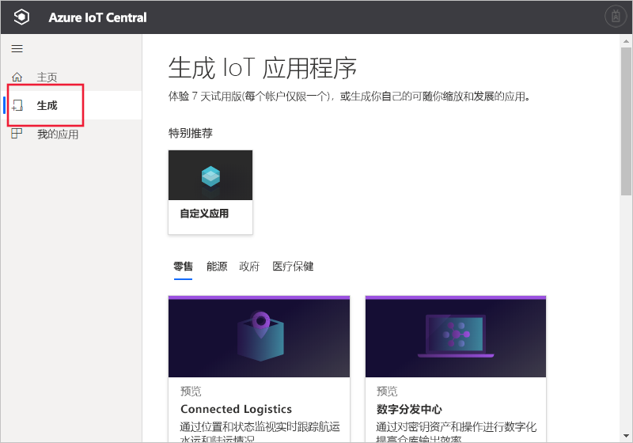

# 创建 Azure IoT Central 应用程序

[!INCLUDE [iot-central-original-pnp](../../../includes/iot-central-original-pnp-note.md)]

构建人员可以使用 Azure IoT Central UI 来定义 Microsoft Azure IoT Central 应用程序。  本快速入门介绍如何创建一个包含示例设备模板的 Azure IoT Central 应用程序。  创建的应用程序不使用任何预览功能。

## 创建应用程序

导航到 [Azure IoT Central 构建](https://aka.ms/iotcentral)网站。 然后使用 Microsoft 个人、工作或学校帐户登录。

若要开始创建未启用预览功能的 Azure IoT Central 应用程序，请选择“构建”  。 此链接会将你转到“构建自己的 IoT 应用程序”页面  。

然后选择“自定义应用”  。

若要创建新的 Azure IoT Central 应用程序：

1. Azure IoT Central 会根据所选应用程序模板自动建议应用程序名称。 可以接受此名称或输入自己的友好应用程序名称，例如 **Contoso IoT**。 Azure IoT Central 还会根据应用程序名称为你生成唯一的 URL。 如果你愿意，可以自由地将此 URL 前缀更改为更令人难忘的内容。

1. 选择不使用预览功能的“旧应用程序”  模板。

    | 应用程序模板 | 说明 |
    | -------------------- | ----------- |
    | 旧应用程序   | 创建一个空的应用程序，以便在其中填充你自己的设备模板和设备。 |

1. 选择付款计划：
   - 7 天免费试用版应用程序可免费使用 7 天，之后便过期  。 它们可以在到期之前随时转换为“即用即付”。  若要创建试用版应用程序，则需要输入联系信息并选择是否接收 Microsoft 发送的信息和使用技巧  。
   - **即用即付**应用程序按设备收费，前 5 台设备免费。 若要创建即用即付应用程序，需要选择“目录”、“Azure 订阅”和“位置”     ：
        - 目录是用于创建应用程序的 Azure Active Directory (AD)  。 它包含用户标识、凭据和其他组织信息。 如果没有 Azure AD，则在创建 Azure 订阅时，系统会为你创建一个 Azure AD。
        - 有了 *Azure 订阅*，就可以创建 Azure 服务的实例。 IoT Central 将在订阅中预配资源。 如果没有 Azure 订阅，则可在 [Azure 注册页](https://aka.ms/createazuresubscription)上创建一个。 创建 Azure 订阅以后，请导航回“创建应用程序”页。  新订阅显示在“Azue 订阅”  下拉列表中。
        - “位置”是你想要创建应用程序的[地理位置](https://azure.microsoft.com/global-infrastructure/geographies/)  。 通常，应选择物理上离设备最近的位置以获得最佳性能。 目前，美国、澳大利亚、亚太地区或欧洲提供 Azure IoT Central     。  选择一个位置后，之后便不能将应用程序移到其他位置。

        可在 [Azure IoT Central 定价页](https://azure.microsoft.com/pricing/details/iot-central/)上了解定价详细信息。

1. 填写之前在步骤 1 中选择的付款计划所需的其他信息。

1. 在页面底部选择“创建”  。

## 后续步骤

在本快速入门中，创建了 IoT Central 应用程序。 下面是建议的后续步骤：

> [!div class="nextstepaction"]
> [在 Azure IoT Central 应用程序中定义新的设备类型](./tutorial-define-device-type.md)
