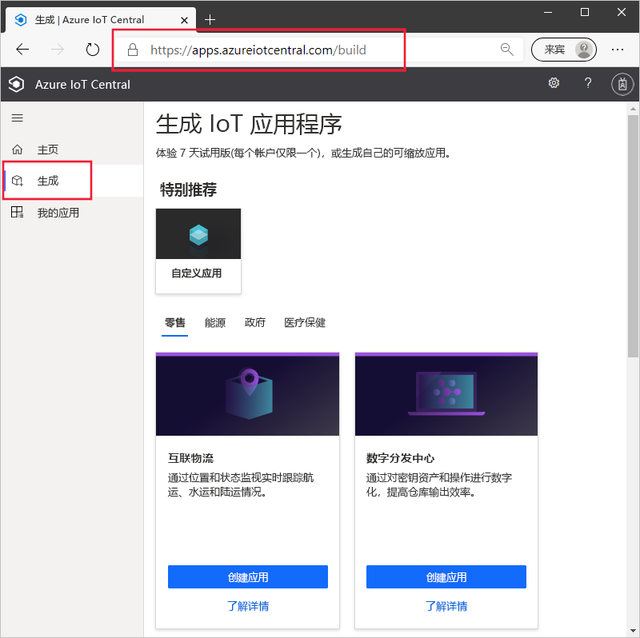
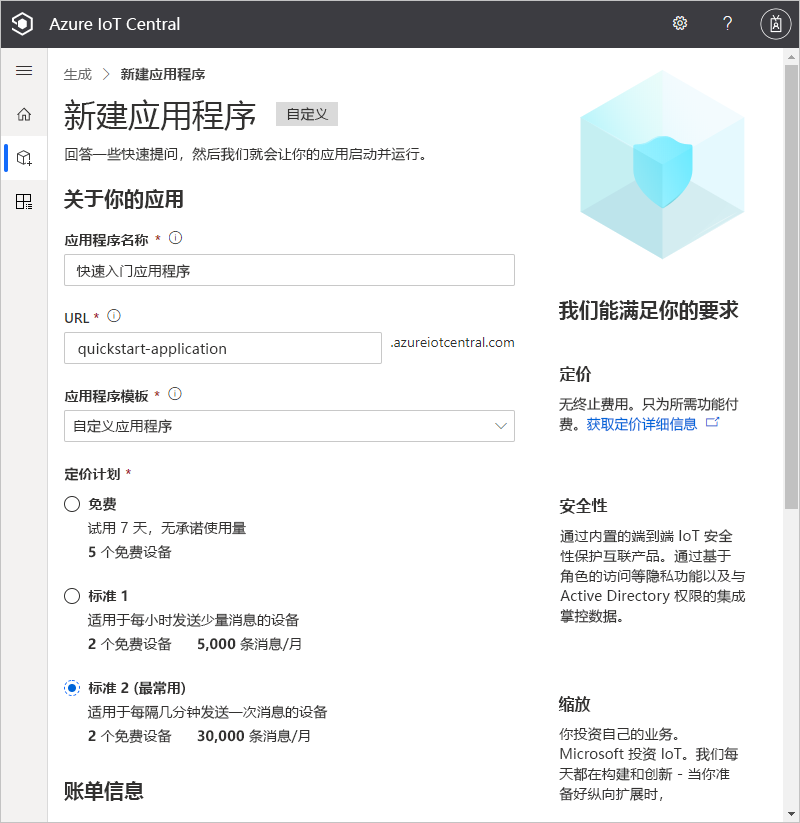
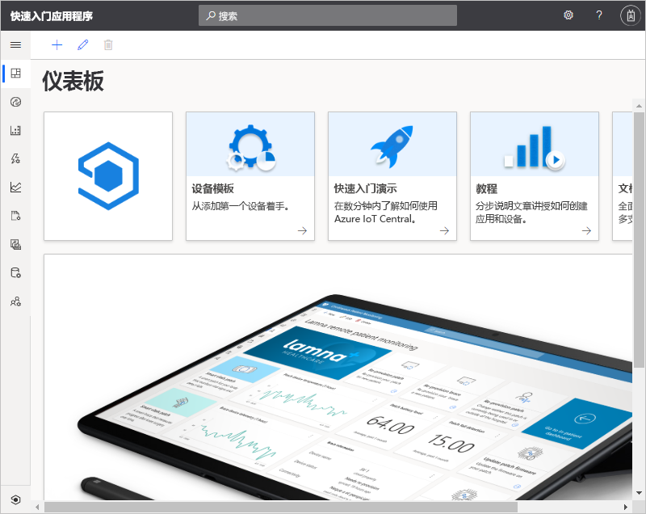

# 创建 Azure IoT Central 应用程序

本快速入门展示了如何创建 Azure IoT Central 应用程序。

## 创建应用程序

导航到 [Azure IoT Central 生成](https://aka.ms/iotcentral)站点。 然后使用 Microsoft 个人、工作或学校帐户登录。

你可以从与行业相关的 IoT Central 模板列表中创建一个新应用程序，帮助你快速入门，也可以使用“自定义应用”模板从头开始  。 在本快速入门中，你将使用**自定义应用**模板。

若要基于**自定义应用**模板创建新的 Azure IoT Central 应用程序，请执行以下操作：

1. 导航到“生成”  页：

    

1. 选择“自定义应用”  并确保选择“自定义应用程序”  模板。

1. Azure IoT Central 会根据所选应用程序模板自动建议应用程序名称  。 可以使用此名称或输入自己的友好应用程序名称。

1. Azure IoT Central 还会根据应用程序名称为你生成唯一的应用程序 URL 前缀  。 使用此 URL 访问应用程序。 如果你愿意，可以将此 URL 前缀更改为更令人难忘的内容。

    

    

    > [!NOTE]
    > 如果你在上一页中选择了“自定义应用”  ，则会看到一个“应用程序模板”  下拉列表。 从这里，你可以在自定义模板与旧模板之间切换。 你可能还会看到为组织提供的其他模板。

1. 选择使用 7 天免费试用版定价计划或标准定价计划之一创建此应用程序：

    - 使用*免费*计划创建的应用程序在七天内是免费的，并且最多支持五台设备。 在它们到期之前，可以随时将它们转换为使用标准定价计划。
    - 使用*标准*计划创建的应用程序按设备计费，你可以选择“标准 1”  或“标准 2”  定价计划，前两个设备是免费的。 在 [Azure IoT Central 定价页](https://azure.microsoft.com/pricing/details/iot-central/)上详细了解免费和标准定价计划。 如果创建标准应用程序，你需要选择“目录”、“Azure 订阅”和“位置”    ：
        - “目录”是将在其中创建应用程序的 Azure Active Directory  。 Azure Active Directory 包含用户标识、凭据和其他组织信息。 如果你没有 Azure Active Directory，则在创建 Azure 订阅时，系统会为你创建一个。
        - 有了 *Azure 订阅*，就可以创建 Azure 服务的实例。 IoT Central 将在订阅中预配资源。 如果没有 Azure 订阅，则可在 [Azure 注册页](https://aka.ms/createazuresubscription)上免费创建一个。 创建 Azure 订阅后，导航回“新建应用程序”页。  新订阅现在显示在“Azue 订阅”  下拉列表中。
        - “位置”是你想要创建应用程序的[地理位置](https://azure.microsoft.com/global-infrastructure/geographies/)  。 通常，应选择物理上离设备最近的位置以获得最佳性能。 选择一个位置后，之后便不能将应用程序移到其他位置。

1. 查看“条款和条件”，并选择页面底部的“创建”  。 几分钟后，IoT Central 应用程序便就绪可用：

    

## 后续步骤

在本快速入门中，创建了 IoT Central 应用程序。 下面是建议的后续步骤：

> [!div class="nextstepaction"]
> [将模拟设备添加到 IoT Central 应用程序](./quick-create-pnp-device.md)
