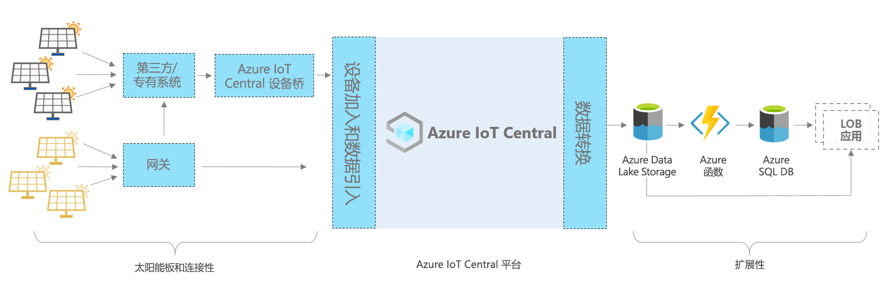

# Azure IoT Central - 太阳能板应用体系结构

本文提供了太阳能电池板监视应用模板体系结构的概述。 下图显示了在 Azure 中使用 IoT Central 平台的太阳能电池板应用的常用体系结构。

> [!div class="mx-imgBorder"]
> 

该体系结构包括以下组件。 某些应用程序可能不需要此处列出的每个组件。

## 太阳能电池板和连接 

太阳能板是可再生能源的重要来源之一。 根据太阳能电池板的类型和设置，可以使用网关或其他中间设备和专用系统来连接它。 可能需要构建 IoT Central 设备网桥以连接无法直接连接的设备。 IoT Central 设备桥是一种开放源代码解决方案，你可以在[此处](https://docs.microsoft.com/azure/iot-central/core/howto-build-iotc-device-bridge)找到完整的详细信息。 

## IoT Central 平台
Azure IoT Central 是一个平台，可简化 IoT 解决方案的构建，并有助于减轻 IoT 管理、运营和开发的负担以及降低相关成本。 借助 IoT Central，可以轻松地大规模连接、监视和管理物联网 (IoT) 资产。 将太阳能电池板连接到 IoT Central 之后，应用模板将使用设备模型、命令和仪表板等内置功能。 该应用模板还将 IoT Central 存储用于暖路径方案，例如近实时仪表数据监视、分析、规则和可视化效果。

## 使用 IoT Central 进行构建的可扩展性选项
IoT Central 平台提供了两个扩展选项：连续数据导出 (CDE) 和 API。 客户和合作伙伴可以在这些选项之间进行选择，以针对特定需求自定义其解决方案。 例如我们的某个合作伙伴为 Azure Data Lake Storage (ADLS) 配置了 CDE。 他们将 ADLS 用于长期数据保留和其他冷路径存储方案（例如批处理、审核和报告目的）。 

## 后续步骤

* 现在，你已了解体系结构，[免费创建太阳能板应用](https://apps.azureiotcentral.com/build/new/solar-panel-monitoring)
* 若要详细了解 IoT Central，请参阅 [IoT Central 概述](https://docs.microsoft.com/azure/iot-central/)