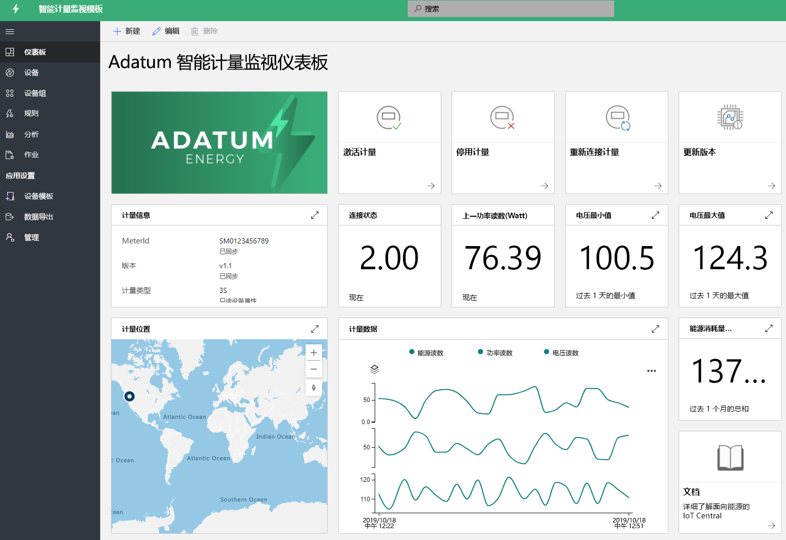
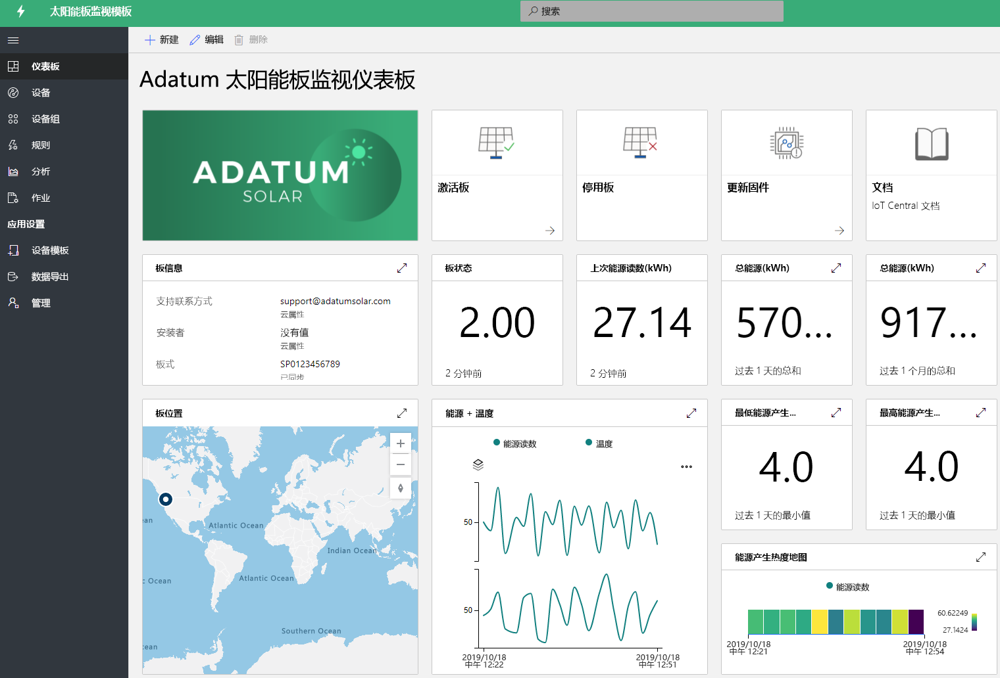

# 使用 IoT Central 生成能源用解决方案 

[!INCLUDE [iot-central-pnp-original](../../../includes/iot-central-pnp-original-note.md)]

智能仪表和太阳能电池板在能源行业转型中发挥着重要作用。 智能仪表可提供更多控制功能，让你能够实时了解能耗；太阳能电池板的增长推动着可再生能源生成领域的突破性进展。 智能仪表和太阳能电池板监视应用是用于显示各种功能的示例模板。 合作伙伴可以通过 IoT Central 利用这些模板构建能源解决方案，以满足其特定需求。 部署和使用这些应用程序不需要任何新的编码，也无需支付额外的费用。 了解有关能源应用模板及其功能的详细信息。

## 什么是智能仪表监视应用程序？
 智能仪表不仅支持自动计费，而且还支持高级计量用例（例如实时读数和双向通信）。 借助智能仪表应用模板，公用事业部门和合作伙伴能够监视智能仪表的状态和数据、定义警报和通知。 它提供断开仪表和更新软件等示例命令。 可以将仪表数据设置为传出到其他商业应用程序和开发自定义解决方案。 

应用的主要功能： 

* 仪表示例设备型号 
* 仪表信息和实时状态 
* 能量、功率和电压等仪表读数
* 仪表命令示例 
* 内置可视化效果和仪表板
* 自定义解决方案开发的可扩展性

可以免费试用[智能仪表监视应用](https://apps.azureiotcentral.com/build/new/smart-meter-monitoring)，无需 Azure 订阅和任何承诺。

部署应用后，你将在仪表板上看到模拟的仪表数据，如下图所示。 此模板是一个示例应用，可针对特定用例进行轻松扩展和自定义。

> [!div class="mx-imgBorder"]
> 

## 什么是太阳能电池板监视应用程序？
借助太阳能电池板监视应用，公用事业单位和合作伙伴能够近实时地监视太阳能电池板（例如能源生成和连接状态）。 它可以根据定义的阈值标准发送通知。 它提供了更新固件和其他属性等示例命令。 可以将太阳能电池板数据设置为传出到其他商业应用程序和开发自定义解决方案。 

应用的主要功能： 

* 太阳能电池板示例设备型号 
* 太阳能电池板信息和实时状态
* 太阳能能源生成和其他读数
* 命令和控件示例
* 内置可视化效果和仪表板
* 自定义解决方案开发的可扩展性

可以免费试用[太阳能电池板监视应用](https://apps.azureiotcentral.com/build/new/solar-panel-monitoring)，无需 Azure 订阅和任何承诺。

部署应用后，你将在 1 到 2 分钟内看到模拟的太阳能电池板数据，如以下仪表板种所示。 此模板是一个示例应用，可针对特定用例进行轻松扩展和自定义。 

> [!div class="mx-imgBorder"]
> 

## 后续步骤
开始构建能源解决方案：
* 免费创建应用程序模板：[智能仪表应用](https://apps.azureiotcentral.com/build/new/smart-meter-monitoring)、[太阳能电池板应用](https://apps.azureiotcentral.com/build/new/solar-panel-monitoring)
* 了解[智能仪表监视应用的概念](https://docs.microsoft.com/azure/iot-central/energy/concept-iot-central-smart-meter-app)
* 了解[太阳能电池板监视应用的概念](https://docs.microsoft.com/azure/iot-central/energy/concept-iot-central-solar-panel-app)
* 了解 [IoT Central 平台](https://docs.microsoft.com/azure/iot-central/)
