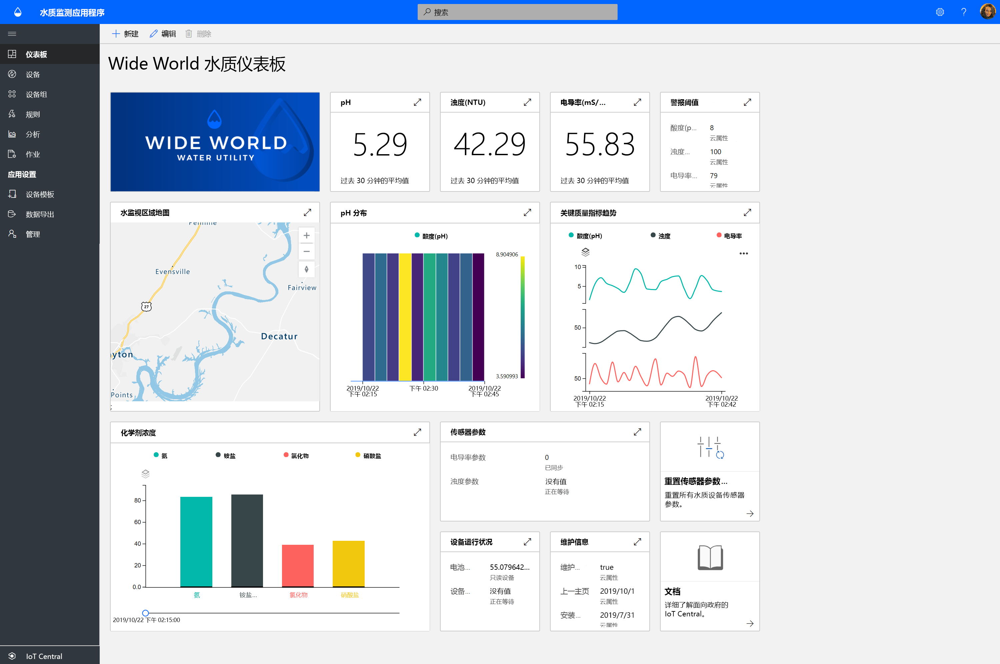
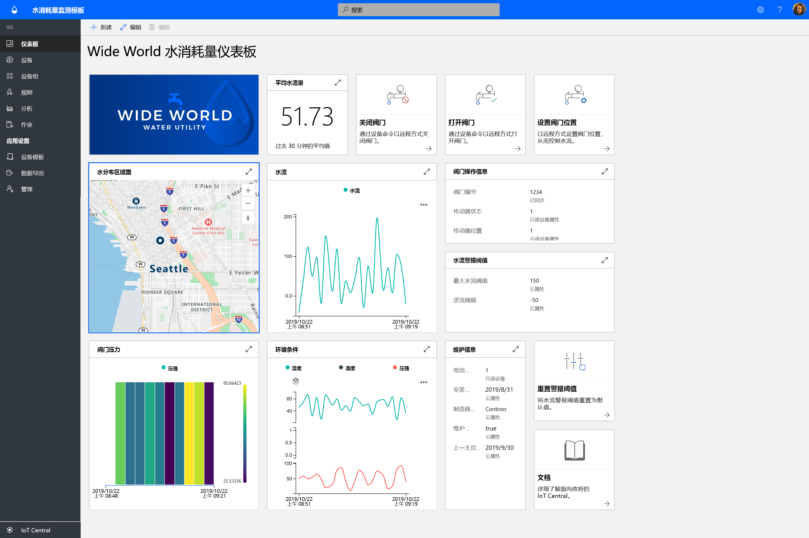
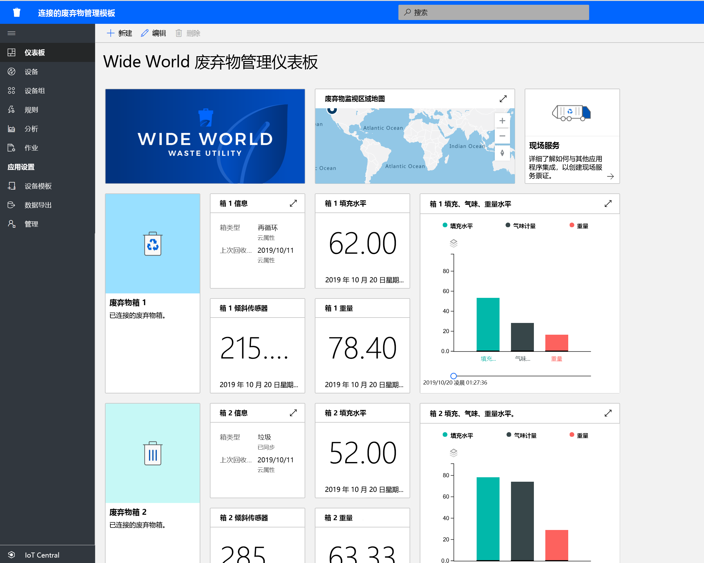

# 使用 Azure IoT Central 生成政府解决方案

[!INCLUDE [iot-central-pnp-original](../../../includes/iot-central-pnp-original-note.md)]

使用 Azure IoT Central 应用程序模板开始构建智能城市解决方案。 立即开始体验**水质监测**、**用水量监测**和**联网废弃物管理**解决方案。

## 什么是水质监测应用程序模板？   

传统的水质监测依赖于人工采样方法和现场实验室分析，这种方法非常耗时且成本高昂。 通过实时远程监测水质，可以在居民受到影响之前对水质进行监管。 此外，借助高级分析，自来水公司和环保机构可以提前针对潜在的水质问题发出警告，并提前规划净水处理措施。  

水质监测应用是一个 IoT Central 应用模板，可帮助你立即开始进行 IoT 解决方案开发，使自来水公司能够对智能城市中的水质进行数字化监测。 

该应用模板包括：
* 示例操作员仪表板
* 示例水质监测设备模板
* 模拟的水质监测设备
* 预配置的规则和作业
* 贴牌式品牌设计 

在[水质监测应用程序教程](./tutorial-water-quality-monitoring.md)中获取入门信息。

## 什么是用水量监测应用程序模板？ 

传统的用水量跟踪依赖于水务操作员在计量现场人工读取用水量仪表。 越来越多的城市正在将传统的计量表更换为先进的智能计量表，这样可以远程监测用水量，并可以远程控制阀门来控制水流量。 对用水量进行监测并将数字反馈消息发送给居民可以提高他们的节水意识并降低水的消耗量。 

用水量监测应用是一个 IoT Central 应用模板，可帮助你立即开始进行 IoT 解决方案开发，使自来水公司和市政部门能够远程监控水流量，以降低消耗。 

  

用水量监测应用模板包括预配置的：
* 示例操作员仪表板
* 示例水质监测设备模板
* 模拟的水质监测设备
* 预配置的规则和作业
* 贴牌式品牌设计 

 在[用水量监测应用程序教程](./tutorial-water-consumption-monitoring.md)中获取入门信息。

## 什么是联网废弃物管理应用程序模板？ 

联网废弃物管理应用是一个 IoT Central 应用模板，可帮助你立即开始进行 IoT 解决方案开发，使智能城市能够进行远程监测，以最大化垃圾回收的效率。 

 

联网废弃物管理应用模板包括预配置的：
* 示例操作员仪表板
* 示例联网垃圾箱设备模板
* 模拟的联网垃圾箱设备
* 预配置的规则和作业
* 贴牌式品牌设计 

在[联网废弃物管理应用程序教程](./tutorial-connected-waste-management.md)中获取入门信息。

## 后续步骤

* 免费试用 IoT Central 中的任意政府应用程序模板来[创建应用](https://apps.azureiotcentral.com/build/government)
* 了解[水质监测的概念](./concepts-waterqualitymonitoring-architecture.md)
* 了解[用水量监测的概念](./concepts-waterconsumptionmonitoring-architecture.md)
* 了解[联网废弃物管理的概念](./concepts-connectedwastemanagement-architecture.md)  
* 在 [IoT Central 概述](https://docs.microsoft.com/azure/iot-central/core/overview-iot-central)中了解 IoT Central
 