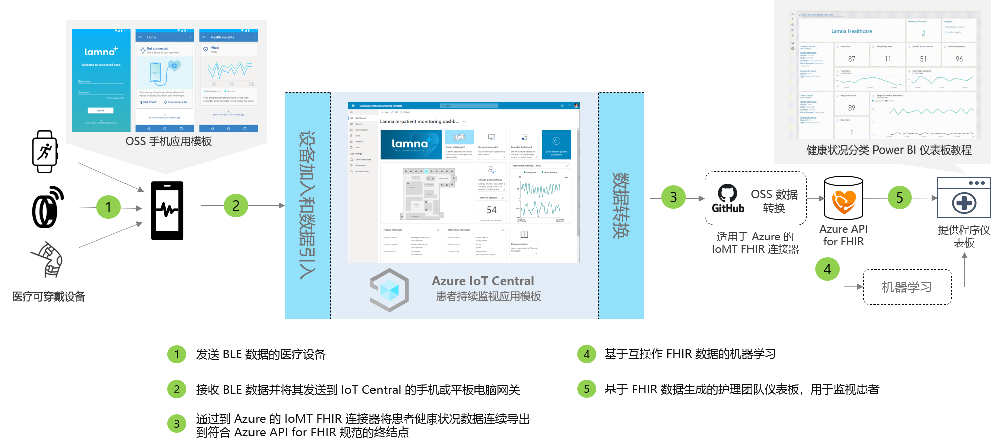

# 持续患者监视体系结构

利用提供的应用模板，并使用下面概述的体系结构作为指导，可以生成持续患者监视解决方案。

>[!div class="mx-imgBorder"] 
>

1. 医疗设备使用低耗电蓝牙 (BLE) 进行通信
1. 手机网关接收 BLE 数据并将其发送到 IoT Central
1. 将患者健康状况数据连续导出到 Azure API for FHIR&reg;
1. 基于互操作数据的机器学习
1. 基于 FHIR 数据生成的护理团队仪表板

## 详细信息
本节会更详细地概述体系结构图的每个部分。

### BLE 医疗设备
医疗保健 IoT 领域中使用的许多医用可穿戴设备都是低耗电蓝牙设备。 这些设备无法直接与云通信，需要通过网关。 此体系结构建议使用手机应用程序作为此网关。

### 手机网关
该手机应用程序的主要功能是从医疗设备引入 BLE 数据，并将其传递给 Azure IoT Central。 此外，该应用还可以帮助指导患者完成设备设置和预配流程，并帮助他们查看其个人健康状况数据视图。 如果是在医院病房内，其他解决方案可以使用平板电脑网关或静态网关实现相同的通信流。

### 导出到 Azure API for FHIR&reg;
Azure IoT Central 符合 HIPAA 并通过 HITRUST&reg; 认证，但你可能还希望将与患者健康状况相关的数据发送到 Azure API for FHIR。 [Azure API for FHIR](../../healthcare-apis/overview.md) 是完全托管的、基于标准的、符合法规的临床健康状况数据 API，让你可以用健康状况数据创建新的参与系统。 它由云中托管的平台即服务 (PaaS) 产品/服务提供支持，通过 FHIR API 即可快速交换数据。 使用 IoT Central 的持续数据导出功能，可以将数据发送到 Azure API for FHIR。

### 机器学习
聚合数据并将其转换为 FHIR 格式后，你可以生成机器学习模型，以便提供丰富的见解，让护理团队能够作出明智的决策。 可使用各种服务构建、训练和部署机器学习模型。 有关如何使用 Azure 机器学习产品/服务的详细信息，请参阅[机器学习文档](../../machine-learning/index.yml)。

### 提供程序仪表板
可使用位于 Azure API for FHIR 中的数据生成患者见解仪表板，也可以将其直接集成到 EMR 中，帮助护理团队查看患者状态。 护理团队可以使用此仪表板来照顾需要帮助的患者，并发现病情恶化的早期征兆。 若要了解如何构建 Power BI 实时提供程序仪表板，请遵循[操作指南](howto-health-data-triage.md)。

## 后续步骤
* [了解如何部署持续监视患者应用程序模板](tutorial-continuous-patient-monitoring.md)