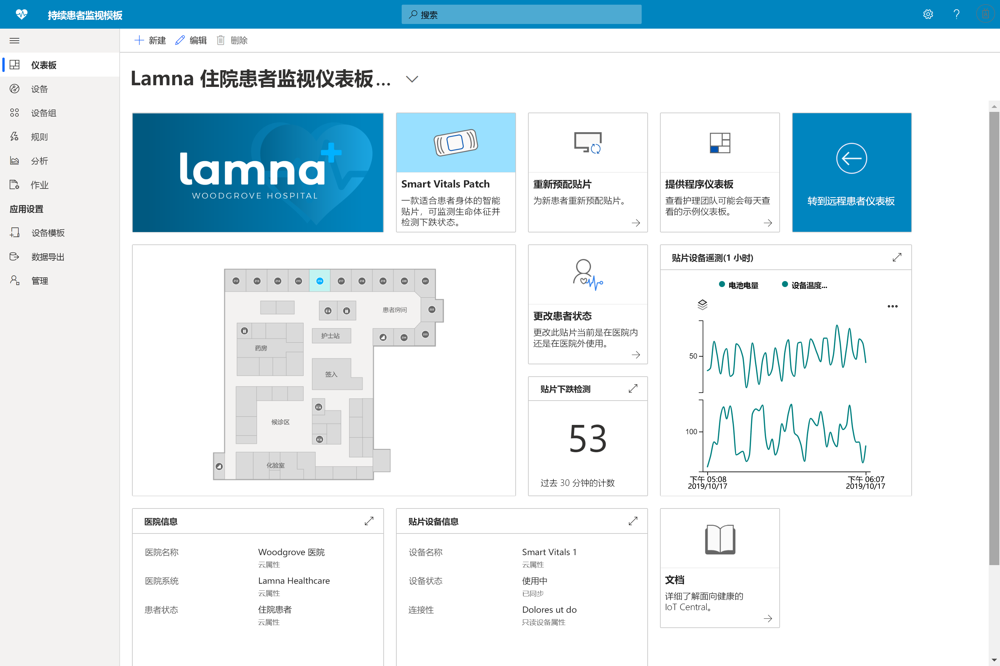

# 使用 Azure IoT Central 生成医疗保健解决方案 

了解如何使用具有应用程序模板的 Azure IoT Central 生成医疗保健解决方案。

## 什么是持续患者监视模板？

在医疗保健 IoT 领域，持续患者监视是帮助降低再次入院的风险、更有效地管理慢性疾病和改善患者治疗效果的关键因素之一。 持续患者监视可以分为两大类：

1. **住院患者监视**：使用医院的医用可穿戴设备和其他设备，护理团队可以监视患者的生命体征和身体状况，而无需派护士对患者进行每日多次的检查。 通过通知功能，护理团队可以在患者需要关注的关键时刻及时了解情况，并有效地安排其时间。
1. **远程患者监视**：通过使用医用可穿戴设备和患者报告的结果 (PRO) 来监视非住院患者，可以降低再次入院的风险。 可以收集来自慢性病患者和复健患者的数据，以确保患者遵循医疗计划，并确保在患者病情恶化到危急状态前通知护理团队。

此应用程序模板可用于生成两类持续患者监视的解决方案。 优点包括：

* 将各种医用可穿戴设备无缝连接到 IoT Central 实例。
* 监视和管理设备，以确保其持续正常运行。
* 围绕设备数据创建自定义规则，以触发相应警报。
* 将患者健康状况数据导出到 Azure API for FHIR，它是一个合规的数据存储服务。
* 将聚合的见解导出到现有或新的业务应用程序中。

>[!div class="mx-imgBorder"] 
>

## 后续步骤

开始生成持续患者监视解决方案：

* [部署应用程序模板](tutorial-continuous-patient-monitoring.md)
* [查看示例结构](concept-continuous-patient-monitoring-architecture.md)