# 浏览 Azure IoT Central UI（预览功能）

[!INCLUDE [iot-central-pnp-original](../../includes/iot-central-pnp-original-note.md)]

本文介绍了 Microsoft Azure IoT Central UI。 可以通过 UI 创建、管理和使用 Azure IoT Central 解决方案及其已连接的设备。

“构建者”  可以使用 Azure IoT Central UI 来定义 Azure IoT Central 解决方案。 他们可以使用 UI 执行以下操作：

* 定义连接到解决方案的设备类型。
* 配置用于设备的规则和操作。
* 为使用解决方案的“操作员”自定义 UI。 

“操作员”  可以使用 Azure IoT Central UI 来管理 Azure IoT Central 解决方案。 他们可以使用 UI 执行以下操作：

* 监视设备。
* 配置设备。
* 排查和修正设备问题。
* 设置新设备。

## 使用左侧导航菜单

使用左侧导航菜单来访问应用程序的不同区域。 可以选择“<”  或“>”  来展开或折叠导航栏：

:::row:::
  :::column span="":::
      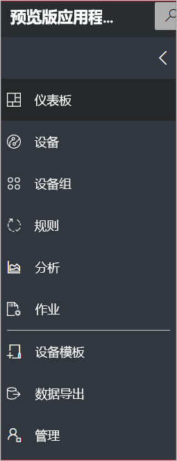
  :::column-end:::
  :::column span="2":::

      **Dashboard** displays your application dashboard. As a builder, you can customize the dashboard for your operators. Users can also create their own  dashboards.
    
      **Devices** lists the simulated and real devices associated with each device template in the application. As an operator, you use the **Device Explorer** to manage your connected devices.
    
      **Device groups** lets you view and create device groups. As an operator, you can create device groups as a logical collections of devices specified by a query.

      **Rules** lets you edit rules that fire based on device telemetry and trigger customizable actions.
    
      **Analytics** shows analytics derived from device telemetry for devices and device groups. As an operator, you can create custom views on top of device data to derive insights from your application.
    
      **Jobs** enables bulk device management by having you create and run jobs to update your devices at scale.
    
      **Device templates** shows the tools a builder uses to create and manage device templates.
    
      **Data export** enables an administrator to configure a continuous export to other Azure services such as storage and queues.
    
      **Administration** shows the application administration pages where an administrator can manage application settings, users, and roles.
   :::column-end:::
:::row-end:::

## 搜索、帮助和支持

顶部的菜单显示在每个页面中：

* 若要搜索设备模板和设备，请输入“搜索”  值。
* 若要更改 UI 语言或主题，请选择“设置”  图标。
* 若要从应用程序中注销，请选择“帐户”  图标。
* 若要获取帮助和支持，请选择**帮助**下拉列表以显示资源列表。 在试用版应用程序中，支持资源包括对[实时聊天](howto-show-hide-chat.md?toc=/azure/iot-central-pnp/toc.json&bc=/azure/iot-central-pnp/breadcrumb/toc.json)的访问权限。

可以为 UI 选择浅色主题或深色主题：

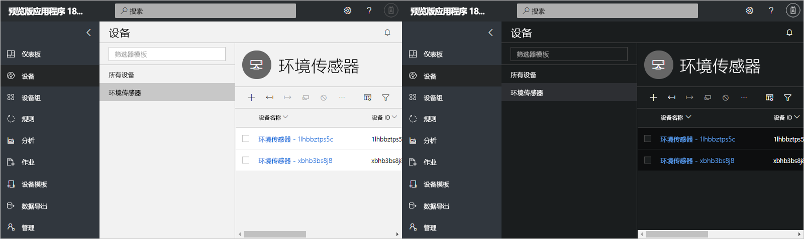

> [!NOTE]
> 如果管理员已为应用程序配置自定义主题，则无法在浅色主题和深色主题之间切换。

## 仪表板

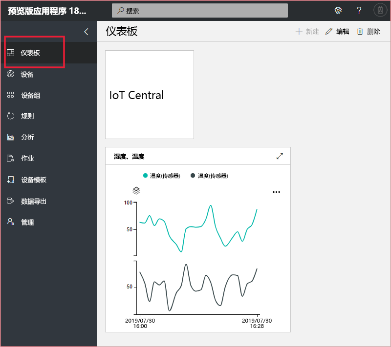

* 仪表板是登录到 Azure IoT Central 应用程序后看到的第一个页面。 构建者可以通过添加磁贴为其他用户自定义应用程序仪表板。 若要了解更多信息，请参阅[设置设备模板](tutorial-define-device-type-pnp.md?toc=/azure/iot-central-pnp/toc.json&bc=/azure/iot-central-pnp/breadcrumb/toc.json)教程。

* 作为操作员，你可以创建个性化仪表板并在这些仪表板和默认仪表板之间切换。 若要了解详细信息，请参阅[创建和管理个人仪表板](howto-personalize-dashboard.md?toc=/azure/iot-central-pnp/toc.json&bc=/azure/iot-central-pnp/breadcrumb/toc.json)操作指南文章。

## 设备

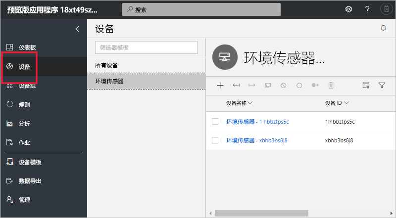

Explorer 页面显示 Azure IoT Central 应用程序中按“设备模板”分组的“设备”。  

* 设备模板定义可以连接到应用程序的设备类型。 若要了解详细信息，请参阅[在 Azure IoT Central 应用程序中定义新的设备类型](tutorial-define-device-type-pnp.md?toc=/azure/iot-central-pnp/toc.json&bc=/azure/iot-central-pnp/breadcrumb/toc.json)。
* 设备表示应用程序中的真实或模拟设备。 若要了解详细信息，请参阅[在 Azure IoT Central 应用程序中添加新设备](tutorial-add-device-pnp.md?toc=/azure/iot-central-pnp/toc.json&bc=/azure/iot-central-pnp/breadcrumb/toc.json)。

## 设备组

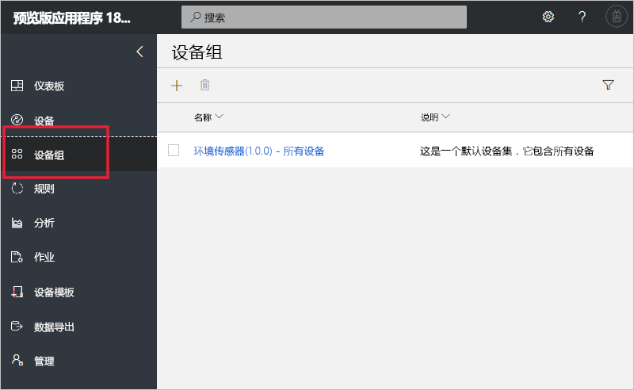

“设备组”  页显示由构建者创建的设备组。 设备组是相关设备的集合。 构建者可以定义查询来标识设备组中包括的设备。 在应用程序中自定义分析时需要使用设备组。 若要了解详细信息，请参阅[在 Azure IoT Central 应用程序中使用设备组](howto-use-device-groups-pnp.md?toc=/azure/iot-central-pnp/toc.json&bc=/azure/iot-central-pnp/breadcrumb/toc.json)一文。

## 规则

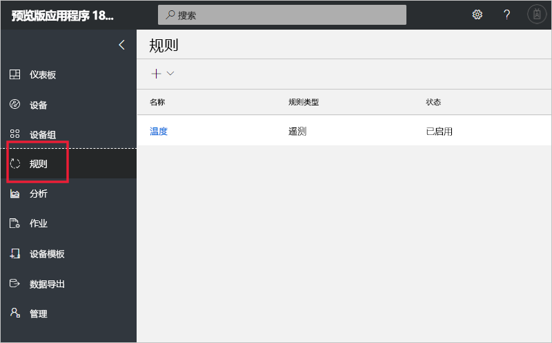

“规则”页可让你根据遥测、设备状态或设备事件定义规则。 当规则触发时，它可以触发操作，例如向操作员发送电子邮件。 构建者使用此页来创建和管理规则。 有关详细信息，请参阅[在 Azure IoT Central 中配置设备的规则和操作](tutorial-configure-rules-pnp.md?toc=/azure/iot-central-pnp/toc.json&bc=/azure/iot-central-pnp/breadcrumb/toc.json)教程。

## 分析

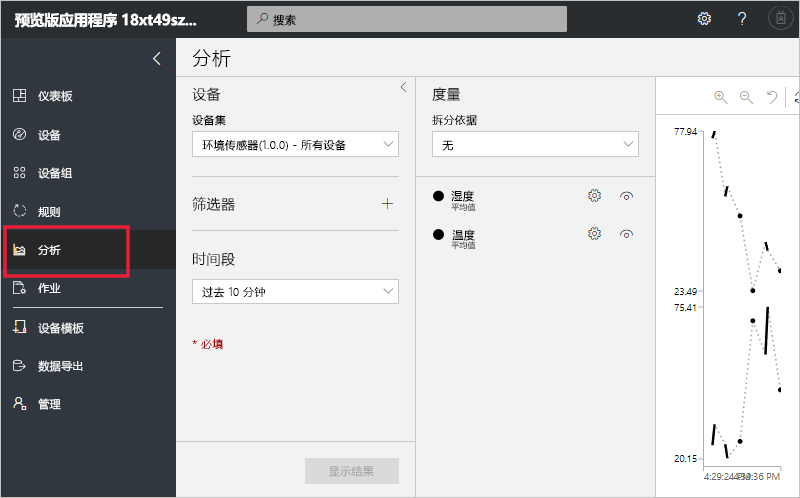

分析页面上会显示图表，可以借助这些图表来了解连接到应用程序的设备的行为方式。 操作员使用此页面来监视和调查已连接的设备的问题。 构建者可以定义显示在此页面上的图表。 若要了解详细信息，请参阅[为 Azure IoT Central 应用程序创建自定义分析](howto-use-device-groups-pnp.md?toc=/azure/iot-central-pnp/toc.json&bc=/azure/iot-central-pnp/breadcrumb/toc.json)一文。

## 作业

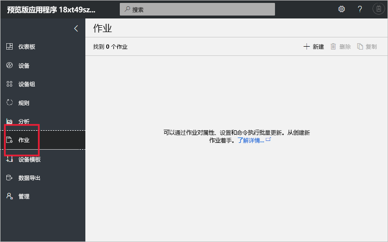

“作业”页可让你对设备执行批量设备管理操作。 构建者使用此页面来更新设备属性、设置和命令。 若要了解详细信息，请参阅[运行作业](howto-run-a-job.md?toc=/azure/iot-central-pnp/toc.json&bc=/azure/iot-central-pnp/breadcrumb/toc.json)文章。

## 设备模板

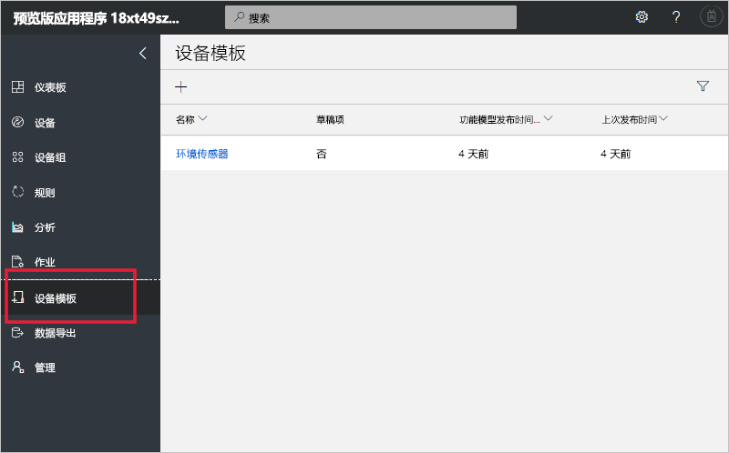

设备模板页可供构建者创建和管理应用程序中的设备模板。 设备模板指定设备特征，例如：

* 遥测、状态和事件度量。
* 属性。
* 命令。

构建者还可以创建表单和仪表板，供操作员用来管理设备。

若要了解详细信息，请参阅[在 Azure IoT Central 应用程序中定义新的设备类型](tutorial-define-device-type-pnp.md?toc=/azure/iot-central-pnp/toc.json&bc=/azure/iot-central-pnp/breadcrumb/toc.json)教程。

## 数据导出

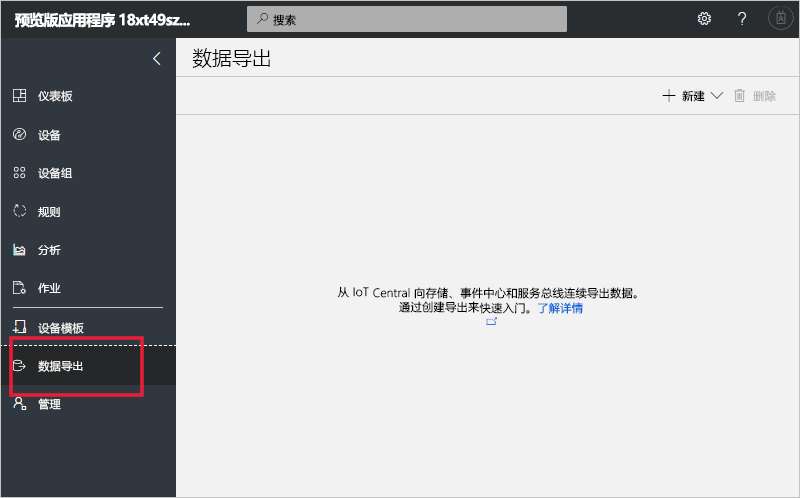

“数据导出”页可供管理员定义如何从应用程序流式传输数据，例如遥测数据。 其他服务可以存储导出的数据，或者将其用于分析。 若要了解详细信息，请参阅[导出 Azure IoT Central 中的数据](howto-export-data.md?toc=/azure/iot-central-pnp/toc.json&bc=/azure/iot-central-pnp/breadcrumb/toc.json)一文。

## 管理

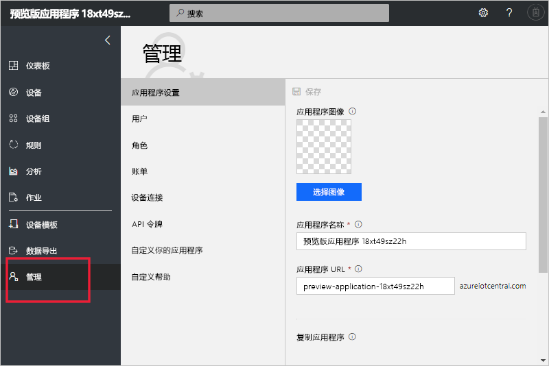

“管理”页包含管理员可以使用的工具的链接，例如，可以使用这些工具在应用程序中定义用户和角色以及自定义 UI。 若要了解详细信息，请参阅[管理 Azure IoT Central 应用程序](howto-administer-pnp.md?toc=/azure/iot-central-pnp/toc.json&bc=/azure/iot-central-pnp/breadcrumb/toc.json)一文。

## 后续步骤

现在，你已大致了解了 Azure IoT Central 并且熟悉了 UI 的布局，建议的下一步骤是完成[创建 Azure IoT Central 应用程序](quick-deploy-iot-central-pnp.md?toc=/azure/iot-central-pnp/toc.json&bc=/azure/iot-central-pnp/breadcrumb/toc.json)快速入门。
