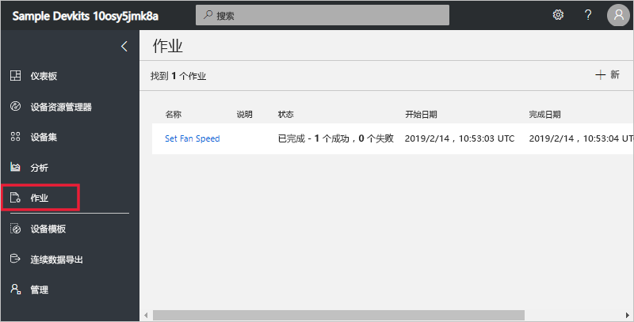
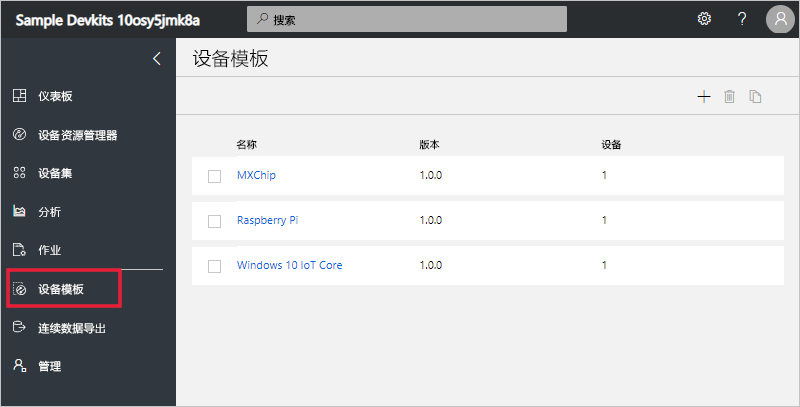
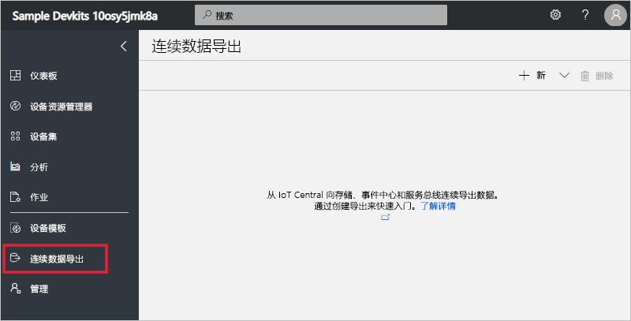

# 浏览 Azure IoT Central UI（全新 UI 设计）

本文介绍了 Microsoft Azure IoT Central UI。 可以通过 UI 创建、管理和使用 Azure IoT Central 解决方案及其已连接的设备。

“构建者”可以使用 Azure IoT Central UI 来定义 Azure IoT Central 解决方案。 他们可以使用 UI 执行以下操作：

- 定义连接到解决方案的设备类型。
- 配置用于设备的规则和操作。
- 为使用解决方案的“操作员”自定义 UI。

“操作员”可以使用 Azure IoT Central UI 来管理 Azure IoT Central 解决方案。 他们可以使用 UI 执行以下操作：

- 监视设备。
- 配置设备。
- 排查和修正设备问题。
- 设置新设备。

## 使用左侧导航菜单

使用左侧导航菜单来访问应用程序的不同区域。 可以选择“<” 或“>”来展开或折叠导航栏：

| 菜单 | 说明 |
| ---- | ----------- |
|  | <ul><li>“仪表板”按钮可显示应用程序仪表板。 构建者可以为操作员自定义仪表板。 用户也可以创建自己的仪表板。</li><li>“Device Explorer”按钮列出与应用程序中的每个设备模板关联的模拟设备和真实设备。 操作员可以使用“Device Explorer”来管理已连接的设备。</li><li>“设备集”按钮可以用来查看和创建设备集。 操作员可以将设备集创建为由查询指定的设备的逻辑集合。</li><li>“分析”按钮显示从设备和设备集的设备遥测数据得出的分析。 操作员可以基于设备数据创建自定义视图来从应用程序获得见解。</li><li>“作业”按钮通过让你创建和运行作业来执行大规模更新，从而实现批量设备管理。</li><li>“设备模板”按钮显示构建者用于创建和管理设备模板的工具。</li><li>“连续数据导出”按钮供管理员用来配置连续导出，可以将数据导出到其他 Azure 服务，例如存储和队列。</li><li>“管理”按钮显示应用程序管理页面，管理员可以在其中管理应用程序设置、用户和角色。</li></ul> |

## 搜索、帮助和支持

顶部的菜单显示在每个页面中：

- 若要搜索设备模板和设备，请输入“搜索”值。
- 若要更改 UI 语言或主题，请选择“设置”图标。
- 若要从应用程序中注销，请选择“帐户”图标。
- 若要获取帮助和支持，请选择**帮助**下拉列表以显示资源列表。

可以为 UI 选择浅色主题或深色主题：

## 仪表板

仪表板是登录到 Azure IoT Central 应用程序后看到的第一个页面。 构建者可以通过添加磁贴为其他用户自定义应用程序仪表板。 若要了解详细信息，请参阅[自定义 Azure IoT Central 操作员的视图](tutorial-customize-operator.md)教程。 用户也可以[创建自己的个人仪表板](howto-personalize-dashboard.md)。

## 设备资源管理器

Explorer 页面显示 Azure IoT Central 应用程序中按“设备模板”分组的“设备”。

* 设备模板定义可以连接到应用程序的设备类型。 若要了解详细信息，请参阅[在 Azure IoT Central 应用程序中定义新的设备类型](tutorial-define-device-type.md)。
* 设备表示应用程序中的真实或模拟设备。 若要了解详细信息，请参阅[在 Azure IoT Central 应用程序中添加新设备](tutorial-add-device.md)。

## 设备集

“设备集”页面显示由构建者创建的设备集。 设备集是相关设备的集合。 构建者可以定义查询来标识设备集中包括的设备。 当在应用程序中自定义分析时需要使用设备集。 若要了解详细信息，请参阅[在 Azure IoT Central 应用程序中使用设备集](howto-use-device-sets.md)一文。

## 分析

分析页面上会显示图表，可以借助这些图表来了解连接到应用程序的设备的行为方式。 操作员使用此页面来监视和调查已连接的设备的问题。 构建者可以定义显示在此页面上的图表。 若要了解详细信息，请参阅[为 Azure IoT Central 应用程序创建自定义分析](howto-use-device-sets.md)一文。

## 作业

“作业”页可让你对设备执行批量设备管理操作。 构建者使用此页面来更新设备属性、设置和命令。 若要了解详细信息，请参阅[运行作业](howto-run-a-job.md)文章。

## 设备模板

设备模板页可供构建者创建和管理应用程序中的设备模板。 若要了解详细信息，请参阅[在 Azure IoT Central 应用程序中定义新的设备类型](tutorial-define-device-type.md)教程。

## 连续数据导出

“连续数据导出”页可供管理员定义如何从应用程序导出数据，例如遥测数据。 其他服务可以存储导出的数据，或者将其用于分析。 若要了解详细信息，请参阅[导出 Azure IoT Central 中的数据](howto-export-data.md)一文。

## 管理

“管理”页面包含管理员可以使用的工具的链接，例如，可以使用这些工具在应用程序中定义用户和角色。 若要了解详细信息，请参阅[管理 Azure IoT Central 应用程序](howto-administer.md)一文。

## 后续步骤

现在，你已大致了解了 Azure IoT Central 并且熟悉了 UI 的布局，建议的下一步骤是完成[创建 Azure IoT Central 应用程序](quick-deploy-iot-central.md)快速入门。