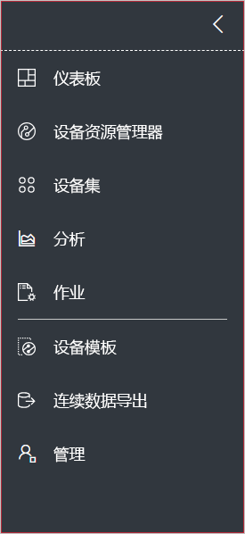
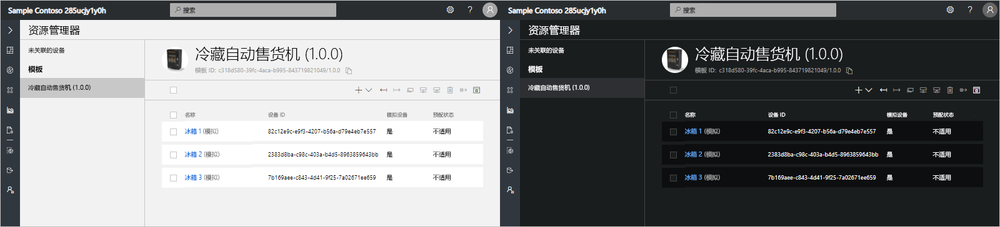
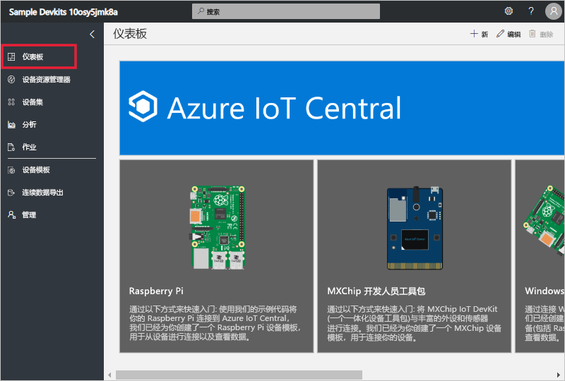
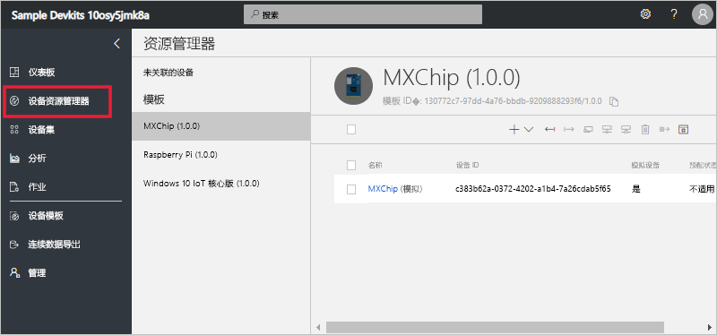
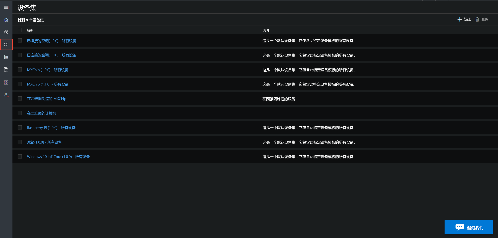
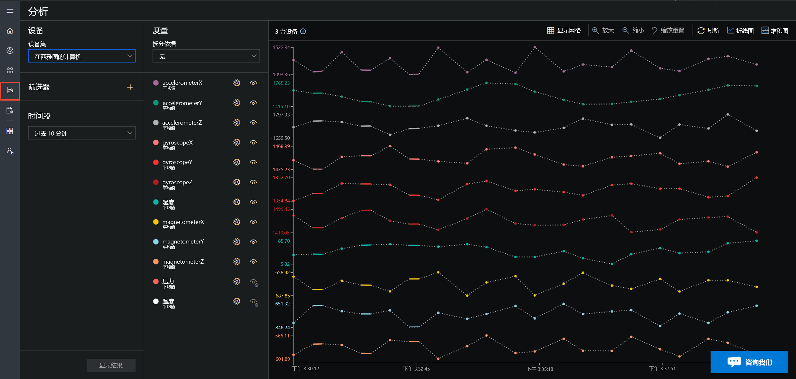
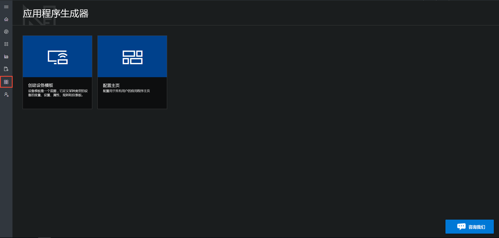
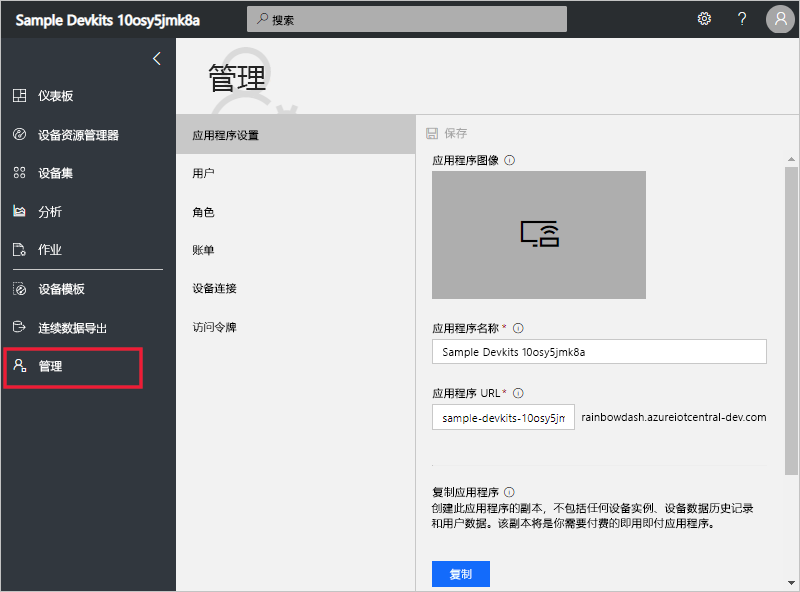

# 浏览 Azure IoT Central UI

本文介绍了 Microsoft Azure IoT Central UI。 可以通过 UI 创建、管理和使用 Azure IoT Central 解决方案及其已连接的设备。

“构建者”可以使用 Azure IoT Central UI 来定义 Azure IoT Central 解决方案。 他们可以使用 UI 执行以下操作：

- 定义连接到解决方案的设备类型。
- 配置用于设备的规则和操作。
- 为使用解决方案的“操作员”自定义 UI。

“操作员”可以使用 Azure IoT Central UI 来管理 Azure IoT Central 解决方案。 他们可以使用 UI 执行以下操作：

- 监视设备。
- 配置设备。
- 排查和修正设备问题。
- 预配新设备。

## 使用左侧导航菜单

使用左侧导航菜单来访问应用程序的不同区域：

| 菜单 | 说明 |
| ---- | ----------- |
|  | <ul><li>“主页”按钮显示应用程序的主页。 构建者可以为操作员自定义此主页。</li><li>“Device Explorer”按钮列出在应用程序中定义的设备模板，以及与每个设备模板关联的模拟和真实设备。 操作员可以使用“Device Explorer”来管理已连接的设备。</li><li>“设备集”按钮可以用来查看和创建设备集。 操作员可以将设备集创建为由查询指定的设备的逻辑集合。</li><li>“分析”按钮显示从设备和设备集的设备遥测数据得出的分析。 操作员可以基于设备数据创建自定义视图来从应用程序获得见解。</li><li>“应用程序构建者”按钮显示构建者使用的工具，例如“创建设备模板”工具。</li><li>“管理”按钮显示应用程序管理页面，管理员可以在其中管理应用程序设置、用户和角色。</li></ul> |

## 搜索、帮助和支持

顶部的菜单显示在每个页面中：

- 若要搜索设备模板和设备，请选择**搜索**图标。
- 若要获取帮助和支持，请选择**帮助**下拉列表以显示资源列表。
- 若要控制这些教程、更改 UI 主题或从应用程序中注销，请选择**帐户**图标。

可以为 UI 选择浅色主题或深色主题：

## 主页

主页是登录到 Azure IoT Central 应用程序后看到的第一个页面。 构建者可以通过添加磁贴为应用程序的其他用户自定义主页。 若要了解详细信息，请参阅[自定义 Azure IoT Central 操作员的视图](tutorial-customize-operator.md)教程。

## Device explorer

Explorer 页面显示 Azure IoT Central 应用程序中的“设备模板”和“设备”。

* 设备模板定义可以连接到应用程序的设备类型。 若要了解详细信息，请参阅[在 Azure IoT Central 应用程序中定义新的设备类型](tutorial-define-device-type.md)。
* 设备表示应用程序中的真实或模拟设备。 若要了解详细信息，请参阅[在 Azure IoT Central 应用程序中添加新设备](tutorial-add-device.md)。

## 设备集

“设备集”页面显示由构建者创建的设备集。 设备集是相关设备的集合。 构建者可以定义查询来标识设备集中包括的设备。 当在应用程序中自定义分析时需要使用设备集。 若要了解详细信息，请参阅[在 Azure IoT Central 应用程序中使用设备集](howto-use-device-sets.md)一文。

## 分析

分析页面上会显示图表，可以借助这些图表来了解连接到应用程序的设备的行为方式。 操作员使用此页面来监视和调查已连接的设备的问题。 构建者可以定义显示在此页面上的图表。 若要了解详细信息，请参阅[为 Azure IoT Central 应用程序创建自定义分析](howto-create-analytics.md)一文。

## 应用程序构建者

“应用程序构建者”页面包含指向各种工具的链接，构建者可以使用这些工具创建 Azure IoT Central 应用程序，例如，创建设备模板以及配置主页。 若要了解详细信息，请参阅[在 Azure IoT Central 应用程序中定义新的设备类型](tutorial-define-device-type.md)教程。

## 管理

“管理”页面包含管理员可以使用的工具的链接，例如，可以使用这些工具在应用程序中定义用户和角色。 若要了解详细信息，请参阅[管理 Azure IoT Central 应用程序](howto-administer.md)一文。

## 后续步骤

现在，你已大致了解了 Azure IoT Central 并且熟悉了 UI 的布局，建议的下一步骤是完成[创建 Azure IoT Central 应用程序](quick-deploy-iot-central.md)快速入门。