# 浏览 Azure IoT Central UI（预览功能）

[!INCLUDE [iot-central-pnp-original](../../../includes/iot-central-pnp-original-note.md)]

本文介绍了 Microsoft Azure IoT Central UI。 可以通过 UI 创建、管理和使用 Azure IoT Central 解决方案及其已连接的设备。

作为“解决方案构建者”可以使用 Azure IoT Central UI 来定义 Azure IoT Central 解决方案  。 他们可以使用 UI 执行以下操作：

* 定义连接到解决方案的设备类型。
* 配置用于设备的规则和操作。 
* 为使用解决方案的“操作员”自定义 UI。 

“操作员”  可以使用 Azure IoT Central UI 来管理 Azure IoT Central 解决方案。 他们可以使用 UI 执行以下操作：

* 监视设备。
* 配置设备。
* 排查和修正设备问题。
* 设置新设备。

## IoT Central 主页

你可以在 [IoT Central 主页](https://aka.ms/iotcentral-get-started)页面上了解更多关于 IoT Central 上最新的消息和功能、创建新的应用程序并查看和启动现有的应用程序。

> [!div class="mx-imgBorder"]
> 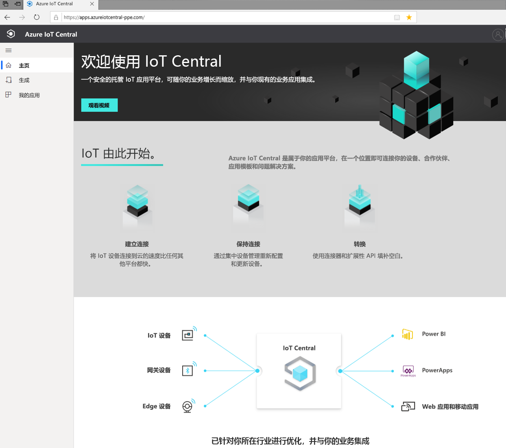

### 创建应用程序

在构建部分，你可以浏览与行业相关的 IoT Central 模板列表，以帮助你快速入门，也可以使用“自定义应用”模板从头开始。  
> [!div class="mx-imgBorder"]
> 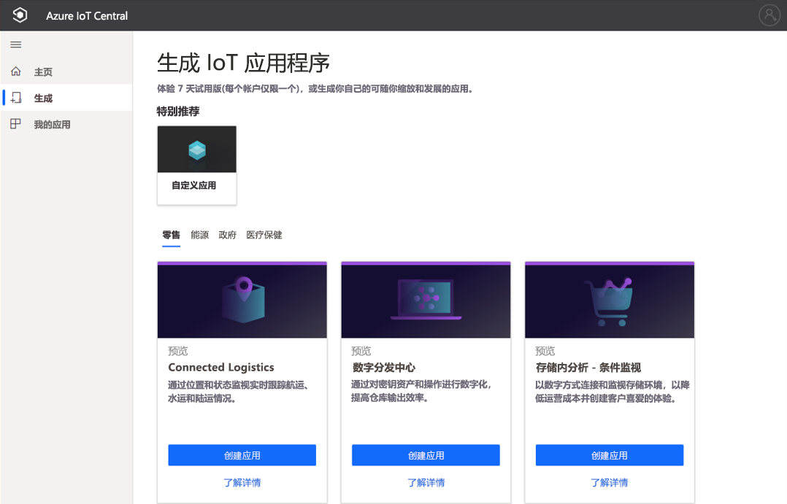

有关详细信息，请参阅[创建 Azure IoT Central 应用程序](quick-deploy-iot-central.md)快速入门。

### 启动应用程序

可以通过转到应用程序创建过程中你或解决方案构建者选择的 URL 来启动 IoT Central 应用程序。 你还可以在 [IoT Central 应用管理器](https://aka.ms/iotcentral-apps)中看到有权访问的所有应用程序的列表。

> [!div class="mx-imgBorder"]
> 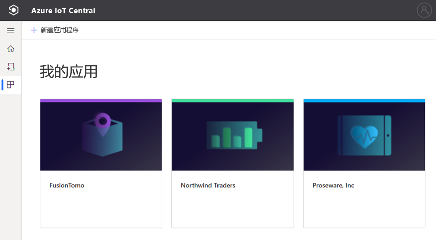

## 导航应用程序

进入 IoT 应用程序后，使用左侧窗格访问不同区域。 通过选择导航栏顶部的三行图标，可以展开或折叠导航栏：

> [!NOTE]
> 导航栏上显示的项目将取决于你的用户角色。 进一步了解[管理用户和角色](howto-manage-users-roles.md)。 

:::row:::
  :::column span="":::
      > [!div class="mx-imgBorder"]
      > 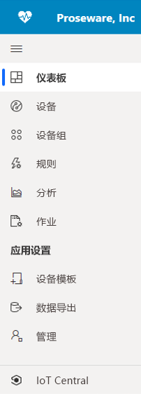
  :::column-end:::
  :::column span="2":::
     “仪表板”  显示应用程序仪表板。 作为“解决方案构建者”，你可以为操作员自定义全局仪表板  。 根据用户角色的不同，操作员还可以创建自己的个人仪表板。
     
     “设备”使你能够管理连接的设备 - 真实的和模拟的  。

     “设备组”允许你查看和创建由查询指定的设备的逻辑集合  。 可以保存此查询，并通过应用程序使用设备组执行批量操作。

     “规则”允许你创建和编辑用于监视设备的规则  。 规则是基于设备遥测和触发可自定义操作来评估的。

     “分析”允许你基于设备数据创建自定义视图来从应用程序获得见解  。

     “作业”使你能够通过运行批量操作来按比例管理设备  。

     “设备模板”是创建和管理连接到应用程序的设备特性的地方  。

     “数据导出”让你能够配置连续导出，将数据导出到外部服务，例如存储和队列  。

     “管理”是管理应用程序的设置、自定义、计费、用户和角色的地方  。

     “IoT Central”让管理员跳回 IoT Central 的应用程序管理器   。
     
   :::column-end:::
:::row-end:::

### 搜索、帮助、主题和支持

顶部的菜单显示在每个页面中：

> [!div class="mx-imgBorder"]
> 

* 若要搜索设备模板和设备，请输入“搜索”  值。
* 若要更改 UI 语言或主题，请选择“设置”  图标。 了解有关[管理应用程序首选项](../core/howto-manage-preferences.md?toc=/azure/iot-central/preview/toc.json&bc=/azure/iot-central/preview/breadcrumb/toc.json)的详细信息
* 若要从应用程序中注销，请选择“帐户”  图标。
* 若要获取帮助和支持，请选择**帮助**下拉列表以显示资源列表。 在试用版应用程序中，支持资源包括对[实时聊天](../core/howto-show-hide-chat.md?toc=/azure/iot-central/preview/toc.json&bc=/azure/iot-central/preview/breadcrumb/toc.json)的访问权限。

可以为 UI 选择浅色主题或深色主题：

> [!NOTE]
> 如果管理员已为应用程序配置自定义主题，则无法在浅色主题和深色主题之间切换。

> [!div class="mx-imgBorder"]
> 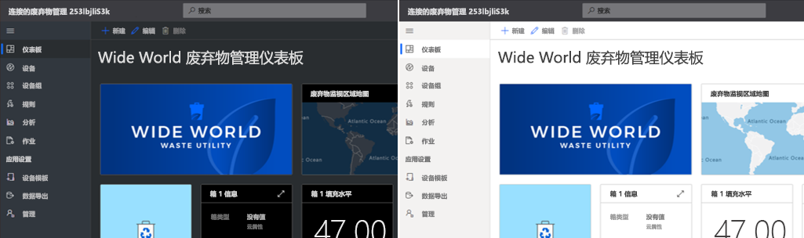

### 仪表板
> [!div class="mx-imgBorder"]
> 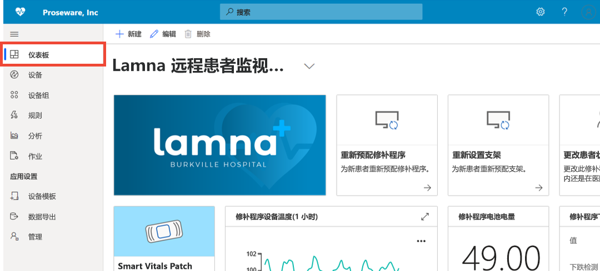

* 仪表板是登录到 Azure IoT Central 应用程序后看到的第一个页面。 作为“解决方案构建者”，你可以为其他用户创建和自定义多个全局应用程序仪表板  。 了解有关[将磁贴添加到仪表板](../core/howto-add-tiles-to-your-dashboard.md?toc=/azure/iot-central/preview/toc.json&bc=/azure/iot-central/preview/breadcrumb/toc.json)的详细信息

* 作为“操作员”，如果你的用户角色允许，则可以创建个人仪表板来监视你所关注的内容  。 若要了解详细信息，请参阅[创建 Azure IoT Central 个人仪表板](../core/howto-create-personal-dashboards.md?toc=/azure/iot-central/preview/toc.json&bc=/azure/iot-central/preview/breadcrumb/toc.json)操作指南文章。

### 设备

> [!div class="mx-imgBorder"]
> 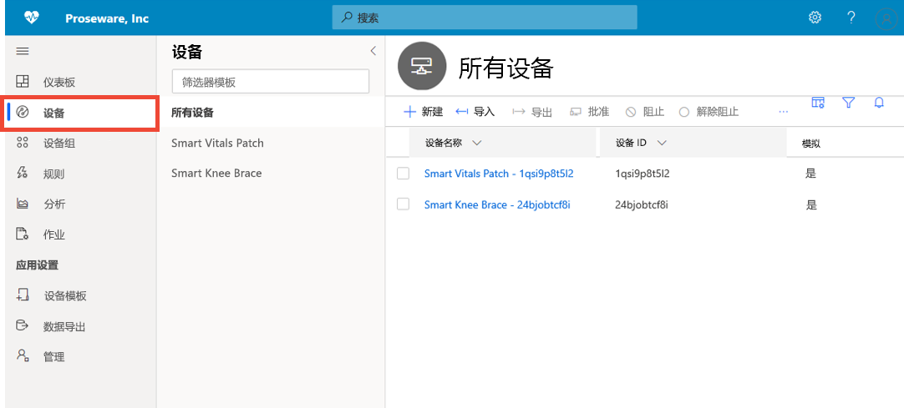

Explorer 页面显示 Azure IoT Central 应用程序中按“设备模板”分组的“设备”。   

* 设备模板定义可以连接到应用程序的设备类型。
* 设备表示应用程序中的真实或模拟设备。

若要了解更多信息，请参阅[监视设备](./quick-monitor-devices.md)快速入门。 

### 设备组

> [!div class="mx-imgBorder"]
> 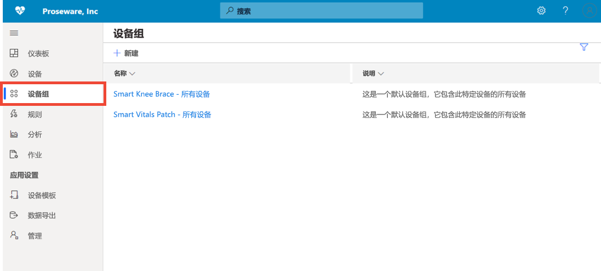

设备组是相关设备的集合。 “解决方案构建者”可以定义查询来标识设备组中包括的设备  。 使用设备组在应用程序中执行批量操作。 若要了解详细信息，请参阅[在 Azure IoT Central 应用程序中使用设备组](tutorial-use-device-groups.md)一文。

### 规则
> [!div class="mx-imgBorder"]
> 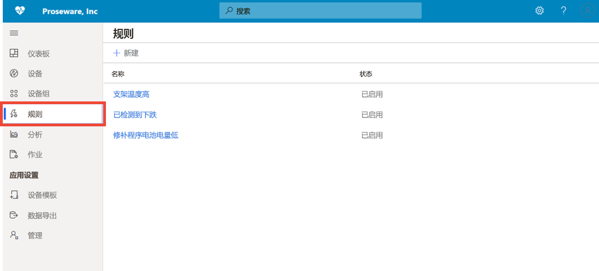

“规则”页可让你根据设备的遥测、状态或事件定义规则。 当规则触发时，它可以触发一个或多个操作，例如发送电子邮件、通过 webhook 警报通知外部系统等。若要了解，请参阅[配置规则](tutorial-create-telemetry-rules.md)教程。 

### 分析

> [!div class="mx-imgBorder"]
> 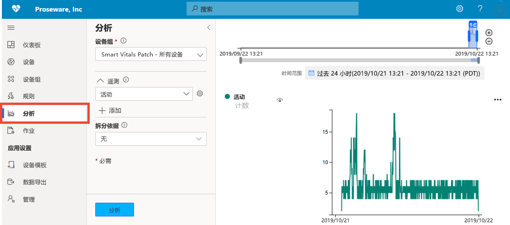

分析允许你基于设备数据创建自定义视图来从应用程序获得见解。 若要了解详细信息，请参阅[为 Azure IoT Central 应用程序创建分析](howto-create-analytics.md)一文。

### 作业

> [!div class="mx-imgBorder"]
> 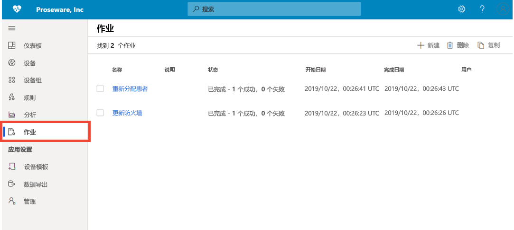

“作业”页可让你对设备执行批量设备管理操作。 可以更新设备属性、设置，并对设备组执行命令。 若要了解详细信息，请参阅[运行作业](../core/howto-run-a-job.md?toc=/azure/iot-central/preview/toc.json&bc=/azure/iot-central/preview/breadcrumb/toc.json)文章。

### 设备模板

> [!div class="mx-imgBorder"]
> 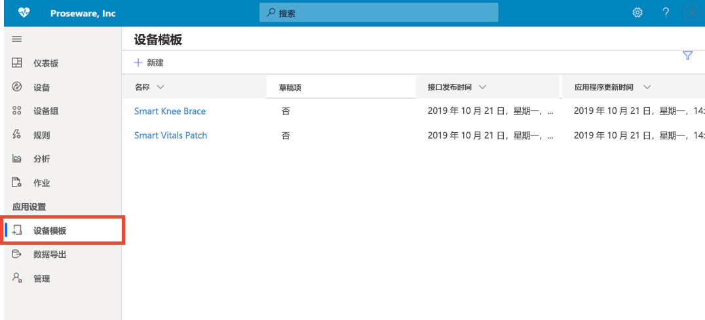

设备模板页可供构建者创建和管理应用程序中的设备模板。 设备模板指定设备特征，例如：

* 遥测、状态和事件度量
* 属性
* 命令
* 视图

“解决方案构建者”还可以创建表单和仪表板，供操作员用来管理设备  。

若要了解详细信息，请参阅[在 Azure IoT Central 应用程序中定义新的设备类型](howto-set-up-template.md)教程。 

### 数据导出
> [!div class="mx-imgBorder"]
> 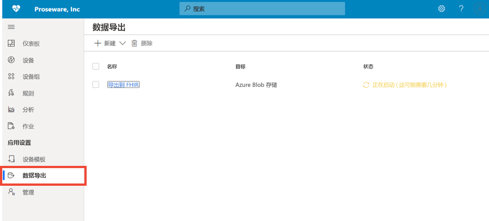

数据导出使你可以设置从应用程序到外部系统的数据流，如遥测。 若要了解详细信息，请参阅[导出 Azure IoT Central 中的数据](./howto-export-data.md)一文。

### 管理
> [!div class="mx-imgBorder"]
> 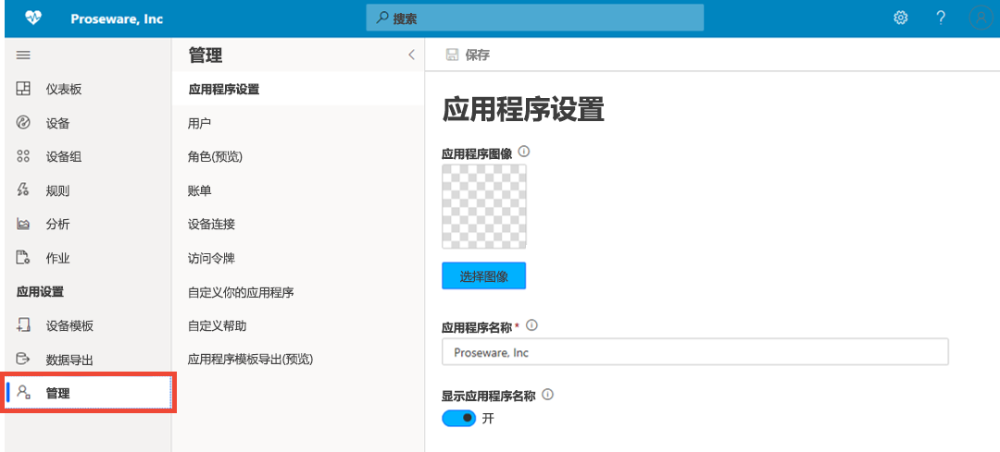

“管理”页允许你配置和自定义 IoT Central 应用程序。 在此处，你可以更改应用程序名称、URL、主题、管理用户和角色、创建 API 令牌以及导出应用程序。 若要了解详细信息，请参阅[管理 Azure IoT Central 应用程序](howto-administer.md)一文。

## 后续步骤

现在，你已大致了解了 Azure IoT Central 并且熟悉了 UI 的布局，建议的下一步骤是完成[创建 Azure IoT Central 应用程序](quick-deploy-iot-central.md)快速入门。
