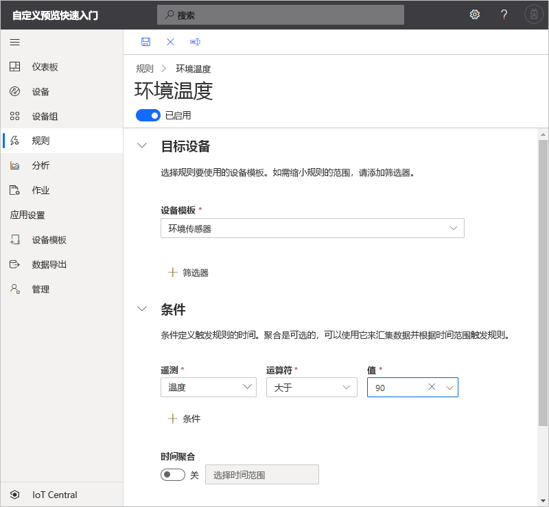
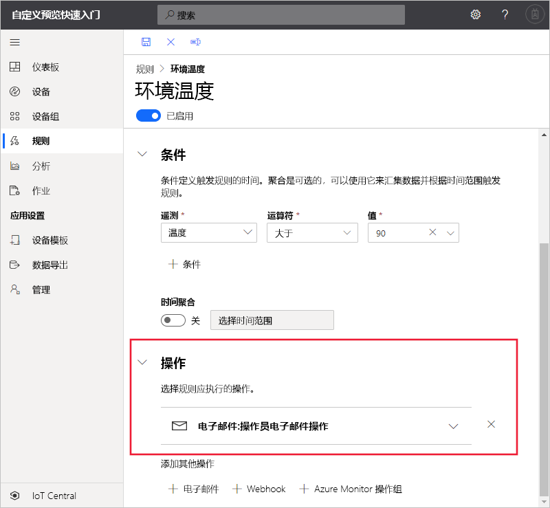

# 快速入门：在 Azure IoT Central 中配置用于设备的规则和操作（预览功能）

*本文适用于操作员、构建者和管理员。*

[!INCLUDE [iot-central-pnp-original](../../../includes/iot-central-pnp-original-note.md)]

在本快速入门中，将创建一个规则，用于在环境传感器设备中的温度超过 90 &deg; F 时发送电子邮件。

## 先决条件

在开始之前，应先完成前面的两个快速入门：[创建 Azure IoT Central 应用程序](./quick-deploy-iot-central.md)和[将模拟设备添加到 IoT Central 应用程序](./quick-create-pnp-device.md)，以创建要使用的环境传感器设备模板  。

## 创建基于遥测的规则

1. 若要为应用程序添加新的基于遥测的规则，请在左侧窗格中选择“规则”  。

1. 若要创建新规则，请选择“+新建”  。

1. 输入 **Environmental temperature** 作为规则名称。

1. 在“目标设备”  部分中，选择“环境传感器”  作为设备模板。 此选项根据设备模板类型筛选规则适用的设备。 可以通过选择“+ 筛选器”  添加更多筛选条件。

1. 在“条件”  部分中，定义触发规则的条件。 使用以下信息定义基于温度遥测的条件：

    | 字段                                        | 值                             |
    | -------------------------------------------- | ------------------------------    |
    | 度量                                  | 温度                       |
    | 运算符                                     | 大于                   |
    | 值                                        | 90                                |

    若要添加更多条件，请选择“+条件”  。

    

1. 若要添加要在规则触发时运行的电子邮件操作，请选择“+ 电子邮件”  。

1. 使用下表中的信息定义操作：

    | 设置   | 值                                             |
    | --------- | ------------------------------------------------- |
    | 显示名称 | 操作员电子邮件操作                          |
    | 目标        | 你的电子邮件地址                                |
    | 说明     | 环境温度超过阈值。 |

    > [!NOTE]
    > 若要接收电子邮件通知，电子邮件地址必须是[应用程序中的用户 ID](howto-administer.md)，并且该用户必须至少登录过应用程序一次。

    

1. 选择“保存”。  你的规则将列在“规则”  页上。

## 测试规则

保存规则后不久，它将变为活动状态。 满足规则中定义的条件时，应用程序会将消息发送到操作中指定的电子邮件地址。

> [!NOTE]
> 测试完成后，关闭该规则以停止在收件箱中接收警报。

## 后续步骤

在此快速入门中，读者学习了如何：

* 创建基于遥测的规则
* 添加操作

若要了解有关连接到应用程序的监视设备的详细信息，请继续阅读快速入门：

> [!div class="nextstepaction"]
> [使用 Azure IoT Central 监视设备](quick-monitor-devices.md)。
