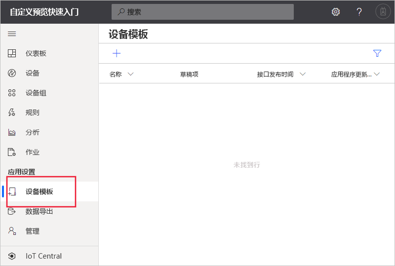
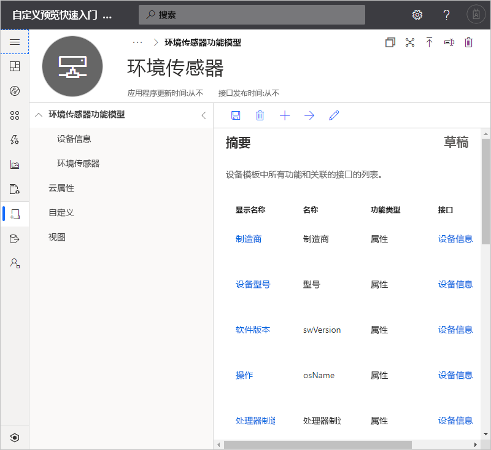
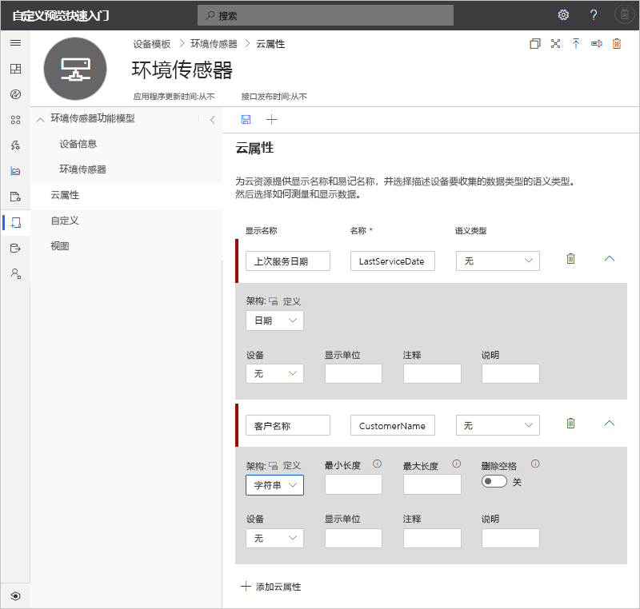
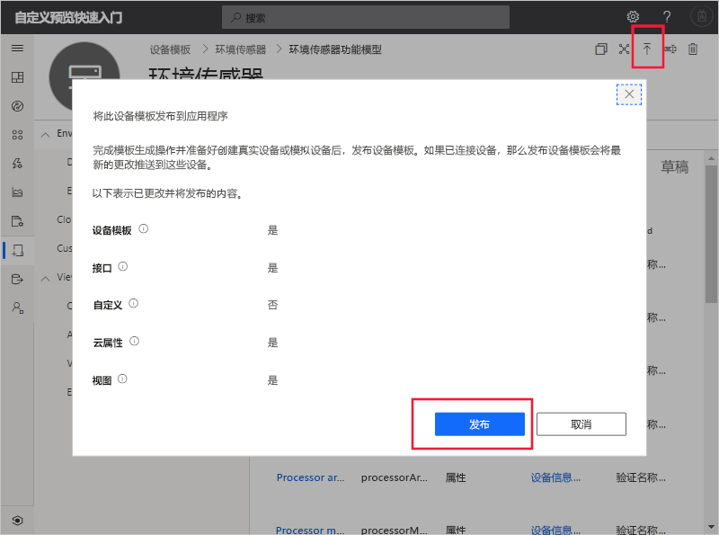
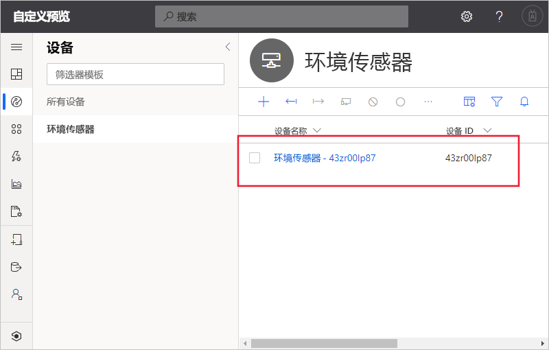
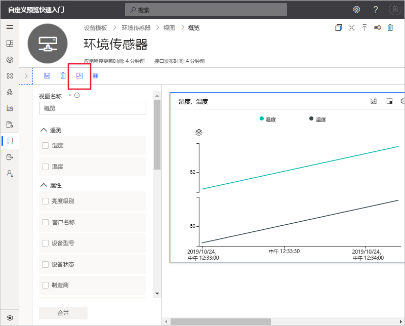

# 快速入门：将模拟设备添加到 IoT Central 应用程序（预览功能）

*本文适用于操作员、构建者和管理员。*

[!INCLUDE [iot-central-pnp-original](../../../includes/iot-central-pnp-original-note.md)]

设备模板定义连接到 IoT Central 应用程序的设备的功能。 功能包括设备发送的遥测数据、设备属性以及设备响应的命令。 在设备模板中，构建者或操作员可以将实际设备和模拟设备添加到应用程序中。 在连接实际设备之前，模拟设备对于测试 IoT Central 应用程序的行为非常有用。

在此快速入门中，创建“环境传感器”设备模板并添加模拟设备  。 环境传感器设备：

* 发送温度等遥测数据。
* 报告设备特定的属性，例如亮度级别。
* 响应打开和关闭等命令。
* 报告常规设备属性，例如固件版本和序列号。

## 必备条件

完成[创建 Azure IoT Central 应用程序（预览功能）](./quick-deploy-iot-central.md)快速入门，使用“自定义应用”>“预览应用程序”模板创建 IoT Central 应用程序  。

还需要获取包含 [IoT 即插即用](../../iot-pnp/overview-iot-plug-and-play.md)设备功能模型的 **EnvironmentalSensorInline.capabilitymodel.json** 文件的本地副本。 可以从[此处](https://raw.githubusercontent.com/Azure/IoTPlugandPlay/master/samples/EnvironmentalSensorInline.capabilitymodel.json)下载它。 在页面上单击右键，然后选择“另存为”。 

下载该文件后，在文本编辑器中将其打开，并将出现的两个 `<YOUR_COMPANY_NAME_HERE>` 替换为自己的名称。 请仅使用字符 a-z、A-Z、0-9 和下划线。

## 创建模板

构建人员可在应用程序中创建和编辑设备模板。 发布设备模板后，可以生成模拟设备，或连接用于实施该设备模板的实际设备。 使用模拟设备可以在连接实际设备之前先测试应用程序的行为。

若要将新设备模板添加到应用程序，请转到“设备模板”页。  为此，请在左窗格中选择“设备模板”选项卡  。

### 添加设备功能模型

在 IoT Central 中，可通过多个选项来创作设备功能模型。 可以选择从头开始创建自定义模型、从文件导入、从设备目录中选择，或者通过设备优先连接（其中的设备功能模型已在公共存储库中发布）来连接 IoT 即插即用设备。 本教程介绍如何从文件导入设备功能模型。

以下步骤说明如何导入“环境传感器”设备的功能模型。  这些设备将遥测数据（例如温度）发送到应用程序：

1. 若要添加新的设备模板，请在“设备模板”页上选择“+”   。

1. 从自定义设备模板列表中选择“IoT 设备”，选择“下一步:   自定义”，然后选择“下一步:  查看”，然后选择“创建”  。

1. 输入“环境传感器”作为设备模板的名称。 

1. 选择“导入功能模型”，以基于 JSON 文件创建新的设备功能模型。  导航到本地计算机上保存 **EnvironmentalSensorInline.capabilitymodel.json** 文件的文件夹。 选择文件“EnvironmentalSensorInline.capabilitymodel.json”，然后选择“打开”。   环境传感器功能模型包括“环境传感器”和“设备信息”接口：  

    

    这些接口定义“环境传感器”设备的功能。  功能包括设备发送的遥测数据、设备报告的属性，以及设备响应的命令。

### 添加云属性

设备模板可以包含云属性。 云属性仅存在于 IoT Central 应用程序中，永远不会与设备相互发送和接收信息。

1. 依次选择“云属性”、“+ 添加云属性”。   使用下表中的信息将云属性添加到设备模板。

    | 显示名称      | 语义类型 | 架构 |
    | ----------------- | ------------- | ------ |
    | 最后维修日期 | 无          | Date   |
    | 客户名称     | 无          | String |

1. 选择“保存”以保存更改： 

    

## 创建视图

构建人员可将应用程序自定义为向操作员显示有关环境传感器设备的信息。 完成自定义后，操作员可以管理连接到应用程序的环境传感器设备。 可为操作员创建两种类型的视图来让他们与设备交互：

* 用于查看和编辑设备与云属性的窗体。
* 用于可视化设备的仪表板。

### 生成默认视图

生成默认视图是开始可视化重要设备信息的快捷方法。 最多可为设备模板生成三个默认视图：

* “命令”视图可让操作员将命令发送到设备。 
* “概述”视图使用图表和指标来显示设备遥测数据。 
* “关于”视图显示设备属性。 

选择“视图”，然后“生成默认视图”   。

### 配置用于可视化设备的视图

设备仪表板可让操作员使用图表和指标来可视化设备。 构建人员可以定义要在设备仪表板上显示的信息。 可为设备定义多个仪表板。 若要创建一个仪表板来可视化环境传感器遥测数据，请依次选择“视图”、“可视化设备”：  

1. 所有设备属性、云属性、遥测和静态选项都在“属性”  下列出。 可将其中的任意项拖放到视图中。 将“亮度级别”  属性拖到视图中。 可以使用齿轮图标配置磁贴。

1. 若要添加用于绘制遥测数据的图表，请选择“湿度”和“温度”，然后选择“合并”。    若要以不同的格式（例如饼图或条形图）查看此图表，请选择磁贴顶部的“更改可视化效果”按钮。 

1. 选择“保存”以保存视图： 

可以添加更多的磁贴用于显示其他属性或遥测值。 还可以添加静态文本、链接和图像。 若要移动仪表板上的某个磁贴或调整其大小，请将鼠标指针移到该磁贴上，然后将该磁贴拖放到新位置或调整其大小。

### 添加设备窗体

设备窗体可让操作员编辑可写的设备属性和云属性。 构建人员可以定义多个窗体，并选择要在每个窗体中显示的设备属性和云属性。 还可以在窗体中显示只读的设备属性。

若要创建窗体用于查看和编辑环境传感器属性：

1. 导航到“环境传感器”  模板中的“视图”  。 选择“编辑设备和云数据”  磁贴以添加新视图。

1. 输入窗体名称“环境传感器属性”。 

1. 将“客户名称”和“上次检修日期”云属性拖放到窗体中的现有部分。  

1. 选择“亮度级别”和“设备状态”设备属性。   然后选择“添加部分”。  将部分的标题编辑为“传感器属性”。  选择“应用”。 

1. 选择“设备型号”  、“软件版本”  、“制造商”  和“处理器制造商”  设备属性。 然后选择“添加部分”。  将部分的标题编辑为“设备属性”。  选择“应用”。 

1. 选择“保存”以保存视图。 

## 发布设备模板

在创建模拟环境传感器或连接实际环境传感器之前，需要发布设备模板。

若要发布设备模板：

1. 从“设备模板”页转到你的设备模板。 

1. 选择“发布”  。

1. 在“发布设备模板”对话框中，选择“发布”：  

    

发布设备模板后，它将显示在“设备”页上，操作员可以看到它。  在发布的设备模板中，除非创建新的版本，否则无法编辑设备功能模型。 但是，在不创建新版本的情况下，可以在发布的设备模板中更新云属性、自定义项和视图。 进行任何更改后，选择“发布”将这些更改推送给操作员。 

## 添加模拟设备

若要将模拟设备添加到应用程序，请使用创建的“环境传感器”设备模板  。

1. 若要以操作员身份添加新设备，请在左侧窗格中选择“设备”  。 “设备”  选项卡显示“所有设备”  和“环境传感器”  设备模板。 选择“环境传感器”  。

1. 若要添加模拟环境传感器设备，请选择“+新建”  。 使用建议的**设备 ID** 或输入自己的小写**设备 ID**。 也可输入新设备的名称。 将“模拟”  开关切换为“开”  ，然后选择“创建”  。

    

现在，你可以使用模拟数据与构建者为设备模板创建的视图进行交互。

## 使用模拟设备改进视图

创建新的模拟设备后，构建者可以使用此设备继续改进设备模板的视图并基于其构建。

1. 在左窗格中选择“设备模板”，然后选择“环境传感器”模板   。

1. 选择要编辑的任何视图，或创建新视图。 单击“配置预览设备”，然后单击“从正在运行的设备中选择”   。 你可以在此处选择“无预览设备”、“使用可配置用于测试的实际设备”，或者“从已添加到 IoT Central 的现有设备”。

1. 在列表中选择模拟设备。 然后，选择“应用”  。 现在，你可以在设备模板视图构建体验中看到相同的模拟设备。 此视图对于图表和其他可视化效非常有用。

    

## 后续步骤

在此快速入门中，你了解了如何创建“环境传感器”设备模板并将模拟设备添加到应用程序中  。

若要了解有关连接到应用程序的监视设备的详细信息，请继续阅读快速入门：

> [!div class="nextstepaction"]
> [配置规则和操作](./quick-configure-rules.md)
