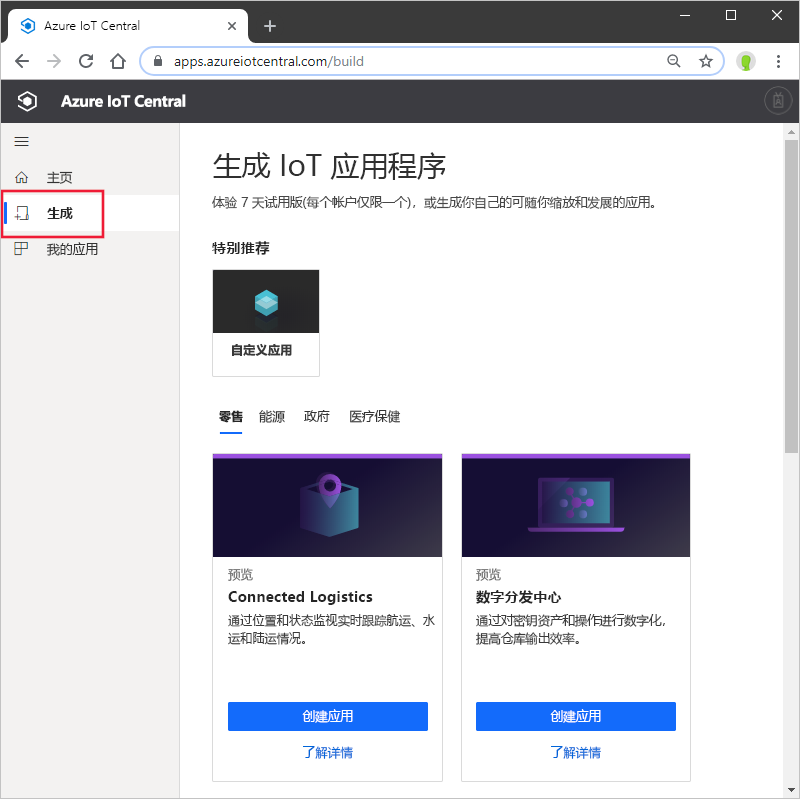
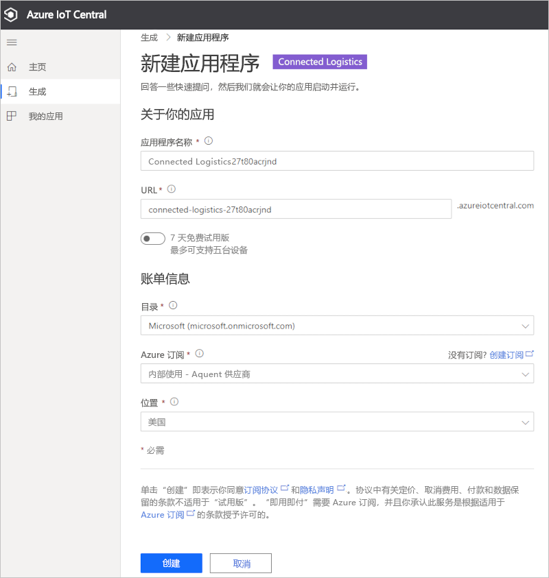

# 创建 Azure IoT Central 应用程序（预览功能）

[!INCLUDE [iot-central-pnp-original](../../../includes/iot-central-pnp-original-note.md)]

本快速入门介绍如何创建包含预览功能（如 IoT 即插即用）的 Azure IoT Central 应用程序。

> [!WARNING]
> Azure IoT Central 中的 IoT 即插即用功能目前以公共预览版提供。 请勿将已启用 IoT 即插即用的 IoT Central 应用程序用于生产工作负荷。 对于生产环境，请使用从当前正式发布的应用程序模板创建的 IoT Central 应用程序。

## 创建应用程序

导航到 [Azure IoT Central 生成](https://aka.ms/iotcentral)站点。 然后使用 Microsoft 个人、工作或学校帐户登录。

你可以从与行业相关的 IoT Central 模板列表中创建一个新应用程序，以帮助你快速入门，也可以使用“自定义应用”模板从头开始  。

若要创建新的 Azure IoT Central 应用程序：

1. 若要从“行业模板”创建新的 Azure IoT Central 应用程序，请从某个行业下的可用模板列表中选择一个应用程序模板  。 也可以选择“自定义应用”从头开始  。
1. Azure IoT Central 会根据所选应用程序模板自动建议“应用程序名称”  。 可以使用此名称或输入自己的友好应用程序名称。
1. Azure IoT Central 还会根据应用程序名称为你生成唯一的“应用程序 URL”前缀  。 使用此 URL 访问应用程序。 如果你愿意，可以自由地将此 URL 前缀更改为更令人难忘的内容。

    

    > [!NOTE]
    > 如果使用的是自定义应用模板，你将看到一个“应用程序模板”下拉字段  。 从这里，你可以在预览模板和正式发布的模板之间切换。 你可能还会看到为组织提供的其他模板。

1. 选择是要使用 7 天免费试用版创建此应用程序，还是使用即用即付订阅。
    - “试用版”应用程序 7 天免费，最多支持 5 台设备  。 它们可以在到期之前随时转换为即用即付。 若要创建试用版应用程序，则需要输入联系信息并选择是否接收 Microsoft 发送的信息和使用技巧。
    - 即用即付应用程序按设备收费，前两个台设备免费  。 详细了解 [IoT Central 定价](https://aka.ms/iotcentral-pricing)。 若要创建“即用即付”应用程序，需要选择“目录”、“Azure 订阅”和“区域”    ：
        - “目录”是将在其中创建应用程序的 Azure Active Directory (AAD)  。 Azure AD 包含用户标识、凭据和其他组织信息。 如果没有 Azure AD，则在创建 Azure 订阅时，系统会为你创建一个 Azure AD。
        - 有了 *Azure 订阅*，就可以创建 Azure 服务的实例。 IoT Central 将在订阅中预配资源。 如果没有 Azure 订阅，则可在 [Azure 注册页](https://aka.ms/createazuresubscription)上创建一个。 创建 Azure 订阅以后，请导航回“创建应用程序”页。  新订阅将显示在“Azue 订阅”下拉列表中  。
        - “区域”是存储设备数据的物理位置  。 通常，应选择物理上离设备最近的区域以获得最佳性能，并确保数据主权符合性。 选择一个区域后，就不能在以后将应用程序移到其他区域。

        > [!NOTE]
        > 在公共预览版期间，“预览应用程序”的唯一可用区域是“欧洲北部”和“美国中部”    。

1. 查看“条款和条件”，并选择页面底部的“创建”  。

## 后续步骤

在本快速入门中，创建了 IoT Central 应用程序。 下面是建议的后续步骤：

> [!div class="nextstepaction"]
> [将模拟设备添加到 IoT Central 应用程序](./quick-create-pnp-device.md)
