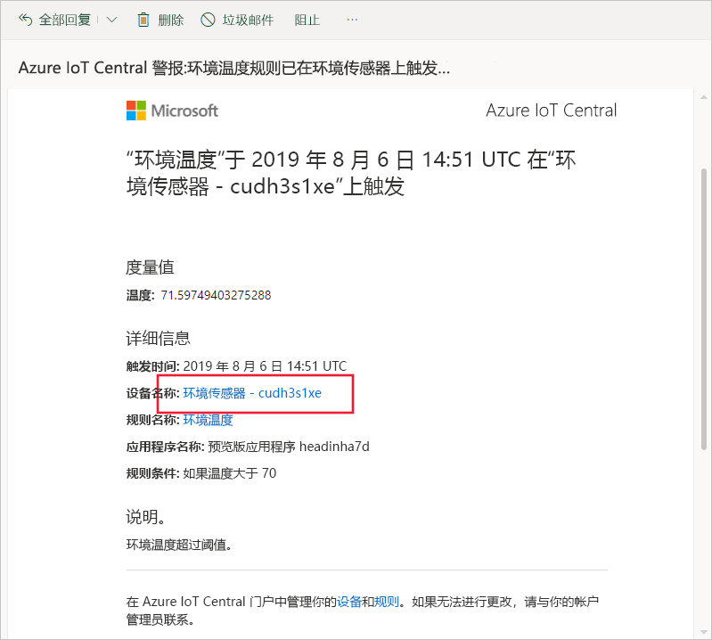
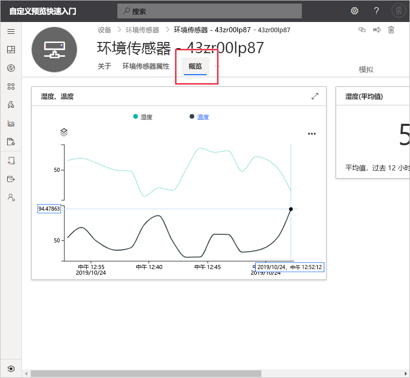
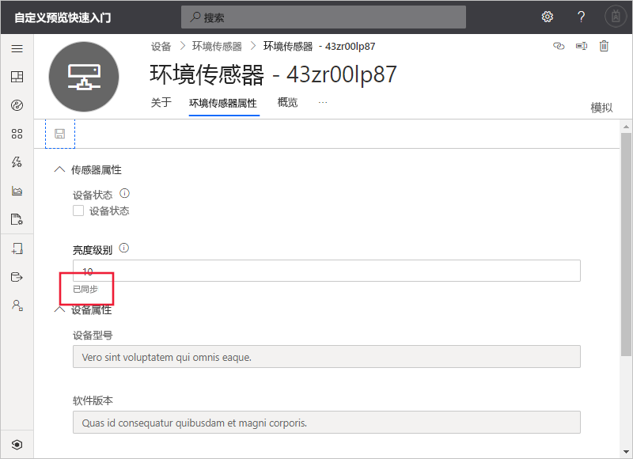

# 快速入门：使用 Azure IoT Central 监视设备（预览功能）

*本文适用于操作员、构建者和管理员。*

[!INCLUDE [iot-central-pnp-original](../../../includes/iot-central-pnp-original-note.md)]

本快速入门介绍作为操作员如何使用 Microsoft Azure IoT Central 应用程序监视设备和更改设置。

## 先决条件

在开始之前，应先完成前面的三个快速入门：[创建 Azure IoT Central 应用程序](./quick-deploy-iot-central.md)、[将模拟设备添加到 IoT Central 应用程序](./quick-create-pnp-device.md)以及[为设备配置规则和操作](quick-configure-rules.md)。

## 接收通知

Azure IoT Central 将有关设备的通知作为电子邮件发送。 构建者添加了一条规则，以便在连接的环境传感器设备中的温度超过阈值时发送通知。 检查发送到构建者选择接收通知的帐户的电子邮件。

打开你在[配置用于设备的规则和操作](quick-configure-rules.md)快速入门结束时收到的电子邮件。 在电子邮件中，选择指向设备的链接：

此时将在浏览器中打开前面快速入门中创建的环境传感器模拟设备的“仪表板”视图  ：

## 调查问题

作为操作员，你可以在“概述”、“环境传感器属性”和“命令”页上查看有关设备的信息    。 构建者自定义了“仪表板”  和“环境传感器属性”  页，以显示有关连接的环境传感器设备的重要信息。

选择“概述”视图可查看有关设备的信息  。

仪表板上的图表显示了设备温度的曲线图。 你确定设备温度过高。

## 解决问题

若要对设备进行更改，请使用“环境传感器属性”页  。

选择“环境传感器属性”。  将“亮度级别”  更改为 10。 选择“保存”  以更新设备。 当设备确认设置更改时，属性的状态将更改为“已同步”  ：

## 后续步骤

在此快速入门中，读者学习了如何：

* 接收通知
* 调查问题
* 解决问题

现在已了解如何监视设备，建议执行的下一步骤是：

> [!div class="nextstepaction"]
> [生成和管理设备模板](howto-set-up-template.md)。
