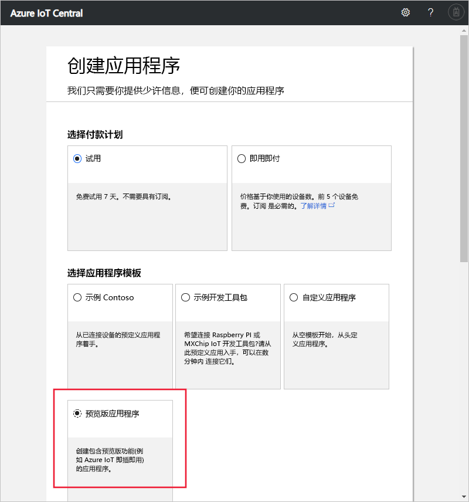

# 创建 Azure IoT Central 应用程序（预览功能）

[!INCLUDE [iot-central-pnp-original](../../includes/iot-central-pnp-original-note.md)]

本快速入门介绍如何创建使用预览功能（如 IoT 即插即用）的 Azure IoT Central 应用程序。

> [!WARNING]
> Azure IoT Central 中的 IoT 即插即用功能目前以公共预览版提供。 请勿将已启用 IoT 即插即用的 IoT Central 应用程序用于生产工作负荷。 对于生产环境，请使用从当前正式发布的应用程序模板创建的 IoT Central 应用程序。

## 创建应用程序

导航到 [Azure IoT Central 应用程序管理器](https://aka.ms/iotcentral)网站。 然后使用 Microsoft 个人、工作或学校帐户登录。

若要开始创建新的 Azure IoT Central 应用程序，请选择“新建应用程序”  。 此链接会将你转到“创建应用程序”  页。

若要创建包含预览功能（如 IoT 即插即用）的新 Azure IoT Central 应用程序，请执行以下操作：

1. 选择付款计划：
   - **试用版**应用程序免费 7 天，然后过期。 它们可以在到期之前随时转换为即用即付。 若要创建试用版应用程序，则需要输入联系信息并选择是否接收 Microsoft 发送的信息和使用技巧  。
   - **即用即付**应用程序按设备收费，前 5 台设备免费。 若要创建即用即付应用程序，需要选择“目录”、“Azure 订阅”和“区域”     ：
      - 目录是用于创建应用程序的 Azure Active Directory (AD)  。 它包含用户标识、凭据和其他组织信息。 如果没有 Azure AD，则在创建 Azure 订阅时，系统会为你创建一个 Azure AD。
      - 有了 *Azure 订阅*，就可以创建 Azure 服务的实例。 IoT Central 将在订阅中预配资源。 如果没有 Azure 订阅，则可在 [Azure 注册页](https://aka.ms/createazuresubscription)上创建一个。 创建 Azure 订阅以后，请导航回“创建应用程序”页。  新订阅显示在“Azue 订阅”  下拉列表中。
      - *区域*是你想要创建应用程序的物理位置。 通常，选择物理上离设备最近的区域以获得最佳性能。 可以在[可用产品(按区域)](https://azure.microsoft.com/regions/services/)页面上查看提供 Azure IoT Central 的区域。 选择一个区域后，就不能在以后将应用程序移到其他区域。

      可在 [Azure IoT Central 定价页](https://azure.microsoft.com/pricing/details/iot-central/)上了解定价详细信息。

1. 选择一个友好的应用程序名称，例如 **Contoso IoT**。 Azure IoT Central 将会生成唯一的 URL 前缀。 可将此 URL 前缀更改为更容易记住的内容。

1. 选择“预览应用程序”  模板。 应用程序模板可能包含入门所需的预定义项目（例如设备模板和仪表板）。

1. 在页面底部选择“创建”  。

## 后续步骤

在本快速入门中，创建了使用预览功能的 IoT Central 应用程序。 建议执行的下一步骤是：

> [!div class="nextstepaction"]
> [在 Azure IoT Central 应用程序中定义新的设备类型](./tutorial-define-device-type-pnp.md?toc=/azure/iot-central-pnp/toc.json&bc=/azure/iot-central-pnp/breadcrumb/toc.json)
