# 创建 Azure IoT Central 应用程序

构建人员可以使用 Azure IoT Central UI 来定义 Microsoft Azure IoT Central 应用程序。 本快速入门演示如何：

- 创建一个包含示例设备模板和模拟设备的 Azure IoT Central 应用程序。
- 查看应用程序中“冷藏食品贩卖机”设备模板的功能。
- 查看模拟“冷冻机”设备发送的遥测和分析数据。

在本快速入门中，我们将查看设备模板中的模拟“冷冻机”设备。 该模拟设备：

* 将遥测数据（例如温度和压力）发送到应用程序。
* 向应用程序报告设备属性值，例如运动警报。
* 具有可在应用程序中设置的设备设置，例如风扇速度。

在 Azure IoT Central 应用程序中基于设备模板创建模拟设备时，该模拟设备允许在连接真实设备之前测试应用程序。

## 创建应用程序

若要完成本快速入门，需要基于“Contoso 示例”应用程序模板创建一个 Azure IoT Central 应用程序。

导航到 Azure IoT Central 的[应用程序管理器](https://aka.ms/iotcentral)页。 输入用于访问 Azure 订阅的电子邮件地址和密码：

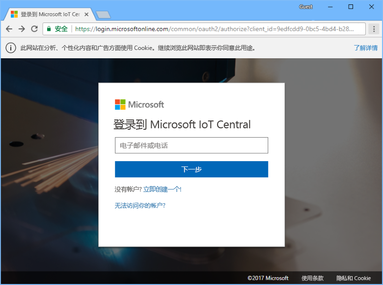

若要开始创建新的 Azure IoT Central 应用程序，请选择“新建应用程序”：

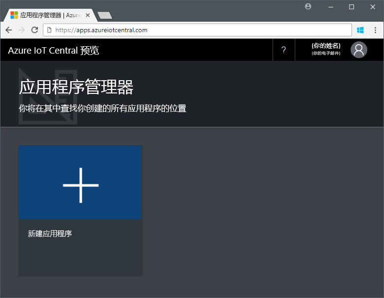

若要创建新的 Azure IoT Central 应用程序：

1. 选择“免费试用应用程序”付款计划。
1. 选择一个友好的应用程序名称，例如 **Contoso IoT**。 Azure IoT Central 将会生成唯一的 URL 前缀。 可将此 URL 前缀更改为更容易记住的内容。
1. 选择“Contoso 示例”应用程序模板。
1. 选择“创建”。

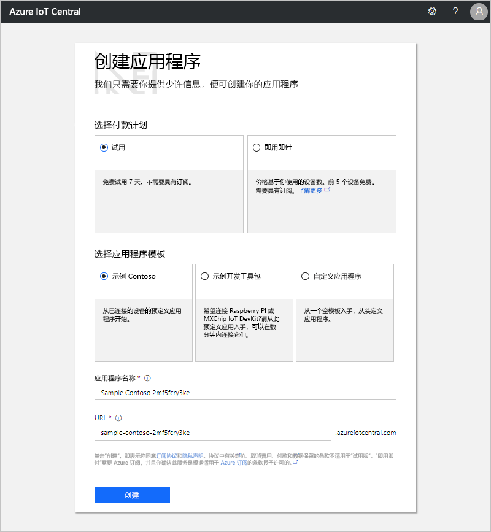

## 导航到该应用程序

应用程序准备就绪时，会显示应用程序的“主页”。 可以切换右上角的“设计模式”来编辑主页。 应用程序 URL 是在上一步骤中指定的 URL：

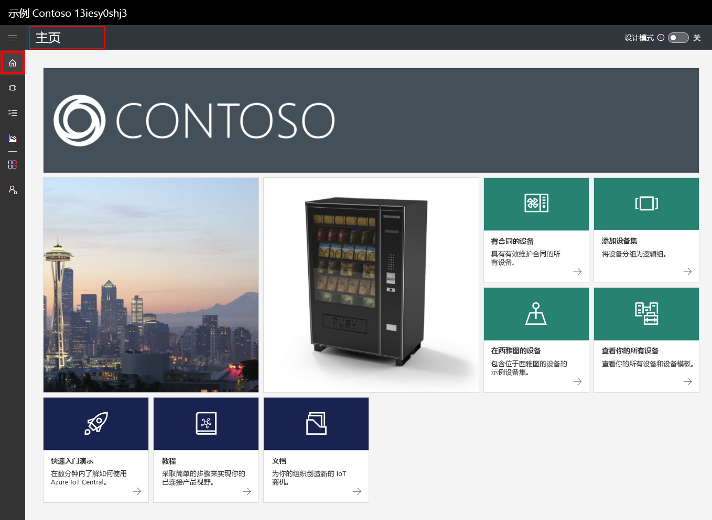

使用左侧导航菜单来访问新 Azure IoT Central 应用程序的不同区域：

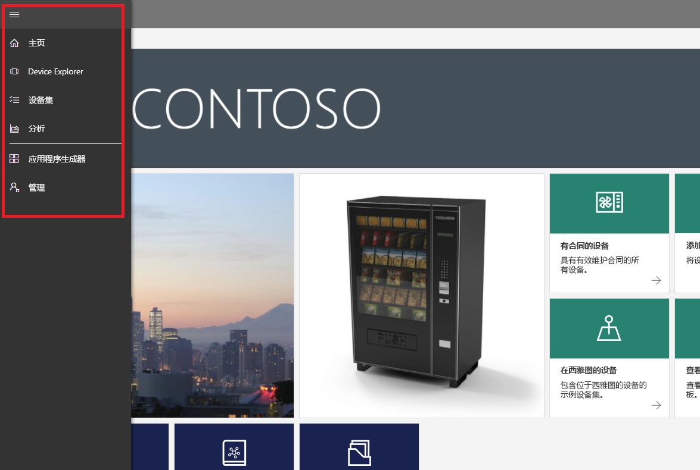

若要查看应用程序中的设备模板和设备，请在左侧导航菜单中选择“Device Explorer”。 示例应用程序包含“冷藏食品贩卖机”设备模板。 已基于此设备模板创建三个模拟设备：

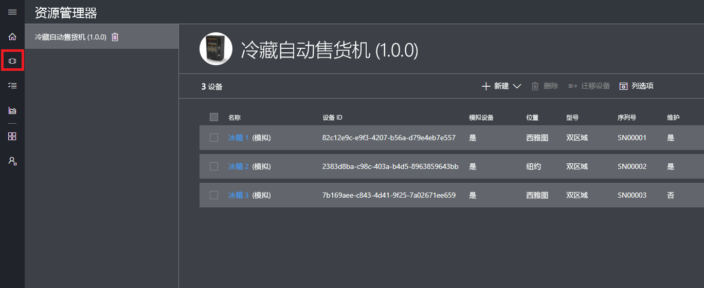

## 查看设备模板和设备

使用以下步骤查看基于“冷藏食品贩卖机”设备模板创建的冷冻机设备。 设备模板定义：

* 度量，例如设备发送的温度遥测数据。
* 用于控制设备的设置，例如风扇转速。
* 用于存储有关设备的信息的属性，例如序列号。
* 用于根据设备的行为将操作自动化的[规则](howto-create-telemetry-rules.md)。
* 显示有关设备的信息的可自定义仪表板。

可以基于设备模板创建模拟设备和真实设备。

### 度量

将显示“冷冻机 1”设备的“度量”页。 可以看到模拟设备发送的度量值列表。 该页还显示可见度量的可自定义图表：

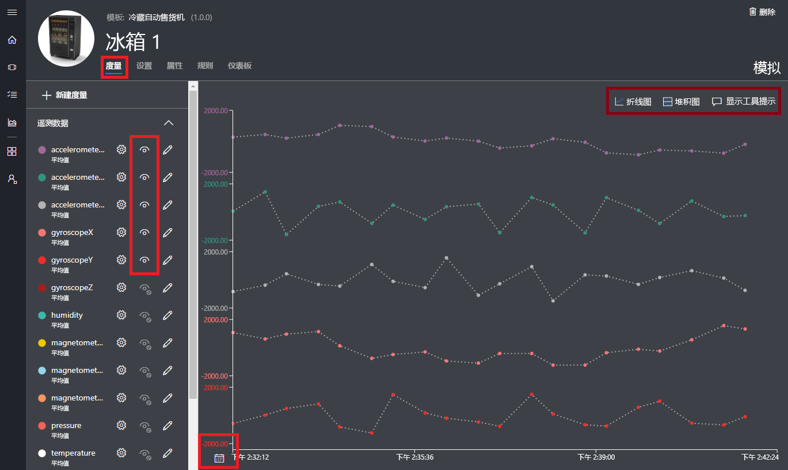

可以切换各个元素的可见性以及自定义图表。 当前图表显示来自模拟设备的遥测数据。 如果有相应的权限，则可将新的度量添加到设备模板。

> [!NOTE]
> 可能需要等待片刻，模拟数据才会显示在图表上。

### 设置

选择“设置”。 在“设置”页上可以控制设备。 例如，可以更新冷冻机上的风扇速度：

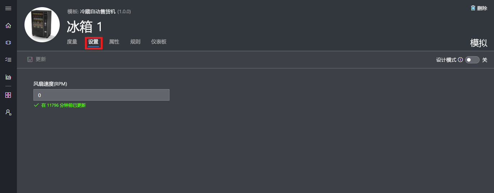

设备确认更改时，设置会显示为“已同步”。

### 属性

选择“属性”。 在“属性”页上，可以：

* 维护有关设备的信息，例如客户名称。
* 查看设备报告的属性值，例如运动警报。

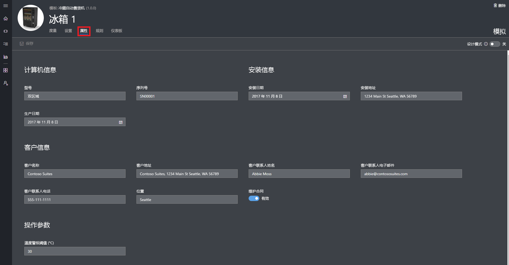

### 仪表板

选择“仪表板”。 仪表板是显示有关设备的信息（例如度量、属性和 KPI）的可自定义视图：

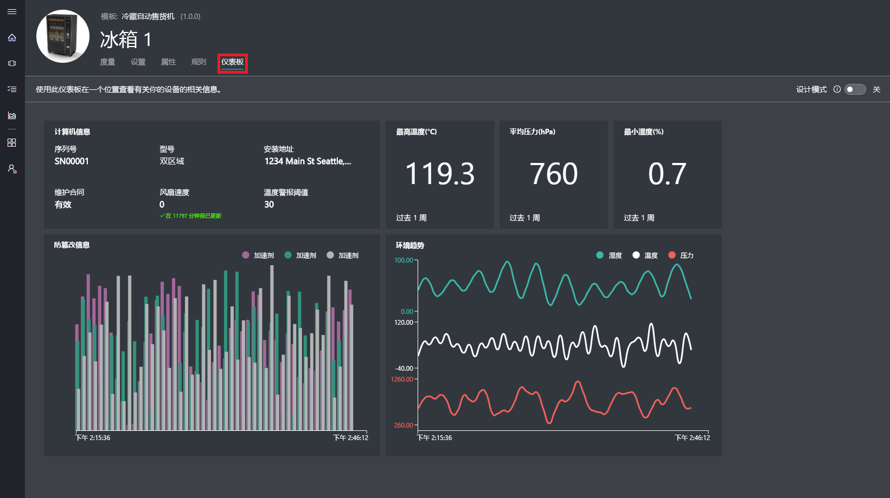

## 查看分析数据

上一部分介绍了如何查看有关单个设备的信息。 可以使用[设备集](howto-use-device-sets.md)和[分析](howto-create-analytics.md)功能查看来自多个设备的整合信息。

设备集使用查询来动态选择一组与条件匹配的设备。 例如，**Machines in Seattle** 设备集会选择位于 Seattle 的冷冻机设备。 若要查看 **Machines in Seattle** 设备集，请在左侧导航菜单中选择“设备集”，然后选择“Machines in Seattle”：

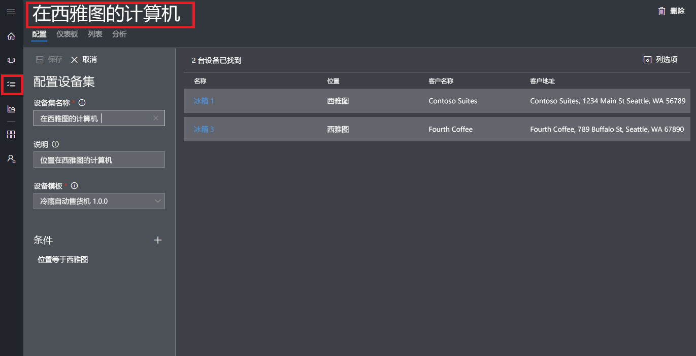

可以在“分析”页上查看某个设备集中的设备的分析数据：

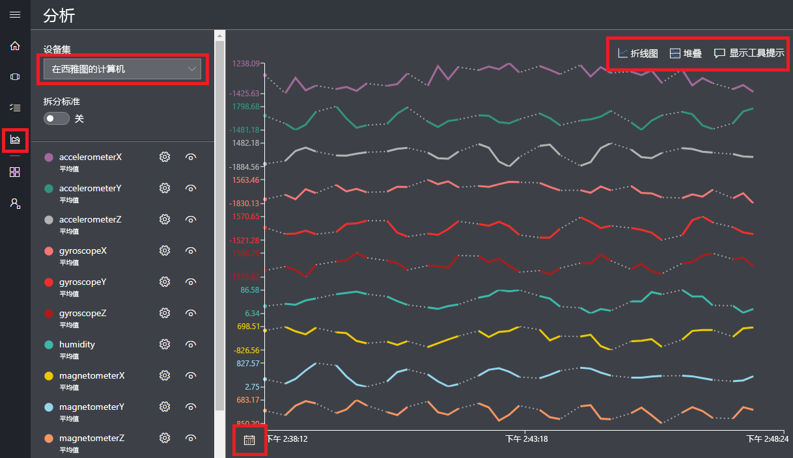

## 后续步骤

在本快速入门中，我们创建了一个包含“冷藏食品贩卖机”设备模板和模拟设备的预填充 Azure IoT Central 应用程序。 请参阅[在应用程序中定义新设备模板](tutorial-define-device-type.md)，详细了解构建人员如何定义自己的设备模板。
