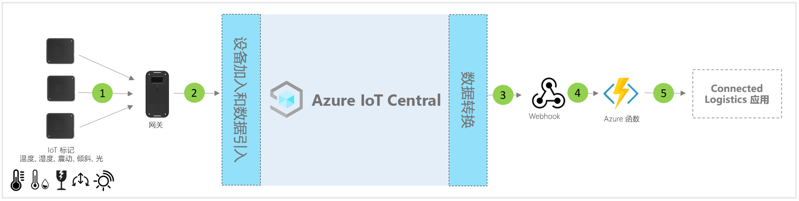

# IoT Central 互联物流应用程序模板的体系结构

合作伙伴和客户可以使用应用模板和以下指南来开发端到端**互联物流解决方案**。

> [!div class="mx-imgBorder"]
> 

1. 一组将遥测数据发送到网关设备的 IoT 标记
2. 将遥测和聚合见解发送到 IoT Central 的网关设备
3. 数据被路由到所需的 Azure 服务以进行操作
4. 可以使用 Azure 服务（如 ASA 或 Azure Functions）重新设置数据流的格式，并将其发送到所需的存储帐户 
5. 最终用户商业应用程序可以支持各种业务工作流

## 详细信息
以下部分概述了从 IoT 标记和网关引入的概念体系结构遥测数据的每个部分

## IoT 标记
IoT 标记提供物理、周边和环境传感器功能，如温度、湿度、震动、倾斜和光照。 IoT 标签通常通过 Zigbee (802.15.4) 连接到网关设备。 标签是较便宜的传感器；因此，可以在典型的物流之旅结束时将其丢弃，以避免逆向物流带来的麻烦。

## 网关
网关也可以通过其环境感应功能充当 IoT 标记。 网关通过手机网络、Wi-Fi 通道启用上游 Azure IoT 云连接 (MQTT)。  蓝牙、NFC 和 802.15.4 无线传感器网络 (WSN) 模式用于与 IoT 标记的下游通信。 网关提供了以下功能：端到端的安全云连接、IoT 标记配对、传感器数据聚合、数据保留以及配置警报阈值。

## 使用 IoT Central 进行设备管理 
Azure IoT Central 是一种解决方案开发平台，可简化 IoT 设备连接、配置和管理。 该平台大大降低了 IoT 设备管理、运营和相关开发的负担和成本。 客户和合作伙伴可以构建端到端的企业解决方案，以便在物流中实现数字反馈循环。

## 使用数据出口获得业务见解并执行操作 
IoT Central 平台通过连续数据导出 (CDE) 和 API 提供了丰富的扩展选项。 通常将基于遥测数据处理或原始遥测的业务见解导出到首选业务线应用程序。 可以使用 Webhook、服务总线、事件中心或 Blob 存储来构建、训练和部署机器学习模型并进一步丰富见解，从而实现这一目标。

## 后续步骤
* 了解如何部署[联接的物流解决方案模板](./tutorial-iot-central-connected-logistics-pnp.md)
* 详细了解 [IoT Central 零售模板](./overview-iot-central-retail-pnp.md)
* 请参阅 [IoT Central 概述](../core/overview-iot-central.md)，详细了解 IoT Central
