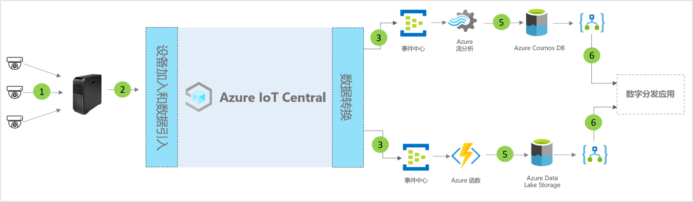

# IoT Central 的数字分发中心应用程序模板体系结构

合作伙伴和客户可以使用应用模板和以下指南来开发端到端“数字分发中心”解决方案  。

> [!div class="mx-imgBorder"]
> 

1. 一组将遥测数据发送到网关设备的 IoT 传感器
2. 将遥测和聚合见解发送到 IoT Central 的网关设备
3. 数据被路由到所需的 Azure 服务以进行操作
4. 可以使用 Azure 服务（如 ASA 或 Azure Functions）重新设置数据流的格式，并将其发送到所需的存储帐户 
5. 处理后的数据将存储在热存储中以便进行近实时操作，或者存储在冷存储中以用于执行更多基于 ML 或批处理分析的见解增强功能。 
6. 可使用逻辑应用为最终用户商业应用程序中的各种业务工作流提供支持

## 详细信息
以下部分概述了概念体系结构的每个部分

## 摄像机 
摄像机是这个数字连接的企业级生态系统中的主要传感器。 利用机器学习和人工智能领域的进步，可将视频转换为结构化数据，在边缘进行处理，然后发送到云。 我们可以使用 IP 照相机来捕获图像，在照相机上压缩图像，然后通过边缘计算将压缩的数据发送到视频分析管道，或使用 GigE 视觉照相机捕获传感器上的图像，将这些图像直接发送到 Azure IoT Edge，进行压缩并在视频分析管道中处理。 

## Azure IoT Edge 网关
“相机即传感器”和边缘工作负荷由 Azure IoT Edge 在本地管理，相机流由分析管道进行处理。 Azure IoT Edge 的视频分析处理管道带来了许多好处（包括响应时间缩短、带宽消耗降低），从而降低了延迟以实现快速数据处理。 只会将最重要的元数据、见解或操作发送到云，以进行进一步的操作或调查。 

## 使用 IoT Central 进行设备管理 
Azure IoT Central 是一种解决方案开发平台，可简化 IoT 设备和 Azure IoT Edge 网关连接、配置和管理。 该平台大大降低了 IoT 设备管理、运营和相关开发的负担和成本。 客户和合作伙伴可以构建端到端的企业解决方案，以便在分发中心中实现数字反馈循环。

## 使用数据出口获得业务见解并执行操作 
IoT Central 平台通过连续数据导出 (CDE) 和 API 提供了丰富的扩展选项。 通常将基于遥测数据处理或原始遥测的业务见解导出到首选业务线应用程序。 可以通过 Webhook、服务总线、事件中心或 Blob 存储来构建、训练和部署机器学习模型并进一步丰富见解，从而实现这一目标。

## 后续步骤
* 了解如何部署[数字分发中心模板](./tutorial-iot-central-digital-distribution-center-pnp.md)
* 详细了解 [IoT Central 零售模板](./overview-iot-central-retail-pnp.md)
* 请参阅 [IoT Central 概述](../core/overview-iot-central.md)，详细了解 IoT Central
