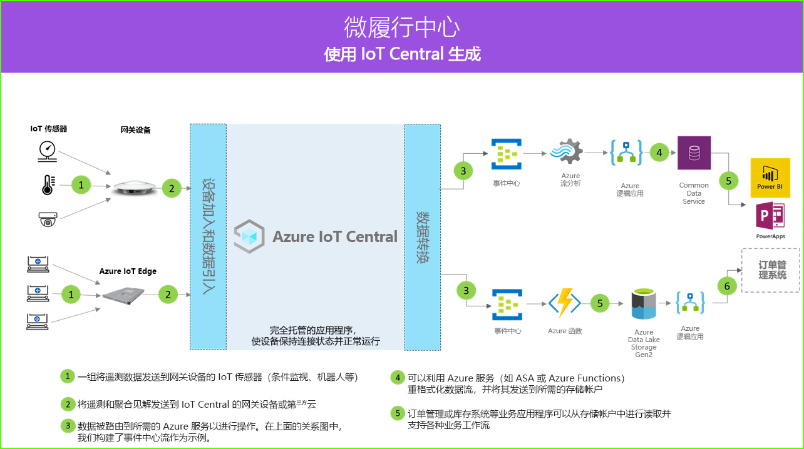

# 微履行中心体系结构

[!INCLUDE [iot-central-pnp-original](../../../includes/iot-central-pnp-original-note.md)]

微履行中心解决方案允许以数字方式连接、监视和管理全自动履行中心的各个方面，以消除停机时间，同时提高安全性和整体效率，从而降低成本。 可以利用 IoT Central 中的某种应用程序模板和下面的体系结构作为指导来构建这些解决方案。

- 一组将遥测数据发送到网关设备的 IoT 传感器
- 将遥测和聚合见解发送到 IoT Central 的网关设备
- 连续数据导出到所需的 Azure 服务以进行操作
- 可按所需格式对数据进行结构化并将其发送到存储服务
- 业务应用程序可以查询数据并生成可助力零售运营的见解
 
让我们来了解一些通常在微履行中心解决方案中起作用的关键组件。

## 机器人载体

微履行中心解决方案中可能会有大量产生各种遥测信号的机器人载体。 这些信号可以被网关设备接收、聚合，然后发送到 IoT Central，如体系结构图左侧所示。  

## 环境监视传感器

IoT 解决方案从一组传感器开始，这些传感器从履行中心捕获有意义的信号。 上面的体系结构图最左侧的各种传感器反映了这一事实。

## 网关设备

许多 IoT 传感器可将原始信号直接送到云或位于其附近的网关设备。 网关设备先在边缘执行数据聚合，然后将摘要见解发送到 IoT Central 应用程序。 网关设备还负责将命令和控制操作中继到传感器设备（如果适用）。 

## IoT Central 应用程序

Azure IoT Central 应用程序从履行中心环境中的各种 IoT 传感器、机器人以及网关设备引入数据，并生成一组有意义的见解。

Azure IoT Central 还为商店运营商提供定制的体验，使他们能够远程监视和管理基础结构设备。

## 数据转换
解决方案中的 Azure IoT Central 应用程序可配置为将原始或聚合见解导出到一组 Azure PaaS（平台即服务）服务，这些服务可执行数据操作并丰富这些见解，然后将其引入业务应用程序。 

## 业务应用程序
IoT 数据可用于为在零售环境中部署的各种业务应用程序提供支持。 履行中心经理或员工可以利用这些应用程序将业务见解可视化，并实时采取有意义的行动。 若要了解如何为零售团队构建实时 Power BI 仪表板，请按照[教程](./tutorial-in-store-analytics-create-app-pnp.md)操作。

## 后续步骤
* [微履行中心](https://aka.ms/checkouttemplate)应用程序模板入门。 
* 请阅读[教程](https://aka.ms/mfc-tutorial)，该教程将指导你利用微履行中心应用模板构建解决方案。
