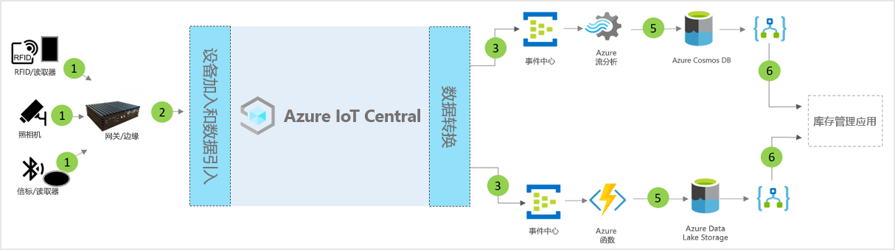

# IoT Central 智能库存管理应用程序模板的体系结构

合作伙伴和客户可以使用应用模板和以下指南来开发端到端智能库存管理解决方案  。

> [!div class="mx-imgBorder"]
> 

1. 一组将遥测数据发送到网关设备的 IoT 传感器
2. 将遥测和聚合见解发送到 IoT Central 的网关设备
3. 数据被路由到所需的 Azure 服务以进行操作
4. 可以利用 Azure 服务（如 ASA 或 Azure Functions）重格式化数据流，并将其发送到所需的存储帐户 
5. 经过处理的数据存储在热存储中以便实时操作，或存储在冷存储中以实现基于 ML 或批分析的深入探究。 
6. 可使用逻辑应用为最终用户商业应用程序中的各种业务工作流提供支持

## 详细信息
以下部分概述了射频识别 (RFID)、低耗电蓝牙 (BLE) 标记的概念体系结构遥测摄取的每个部分

## RFID 标记
RFID 标记通过无线电波发送相关项的数据。 除非另有说明，否则 RFID 标记通常没有电池。 标记从读取器产生的无线电波中接收能源，并将信号发送回 RFID 读取器。

## BLE 标记
能源信标定期广播数据包。 BLE 读取器或 Smartphone 上已安装的服务会检测到信标数据，然后将其传输到云端。

## RFID 和 BLE 读取器
RFID 读取器将无线电波转换为更有用的数据形式。 然后，将从标记收集的信息存储在本地边缘服务器中，或通过 MQTT 经由 JSON-RPC 2.0 将其发送到云端。
BLE 读取器也称为接入点 (AP)，与 RFID 读取器类似。 它们用于检测附近的蓝牙信号，并通过 MQTT 经由 JSON-RPC 2.0 将其消息中继到本地 Azure IoT Edge 或云端。
许多读取器能够读取 RFID 和信标信号，并提供与温度、湿度、加速计和陀螺仪有关的其他传感器功能。

## Azure IoT Edge 网关
Azure IoT Edge 服务器提供了一个位置，可在其中对本地数据进行预处理，再将其发送到云。 我们还可以通过标准容器部署云工作负荷人工智能、Azure 和第三方服务、业务逻辑。

## 使用 IoT Central 进行设备管理 
Azure IoT Central 是一种解决方案开发平台，可简化 IoT 设备连接、配置和管理。 该平台大大降低了 IoT 设备管理、运营和相关开发的负担和成本。 客户和合作伙伴可以构建端到端的企业解决方案，以便在库存管理中实现数字反馈循环。

## 通过数据出口获得业务见解并执行操作 
IoT Central 平台通过连续数据导出 (CDE) 和 API 提供了丰富的扩展选项。 通常将基于遥测数据处理或原始遥测的业务见解导出到首选业务线应用程序。 其实现方式可以是通过 Webhook、服务总线、事件中心或 blob 存储来构建、训练和部署机器学习模型并进一步丰富见解。

## 后续步骤
* 了解如何部署[智能库存管理模板](./tutorial-iot-central-smart-inventory-management-pnp.md)
* 详细了解 [IoT Central 零售模板](./overview-iot-central-retail-pnp.md)
* 请参阅 [IoT Central 概述](../preview/overview-iot-central.md)，详细了解 IoT Central
