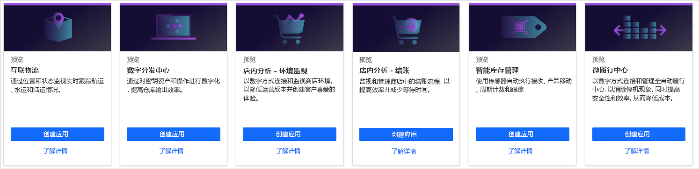
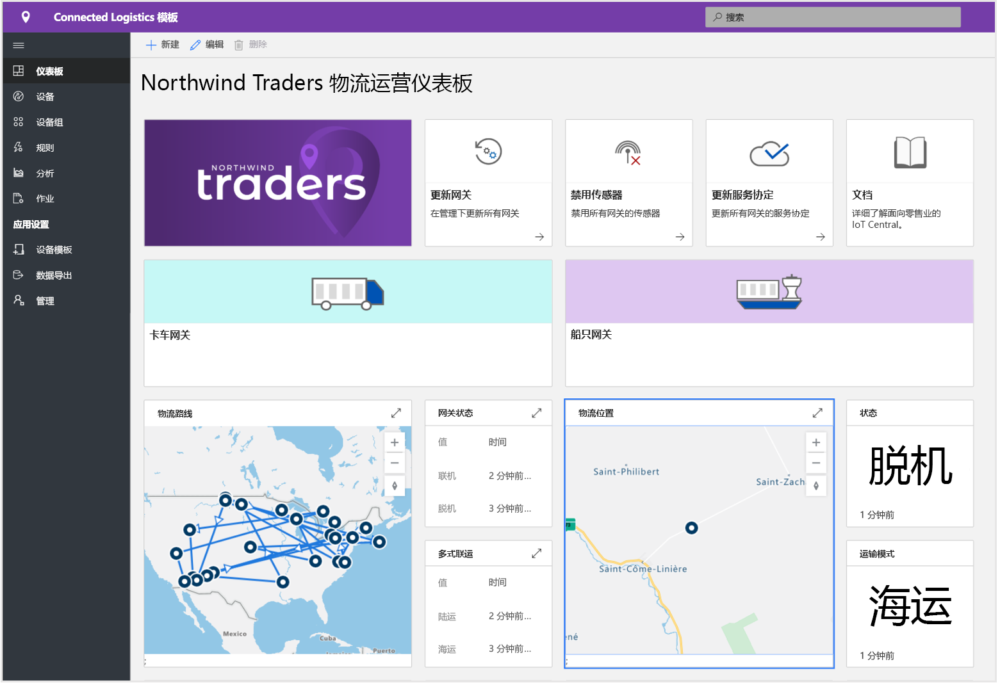
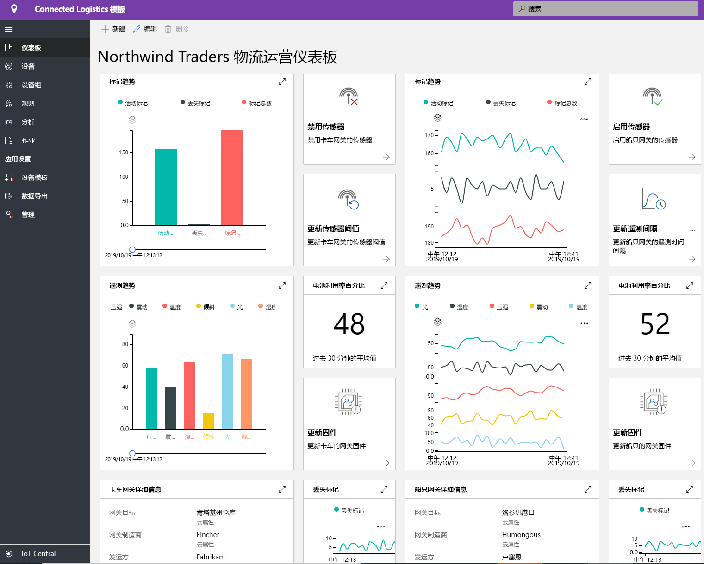
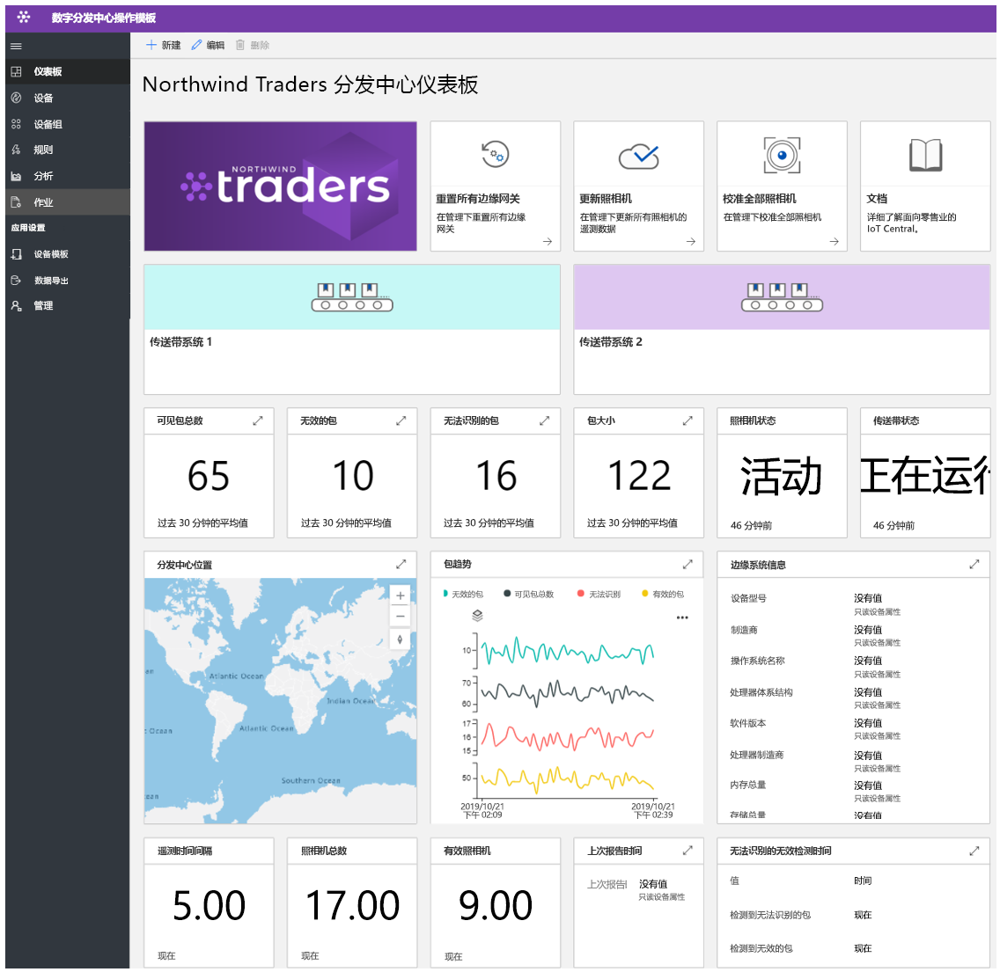
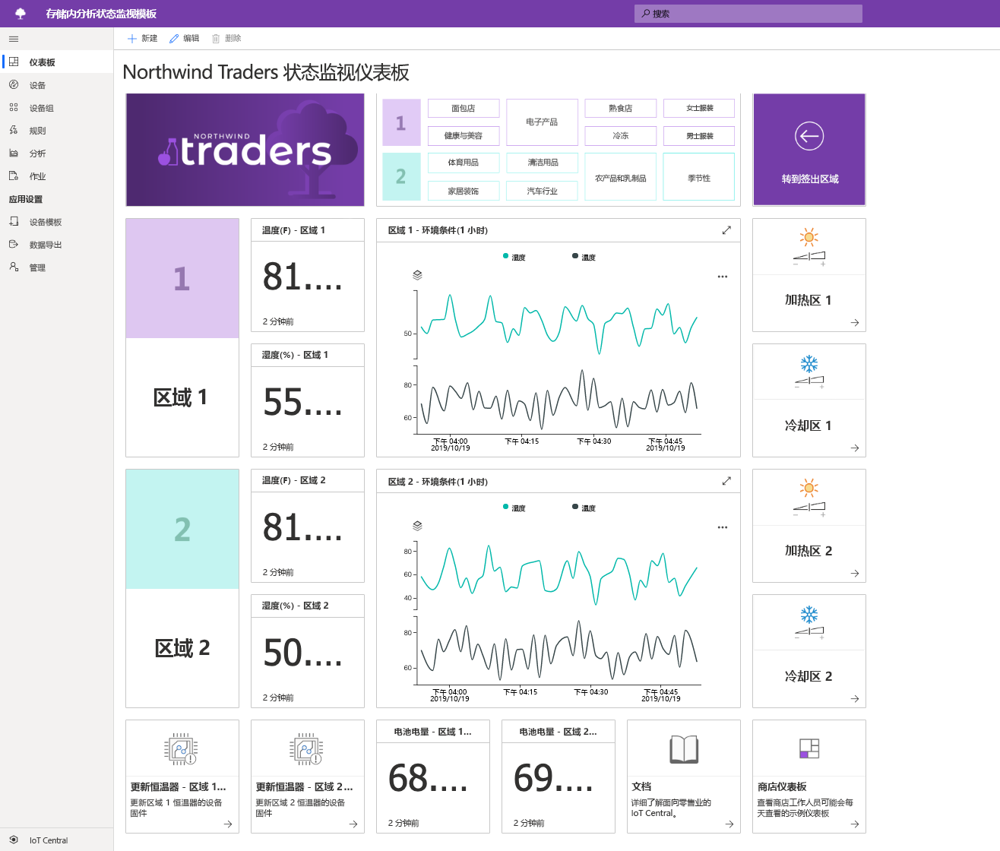

# 使用 Azure IoT Central 生成零售解决方案

[!INCLUDE [iot-central-pnp-original](../../../includes/iot-central-pnp-original-note.md)]

Azure IoT Central 是一个 IoT 应用平台，可减轻与开发、管理和维护企业级 IoT 解决方案相关联的负担和成本。 选择使用 Azure IoT Central 进行构建可将时间、金钱和精力集中于使用 IoT 数据转换业务，而不仅仅是维护和更新复杂且不断发展的 IoT 基础结构。

本文介绍了几个特定于零售的 IoT Central 应用程序模板。 作为解决方案构建者，你可以利用已发布的模板构建 IoT 解决方案，来优化供应链，改进客户的店内体验，更高效地跟踪库存。

> [!div class="mx-imgBorder"]
> 

以下各部分介绍了这些应用程序模板的功能：

## 互联物流

在 2020 年，全球物流支出预计将达到 10.6 万亿美元。 货物运输占这项开支的大部分，货运提供商面临激烈的竞争压力和严峻的限制。

你可以使用物联网传感器来收集和监测环境状况，例如温度、湿度、倾斜、冲击、光照和装运位置。 你可以将从物联网传感器和设备收集的遥测数据与其他数据源（例如基于云的商业智能系统中的天气和交通信息）结合使用。

联接的物流解决方案有以下优势：

* 具有实时跟踪功能的发运监视。 
* 通过实时环境状况监视保持货运完整性。
* 安全性，避免货物被盗、丢失或损坏。
* 地理围栏、路线优化、船队管理以及车辆分析。
* 预测功能，可预测货物的出发和到达情况。

以下屏幕截图显示了应用程序模板中的现成仪表板。 该仪表板可完全自定义，以满足你的特定解决方案要求：

> [!div class="mx-imgBorder"]
> 

> [!div class="mx-imgBorder"]
> 

若要了解详细信息，请参阅[部署并演练互联物流应用程序模板](./tutorial-iot-central-connected-logistics-pnp.md)教程。

## 数字分发中心

随着越来越多的制造商和零售商进入世界各地，它们的供应链也不断扩展且越来越复杂。 消费者现在希望有大量的产品可供选择，并且希望在购买后的 1-2 天内即可到货。 分发中心必须适应这些趋势，并克服当前导致效率低下的问题。 

如今，依赖人工意味着分拣和打包占据分发中心成本的 55%-65%。 人工分拣和打包通常也比自动化系统慢，快速波动的人员需求使得运输量需求更加难以满足。 这种季节性的波动导致员工流动率高，并且出错概率会大增且代价高昂。

通过启用数字反馈循环，基于 IoT 支持的摄像头的解决方案可以提供转换优势。 分发中心的数据有助于生成可操作见解，而后者反过来会促进生成更优质的数据。

数字分发中心的优势包括：

* 当货物抵达并通过输送系统转移时，摄像头进行监视。
* 自动识别有问题的货物。
* 高效的订单跟踪。
* 降低了成本，提高了工作效率并优化了利用率。

以下屏幕截图显示了应用程序模板中的现成仪表板。 该仪表板可完全自定义，以满足你的特定解决方案要求： 

> [!div class="mx-imgBorder"]
> 

若要了解详细信息，请参阅[部署并演练数字分发中心应用程序模板](./tutorial-iot-central-digital-distribution-center-pnp.md)教程。

## 店内分析 - 环境监视

对许多零售商来说，其店内的环境状况是他们与竞争对手的一个关键区别。 为客户着想，零售商希望在他们的店内保持舒适的环境。  

作为解决方案构建者，你可以使用 IoT Central 的店内分析 - 环境监视应用程序模板来构建端到端解决方案。 借助此应用程序模板，你可以使用各种传感器设备进行数字连接，并监视零售商店环境。 这些传感器设备生成遥测数据，你可以将其转换为业务见解，帮助零售商降低运营成本，为其客户创造良好的体验。

使用此应用程序模板，可以：

* 将各种 IoT 传感器连接到 IoT Central 应用程序实例。
* 监视并管理传感器网络以及环境中的网关设备的运行状况。
* 创建关于店内环境状况的自定义规则，以针对商店管理人员触发警报。
* 将店内的环境状况转换为见解，供零售店团队用来改进客户体验。
* 将聚合的见解导出到现有的或新的业务应用程序，为零售员工提供有用及时的信息。

应用程序模板附带了一组设备模板，并使用一组模拟设备来填充该仪表板。 

以下屏幕截图显示了应用程序模板中的现成仪表板。 该仪表板可完全自定义，以满足你的特定解决方案要求： 

> [!div class="mx-imgBorder"]
> 

若要了解详细信息，请参阅[在 Azure IoT Central 中创建店内分析应用程序](./tutorial-in-store-analytics-create-app-pnp.md)教程。

## 店内分析 - 结帐

对许多零售商来说，其店内的结帐体验是他们与竞争对手的一个关键区别。 零售商希望在其店内提供顺畅的结帐体验，以促进客户回头购买。  

作为解决方案构建者，你可以使用 IoT Central 的店内分析 - 结帐应用程序模板来构建解决方案，用以将关于商店结帐区域的见解提供给零售员工。 例如，传感器可以针对每个结帐通道提供有关队列长度和平均等待时间的信息。

使用此应用程序模板，可以：

* 将各种 IoT 传感器连接到 IoT Central 应用程序实例。
* 监视并管理传感器网络以及环境中的网关设备的运行状况。
* 创建关于店内结帐状况的自定义规则，以针对零售员工触发警报。
* 将店内的结帐状况转换为见解，供零售店团队用来改进客户体验。
* 将聚合的见解导出到现有的或新的业务应用程序，为零售员工提供有用及时的信息。

应用程序模板附带了一组设备模板，并使用一组模拟设备将通道占用数据填充到该仪表板。 

以下屏幕截图显示了应用程序模板中的现成仪表板。 该仪表板可完全自定义，以满足你的特定解决方案要求： 

> [!div class="mx-imgBorder"]
> 

若要了解详细信息，请参阅[在 Azure IoT Central 中创建店内分析应用程序](./tutorial-in-store-analytics-create-app-pnp.md)教程。

## 智能库存管理

库存是零售商持有的存货。 库存管理对于确保适当产品在适当时间处于适当位置至关重要。 零售商必须在储存过多库存产生的成本与没有足够库存来满足需求产生的成本之间进行权衡。

由射频识别 (RFID) 标签、信标和摄像头生成的物联网数据提供了改进库存管理流程的机会。 你可以将从物联网传感器和设备收集的遥测数据与其他数据源（例如基于云的商业智能系统中的天气和交通信息）结合使用。

智能库存管理的好处有：

* 降低了商品缺货的风险，并确保达到预期的客户服务水平。 
* 近乎实时地提供对库存准确性的深入分析和见解。
* 提供了工具来帮助确定满足客户订单需求所需保持的合适库存量。

此应用程序模板侧重于设备连接，以及 RFID 和蓝牙低功耗 (BLE) 读取器设备的配置和管理。

以下屏幕截图显示了应用程序模板中的现成仪表板。 该仪表板可完全自定义，以满足你的特定解决方案要求：

> [!div class="mx-imgBorder"]
> 

若要了解详细信息，请参阅[部署和演练智能库存管理应用程序模板](./tutorial-iot-central-smart-inventory-management-pnp.md)教程。

## 微履行中心

在竞争日益激烈的零售业格局中，零售商不断面临压力来缩小需求与履行之间的差距。 为了满足日益增长的消费需求，出现了一种新的趋势，即在最终客户及其访问的商店附近建立库存。

利用 IoT Central 微履行中心应用程序模板，解决方案构建者可以监视和管理其完全自动化履行中心的所有方面。 该模板包含一组模拟状况监视传感器和机器人载体，用以加快解决方案的开发过程。 这些传感器设备捕获有意义的信号，这些信号可以转换为业务见解，使零售商可以降低运营成本，并营造客户喜欢的体验。

使用此应用程序模板，可以： 

- 将各种 IoT 传感器（例如机器人和状况监视传感器）无缝连接到 IoT Central 应用程序实例。
- 监视并管理传感器网络以及环境中的网关设备的运行状况。
- 创建关于履行中心内环境状况的自定义规则，以触发相应的警报。
- 将履行中心内的环境状况转换为见解，供零售仓库团队使用。
- 将聚合的见解导出到现有的或新的业务应用程序，为零售员工成员提供支持。

以下屏幕截图显示了应用程序模板中的现成仪表板。 该仪表板可完全自定义，以满足你的特定解决方案要求：

> [!div class="mx-imgBorder"]
> 

若要了解详细信息，请参阅[部署并演练微履行中心应用程序模板](./tutorial-iot-central-smart-inventory-management-pnp.md)教程。

## 后续步骤

开始生成零售解决方案：

* 请从[在 Azure IoT Central 中创建店内分析应用程序](./tutorial-in-store-analytics-create-app-pnp.md)入手，它分步介绍了如何利用某个店内分析应用程序模板来构建解决方案。
* [部署并演练互联物流应用程序模板](./tutorial-iot-central-connected-logistics-pnp.md)。
* [部署并演练数字分发中心应用程序模板](./tutorial-iot-central-digital-distribution-center-pnp.md)。
* [部署并演练智能库存管理应用程序模板](./tutorial-iot-central-smart-inventory-management-pnp.md)。
* [部署并演练微履行中心应用程序模板](./tutorial-iot-central-smart-inventory-management-pnp.md)。
* 若要详细了解 IoT Central，请参阅 [IoT Central 概述](../preview/overview-iot-central.md)。
