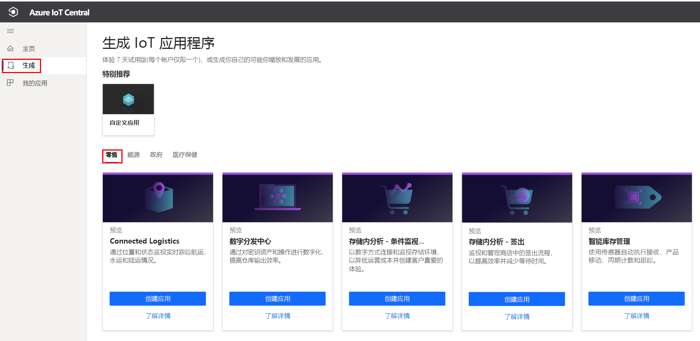
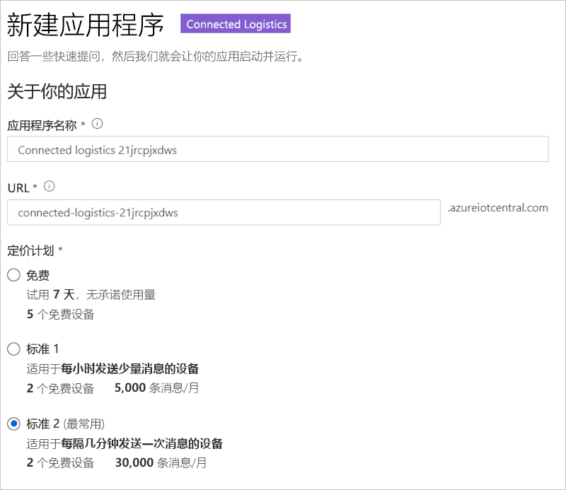
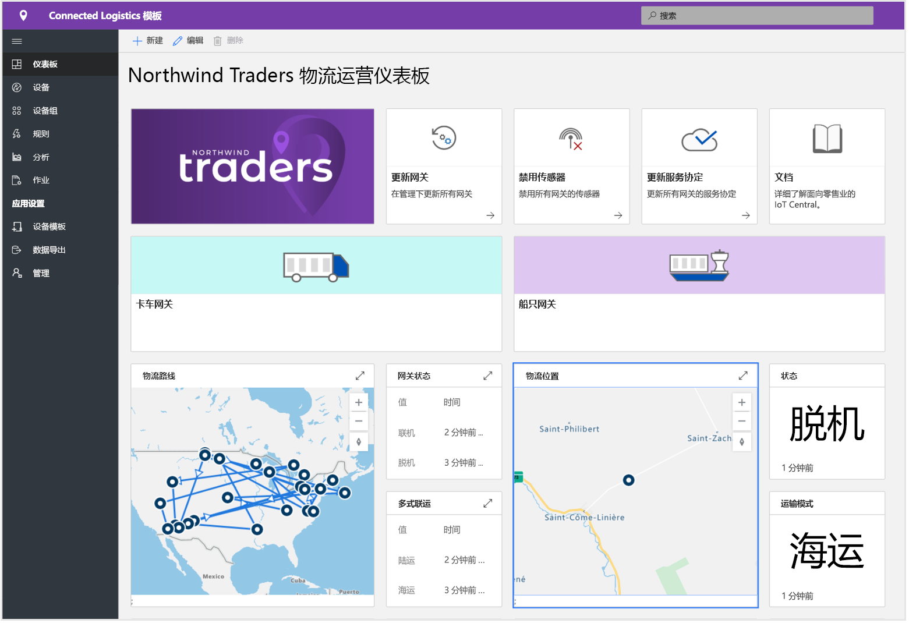
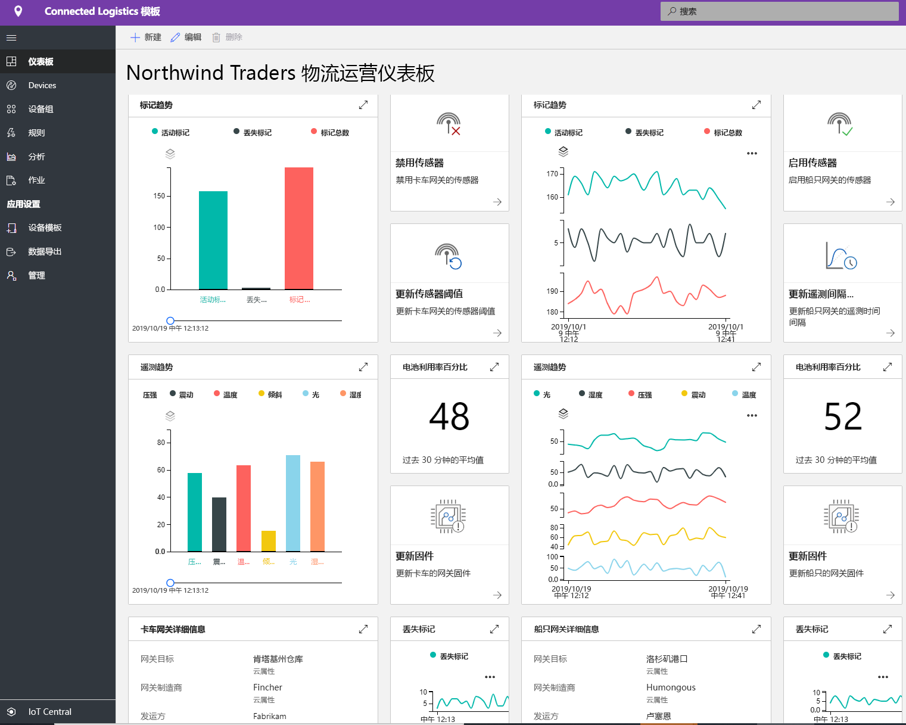
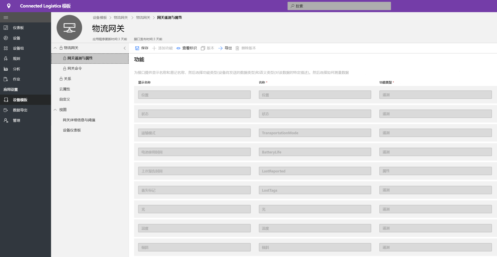
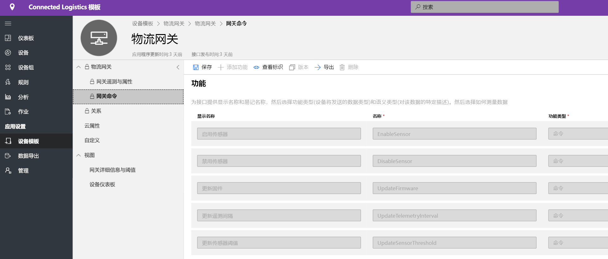
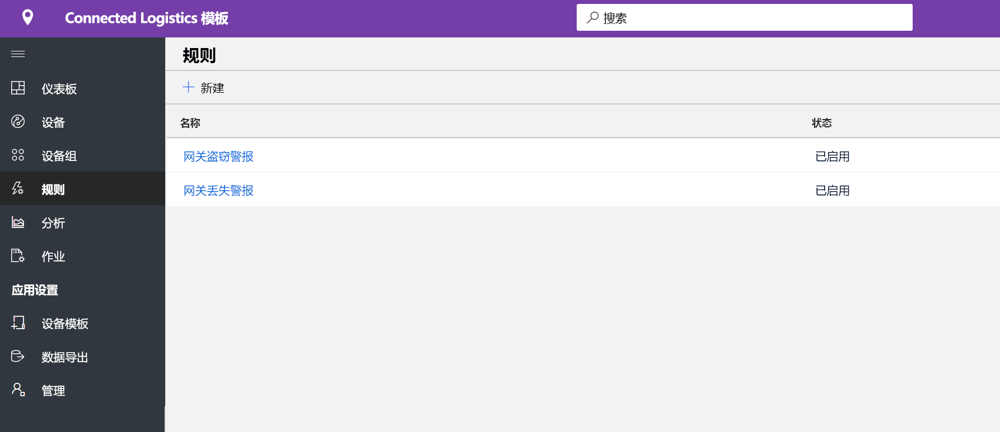
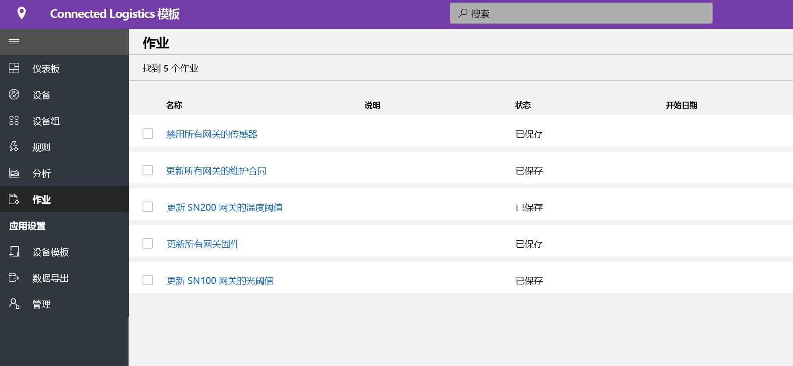
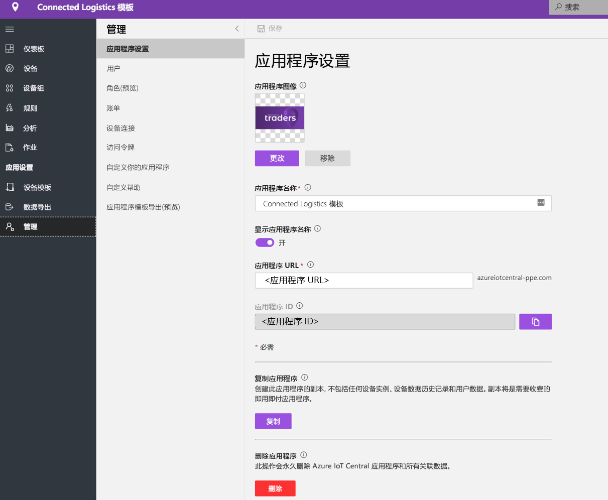

# 教程：部署并演练互联物流应用程序模板

[!INCLUDE [iot-central-pnp-original](../../../includes/iot-central-pnp-original-note.md)]

本教程介绍如何开始部署 IoT Central 互联物流应用程序模板  。 你将了解如何部署模板、有哪些现成的内容以及接下来要执行哪些操作。

本教程介绍如何执行下列操作： 
* 创建互联物流应用程序 
* 演练应用程序 

## 先决条件
* 无需满足特定的先决条件，就可以部署此应用
* 建议使用 Azure 订阅，但不使用也可以

## 创建互联物流应用程序模板
可以使用以下步骤创建应用程序
1. 导航到 Azure IoT Central 应用程序管理器网站。 从左侧导航栏中选择“生成”，然后单击“零售”选项卡   。

> [!div class="mx-imgBorder"]
> 

2. 选择“互联物流应用程序”下的“创建应用”  

3. “创建应用”将打开“新建应用程序”窗体，并按如下所示填写所需的详细信息  。
   * **应用程序名称**：可以使用默认的建议名称，也可以输入易记的应用程序名称。
   * **URL**：可以使用建议的默认 URL，也可以输入唯一且容易记住的 URL。 接下来，如果你已有一个 Azure 订阅，则建议使用默认设置。或者，你可以开始使用七天免费试用，并选择在免费试用到期之前的任何时间内转换为即用即付。
   * **计费信息**：必须提供目录、Azure 订阅和区域详细信息才能配置资源。
   * **创建**：选择页面底部的“创建”以部署应用程序。

> [!div class="mx-imgBorder"]
> 

## 演练应用程序 

## 仪表板

成功部署应用模板后，默认仪表板是一个以互联物流操作员为中心的门户。 Northwind Trader 是一家虚构的物流服务提供商，负责管理海上和陆地上的货运队。 在此仪表板中，你将看到两个不同的网关，它们提供有关货物的遥测数据以及可执行的相关命令、作业和操作。 此仪表板已预先配置为展示关键的物流设备操作活动。
仪表板在逻辑上区分两个不同的网关设备管理操作， 
   * 卡车运输的物流路线和海洋运输的位置详细信息是所有多式联运的基本要素
   * 查看网关状态及相关信息 

> [!div class="mx-imgBorder"]
> 

   * 可以轻松地跟踪网关、活动和未知标记的总数。
   * 可以执行设备管理操作，例如更新固件、禁用传感器、启用传感器、更新传感器阈值、更新遥测间隔时间和更新设备服务协定。
   * 查看设备电池消耗

> [!div class="mx-imgBorder"]
> 

## 设备模板

单击“设备模板”选项卡，你将看到网关功能模型。 功能模型是围绕两个不同的接口（“网关遥测与属性”以及“网关命令”）构建的  

**网关遥测与属性** - 此接口表示与传感器、位置和设备信息以及设备孪生属性功能有关的所有遥测，例如传感器阈值和更新间隔时间。

> [!div class="mx-imgBorder"]
> 

**网关命令** - 此接口组织了所有网关命令功能

> [!div class="mx-imgBorder"]
> 

## 规则
选择“规则”选项卡以查看此应用程序模板中存在的两个不同规则。 这些规则配置为通过电子邮件将通知发送给操作员以进行进一步调查。
 
**网关盗窃警报**：在行驶过程中，如果传感器意外检测到光源，则会触发此规则。 必须尽快通知操作员调查潜在的盗窃行为。
 
**网关不响应**：如果网关长时间未向云报告，则触发此规则。 低电量模式、断开连接和设备运行状况不良都可能使网关不响应。

> [!div class="mx-imgBorder"]
> 

## 作业
选择“作业”选项卡以查看此应用程序模板中存在的五个不同的作业：

> [!div class="mx-imgBorder"]
> 

可以使用作业功能来执行解决方案范围的操作。 此处的作业将使用设备命令和孪生功能来执行各种任务，如在整个网关上禁用特定传感器，或根据装运模式和路线修改传感器阈值。 
   * 标准操作是禁用震动传感器，以在海洋运输过程中节省电池电量，或在冷链运输中降低温度阈值。 
 
   * 通过这些作业，你能够执行系统范围的操作（例如更新网关上的固件或更新服务协定），以及时了解最新的维护活动。

## 清理资源
如果不打算继续使用此应用程序，请访问“管理” > “应用程序设置”并单击“删除”，以删除应用程序模板    。

> [!div class="mx-imgBorder"]
> 

## 后续步骤
* 详细了解[互联物流的概念](./architecture-connected-logistics-pnp.md)
* 详细了解其他 [IoT Central 零售模板](./overview-iot-central-retail-pnp.md)
* 详细了解 [IoT Central 概述](../preview/overview-iot-central.md)
