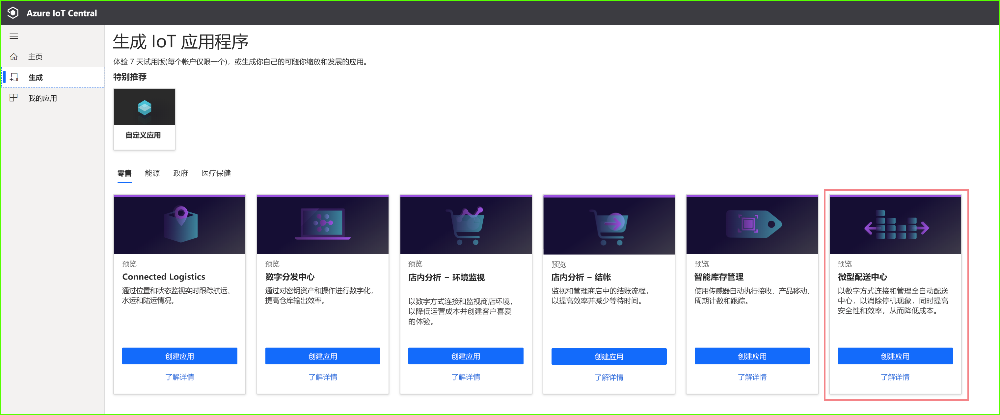
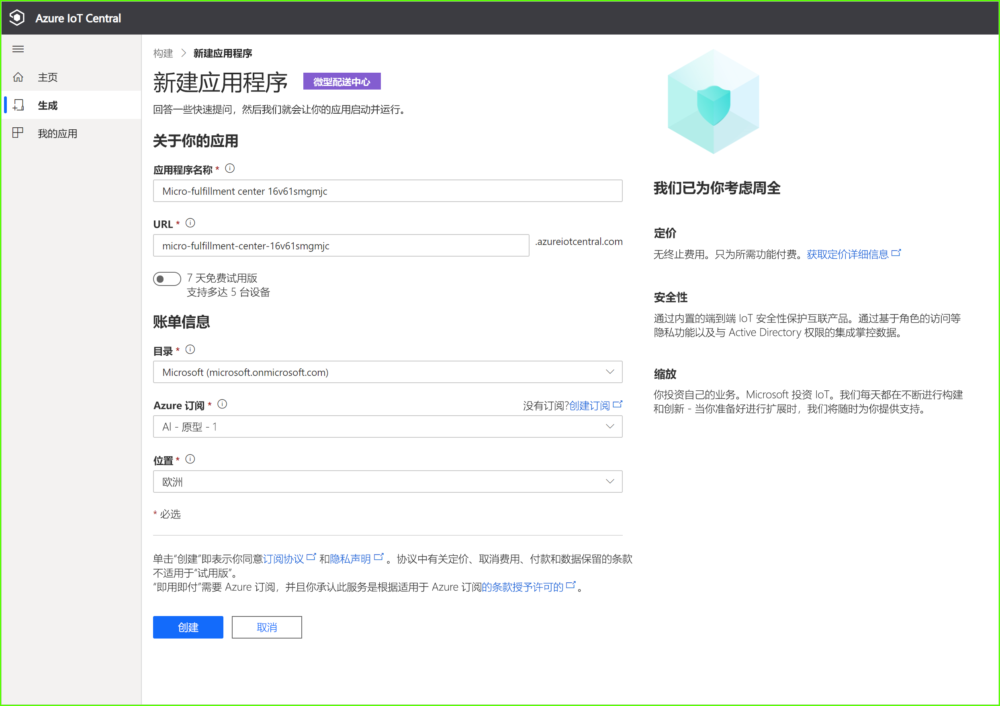
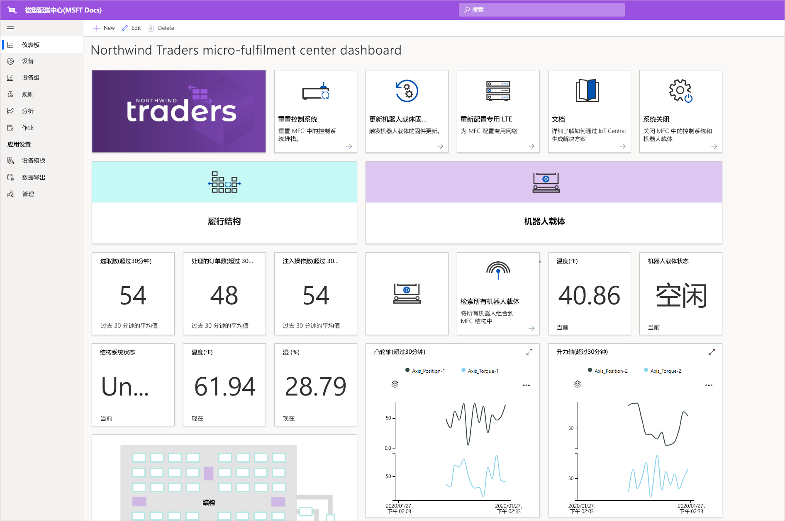
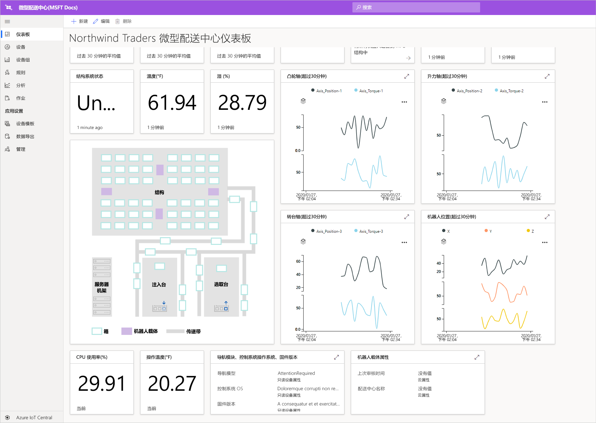
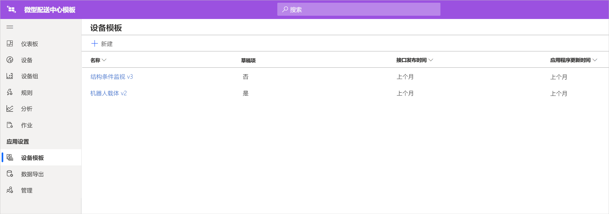
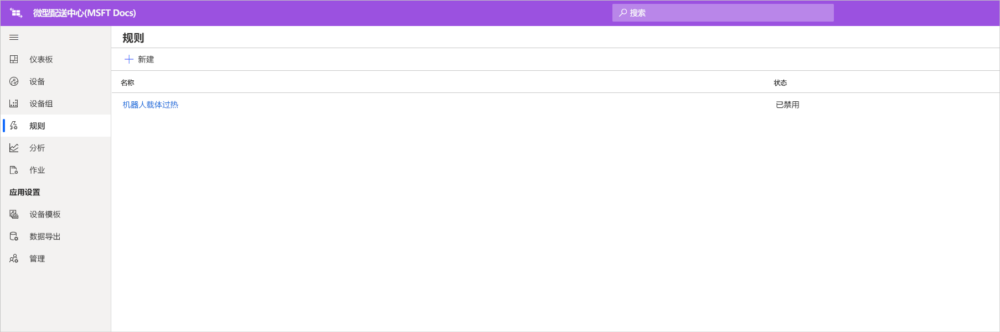
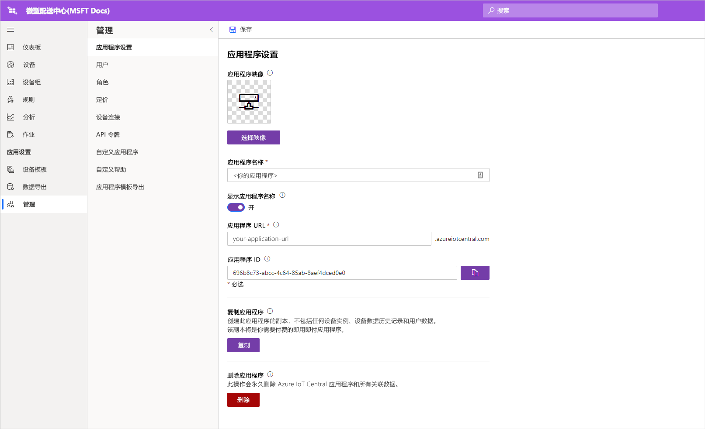

# 教程：部署和演练微型配送中心应用程序模板

在本教程中，你将使用 Azure IoT Central 微型配送中心应用程序模板来生成一个零售解决方案。 你将了解如何部署该模板、其中包含的设置，以及接下来要执行的操作。

## 必备条件
若要完成本教程系列，需有一个 Azure 订阅。 可以选择使用 7 天免费试用版。 如果没有 Azure 订阅，则可在 [Azure 注册页](https://aka.ms/createazuresubscription)上创建一个。

## 创建应用程序 
在本部分中，将从模板创建新的 Azure IoT Central 应用程序。 你将在本系列教程中使用此应用程序来生成完整的解决方案。

若要创建新的 Azure IoT Central 应用程序：

1. 转到 [Azure IoT Central 应用程序管理器](https://aka.ms/iotcentral)网站。
1. 如果你有一个 Azure 订阅，请使用用于访问该订阅的凭据登录。 否则，请使用 Microsoft 帐户登录：

   

1. 若要开始创建新的 Azure IoT Central 应用程序，请选择“新建应用程序”  。

1. 选择“零售”  。  “零售”页将显示多个零售应用程序模板。

若要创建使用预览版功能的新微型配送中心应用程序：  
1. 选择“微型配送中心”应用程序模板入门。  此模板包括本教程中使用的所有设备的设备模板。 此模板还提供操作员仪表板，用于监视配送中心内的条件以及机器人载体的条件。 

    
    
1. （可选）选择一个友好的应用程序名称  。 应用程序模板基于虚构公司 Northwind Traders。 

    >[!NOTE]
    >如果使用易记的应用程序名称，仍必须对应用程序 URL 使用唯一的值。

1. 如果你有一个 Azure 订阅，请输入目录、Azure 订阅和区域。 如果你没有订阅，可以启用 7 天免费试用版并填写所需的联系信息。  

    有关目录和订阅的详细信息，请参阅[创建应用程序](../preview/quick-deploy-iot-central.md)快速入门。

1. 选择“创建”  。

    

## 演练应用程序 

成功部署应用模板后，会看到 **Northwind Traders 微型配送中心仪表板**。 Northwind Traders 是一家虚构的零售商，它在此 Azure IoT Central 应用程序中管理微型配送中心。 在操作员仪表板上，可以看到此模板中与设备有关的信息和遥测数据，以及可执行的一组命令、作业和操作。 仪表板以逻辑方式划分为两个部分。 在左侧可以监视配送结构中的环境条件，在右侧可以监视车间中机器人载体的运行状况。  

在仪表板中可以：
   * 查看设备遥测数据，例如取件数量、处理的订单数量，以及结构系统状态等属性。  
   * 查看楼面布置图，以及机器人载体在配送结构中的位置。
   * 触发命令，例如重置控制系统、更新载体的固件，以及重新配置网络。

     
   * 参阅可供操作员用来监视配送中心内的条件的仪表板示例。 
   * 监视配送中心内网关设备上运行的有效负载的运行状况。    

     

## 设备模板
如果选择“设备模板”选项卡，将会看到模板中包含两种不同的设备类型： 
   * **机器人载体**：此设备模板表示已部署在配送结构中的，且正在执行相应的贮存和检索操作的正常运行的机器人载体的定义。 如果选择该模板，会看到机器人正在发送设备数据，例如温度、轴位置，以及机器人载体状态等属性。 
   * **结构条件监视**：此设备模板表示一个设备集合，可用于监视环境条件，以及承载各种边缘工作负荷，以便为配送中心提供动力的网关设备。 设备发送温度、取件数量、订单数量等遥测数据。 它还会发送有关环境中运行的计算工作负荷的状态和运行状况的信息。 

     

如果选择“设备组”选项卡，则还会看到这些设备模板会自动为其创建设备组。

## 规则
在“规则”选项卡上，可以看到应用程序模板中存在的一个示例规则，该规则用于监视机器人载体的温度条件。  如果车间中的特定机器人温度过高，因而需要将其下线以进行检修，则可以使用此规则来提醒操作员。 

请参考示例规则来定义更适合你的业务职能的规则。

## 清理资源

如果你不打算继续使用此应用程序，请删除应用程序模板。 转到“管理” > “应用程序设置”，然后选择“删除”。   

## 后续步骤
* 详细了解[微型配送中心解决方案体系结构](./architecture-micro-fulfillment-center-pnp.md)。
* 详细了解其他 [Azure IoT Central 零售模板](./overview-iot-central-retail-pnp.md)。
* 阅读 [Azure IoT Central 概述](../preview/overview-iot-central.md)。
