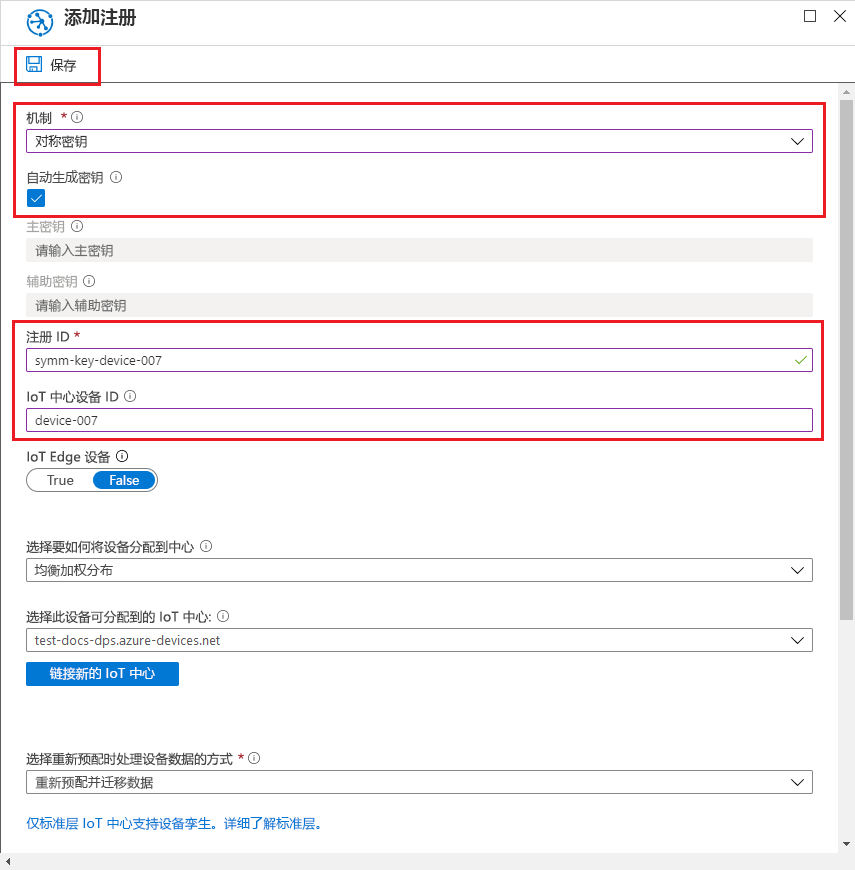

# <a name="quickstart-provision-a-simulated-device-with-symmetric-keys"></a>快速入门：使用对称密钥预配模拟设备

本快速入门介绍如何在 Windows 开发计算机上创建和运行设备模拟器。 你将配置此模拟设备，以使用对称密钥对设备预配服务实例进行身份验证，并将此模拟设备分配到 IoT 中心。 将使用 [Azure IoT C SDK](https://github.com/Azure/azure-iot-sdk-c) 中的示例代码来模拟启动预配的设备的启动序列。 将根据预配服务实例的单个注册来识别该设备，然后将其分配到 IoT 中心。

虽然本文演示了使用单个注册进行预配，但你也可以对注册组使用相同的过程。 唯一的区别在于，你必须使用具有设备唯一注册 ID 的派生设备密钥。 对于注册组，不直接使用注册中的对称密钥。 虽然对称密钥注册组不限于旧设备，但[如何使用对称密钥证明预配旧设备](how-to-legacy-device-symm-key.md)提供了注册组示例。 有关详细信息，请参阅[对称密钥证明的组注册](concepts-symmetric-key-attestation.md#group-enrollments)。

如果你不熟悉自动预配过程，请查看[自动预配的概念](concepts-auto-provisioning.md)。 

另外，在继续学习本快速入门之前，请确保已完成[通过 Azure 门户设置 IoT 中心设备预配服务](./quick-setup-auto-provision.md)中的步骤。 本快速入门需要你已创建设备预配服务实例。

本文面向基于 Windows 的工作站。 但是，你也可以在 Linux 上执行过程。 对于 Linux 示例，请参阅[如何进行多租户预配](how-to-provision-multitenant.md)。


[!INCLUDE [quickstarts-free-trial-note](../../includes/quickstarts-free-trial-note.md)]


## <a name="prerequisites"></a>先决条件

* 已启用[“使用 C++ 的桌面开发”](https://www.visualstudio.com/vs/support/selecting-workloads-visual-studio-2017/)工作负荷的 Visual Studio 2015 或 [Visual Studio 2017](https://www.visualstudio.com/vs/)。
* 已安装最新版本的 [Git](https://git-scm.com/download/)。


<a id="setupdevbox"></a>

## <a name="prepare-an-azure-iot-c-sdk-development-environment"></a>准备 Azure IoT C SDK 开发环境

在本部分，你将准备一个用于生成 [Azure IoT C SDK](https://github.com/Azure/azure-iot-sdk-c) 的开发环境。 

SDK 包含模拟设备的示例代码。 该模拟设备将尝试在设备启动顺序期间进行预配。

1. 下载最新版本的 [CMake 生成系统](https://cmake.org/download/)。 在同一站点中，查找所选二进制分发版本的加密哈希。 使用相应的加密哈希值验证下载的二进制文件。 以下示例使用了 Windows PowerShell 来验证 x64 MSI 分发版本 3.11.4 的加密哈希：

    ```PowerShell
    PS C:\Users\wesmc\Downloads> $hash = get-filehash .\cmake-3.11.4-win64-x64.msi
    PS C:\Users\wesmc\Downloads> $hash.Hash -eq "56e3605b8e49cd446f3487da88fcc38cb9c3e9e99a20f5d4bd63e54b7a35f869"
    True
    ```

    在进行 `CMake` 安装**之前**，必须在计算机上安装 Visual Studio 必备组件（Visual Studio 和“使用 C++ 的桌面开发”工作负荷）。 满足先决条件并验证下载内容后，安装 CMake 生成系统。

2. 打开命令提示符或 Git Bash shell。 执行以下命令来克隆 Azure IoT C SDK GitHub 存储库：
    
    ```cmd/sh
    git clone https://github.com/Azure/azure-iot-sdk-c.git --recursive
    ```
    此存储库的大小目前大约为 220 MB。 应该预料到此操作需要几分钟才能完成。


3. 在 git 存储库的根目录中创建 `cmake` 子目录，并导航到该文件夹。 

    ```cmd/sh
    cd azure-iot-sdk-c
    mkdir cmake
    cd cmake
    ```

4. 运行以下命令，生成特定于你的开发客户端平台的 SDK 版本。 将在 `cmake` 目录中生成模拟设备的 Visual Studio 解决方案。 

    ```cmd
    cmake -Duse_prov_client:BOOL=ON ..
    ```
    
    如果 `cmake` 找不到 C++ 编译器，则可能会在运行以上命令时出现生成错误。 如果出现这种情况，请尝试在 [Visual Studio 命令提示符](https://docs.microsoft.com/dotnet/framework/tools/developer-command-prompt-for-vs)窗口中运行该命令。 

    生成成功后，最后的几个输出行如下所示：

    ```cmd/sh
    $ cmake -Duse_prov_client:BOOL=ON ..
    -- Building for: Visual Studio 15 2017
    -- Selecting Windows SDK version 10.0.16299.0 to target Windows 10.0.17134.
    -- The C compiler identification is MSVC 19.12.25835.0
    -- The CXX compiler identification is MSVC 19.12.25835.0

    ...

    -- Configuring done
    -- Generating done
    -- Build files have been written to: E:/IoT Testing/azure-iot-sdk-c/cmake
    ```


## <a name="create-a-device-enrollment-entry-in-the-portal"></a>在门户中创建设备注册项

1. 登录到 Azure 门户，单击左侧菜单上的“所有资源”按钮，打开设备预配服务。

2. 选择“管理注册”选项卡，然后单击顶部的“添加个人注册”按钮。 

3. 在“添加注册”中输入以下信息，然后单击“保存”按钮。

    - 机制：选择“对称密钥”作为标识证明“机制”。

    - 自动生成密钥：选中此复选框。

    - 注册 ID：输入注册 ID 以标识注册。 仅使用小写字母数字和短划线（“-”）字符。 例如，`symm-key-device-007`。

    - IoT 中心设备 ID：输入设备标识符。 例如：device-007。

    

4. 保存注册后，将生成“主要密钥”和“辅助密钥”，并将其添加到注册条目。 对称密钥设备注册会在“单独注册”选项卡的“注册 ID”列下显示为 symm-key-device-007。 

    打开注册并复制生成的“主要密钥”的值。


<a id="firstbootsequence"></a>

## <a name="simulate-first-boot-sequence-for-the-device"></a>模拟设备的首次启动顺序

在本部分更新向设备预配服务实例发送设备启动序列的示例代码。 此启动序列使得设备可被识别并分配到与设备预配服务实例链接的 IoT 中心。


1. 在 Azure 门户中，选择设备预配服务的“概述”选项卡，记下“ID 范围”的值。

     

2. 在 Visual Studio 中，打开通过运行 CMake 生成的 azure_iot_sdks.sln 解决方案文件。 解决方案文件应位于以下位置：

    ```
    \azure-iot-sdk-c\cmake\azure_iot_sdks.sln
    ```

3. 在 Visual Studio 的“解决方案资源管理器”窗口中，导航到 **Provision\_Samples** 文件夹。 展开名为 **prov\_dev\_client\_sample** 的示例项目。 展开“源文件”，打开 **prov\_dev\_client\_sample.c**。

4. 找到 `id_scope` 常量，将值替换为前面复制的“ID 范围”值。 

    ```c
    static const char* id_scope = "0ne00002193";
    ```

5. 在同一文件中找到 `main()` 函数的定义。 确保 `hsm_type` 变量设置为 `SECURE_DEVICE_TYPE_SYMMETRIC_KEY`，如下所示：

    ```c
    SECURE_DEVICE_TYPE hsm_type;
    //hsm_type = SECURE_DEVICE_TYPE_TPM;
    //hsm_type = SECURE_DEVICE_TYPE_X509;
    hsm_type = SECURE_DEVICE_TYPE_SYMMETRIC_KEY;
    ```

6. 右键单击“prov\_dev\_client\_sample”项目，然后选择“设为启动项目”。 

7. 在 Visual Studio 的“解决方案资源管理器”窗口中，导航到“hsm\_security\_client”项目并展开它。 展开“源文件”，然后打开“hsm\_client\_key.c”。 

    找到 `REGISTRATION_NAME` 和 `SYMMETRIC_KEY_VALUE` 常量的声明。 对文件进行以下更改并保存该文件。

    使用“注册 ID”更新 `REGISTRATION_NAME` 常量的值。
    
    使用“主要密钥”更新 `SYMMETRIC_KEY_VALUE` 常量的值。

    ```c
    static const char* const REGISTRATION_NAME = "symm-key-device-007";
    static const char* const SYMMETRIC_KEY_VALUE = "<enter your Symmetric primary key>";
    ```

7. 在 Visual Studio 菜单中，选择“调试” > “开始执行(不调试)”以运行该解决方案。 在重新生成项目的提示中单击“是”，以便在运行项目之前重新生成项目。

    以下输出是模拟设备成功启动并连接到要分配到 IoT 中心的预配服务实例的示例：

    ```cmd
    Provisioning API Version: 1.2.8

    Registering Device

    Provisioning Status: PROV_DEVICE_REG_STATUS_CONNECTED
    Provisioning Status: PROV_DEVICE_REG_STATUS_ASSIGNING
    Provisioning Status: PROV_DEVICE_REG_STATUS_ASSIGNING

    Registration Information received from service: 
    test-docs-hub.azure-devices.net, deviceId: device-007    
    Press enter key to exit:
    ```

8. 在门户中，导航到模拟设备分配到的 IoT 中心，然后单击“IoT 设备”选项卡。将模拟设备成功预配到中心以后，设备 ID 会显示在“IoT 设备”边栏选项卡上，“状态”为“已启用”。 你可能需要单击顶部的“刷新”按钮。 

     


## <a name="clean-up-resources"></a>清理资源

如果打算继续使用和探索设备客户端示例，请勿清理在本快速入门中创建的资源。 如果不打算继续学习，请通过以下步骤删除通过本快速入门创建的所有资源。

1. 关闭计算机上的设备客户端示例输出窗口。
1. 在 Azure 门户的左侧菜单中单击“所有资源”，然后选择设备预配服务。 打开服务的“管理注册”，然后单击“个人注册”选项卡。选择在本快速入门中注册的设备的“注册 ID”，然后单击顶部的“删除”按钮。 
1. 在 Azure 门户的左侧菜单中单击“所有资源”，然后选择 IoT 中心。 打开中心的“IoT 设备”，选择在本快速入门中注册的设备的“设备 ID”，然后单击顶部的“删除”按钮。

## <a name="next-steps"></a>后续步骤

本快速入门介绍了如何在 Windows 计算机上创建模拟设备，以及如何在门户中通过 Azure IoT 中心设备预配服务使用对称密钥将其预配到 IoT 中心。 若要了解如何以编程方式注册设备，请继续学习快速入门中关于 X.509 设备的编程注册部分的内容。 

> [!div class="nextstepaction"]
> [Azure 快速入门 - 将 X.509 设备注册到 Azure IoT 中心设备预配服务](quick-enroll-device-x509-java.md)
