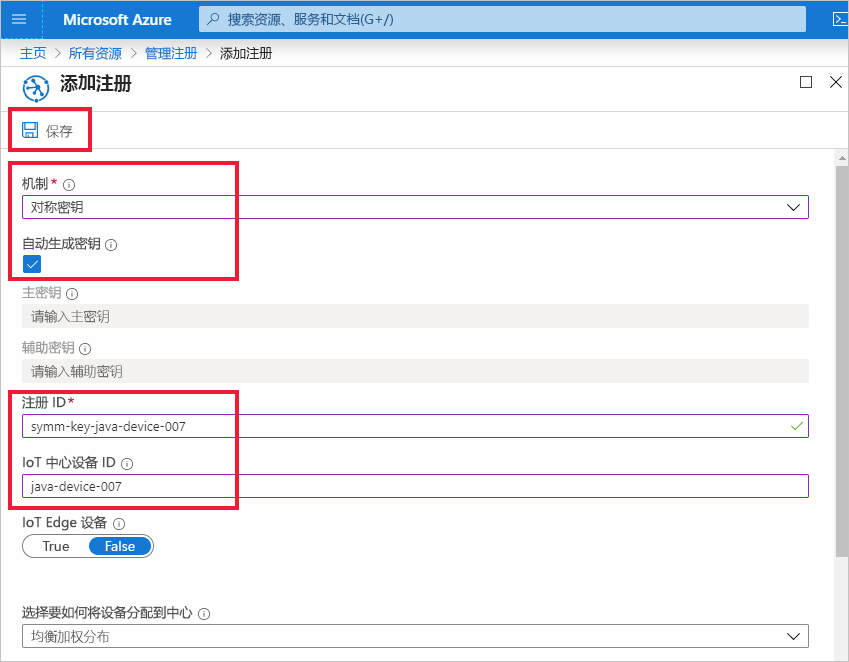
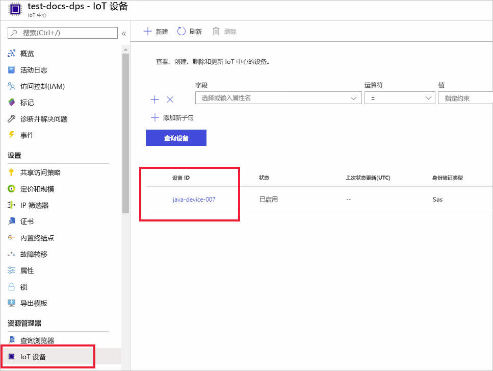

# <a name="quickstart-provision-a-simulated-device-with-symmetric-keys"></a>快速入门：使用对称密钥预配模拟设备

本快速入门介绍如何在 Windows 开发计算机上创建和运行设备模拟器。 你将配置此模拟设备，以使用对称密钥对设备预配服务 (DPS) 实例进行身份验证，并将此模拟设备分配到 IoT 中心。 将使用[适用于 Java 的 Microsoft Azure IoT SDK](https://github.com/Azure/azure-iot-sdk-java) 中的示例代码来模拟启动预配的设备的启动序列。 将根据 DPS 服务实例的单个注册来识别该设备，然后将其分配到 IoT 中心。

虽然本文演示了使用单个注册进行预配，但你也可以使用注册组。 使用注册组时有一些不同之处。 例如，必须将派生的设备密钥与设备的唯一注册 ID 一起使用。 虽然对称密钥注册组不限于旧设备，但[如何使用对称密钥证明预配旧设备](how-to-legacy-device-symm-key.md)提供了注册组示例。 有关详细信息，请参阅[对称密钥证明的组注册](concepts-symmetric-key-attestation.md#group-enrollments)。

如果你不熟悉自动预配过程，请查看[自动预配的概念](concepts-auto-provisioning.md)。 

另外，在继续学习本快速入门之前，请确保已完成[通过 Azure 门户设置 IoT 中心设备预配服务](./quick-setup-auto-provision.md)中的步骤。 本快速入门需要你已创建设备预配服务实例。

本文面向基于 Windows 的工作站。 但是，你也可以在 Linux 上执行过程。 对于 Linux 示例，请参阅[如何进行多租户预配](how-to-provision-multitenant.md)。


[!INCLUDE [quickstarts-free-trial-note](../../includes/quickstarts-free-trial-note.md)]


## <a name="prerequisites"></a>必备条件

* 确保已在计算机上安装 [Java SE 开发工具包 8](https://aka.ms/azure-jdks) 或更高版本。

* 下载并安装 [Maven](https://maven.apache.org/install.html)。

* 已安装最新版本的 [Git](https://git-scm.com/download/)。

<a id="setupdevbox"></a>

## <a name="prepare-the-java-sdk-environment"></a>准备 Java SDK 环境 

1. 确保在计算机上安装 Git 并将其添加到可供命令窗口访问的环境变量。 请参阅[软件自由保护组织提供的 Git 客户端工具](https://git-scm.com/download/)，了解要安装的最新版 `git` 工具，其中包括  Git Bash，这是一个命令行应用，可以用来与本地 Git 存储库交互。 

2. 打开命令提示符。 为设备模拟代码示例克隆 GitHub 存储库：
    
    ```cmd/sh
    git clone https://github.com/Azure/azure-iot-sdk-java.git --recursive
    ```
3. 导航到 `azure-iot-sdk-java` 根目录，并生成项目以下载全部所需的包。
   
   ```cmd/sh
   cd azure-iot-sdk-java
   mvn install -DskipTests=true
   ```

## <a name="create-a-device-enrollment"></a>创建设备注册

1. 登录到 [Azure 门户](https://portal.azure.com)，选择左侧菜单上的“所有资源”按钮，打开设备预配服务 (DPS) 实例  。

2. 选择“管理注册”选项卡，然后选择顶部的“添加个人注册”按钮   。 

3. 在“添加注册”面板中输入以下信息，然后按“保存”按钮   。

   - **机制**：选择“对称密钥”作为标识证明“机制”   。

   - **自动生成密钥**：选中此框。

   - **注册 ID**：输入注册 ID 以标识注册。 仅使用小写字母数字和短划线（“-”）字符。 例如 **symm-key-java-device-007**。

   - **IoT 中心设备 ID：** 输入设备标识符。 例如 **java-device-007**。

     

4. 保存注册后，将生成“主要密钥”和“辅助密钥”，并将其添加到注册条目   。 对称密钥设备注册会在“单独注册”  选项卡的“注册 ID”  列下显示为“symm-key-java-device-007”  。 

    打开注册并复制生成的“主要密钥”  的值。 稍后在更新设备的 Java 代码时，将使用此密钥值和**注册 ID**。


<a id="firstbootsequence"></a>

## <a name="simulate-device-boot-sequence"></a>模拟设备启动序列

在本部分，你将更新向 DPS 实例发送设备启动序列的设备示例代码。 此启动序列使得设备可被识别、完成身份验证，并分配到与 DPS 实例链接的 IoT 中心。

1. 在“设备预配服务”菜单中选择“概述”，并记下“ID 范围”和“预配服务全局终结点”。   

    

2. 打开 Java 设备示例代码进行编辑。 设备示例代码的完整路径为：

    `azure-iot-sdk-java/provisioning/provisioning-samples/provisioning-symmetrickey-sample/src/main/java/samples/com/microsoft/azure/sdk/iot/ProvisioningSymmetricKeySampleSample.java`

   - 添加 DPS 实例的“ID 范围”和“预配服务全局终结点”   。 另外，包含你为单独注册选择的主对称密钥和注册 ID。 保存所做更改。 

      ```java
        private static final String SCOPE_ID = "[Your scope ID here]";
        private static final String GLOBAL_ENDPOINT = "[Your Provisioning Service Global Endpoint here]";
        private static final String SYMMETRIC_KEY = "[Enter your Symmetric Key here]";
        private static final String REGISTRATION_ID = "[Enter your Registration ID here]";
      ```

3. 打开命令提示符进行生成。 导航到 Java SDK 存储库的预配示例项目文件夹。

    ```cmd/sh
    cd azure-iot-sdk-java/provisioning/provisioning-samples/provisioning-symmetrickey-sample
    ```

4. 生成示例，然后导航到 `target` 文件夹执行所创建的 .jar 文件。

    ```cmd/sh
    mvn clean install
    cd target
    java -jar ./provisioning-symmetrickey-sample-{version}-with-deps.jar
    ```

5. 预期的输出应如下所示：

    ```cmd/sh
      Starting...
      Beginning setup.
      Waiting for Provisioning Service to register
      IotHUb Uri : <Your DPS Service Name>.azure-devices.net
      Device ID : java-device-007
      Sending message from device to IoT Hub...
      Press any key to exit...
      Message received! Response status: OK_EMPTY
    ```

6. 在 Azure 门户中，导航到已链接到预配服务的 IoT 中心，然后打开“Device Explorer”边栏选项卡。  将模拟的对称密钥设备成功预配到中心后，设备 ID 会显示在“Device Explorer”边栏选项卡上，“状态”为“已启用”。     如果在运行示例设备应用程序之前已打开边栏选项卡，则可能需要按顶部的“刷新”按钮  。 

     

> [!NOTE]
> 如果从设备的注册项中的默认值更改了“初始设备孪生状态”  ，则它会从中心拉取所需的孪生状态，并执行相应的操作。 有关详细信息，请参阅[了解并在 IoT 中心内使用设备孪生](../iot-hub/iot-hub-devguide-device-twins.md)。
>


## <a name="clean-up-resources"></a>清理资源

如果打算继续使用和探索设备客户端示例，请勿清理在本快速入门中创建的资源。 如果不打算继续学习，请按以下步骤删除本快速入门中创建的所有资源。

1. 关闭计算机上的设备客户端示例输出窗口。
1. 在 Azure 门户的左侧菜单中选择“所有资源”，然后选择设备预配服务  。 打开服务的“管理注册”，然后选择“个人注册”选项卡   。选中在本快速入门中注册的设备的“注册 ID”旁边的复选框，然后按窗格顶部的“删除”按钮   。 
1. 在 Azure 门户的左侧菜单中选择“所有资源”，然后选择 IoT 中心  。 打开中心的“IoT 设备”，选中在本快速入门中注册的设备的“设备 ID”旁边的复选框，然后按窗格顶部的“删除”按钮    。

## <a name="next-steps"></a>后续步骤

本快速入门介绍了如何在 Windows 计算机上创建模拟设备，以及如何在门户中通过 Azure IoT 中心设备预配服务使用对称密钥将其预配到 IoT 中心。 若要了解如何以编程方式注册设备，请继续学习快速入门中关于 X.509 设备的编程注册部分的内容。 

> [!div class="nextstepaction"]
> [Azure 快速入门 - 将 X.509 设备注册到 Azure IoT 中心设备预配服务](quick-enroll-device-x509-java.md)
