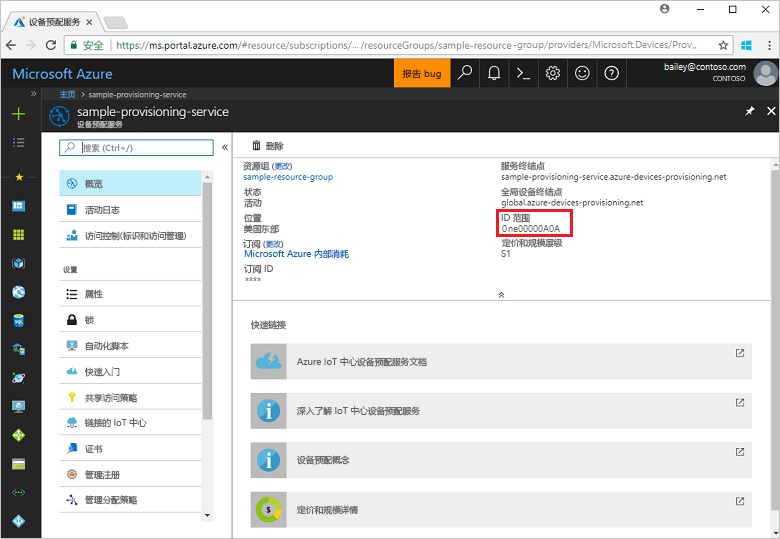
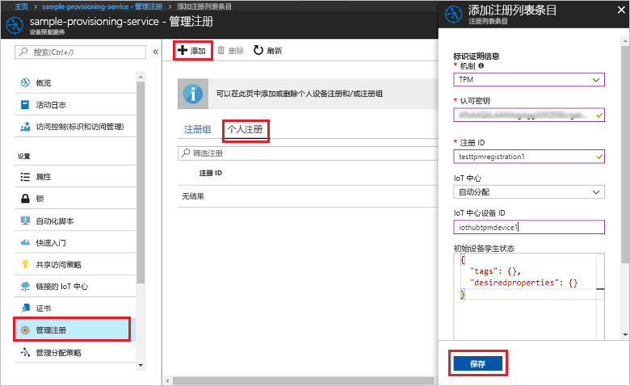
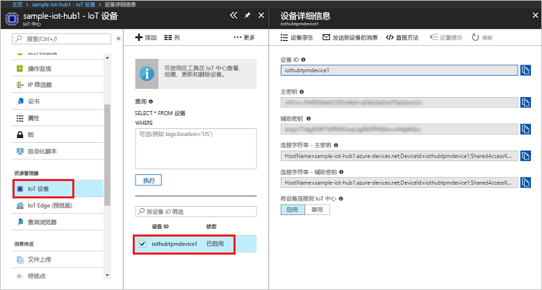

# <a name="create-and-provision-a-simulated-tpm-device-using-c-device-sdk-for-iot-hub-device-provisioning-service"></a>使用适用于 IoT 中心设备预配服务的 C# 设备 SDK 创建和预配模拟的 TPM 设备
> [!div class="op_single_selector"]
> * [C](quick-create-simulated-device.md)
> * [Java](quick-create-simulated-device-tpm-java.md)
> * [C#](quick-create-simulated-device-tpm-csharp.md)
> * [Python](quick-create-simulated-device-tpm-python.md)

以下步骤演示了如何在运行 Windows OS 的开发计算机上生成 Azure IoT 中心 C# SDK 模拟的 TPM 设备示例，以及如何通过设备预配服务和 IoT 中心连接该模拟设备。 示例代码使用 Windows TPM 模拟器作为设备的[硬件安全模块 (HSM)](https://azure.microsoft.com/blog/azure-iot-supports-new-security-hardware-to-strengthen-iot-security/)。 

在继续操作之前，请确保完成[通过 Azure 门户设置 IoT 中心设备预配服务](./quick-setup-auto-provision.md)中的步骤。

<a id="setupdevbox"></a>
## <a name="prepare-the-development-environment"></a>准备开发环境 

1. 确保已在计算机上安装 [.Net 核心 SDK](https://www.microsoft.com/net/download/windows)。 

1. 确保在计算机上安装 `git` 并将其添加到可供命令窗口访问的环境变量。 请参阅[软件自由保护组织提供的 Git 客户端工具](https://git-scm.com/download/)，了解要安装的最新版 `git` 工具，其中包括 Git Bash，这是一个命令行应用，可以用来与本地 Git 存储库交互。 

4. 打开命令提示符或 Git Bash。 克隆 Azure IoT SDK for C# GitHub 存储库：
    
    ```cmd
    git clone --recursive https://github.com/Azure/azure-iot-sdk-csharp.git
    ```

## <a name="provision-the-simulated-device"></a>预配模拟的设备


1. 登录到 Azure 门户。 单击左侧菜单上的“所有资源”按钮，打开设备预配服务。 在“概览”边栏选项卡中， 记下“ID 范围”值。

     


2. 在命令提示符处将目录更改为 TPM 设备预配示例的项目目录。

    ```cmd
    cd .\azure-iot-sdk-csharp\provisioning\device\samples\ProvisioningDeviceClientTpm
    ```

2. 键入以下命令，生成并运行 TPM 设备预配示例。 将 `<IDScope>` 值替换为预配服务的 ID 范围。 

    ```cmd
    dotnet run <IDScope>
    ```

1. 命令窗口显示进行设备注册所需的“认可密钥”、“注册 ID”以及建议的“设备 ID”。 记下这些值。 
   > [!NOTE]
   > 请勿混淆包含命令输出的窗口与包含 TPM 模拟器输出的窗口。 可能需要单击命令窗口，将其置于前台。

     


4. 在 Azure 门户的设备预配服务摘要边栏选项卡上，选择“管理注册”。 选择“单个注册”选项卡，然后单击顶部的“添加”按钮。 

5. 在“添加注册列表项”下，输入以下信息：
    - 选择“TPM”作为标识证明*机制*。
    - 输入 TPM 设备的*注册 ID* 和*认可密钥*。 
    - 可以选择与预配服务链接的 IoT 中心。
    - 输入唯一设备 ID。 可以输入在示例输出中建议的设备 ID，也可以输入自己的设备 ID。 如果使用自己的设备 ID，则请在为设备命名时，确保避免使用敏感数据。 
    - 使用设备所需的初始配置更新“初始设备孪生状态”。
    - 完成后，单击“保存”按钮。 

      

   成功注册以后，设备的“注册 ID”会显示在“单个注册”选项卡下的列表中。 

6. 单击 Enter 注册模拟的设备。 请注意相关消息，这些消息模拟设备启动后连接到设备预配服务以获取 IoT 中心信息的情况。 

1. 验证设备是否已预配。 将模拟设备成功预配到与预配服务链接的 IoT 中心以后，设备 ID 会显示在该中心的“IoT 设备”边栏选项卡上。 

     

    如果从设备的注册项中的默认值更改了“初始设备孪生状态”，则它会从中心拉取所需的孪生状态，并执行相应的操作。 有关详细信息，请参阅[了解并在 IoT 中心内使用设备孪生](../iot-hub/iot-hub-devguide-device-twins.md)


## <a name="clean-up-resources"></a>清理资源

如果打算继续使用和探索设备客户端示例，请勿清理在本快速入门中创建的资源。 如果不打算继续学习，请通过以下步骤删除通过本快速入门创建的所有资源。

1. 关闭计算机上的设备客户端示例输出窗口。
1. 关闭计算机上的 TPM 模拟器窗口。
1. 在 Azure 门户的左侧菜单中单击“所有资源”，然后选择设备预配服务。 在“所有资源”边栏选项卡的顶部单击“删除”。  
1. 在 Azure 门户的左侧菜单中单击“所有资源”，然后选择 IoT 中心。 在“所有资源”边栏选项卡的顶部单击“删除”。  

## <a name="next-steps"></a>后续步骤

在本快速入门中，你已在计算机上创建 TPM 模拟设备，并已使用 IoT 中心设备预配服务将其预配到 IoT 中心。 若要了解如何以编程方式注册 TPM 设备，请继续阅读快速入门中关于 TPM 设备的编程注册内容。 

> [!div class="nextstepaction"]
> [Azure 快速入门 - 将 TPM 设备注册到 Azure IoT 中心设备预配服务](quick-enroll-device-tpm-csharp.md)
