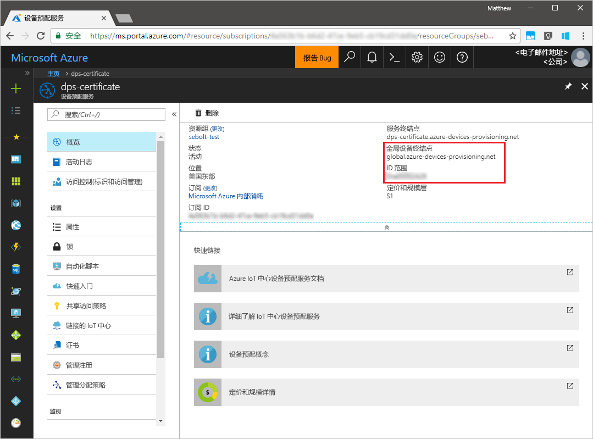
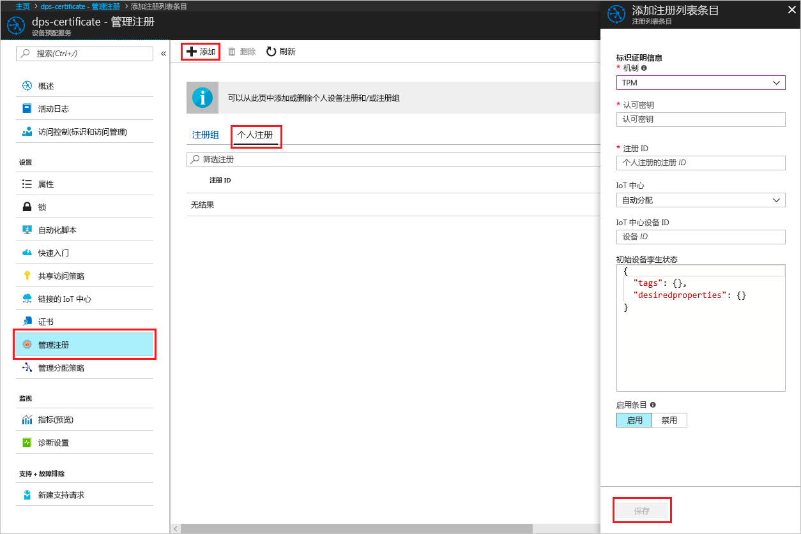
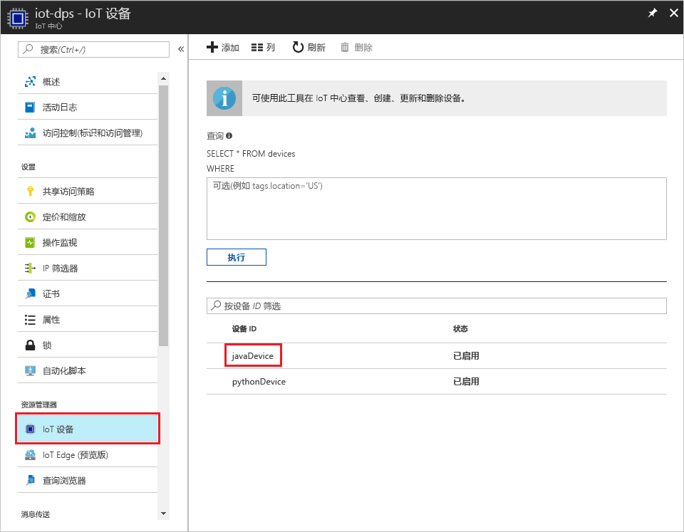

# <a name="create-and-provision-a-simulated-tpm-device-using-java-device-sdk-for-azure-iot-hub-device-provisioning-service"></a>使用适用于 Azure IoT 中心设备预配服务的 Java 设备 SDK 创建和预配模拟的 TPM 设备

[!INCLUDE [iot-dps-selector-quick-create-simulated-device-tpm](../../includes/iot-dps-selector-quick-create-simulated-device-tpm.md)]

以下步骤演示了如何在运行 Windows OS 的开发计算机上创建模拟设备、如何将 Windows TPM 模拟器作为设备的[硬件安全模块 (HSM)](https://azure.microsoft.com/blog/azure-iot-supports-new-security-hardware-to-strengthen-iot-security/) 运行，以及如何使用代码示例通过设备预配服务和 IoT 中心连接该模拟设备。 

如果不熟悉自动预配过程，请务必还查看[自动预配概念](concepts-auto-provisioning.md)。 另外，在继续操作之前，请确保已完成[通过 Azure 门户设置 IoT 中心设备预配服务](./quick-setup-auto-provision.md)中的步骤。 

[!INCLUDE [IoT DPS basic](../../includes/iot-dps-basic.md)]

## <a name="prepare-the-environment"></a>准备环境 

1. 确保已在计算机上安装 [Java SE 开发工具包 8](http://www.oracle.com/technetwork/java/javase/downloads/jdk8-downloads-2133151.html)。

1. 下载并安装 [Maven](https://maven.apache.org/install.html)。

1. 确保在计算机上安装 `git` 并将其添加到可供命令窗口访问的环境变量。 请参阅[软件自由保护组织提供的 Git 客户端工具](https://git-scm.com/download/)，了解要安装的最新版 `git` 工具，其中包括 Git Bash，这是一个命令行应用，可以用来与本地 Git 存储库交互。 

1. 打开命令提示符。 为设备模拟代码示例克隆 GitHub 存储库。
    
    ```cmd/sh
    git clone https://github.com/Azure/azure-iot-sdk-java.git --recursive
    ```

1. 运行 [TPM](https://docs.microsoft.com/windows/device-security/tpm/trusted-platform-module-overview) 模拟器。 单击“允许访问”，以便更改“Windows 防火墙”设置。 该模拟器通过套接字在端口 2321 和 2322 上进行侦听。 请勿关闭此窗口；本快速入门指南自始至终都需让该模拟器保持运行状态。 

    ```cmd/sh
    .\azure-iot-sdk-java\provisioning\provisioning-tools\tpm-simulator\Simulator.exe
    ```

    

1. 在单独的命令提示符处导航到根文件夹，然后生成示例依赖项。

    ```cmd/sh
    cd azure-iot-sdk-java
    mvn install -DskipTests=true
    ```

1. 导航到示例文件夹。

    ```cmd/sh
    cd provisioning/provisioning-samples/provisioning-tpm-sample
    ```

1. 登录到 Azure 门户，单击左侧菜单上的“所有资源”按钮，打开设备预配服务。 记下“ID 范围”和“预配服务全局终结点”。

    

1. 编辑 `src/main/java/samples/com/microsoft/azure/sdk/iot/ProvisioningTpmSample.java`，使之包括“ID 范围”和“预配服务全局终结点”，如前所述。  

    ```java
    private static final String idScope = "[Your ID scope here]";
    private static final String globalEndpoint = "[Your Provisioning Service Global Endpoint here]";
    private static final ProvisioningDeviceClientTransportProtocol PROVISIONING_DEVICE_CLIENT_TRANSPORT_PROTOCOL = ProvisioningDeviceClientTransportProtocol.HTTPS;
    ```

1. 生成项目。 导航到目标文件夹，然后执行创建的 jar 文件。

    ```cmd/sh
    mvn clean install
    cd target
    java -jar ./provisioning-tpm-sample-{version}-with-deps.jar
    ```

1. 程序开始运行。 记下用于下一部分的“认可密钥”和“注册 ID”，让程序保持运行。

    
    

## <a name="create-a-device-enrollment-entry"></a>创建设备注册项

1. 登录到 Azure 门户，单击左侧菜单上的“所有资源”按钮，打开设备预配服务。

1. 在设备预配服务摘要边栏选项卡上，选择“管理注册”。 选择“单个注册”选项卡，单击顶部的“添加”按钮。 

1. 在“添加注册列表项”下，输入以下信息：
    - 选择“TPM”作为标识证明*机制*。
    - 输入 TPM 设备的“注册 ID”和“认可密钥”，如前所述。 
    - 选择与预配服务链接的 IoT 中心。
    - 输入唯一设备 ID。 为设备命名时，请确保避免使用敏感数据。
    - 使用设备所需的初始配置更新“初始设备孪生状态”。
    - 完成后，单击“保存”按钮。 

      

   成功注册以后，设备的“注册 ID”显示在“单个注册”选项卡下的列表中。 


## <a name="simulate-the-device"></a>模拟设备

1. 在计算机上运行 Java 示例代码的命令窗口中单击 Enter，继续运行应用程序。 请注意相关消息，这些消息模拟设备启动后连接到设备预配服务以获取 IoT 中心信息的情况。  

    

1. 将模拟设备成功预配到与预配服务链接的 IoT 中心以后，设备 ID 会显示在该中心的“Device Explorer”边栏选项卡上。

     

    如果从设备的注册项中的默认值更改了“初始设备孪生状态”，则它会从中心拉取所需的孪生状态，并执行相应的操作。 有关详细信息，请参阅[了解并在 IoT 中心内使用设备孪生](../iot-hub/iot-hub-devguide-device-twins.md)


## <a name="clean-up-resources"></a>清理资源

如果打算继续使用和探索设备客户端示例，请勿清理在本快速入门中创建的资源。 如果不打算继续学习，请通过以下步骤删除通过本快速入门创建的所有资源。

1. 关闭计算机上的设备客户端示例输出窗口。
1. 关闭计算机上的 TPM 模拟器窗口。
1. 在 Azure 门户的左侧菜单中单击“所有资源”，然后选择设备预配服务。 打开服务的“管理注册”边栏选项卡，然后单击“单个注册”选项卡。选择在本快速入门中注册的设备的“注册 ID”，然后单击顶部的“删除”按钮。 
1. 在 Azure 门户的左侧菜单中单击“所有资源”，然后选择 IoT 中心。 打开中心的“IoT 设备”边栏选项卡，选择在本快速入门中注册的设备的“设备 ID”，然后单击顶部的“删除”按钮。

## <a name="next-steps"></a>后续步骤

在本快速入门中，你已在计算机上创建 TPM 模拟设备，并已使用 IoT 中心设备预配服务将其预配到 IoT 中心。 若要了解如何以编程方式注册 TPM 设备，请继续阅读快速入门中关于 TPM 设备的编程注册内容。 

> [!div class="nextstepaction"]
> [Azure 快速入门 - 将 TPM 设备注册到 Azure IoT 中心设备预配服务](quick-enroll-device-tpm-java.md)
