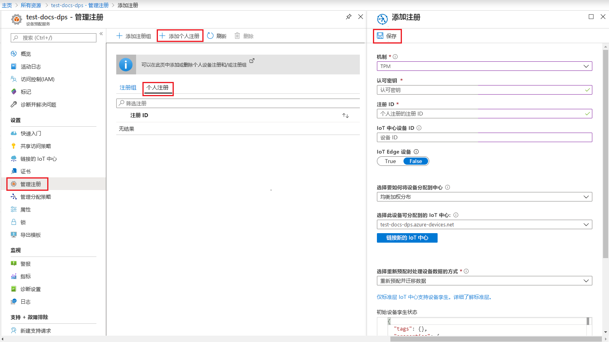
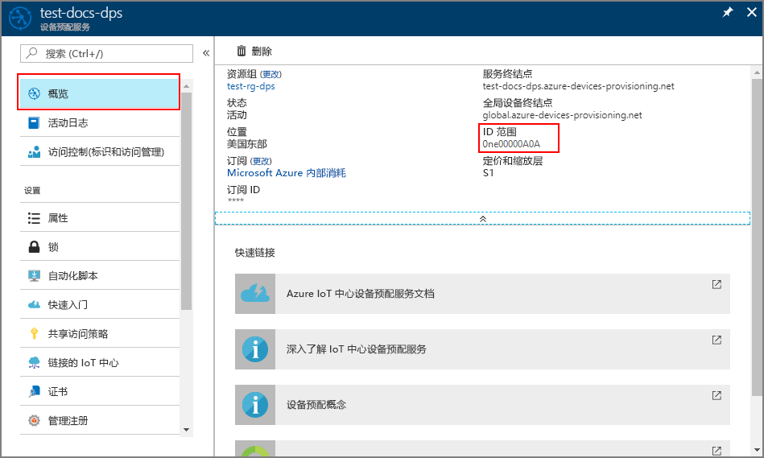

# <a name="create-and-provision-a-simulated-tpm-device-using-nodejs-device-sdk-for-iot-hub-device-provisioning-service"></a>使用适用于 IoT 中心设备预配服务的 Node.js 设备 SDK 创建和预配模拟的 TPM 设备

[!INCLUDE [iot-dps-selector-quick-create-simulated-device-tpm](../../includes/iot-dps-selector-quick-create-simulated-device-tpm.md)]

以下步骤演示了如何在运行 Windows OS 的开发计算机上创建模拟设备、如何将 Windows TPM 模拟器作为设备的[硬件安全模块 (HSM)](https://azure.microsoft.com/blog/azure-iot-supports-new-security-hardware-to-strengthen-iot-security/) 运行，以及如何使用代码示例通过设备预配服务和 IoT 中心连接该模拟设备。 

如果不熟悉自动预配过程，还务必查看[自动预配概念](concepts-auto-provisioning.md)。 另外，在继续操作之前，请确保已完成[通过 Azure 门户设置 IoT 中心设备预配服务](./quick-setup-auto-provision.md)中的步骤。 

[!INCLUDE [IoT DPS basic](../../includes/iot-dps-basic.md)]

## <a name="prepare-the-environment"></a>准备环境 

1. 请确保已在计算机上安装 [Node.js v4.0 或更高版本](https://nodejs.org)。

1. 确保在计算机上安装 `git` 并将其添加到可供命令窗口访问的环境变量。 请参阅[软件自由保护组织提供的 Git 客户端工具](https://git-scm.com/download/)，了解要安装的最新版 `git` 工具，其中包括 Git Bash，这是一个命令行应用，可以用来与本地 Git 存储库交互。 


## <a name="simulate-a-tpm-device"></a>模拟 TPM 设备

1. 打开命令提示符或 Git Bash。 克隆 `azure-utpm-c` GitHub 存储库：
    
    ```cmd/sh
    git clone https://github.com/Azure/azure-utpm-c.git
    ```

1. 导航到 GitHub 根文件夹，运行 [TPM](https://docs.microsoft.com/windows/device-security/tpm/trusted-platform-module-overview) 模拟器。 该模拟器通过套接字在端口 2321 和 2322 上进行侦听。 请勿关闭此命令窗口；本快速入门指南自始至终都需让该模拟器保持运行状态： 

    ```cmd/sh
    .\azure-utpm-c\tools\tpm_simulator\Simulator.exe
    ```

1. 新建名为 **registerdevice** 的空文件夹。 在 **registerdevice** 文件夹的命令提示符处，使用以下命令创建 package.json 文件。 确保回答 `npm` 提问的所有问题，或者接受默认设置（如果适合）：
   
    ```cmd/sh
    npm init
    ```

1. 安装以下前提包：

    ```cmd/sh
    npm install node-gyp -g
    npm install ffi -g
    ```

    > [!NOTE]
    > 安装上述包时存在一些已知问题。 若要解决这些问题，请使用命令提示符在“以管理员身份运行”模式下运行 `npm install --global --production windows-build-tools`，在将路径替换为已安装版本后运行 `SET VCTargetsPath=C:\Program Files (x86)\MSBuild\Microsoft.Cpp\v4.0\V140`，然后重新运行上述安装命令。
    >

1. 安装以下包，其中包含在注册过程中使用过的组件：

    - 适用于 TPM 的安全客户端：`azure-iot-security-tpm`
    - 设备的传输，用于连接到设备预配服务：`azure-iot-provisioning-device-http` 或 `azure-iot-provisioning-device-amqp`
    - 将要使用传输的客户端和安全客户端：`azure-iot-provisioning-device`

    注册设备以后，即可使用常用的 IoT 中心设备客户端包通过在注册过程中提供的凭据来连接设备。 将需要以下项：

    - 设备客户端：`azure-iot-device`
    - 一个传输：`azure-iot-device-amqp`、`azure-iot-device-mqtt`、`azure-iot-device-http` 中的任一项
    - 已安装的安全客户端：`azure-iot-security-tpm`

    > [!NOTE]
    > 下面的示例使用 `azure-iot-provisioning-device-http` 和 `azure-iot-device-mqtt` 传输。
    > 

    可以在 **registerdevice** 文件夹中的命令提示符处运行以下命令，一次性安装所有这些包：

        ```cmd/sh
        npm install --save azure-iot-device azure-iot-device-mqtt azure-iot-security-tpm azure-iot-provisioning-device-http azure-iot-provisioning-device
        ```

1. 在 **registerdevice** 文件夹中，使用文本编辑器创建新的 **ExtractDevice.js** 文件。

1. 在 **ExtractDevice.js** 文件的开头添加以下 `require` 语句：
   
    ```
    'use strict';

    var tpmSecurity = require('azure-iot-security-tpm');
    var tssJs = require("tss.js");

    var myTpm = new tpmSecurity.TpmSecurityClient(undefined, new tssJs.Tpm(true));
    ```

1. 添加以下函数以实现该方法：
   
    ```
    myTpm.getEndorsementKey(function(err, endorsementKey) {
      if (err) {
        console.log('The error returned from get key is: ' + err);
      } else {
        console.log('the endorsement key is: ' + endorsementKey.toString('base64'));
        myTpm.getRegistrationId((getRegistrationIdError, registrationId) => {
          if (getRegistrationIdError) {
            console.log('The error returned from get registration id is: ' + getRegistrationIdError);
          } else {
            console.log('The Registration Id is: ' + registrationId);
            process.exit();
          }
        });
      }
    });
    ```

1. 保存并关闭 **ExtractDevice.js** 文件。 运行示例：

    ```cmd/sh
    node ExtractDevice.js
    ```

1. 输出窗口会显示进行设备注册所需的“认可密钥”和“注册 ID”。 记下这些值。 


## <a name="create-a-device-entry"></a>创建设备条目

1. 登录到 Azure 门户，单击左侧菜单上的“所有资源”按钮，打开设备预配服务。

1. 在设备预配服务摘要边栏选项卡上，选择“管理注册”。 选择“单个注册”选项卡，单击顶部的“添加”按钮。 

1. 在“添加注册列表项”下，输入以下信息：
    - 选择“TPM”作为标识证明*机制*。
    - 输入 TPM 设备的*注册 ID* 和*认可密钥*。
    - （可选）可以提供以下信息：
        - 选择与预配服务链接的 IoT 中心。
        - 输入唯一设备 ID。 为设备命名时，请确保避免使用敏感数据。
        - 使用设备所需的初始配置更新“初始设备孪生状态”。
    - 完成后，单击“保存”按钮。 

      

   成功注册以后，设备的“注册 ID”显示在“单个注册”选项卡下的列表中。 


## <a name="register-the-device"></a>注册设备

1. 在 Azure 门户中，选择设备预配服务的“概览”边栏选项卡，记下“全局设备终结点”和“ID 范围”的值。

     

1. 在 **registerdevice** 文件夹中，使用文本编辑器创建新的 **RegisterDevice.js** 文件。

1. 在 **RegisterDevice.js** 文件的开头添加以下 `require` 语句：
   
    ```
    'use strict';

    var ProvisioningTransport = require('azure-iot-provisioning-device-http').Http;
    var iotHubTransport = require('azure-iot-device-mqtt').Mqtt;
    var Client = require('azure-iot-device').Client;
    var Message = require('azure-iot-device').Message;
    var tpmSecurity = require('azure-iot-security-tpm');
    var ProvisioningDeviceClient = require('azure-iot-provisioning-device').ProvisioningDeviceClient;
    ```

    > [!NOTE]
    > **用于 Node.js 的 Azure IoT SDK** 支持其他协议，例如 _AMQP_、_AMQP WS_、_MQTT WS_。  有关更多示例，请参阅 [Device Provisioning Service SDK for Node.js samples](https://github.com/Azure/azure-iot-sdk-node/tree/master/provisioning/device/samples)（用于 Node.js 的设备预配服务 SDK 示例）。
    > 

1. 添加 **globalDeviceEndpoint** 和 **idScope** 变量，使用它们创建 **ProvisioningDeviceClient** 实例。 将 **{globalDeviceEndpoint}** 和 **{idScope}** 替换为**步骤 1** 中的“全局设备终结点”和“ID 范围”的值：
   
    ```
    var provisioningHost = '{globalDeviceEndpoint}';
    var idScope = '{idScope}';

    var tssJs = require("tss.js");
    var securityClient = new tpmSecurity.TpmSecurityClient('', new tssJs.Tpm(true));
    // if using non-simulated device, replace the above line with following:
    //var securityClient = new tpmSecurity.TpmSecurityClient();

    var provisioningClient = ProvisioningDeviceClient.create(provisioningHost, idScope, new ProvisioningTransport(), securityClient);
    ```

1. 添加以下函数，实现设备上的方法：
   
    ```
    provisioningClient.register(function(err, result) {
      if (err) {
        console.log("error registering device: " + err);
      } else {
        console.log('registration succeeded');
        console.log('assigned hub=' + result.registrationState.assignedHub);
        console.log('deviceId=' + result.registrationState.deviceId);
        var tpmAuthenticationProvider = tpmSecurity.TpmAuthenticationProvider.fromTpmSecurityClient(result.registrationState.deviceId, result.registrationState.assignedHub, securityClient);
        var hubClient = Client.fromAuthenticationProvider(tpmAuthenticationProvider, iotHubTransport);

        var connectCallback = function (err) {
          if (err) {
            console.error('Could not connect: ' + err.message);
          } else {
            console.log('Client connected');
            var message = new Message('Hello world');
            hubClient.sendEvent(message, printResultFor('send'));
          }
        };

        hubClient.open(connectCallback);

        function printResultFor(op) {
          return function printResult(err, res) {
            if (err) console.log(op + ' error: ' + err.toString());
            if (res) console.log(op + ' status: ' + res.constructor.name);
            process.exit(1);
          };
        }
      }
    });
    ```

1. 保存并关闭 **RegisterDevice.js** 文件。 运行示例：

    ```cmd/sh
    node RegisterDevice.js
    ```

1. 请注意相关消息，这些消息模拟设备启动后连接到设备预配服务以获取 IoT 中心信息的情况。 将模拟设备成功预配到与预配服务链接的 IoT 中心以后，设备 ID 会显示在该中心的“IoT 设备”边栏选项卡上。 

     

    如果从设备的注册项中的默认值更改了“初始设备孪生状态”，则它会从中心拉取所需的孪生状态，并执行相应的操作。 有关详细信息，请参阅[了解并在 IoT 中心内使用设备孪生](../iot-hub/iot-hub-devguide-device-twins.md)


## <a name="clean-up-resources"></a>清理资源

如果打算继续使用和探索设备客户端示例，请勿清理在本快速入门中创建的资源。 如果不打算继续学习，请通过以下步骤删除通过本快速入门创建的所有资源。

1. 关闭计算机上的设备客户端示例输出窗口。
1. 关闭计算机上的 TPM 模拟器窗口。
1. 在 Azure 门户的左侧菜单中单击“所有资源”，然后选择设备预配服务。 打开服务的“管理注册”边栏选项卡，然后单击“单个注册”选项卡。选择在本快速入门中注册的设备的“注册 ID”，然后单击顶部的“删除”按钮。 
1. 在 Azure 门户的左侧菜单中单击“所有资源”，然后选择 IoT 中心。 打开中心的“IoT 设备”边栏选项卡，选择在本快速入门中注册的设备的“设备 ID”，然后单击顶部的“删除”按钮。


## <a name="next-steps"></a>后续步骤

在本快速入门中，你已在计算机上创建 TPM 模拟设备，并已使用 IoT 中心设备预配服务将其预配到 IoT 中心。 若要了解如何以编程方式注册 TPM 设备，请继续阅读快速入门中关于 TPM 设备的编程注册内容。 

> [!div class="nextstepaction"]
> [Azure 快速入门 - 将 TPM 设备注册到 Azure IoT 中心设备预配服务](quick-enroll-device-tpm-node.md)
