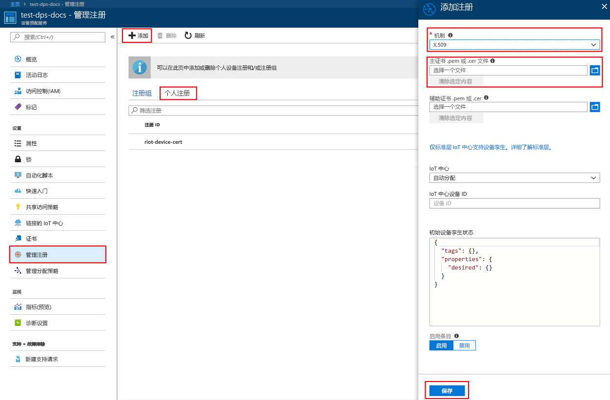
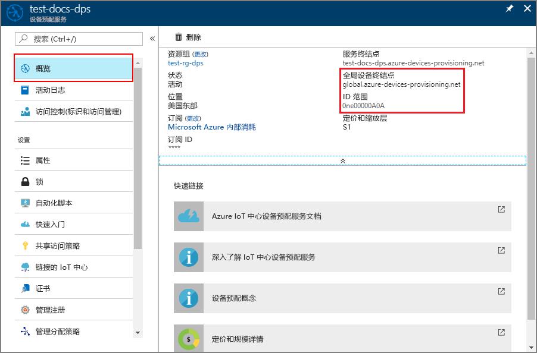
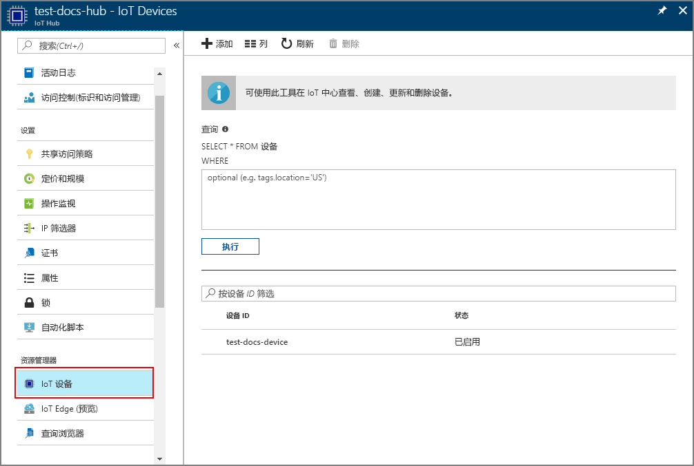

# <a name="create-and-provision-an-x509-simulated-device-using-nodejs-device-sdk-for-iot-hub-device-provisioning-service"></a>使用适用于 IoT 中心设备预配服务的 Node.js 设备 SDK 创建和预配 X.509 模拟设备
[!INCLUDE [iot-dps-selector-quick-create-simulated-device-x509](../../includes/iot-dps-selector-quick-create-simulated-device-x509.md)]

这些步骤介绍了如何使用 [Azure IoT 中心 Node.js 设备 SDK](https://github.com/Azure/azure-iot-sdk-node) 在设备预配服务中创建注册条目、在开发计算机上模拟 X.509 设备、将模拟设备与设备预配服务连接，以及在 IoT 中心注册设备。

如果不熟悉自动预配过程，还务必查看[自动预配概念](concepts-auto-provisioning.md)。 另外，在继续操作之前，请确保已完成[通过 Azure 门户设置 IoT 中心设备预配服务](./quick-setup-auto-provision.md)中的步骤。 

[!INCLUDE [IoT DPS basic](../../includes/iot-dps-basic.md)]

## <a name="prepare-the-environment"></a>准备环境 

1. 在继续操作之前，请完成[通过 Azure 门户设置 IoT 中心设备预配服务](./quick-setup-auto-provision.md)中的步骤。

2. 请确保已在计算机上安装 [Node.js v4.0 或更高版本](https://nodejs.org)。

3. 确保在计算机上安装 [Git](https://git-scm.com/download/) 并将其添加到可供命令窗口访问的环境变量。 

4. 确保在计算机上安装 [OpenSSL](https://www.openssl.org/) 并将其添加到可供命令窗口访问的环境变量。 此库可以从源生成和安装，也可以从[第三方](https://wiki.openssl.org/index.php/Binaries)（例如[这个第三方](https://sourceforge.net/projects/openssl/)）下载和安装。 

    > [!NOTE]
    > 如果已创建“根”、“中间”和/或“叶”X.509 证书，则可跳过此步骤以及与生成证书相关的所有后续步骤。
    >

## <a name="create-a-self-signed-x509-device-certificate-and-individual-enrollment-entry"></a>创建自签名的 X.509 设备证书和单个注册项

1. 打开命令提示符。 克隆代码示例的 GitHub 存储库：
    
    ```cmd/sh
    git clone https://github.com/Azure/azure-iot-sdk-node.git --recursive
    ```

2. 导航到证书生成器脚本，然后生成该项目。 

    ```cmd/sh
    cd azure-iot-sdk-node/provisioning/tools
    npm install
    ```

3. 使用自己的 _certificate-name_ 运行脚本，创建_叶_ X.509 证书。 请注意，叶证书的公用名称会成为[注册 ID](https://docs.microsoft.com/azure/iot-dps/concepts-device#registration-id)，因此请确保只使用小写的字母数字和连字符。

    ```cmd/sh
    node create_test_cert.js device {certificate-name}
    ```

4. 登录到 [Azure 门户](https://portal.azure.com)，单击左侧菜单上的“所有资源”按钮，打开设备预配服务实例。

5. 在“设备预配服务摘要”边栏选项卡上，选择“管理注册”。 选择“单个注册”选项卡，单击顶部的“添加”按钮。 

6. 在“添加注册”面板下，输入以下信息：
    - 选择“X.509”作为标识证明机制。
    - 在“主要证书 .pem 或 .cer 文件”下，单击“选择文件”选择在前述步骤中创建的证书文件 {certificate-name}_cert.pem。  
    - （可选）可以提供以下信息：
      - 选择与预配服务链接的 IoT 中心。
      - 输入唯一设备 ID。 为设备命名时，请确保避免使用敏感数据。 
      - 使用设备所需的初始配置更新“初始设备孪生状态”。
   - 完成后，单击“保存”按钮。 

    [](./media/quick-create-simulated-device-x509-node/individual-enrollment.png#lightbox)

    成功注册以后，X.509 设备会在“单独注册”选项卡的“注册 ID”列下显示为 **{certificatename}**。记下此值以备将来使用。

## <a name="simulate-the-device"></a>模拟设备

[Azure IoT 中心 Node.js 设备 SDK](https://github.com/Azure/azure-iot-sdk-node) 提供了进行设备模拟的简单方式。 若要阅读更多材料，请参阅[设备概念](https://docs.microsoft.com/azure/iot-dps/concepts-device)。

1. 在 Azure 门户中，选择设备预配服务的“概览”边栏选项卡，记下“全局设备终结点”和“ID 范围”的值。

     

2. 将证书和密钥复制到示例文件夹。

    ```cmd/sh
    copy .\{certificate-name}_cert.pem ..\device\samples\{certificate-name}_cert.pem
    copy .\{certificate-name}_key.pem ..\device\samples\{certificate-name}_key.pem
    ```

3. 导航到设备测试脚本，然后生成项目。 

    ```cmd/sh
    cd ..\device\samples
    npm install
    ```

4. 编辑 **register\_x509.js** 文件。 进行下述更改，然后保存文件。
    - 将 `provisioning host` 替换为在上面的“步骤 1”中注明的“全局设备终结点”。
    - 将 `id scope` 替换为在上面的“步骤 1”中注明的“ID 范围”。 
    - 将 `registration id` 替换为在上一部分中记下的**_注册 ID_**。
    - 将 `cert filename` 和 `key filename` 替换为在上面的“步骤 2”中复制的文件。 

5. 执行脚本，验证该设备是否已成功预配。

    ```cmd/sh
    node register_x509.js
    ```   

6. 在门户中导航到已链接到预配服务的 IoT 中心，然后打开“IoT 设备”边栏选项卡。 将模拟的 X.509 设备成功预配到中心以后，设备 ID 会显示在“IoT 设备”边栏选项卡上，“状态”为“已启用”。 如果在运行示例设备应用程序之前已打开边栏选项卡，则可能需要单击顶部的“刷新”按钮。 

     

    如果从设备的注册项中的默认值更改了“初始设备孪生状态”，则它会从中心拉取所需的孪生状态，并执行相应的操作。 有关详细信息，请参阅[了解并在 IoT 中心内使用设备孪生](../iot-hub/iot-hub-devguide-device-twins.md)。


## <a name="clean-up-resources"></a>清理资源

如果打算继续使用和探索设备客户端示例，请勿清理在本快速入门中创建的资源。 如果不打算继续学习，请通过以下步骤删除通过本快速入门创建的所有资源。

1. 关闭计算机上的设备客户端示例输出窗口。
2. 在 Azure 门户的左侧菜单中单击“所有资源”，然后选择设备预配服务。 打开服务的“管理注册”边栏选项卡，然后单击“单个注册”选项卡。选择在本快速入门中注册的设备的“注册 ID”，然后单击顶部的“删除”按钮。 
3. 在 Azure 门户的左侧菜单中单击“所有资源”，然后选择 IoT 中心。 打开中心的“IoT 设备”边栏选项卡，选择在本快速入门中注册的设备的“设备 ID”，然后单击顶部的“删除”按钮。


## <a name="next-steps"></a>后续步骤

在本快速入门中，你已创建模拟 X.509 设备，并已使用门户中的 Azure IoT 中心设备预配服务将其预配到 IoT 中心。 若要了解如何以编程方式注册 X.509 设备，请继续阅读快速入门中关于 X.509 设备的编程注册内容。 

> [!div class="nextstepaction"]
> [Azure 快速入门 - 将 X.509 设备注册到 Azure IoT 中心设备预配服务](quick-enroll-device-x509-node.md)
