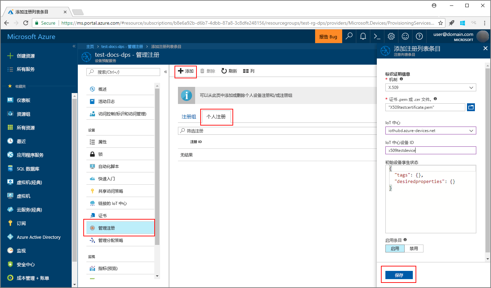
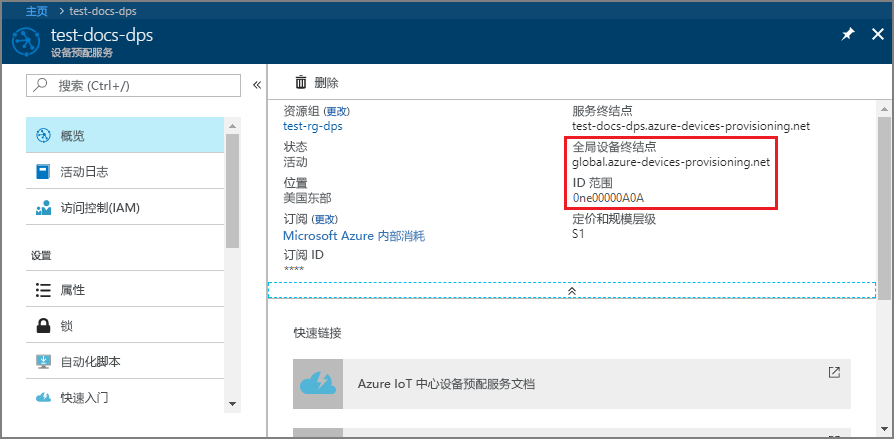
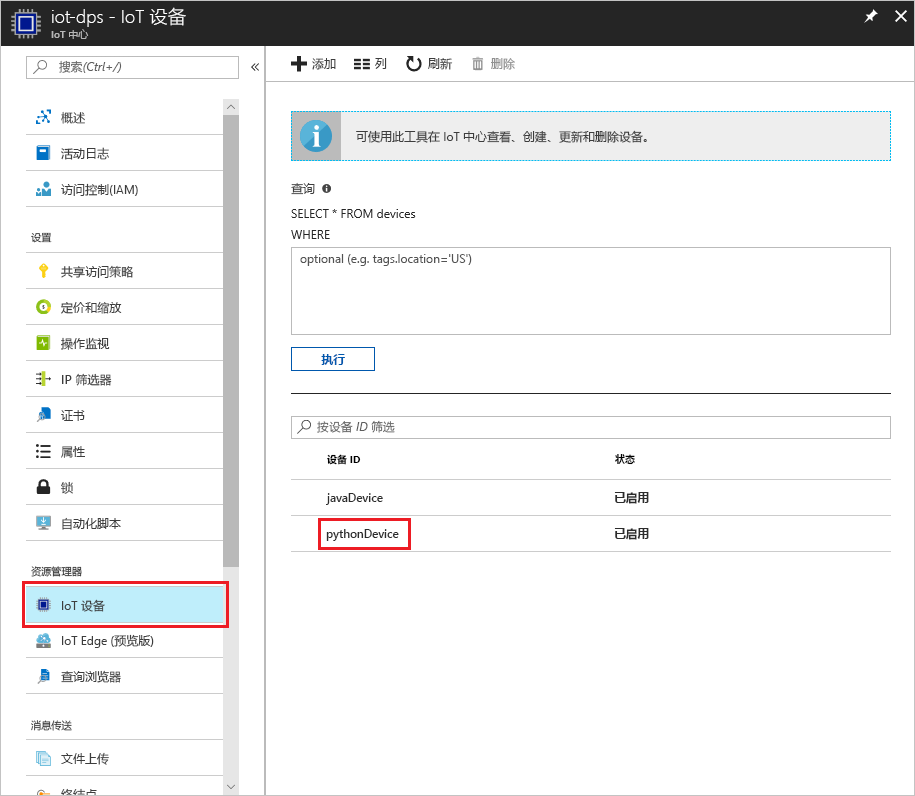

# <a name="create-and-provision-a-simulated-x509-device-using-python-device-sdk-for-iot-hub-device-provisioning-service"></a>使用适用于 IoT 中心设备预配服务的 Python 设备 SDK 创建和预配模拟的 X.509 设备
> [!div class="op_single_selector"]
> * [C](quick-create-simulated-device-x509.md)
> * [Java](quick-create-simulated-device-x509-java.md)
> * [C#](quick-create-simulated-device-x509-csharp.md)
> * [Python](quick-create-simulated-device-x509-python.md)

以下步骤演示了如何在运行 Windows OS 的开发计算机上模拟 X.509 设备，以及如何使用 Python 代码示例通过设备预配服务和 IoT 中心连接该模拟设备。 

在继续操作之前，请确保完成[通过 Azure 门户设置 IoT 中心设备预配服务](./quick-setup-auto-provision.md)中的步骤。


## <a name="prepare-the-environment"></a>准备环境 

1. 确保已在计算机上安装 [Visual Studio 2015](https://www.visualstudio.com/vs/older-downloads/) 或 [Visual Studio 2017](https://www.visualstudio.com/vs/)。 必须启用“使用 C++ 进行桌面开发”工作负荷才能进行 Visual Studio 安装。

1. 下载并安装 [CMake 生成系统](https://cmake.org/download/)。

1. 确保在计算机上安装 `git` 并将其添加到可供命令窗口访问的环境变量。 请参阅[软件自由保护组织提供的 Git 客户端工具](https://git-scm.com/download/)，了解要安装的最新版 `git` 工具，其中包括 Git Bash，这是一个命令行应用，可以用来与本地 Git 存储库交互。 

1. 打开命令提示符或 Git Bash。 为设备模拟代码示例克隆 GitHub 存储库。
    
    ```cmd/sh
    git clone https://github.com/Azure/azure-iot-sdk-python.git --recursive
    ```

1. 在该 GitHub 存储库的本地副本中创建一个用于 CMake 生成过程的文件夹。 

    ```cmd/sh
    cd azure-iot-sdk-python/c
    mkdir cmake
    cd cmake
    ```

1. 运行以下命令，为预配客户端创建 Visual Studio 解决方案。

    ```cmd/sh
    cmake -Duse_prov_client:BOOL=ON ..
    ```


## <a name="create-a-device-enrollment-entry"></a>创建设备注册项

1. 打开在 cmake 文件夹中生成的名为 `azure_iot_sdks.sln` 的解决方案，将其内置到 Visual Studio 中。

1. 右键单击 **Provision\_Tools** 文件夹中的 **dice\_device\_enrollment** 项目，然后选择“设置为启动项目”。 运行解决方案。 在输出窗口中，当系统提示时输入 `i` 进行单独注册。 输出窗口会显示在本地为模拟设备生成的 X.509 证书。 将输出（从 *-----BEGIN CERTIFICATE-----* 开始，到 *-----END CERTIFICATE-----* 结束）复制到剪贴板，确保将这两行也包括进去。 

    
 
1. 在 Windows 计算机上创建名为 **_X509testcertificate.pem_** 的文件，在所选编辑器中将其打开，然后将剪贴板内容复制到该文件中。 保存文件。 

1. 登录到 Azure 门户，单击左侧菜单上的“所有资源”按钮，打开预配服务。

1. 在“设备预配服务摘要”边栏选项卡上，选择“管理注册”。 选择“单个注册”选项卡，单击顶部的“添加”按钮。 

1. 在“添加注册列表项”下，输入以下信息：
    - 选择“X.509”作为标识证明机制。
    - 使用“文件资源管理器”小组件，在“证书 .pem 或 .cer 文件”下选择在前述步骤中创建的证书文件 **_X509testcertificate.pem_**。
    - （可选）可以提供以下信息：
        - 选择与预配服务链接的 IoT 中心。
        - 输入唯一设备 ID。 为设备命名时，请确保避免使用敏感数据。 
        - 使用设备所需的初始配置更新“初始设备孪生状态”。
    - 完成后，单击“保存”按钮。 

      

   成功注册以后，X.509 设备会在“单独注册”选项卡的“注册 ID”列下显示为 **riot-device-cert**。 


## <a name="simulate-the-device"></a>模拟设备

1. 在设备预配服务摘要边栏选项卡上，选择“概览”。 记下“ID 范围”和“全局服务终结点”。

    

1. 下载并安装 [Python 2.x 或 3.x](https://www.python.org/downloads/)。 请确保根据安装程序的要求，使用 32 位或 64 位安装。 在安装过程中出现提示时，请确保将 Python 添加到特定于平台的环境变量中。 如果使用 Python 2.x，则可能需要[安装或升级 pip - Python 包管理系统](https://pip.pypa.io/en/stable/installing/)。
    - 如果使用 Windows OS，则请安装 [Visual C++ 可再发行组件包](http://www.microsoft.com/download/confirmation.aspx?id=48145)，以便使用 Python 中的本机 DLL。

1. 按照[这些说明](https://github.com/Azure/azure-iot-sdk-python/blob/master/doc/python-devbox-setup.md)生成 Python 包。

    > [!NOTE]
        > 如果使用 `pip`，请确保也安装 `azure-iot-provisioning-device-client` 包。

1. 导航到示例文件夹。

    ```cmd/sh
    cd azure-iot-sdk-python/provisioning_device_client/samples
    ```

1. 使用 Python IDE，编辑名为 **provisioning\_device\_client\_sample.py** 的 Python 脚本。 将 _GLOBAL\_PROV\_URI_ 和 _ID\_SCOPE_ 变量修改为以前记下的值。

    ```python
    GLOBAL_PROV_URI = "{globalServiceEndpoint}"
    ID_SCOPE = "{idScope}"
    SECURITY_DEVICE_TYPE = ProvisioningSecurityDeviceType.X509
    PROTOCOL = ProvisioningTransportProvider.HTTP
    ```

1. 运行示例。 

    ```cmd/sh
    python provisioning_device_client_sample.py
    ```

1. 应用程序会进行连接，注册设备，然后显示注册成功的消息。

    

1. 在门户中导航到已链接到预配服务的 IoT 中心，然后打开“Device Explorer”边栏选项卡。 将模拟的 X.509 设备成功预配到中心以后，设备 ID 会显示在“Device Explorer”边栏选项卡上，“状态”为“已启用”。 如果在运行示例设备应用程序之前已打开边栏选项卡，则可能需要单击顶部的“刷新”按钮。 

     

> [!NOTE]
> 如果从设备的注册项中的默认值更改了“初始设备孪生状态”，则它会从中心拉取所需的孪生状态，并执行相应的操作。 有关详细信息，请参阅[了解并在 IoT 中心内使用设备孪生](../iot-hub/iot-hub-devguide-device-twins.md)。
>


## <a name="clean-up-resources"></a>清理资源

如果打算继续使用和探索设备客户端示例，请勿清理在本快速入门中创建的资源。 如果不打算继续学习，请通过以下步骤删除通过本快速入门创建的所有资源。

1. 关闭计算机上的设备客户端示例输出窗口。
1. 在 Azure 门户的左侧菜单中单击“所有资源”，然后选择设备预配服务。 打开服务的“管理注册”边栏选项卡，然后单击“单个注册”选项卡。选择在本快速入门中注册的设备的“注册 ID”，然后单击顶部的“删除”按钮。 
1. 在 Azure 门户的左侧菜单中单击“所有资源”，然后选择 IoT 中心。 打开中心的“IoT 设备”边栏选项卡，选择在本快速入门中注册的设备的“设备 ID”，然后单击顶部的“删除”按钮。

## <a name="next-steps"></a>后续步骤

本快速入门介绍了如何在 Windows 计算机上创建模拟 X.509 设备，以及如何使用门户中的 Azure IoT 中心设备预配服务将其预配到 IoT 中心。 若要了解如何以编程方式注册 X.509 设备，请继续阅读快速入门中关于 X.509 设备的编程注册内容。 

> [!div class="nextstepaction"]
> [Azure 快速入门 - 将 X.509 设备注册到 Azure IoT 中心设备预配服务](quick-enroll-device-x509-java.md)
