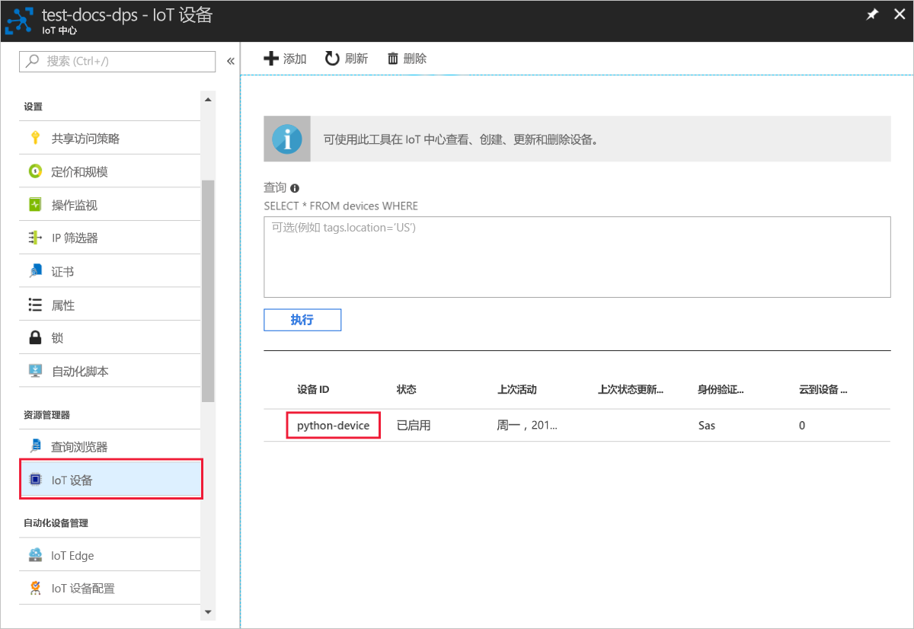

# <a name="quickstart-create-and-provision-a-simulated-x509-device-using-python-device-sdk-for-iot-hub-device-provisioning-service"></a>快速入门：使用适用于 IoT 中心设备预配服务的 Python 设备 SDK 创建和预配模拟的 X.509 设备

[!INCLUDE [iot-dps-selector-quick-create-simulated-device-x509](../../includes/iot-dps-selector-quick-create-simulated-device-x509.md)]

在本快速入门中，我们在 Windows 计算机上创建一台模拟 X.509 设备。 我们使用设备预配服务 (DPS) 的单个注册，通过设备示例 Python 代码将此模拟设备连接到 IoT 中心。

## <a name="prerequisites"></a>必备条件

- 查看[自动预配概念](concepts-auto-provisioning.md)。
- 完成[通过 Azure 门户设置 IoT 中心设备预配服务](./quick-setup-auto-provision.md)。
- 具有活动订阅的 Azure 帐户。 [免费创建一个](https://azure.microsoft.com/free/?ref=microsoft.com&utm_source=microsoft.com&utm_medium=docs&utm_campaign=visualstudio)。
- [Visual Studio 2015+](https://visualstudio.microsoft.com/vs/)，结合使用通过 C++ 进行的桌面开发。
- [CMake 生成系统](https://cmake.org/download/)。
- [Git](https://git-scm.com/download/)。

> [!IMPORTANT]
> 本文仅适用于已弃用的 V1 Python SDK。 V2 中尚不提供用于 IoT 中心设备预配服务的设备和服务客户端。 该团队目前正在努力使 V2 具有功能奇偶一致性。

[!INCLUDE [IoT Device Provisioning Service basic](../../includes/iot-dps-basic.md)]

## <a name="prepare-the-environment"></a>准备环境 

1. 确保你已安装了 [Visual Studio](https://visualstudio.microsoft.com/vs/) 2015 或更高版本，并为你的 Visual Studio 安装启用“使用 C++ 的桌面开发”。

2. 下载并安装 [CMake 生成系统](https://cmake.org/download/)。

3. 确保在计算机上安装 `git` 并将其添加到可供命令窗口访问的环境变量。 请参阅[软件自由保护组织提供的 Git 客户端工具](https://git-scm.com/download/)，了解要安装的最新版 `git` 工具，其中包括  Git Bash，这是一个命令行应用，可以用来与本地 Git 存储库交互。 

4. 打开命令提示符或 Git Bash。 为设备模拟代码示例克隆 GitHub 存储库。
    
    ```cmd/sh
    git clone https://github.com/Azure/azure-iot-sdk-python.git --recursive
    ```

5. 在该 GitHub 存储库的本地副本中创建一个用于 CMake 生成过程的文件夹。 

    ```cmd/sh
    cd azure-iot-sdk-python/c
    mkdir cmake
    cd cmake
    ```

6. 运行以下命令，为预配客户端创建 Visual Studio 解决方案。

    ```cmd/sh
    cmake -Duse_prov_client:BOOL=ON ..
    ```


## <a name="create-a-self-signed-x509-device-certificate-and-individual-enrollment-entry"></a>创建自签名的 X.509 设备证书和单个注册项

在本部分中，将使用自签名的 X.509 证书。 请务必记住以下几点：

* 自签名证书仅用于测试，不应在生产环境中使用。
* 自签名证书的默认过期日期为一年。

你将使用来自 Azure IoT C SDK 的示例代码创建要与模拟设备的个人注册条目一起使用的证书。

Azure IoT 设备预配服务支持两类注册：

- [注册组](concepts-service.md#enrollment-group)：用于注册多个相关设备。
- [个人注册](concepts-service.md#individual-enrollment)：用于注册单个设备。

本文演示单个注册。

1. 打开在  cmake 文件夹中生成的名为 `azure_iot_sdks.sln` 的解决方案，将其内置到 Visual Studio 中。

2. 右键单击 **Provision\_Tools** 文件夹中的 **dice\_device\_enrollment** 项目，然后选择“设置为启动项目”。  运行解决方案。 

3. 在输出窗口中，当系统提示时输入 `i` 进行单独注册。 输出窗口会显示在本地为模拟设备生成的 X.509 证书。 
    
    将第一个证书复制到剪贴板。 从第一次出现以下项开始：
    
        -----BEGIN CERTIFICATE----- 
        
    在第一次出现以下项后复制结束：
    
        -----END CERTIFICATE-----
        
    请确保也包含这两行。 

    
 
4. 在 Windows 计算机上创建名为 **_X509testcertificate.pem_** 的文件，在所选编辑器中将其打开，然后将剪贴板内容复制到该文件中。 保存文件。 

5. 登录到 Azure 门户，选择左侧菜单上的“所有资源”按钮，打开预配服务  。

6. 在“设备预配服务”菜单中，选择“管理注册”  。 选择“个人注册”选项卡，然后选择顶部的“添加个人注册”按钮   。 

7. 在“添加注册”面板中，输入以下信息  ：
   - 选择“X.509”  作为标识证明机制  。
   - 在“主要证书 .pem 或 .cer 文件”下，选择“选择文件”以选择在前述步骤中创建的证书文件 X509testcertificate.pem    。
   - （可选）可以提供以下信息：
     - 选择与预配服务链接的 IoT 中心。
     - 输入唯一设备 ID。 为设备命名时，请确保避免使用敏感数据。 
     - 使用设备所需的初始配置更新“初始设备孪生状态”  。
   - 完成后，按“保存”按钮  。 

     [](./media/python-quick-create-simulated-device-x509/device-enrollment.png#lightbox)

   成功注册以后，X.509 设备会在“单个注册”选项卡的“注册 ID”列下显示为 **riot-device-cert**。   

## <a name="simulate-the-device"></a>模拟设备

1. 在“设备预配服务”菜单中，选择“概述”  。 记下“ID 范围”和“全局服务终结点”。  

    

2. 下载并安装 [Python 2.x 或 3.x](https://www.python.org/downloads/)。 请确保根据安装程序的要求，使用 32 位或 64 位安装。 在安装过程中出现提示时，请确保将 Python 添加到特定于平台的环境变量中。 如果使用 Python 2.x，则可能需要[安装或升级 pip  - Python 包管理系统](https://pip.pypa.io/en/stable/installing/)。
    
    > [!NOTE] 
    > 如果使用的是 Windows，还需要安装 [Visual C++ Redistributable for Visual Studio 2015](https://support.microsoft.com/help/2977003/the-latest-supported-visual-c-downloads)。 pip 包需要可再发行组件，才能加载/执行 C DLL。

3. 按照[这些说明](https://github.com/Azure/azure-iot-sdk-python/blob/v1-deprecated/doc/python-devbox-setup.md)生成 Python 包。

   > [!NOTE]
   > 如果使用 `pip`，请确保也安装 `azure-iot-provisioning-device-client` 包。

4. 导航到示例文件夹。

    ```cmd/sh
    cd azure-iot-sdk-python/provisioning_device_client/samples
    ```

5. 使用 Python IDE，编辑名为 **provisioning\_device\_client\_sample.py** 的 Python 脚本。 将 _GLOBAL\_PROV\_URI_ 和 _ID\_SCOPE_ 变量修改为以前记下的值。

    ```python
    GLOBAL_PROV_URI = "{globalServiceEndpoint}"
    ID_SCOPE = "{idScope}"
    SECURITY_DEVICE_TYPE = ProvisioningSecurityDeviceType.X509
    PROTOCOL = ProvisioningTransportProvider.HTTP
    ```

6. 运行该示例。 

    ```cmd/sh
    python provisioning_device_client_sample.py
    ```

7. 应用程序会进行连接，注册设备，然后显示注册成功的消息。

    

8. 在门户中导航到已链接到预配服务的 IoT 中心，然后打开“Device Explorer”边栏选项卡。  将模拟的 X.509 设备成功预配到中心以后，设备 ID 会显示在“Device Explorer”边栏选项卡上，“状态”为“已启用”。    如果在运行示例设备应用程序之前已打开边栏选项卡，则可能需要按顶部的“刷新”按钮  。 

     

> [!NOTE]
> 如果从设备的注册项中的默认值更改了“初始设备孪生状态”  ，则它会从中心拉取所需的孪生状态，并执行相应的操作。 有关详细信息，请参阅[了解并在 IoT 中心内使用设备孪生](../iot-hub/iot-hub-devguide-device-twins.md)。
>

## <a name="clean-up-resources"></a>清理资源

如果打算继续使用和探索设备客户端示例，请勿清理在本快速入门中创建的资源。 如果不打算继续学习，请按以下步骤删除本快速入门中创建的所有资源。

1. 关闭计算机上的设备客户端示例输出窗口。
2. 在 Azure 门户的左侧菜单中选择“所有资源”，然后选择设备预配服务  。 打开服务的“管理注册”边栏选项卡，然后选择“单个注册”选项卡   。选中在本快速入门中注册的设备的“注册 ID”旁边的复选框，然后按窗格顶部的“删除”按钮   。 
3. 在 Azure 门户的左侧菜单中选择“所有资源”，然后选择 IoT 中心  。 打开中心的“IoT 设备”边栏选项卡，选中在本快速入门中注册的设备的“设备 ID”旁边的复选框，然后按窗格顶部的“删除”按钮    。

## <a name="next-steps"></a>后续步骤

本快速入门介绍了如何在 Windows 计算机上创建模拟 X.509 设备，以及如何使用门户中的 Azure IoT 中心设备预配服务将其预配到 IoT 中心。 若要了解如何以编程方式注册 X.509 设备，请继续阅读快速入门中关于 X.509 设备的编程注册内容。 

> [!div class="nextstepaction"]
> [Azure 快速入门 - 将 X.509 设备注册到 Azure IoT 中心设备预配服务](quick-enroll-device-x509-python.md)
