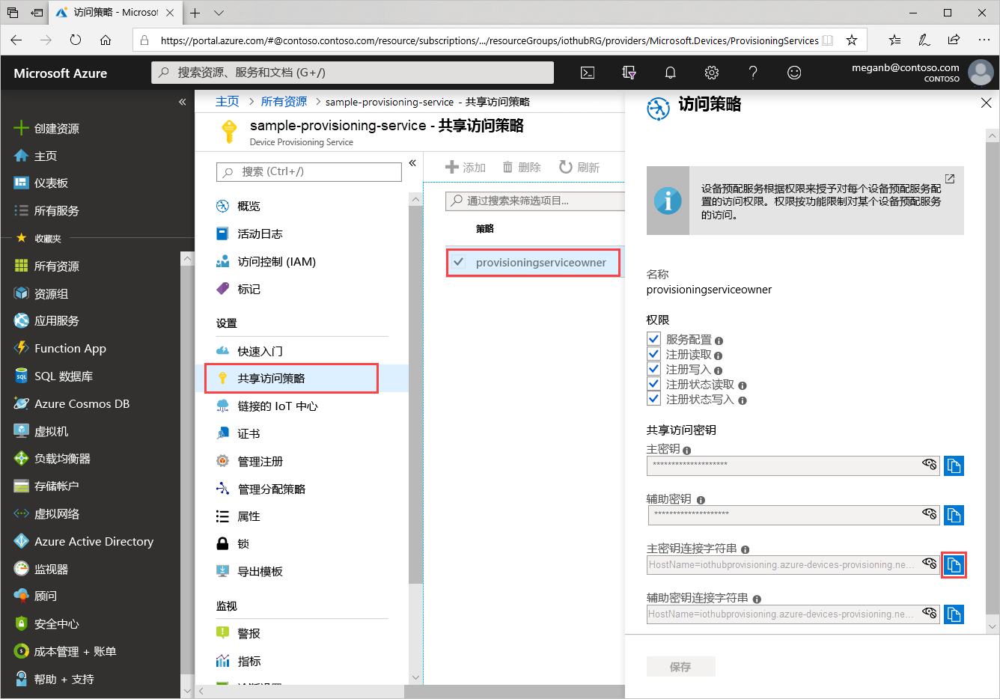
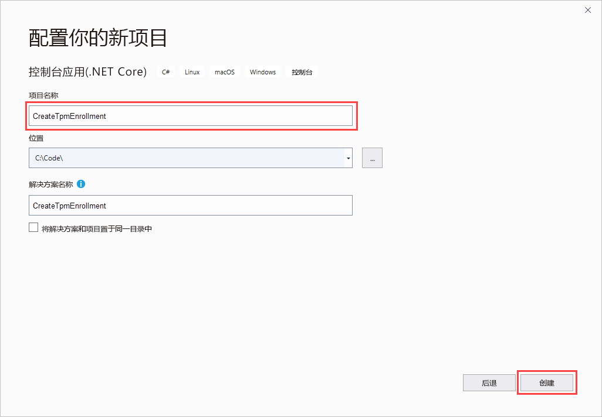
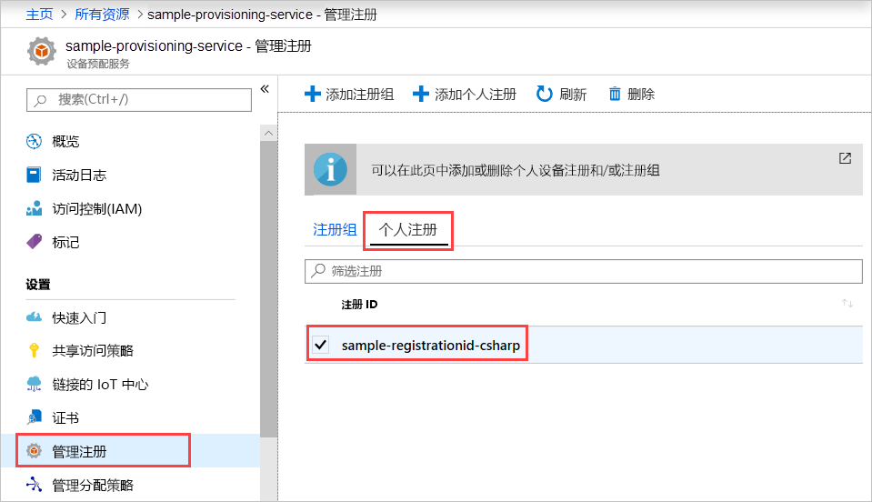

# <a name="quickstart-enroll-tpm-device-to-iot-hub-device-provisioning-service-using-c-service-sdk"></a>快速入门：使用 C# 服务 SDK 将 TPM 设备注册到 IoT 中心设备预配服务

[!INCLUDE [iot-dps-selector-quick-enroll-device-tpm](../../includes/iot-dps-selector-quick-enroll-device-tpm.md)]

本文介绍如何使用 [C# 服务 SDK](https://github.com/Azure/azure-iot-sdk-csharp) 和示例 C# .NET Core 应用程序，在 Azure IoT 中心设备预配服务中以编程方式为 TPM 设备创建单个注册。 可以通过该单个注册项，选择性地将模拟的 TPM 设备注册到预配服务。 本文使用 Windows 开发计算机，不过，这些步骤在 Windows 和 Linux 计算机上均适用。

## <a name="prepare-the-development-environment"></a>准备开发环境

1. 检查计算机上是否安装了 [Visual Studio 2019](https://www.visualstudio.com/vs/)。

1. 检查计算机上是否安装了 [.NET Core SDK](https://www.microsoft.com/net/download/windows)。

1. 在继续操作之前，请先完成[使用 Azure 门户设置 IoT 中心设备预配服务](./quick-setup-auto-provision.md)中的步骤。

1. （可选）如需在本快速入门末尾注册模拟设备，请执行[使用 C# 设备 SDK 创建和预配模拟的 TPM 设备](quick-create-simulated-device-tpm-csharp.md)中的过程，一直到获取设备的认可密钥那一步。 保存认可密钥和注册 ID，并视需要记下设备 ID，因为稍后需要在本快速入门中用到。

   > [!NOTE]
   > 请勿执行使用 Azure 门户创建单个注册的步骤。

## <a name="get-the-connection-string-for-your-provisioning-service"></a>获取适用于预配服务的连接字符串

对于本快速入门中的示例，需要适用于预配服务的连接字符串。

1. 登录到 Azure 门户，选择“所有资源”，然后选择你的设备预配服务。 

1. 选择“共享访问策略”，然后选择需要用来打开其属性的访问策略。  在“访问策略”中，复制并保存主密钥连接字符串。 

    

## <a name="create-the-individual-enrollment-sample"></a>创建单个注册示例

本部分介绍如何创建一个 .NET Core 控制台应用，以便向预配服务添加 TPM 设备的单个注册。 进行一些修改后，还可以按这些步骤创建 [Windows IoT Core](https://developer.microsoft.com/en-us/windows/iot) 控制台应用，以便添加单个注册。 若要详细了解如何使用 IoT Core 进行开发，请参阅 [Windows IoT Core 开发人员文档](https://docs.microsoft.com/windows/iot-core/)。

1. 打开 Visual Studio 并选择“创建新项目”  。 在“创建新项目”中，为 C# 项目模板选择“控制台应用(.NET Core)”，然后选择“下一步”。   

1. 将项目命名为“CreateTpmEnrollment”，然后按“创建”   。

    

1. 在 Visual Studio 中打开该解决方案后，在“解决方案资源管理器”窗格中右键单击“CreateTpmEnrollment”项目   。 选择“管理 NuGet 包”。 

1. 在“NuGet 包管理器”中选择“浏览”，搜索并选择“Microsoft.Azure.Devices.Provisioning.Service”，然后按“安装”     。

   

   此步骤会下载、安装 [Azure IoT 预配服务客户端 SDK](https://www.nuget.org/packages/Microsoft.Azure.Devices.Provisioning.Service/) NuGet 包及其依赖项并添加对它的引用。

1. 在 `Program.cs` 顶部的其他 `using` 语句之后添加以下 `using` 语句：
  
   ```csharp
   using System.Threading.Tasks;
   using Microsoft.Azure.Devices.Provisioning.Service;
   ```

1. 将以下字段添加到 `Program` 类，并进行下列更改。

   ```csharp
   private static string ProvisioningConnectionString = "{ProvisioningServiceConnectionString}";
   private const string RegistrationId = "sample-registrationid-csharp";
   private const string TpmEndorsementKey =
       "AToAAQALAAMAsgAgg3GXZ0SEs/gakMyNRqXXJP1S124GUgtk8qHaGzMUaaoABgCAAEMAEAgAAAAAAAEAxsj2gUS" +
       "cTk1UjuioeTlfGYZrrimExB+bScH75adUMRIi2UOMxG1kw4y+9RW/IVoMl4e620VxZad0ARX2gUqVjYO7KPVt3d" +
       "yKhZS3dkcvfBisBhP1XH9B33VqHG9SHnbnQXdBUaCgKAfxome8UmBKfe+naTsE5fkvjb/do3/dD6l4sGBwFCnKR" +
       "dln4XpM03zLpoHFao8zOwt8l/uP3qUIxmCYv9A7m69Ms+5/pCkTu/rK4mRDsfhZ0QLfbzVI6zQFOKF/rwsfBtFe" +
       "WlWtcuJMKlXdD8TXWElTzgh7JS4qhFzreL0c1mI0GCj+Aws0usZh7dLIVPnlgZcBhgy1SSDQMQ==";
       
   // Optional parameters
   private const string OptionalDeviceId = "myCSharpDevice";
   private const ProvisioningStatus OptionalProvisioningStatus = ProvisioningStatus.Enabled;
   ```

   * 将 `ProvisioningServiceConnectionString` 占位符值替换为需要为其创建注册的预配服务的连接字符串。

   * 可以选择更改注册 ID、认可密钥、设备 ID 和预配状态。

   * 如果将此快速入门与[使用 C# 设备 SDK 创建和预配模拟的 TPM 设备](quick-create-simulated-device-tpm-csharp.md)快速入门结合使用来预配模拟设备，请将认可密钥和注册 ID 替换为在该快速入门中记下的值。 可以将设备 ID 替换为在该快速入门中建议的值，可以使用自己的值，也可以使用此示例中的默认值。

1. 将以下方法添加到 `Program` 类。  此代码创建单个注册条目，然后调用 `ProvisioningServiceClient` 中的 `CreateOrUpdateIndividualEnrollmentAsync` 方法，将单个注册添加到预配服务。

   ```csharp
   public static async Task RunSample()
   {
       Console.WriteLine("Starting sample...");

       using (ProvisioningServiceClient provisioningServiceClient =
               ProvisioningServiceClient.CreateFromConnectionString(ProvisioningConnectionString))
       {
           #region Create a new individualEnrollment config
           Console.WriteLine("\nCreating a new individualEnrollment...");
           Attestation attestation = new TpmAttestation(TpmEndorsementKey);
           IndividualEnrollment individualEnrollment =
                   new IndividualEnrollment(
                           RegistrationId,
                           attestation);

           // The following parameters are optional. Remove them if you don't need them.
           individualEnrollment.DeviceId = OptionalDeviceId;
           individualEnrollment.ProvisioningStatus = OptionalProvisioningStatus;
           #endregion

           #region Create the individualEnrollment
           Console.WriteLine("\nAdding new individualEnrollment...");
           IndividualEnrollment individualEnrollmentResult =
               await provisioningServiceClient.CreateOrUpdateIndividualEnrollmentAsync(individualEnrollment).ConfigureAwait(false);
           Console.WriteLine("\nIndividualEnrollment created with success.");
           Console.WriteLine(individualEnrollmentResult);
           #endregion
        
       }
   }
   ```

1. 最后，将 `Main` 方法的主体替换为以下行：

   ```csharp
   RunSample().GetAwaiter().GetResult();
   Console.WriteLine("\nHit <Enter> to exit ...");
   Console.ReadLine();
   ```

1. 生成解决方案。

## <a name="run-the-individual-enrollment-sample"></a>运行单个注册示例
  
在 Visual Studio 中运行此示例，为 TPM 设备创建单个注册。

系统将显示命令提示符窗口并开始显示确认消息。 成功创建后，命令提示符窗口会显示新的单个注册的属性。

可以验证是否已创建单个注册。 转到设备预配服务的摘要，依次选择“管理注册”、“单个注册”。   此时会看到一个新的注册条目，对应于示例中使用的注册 ID。



选择该条目即可验证认可密钥以及该条目的其他属性。

如果你一直在按[使用 C# 设备 SDK 创建和预配模拟的 TPM 设备](quick-create-simulated-device-tpm-csharp.md)快速入门中的步骤操作，可以继续执行该快速入门中的其余步骤来注册模拟设备。 务必跳过使用 Azure 门户创建单个注册的步骤。

## <a name="clean-up-resources"></a>清理资源

如果你打算学习 C# 服务示例，请勿清理本快速入门中创建的资源。 否则，请使用以下步骤删除本快速入门创建的所有资源。

1. 关闭计算机上的 C# 示例输出窗口。

1. 在 Azure 门户中导航到你的设备预配服务，选择“管理注册”，然后选择“单个注册”选项卡。   选中通过本快速入门创建的注册项的“注册 ID”旁边的复选框，然后按窗格顶部的“删除”按钮   。

1. 如果已按照[使用 C# 设备 SDK 创建和预配模拟的 TPM 设备](quick-create-simulated-device-tpm-csharp.md)中的步骤创建模拟的 TPM 设备，请执行以下步骤：

    1. 关闭 TPM 模拟器窗口以及模拟设备的示例输出窗口。

    1. 在 Azure 门户中，导航到预配了设备的 IoT 中心。 在“资源管理器”下的菜单中，选择“IoT 设备”，选中在本快速入门中注册的设备的“设备 ID”旁边的复选框，然后按窗格顶部的“删除”按钮     。

## <a name="next-steps"></a>后续步骤

在本快速入门中，你以编程方式为 TPM 设备创建了单个注册条目。 此外，你已根据需要在计算机上创建了一个 TPM 模拟设备，并已使用 Azure IoT 中心设备预配服务将其预配到 IoT 中心。 若要深入了解设备预配，请继续学习本教程有关如何在 Azure 门户中进行设备预配服务设置的内容。

> [!div class="nextstepaction"]
> [Azure IoT 中心设备预配服务教程](./tutorial-set-up-cloud.md)
