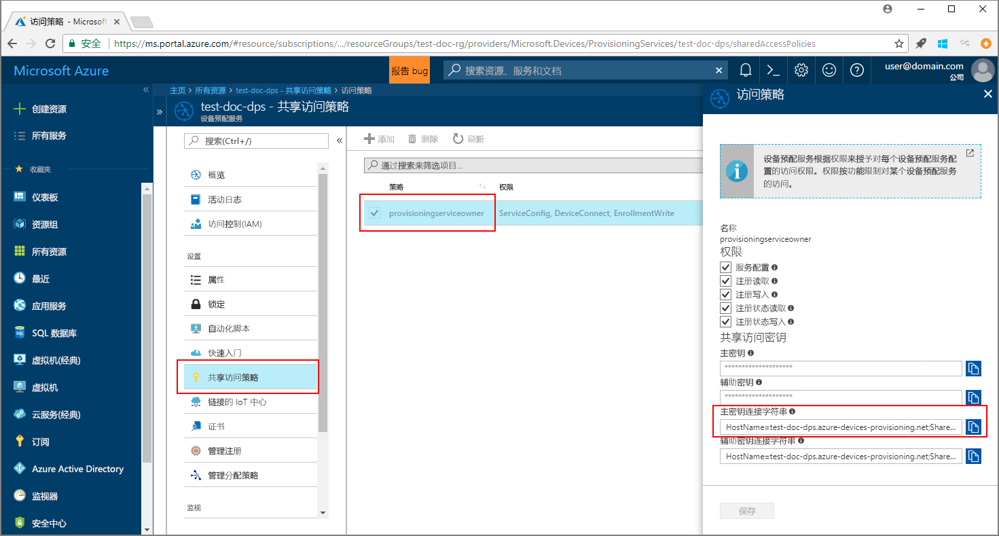
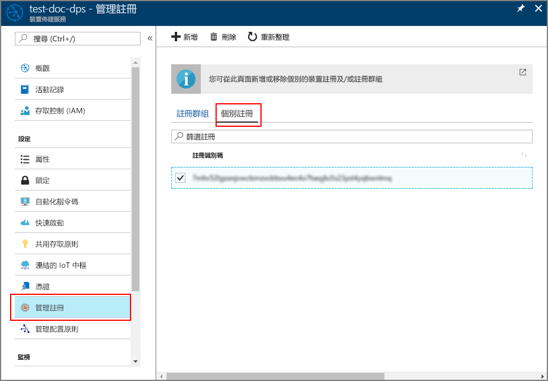

# <a name="enroll-tpm-device-to-iot-hub-device-provisioning-service-using-java-service-sdk"></a>使用 Java 服务 SDK 将 TPM 设备注册到 IoT 中心设备预配服务

[!INCLUDE [iot-dps-selector-quick-enroll-device-tpm](../../includes/iot-dps-selector-quick-enroll-device-tpm.md)]


以下步骤借助一个示例 Java 应用程序，演示了如何使用 [Java 服务 SDK](https://azure.github.io/azure-iot-sdk-java/service/) 通过编程方式将模拟的 TPM 设备注册到 Azure IoT 中心设备预配服务。 虽然 Java 服务 SDK 在 Windows 和 Linux 计算机上均适用，但本文使用 Windows 开发计算机来演示注册过程。

在继续操作之前，请确保[通过 Azure 门户设置 IoT 中心设备预配服务](./quick-setup-auto-provision.md)，并[模拟 TPM 设备](quick-create-simulated-device.md#simulatetpm)。

<a id="setupdevbox"></a>

## <a name="prepare-the-development-environment"></a>准备开发环境 

1. 确保已在计算机上安装 [Java SE 开发工具包 8](http://www.oracle.com/technetwork/java/javase/downloads/jdk8-downloads-2133151.html)。 

2. 设置 Java 安装的环境变量。 `PATH` 变量应包括 *jdk1.8.x\bin* 目录的完整路径。 如果这是计算机的首次 Java 安装，则请创建名为 `JAVA_HOME` 的新的环境变量，将其指向 *jdk1.8.x* 目录的完整路径。 在 Windows 计算机上，该目录通常位于 *C:\\Program Files\\Java\\* 文件夹中。可以通过在 Windows 计算机的“控制面板”上搜索“编辑系统环境变量”来创建或编辑环境变量。 

  可以在命令窗口中运行以下命令，查看 Java 是否已成功安装在计算机上：

    ```cmd\sh
    java -version
    ```

3. 将 [Maven 3](https://maven.apache.org/download.cgi) 下载并解压缩到计算机上。 

4. 编辑环境变量 `PATH`，使之指向 Maven 解压缩时所在文件夹中的 *apache-maven-3.x.x\\bin* 文件夹。 可以在命令窗口中运行以下命令，确认 Maven 已成功安装：

    ```cmd\sh
    mvn --version
    ```

5. 确保在计算机上安装 [git](https://git-scm.com/download/) 并将其添加到环境变量 `PATH`。 


<a id="javasample"></a>

## <a name="download-and-modify-the-java-sample-code"></a>下载并修改 Java 示例代码

此部分演示如何向示例代码添加 TPM 设备的预配详细信息。 

1. 打开命令提示符。 使用 Java 服务 SDK 克隆设备注册代码示例的 GitHub 存储库：
    
    ```cmd\sh
    git clone https://github.com/Azure/azure-iot-sdk-java.git --recursive
    ```

2. 在下载的源代码中，导航到示例文件夹 **_azure-iot-sdk-java/provisioning/provisioning-samples/service-enrollment-sample_**。 在所选编辑器中打开文件 **_/src/main/java/samples/com/microsoft/azure/sdk/iot/ServiceEnrollmentSample.java_**，添加以下详细信息：

    1. 在门户中为预配服务添加 `[Provisioning Connection String]`，如下所示：
        1. 在 [Azure 门户](https://portal.azure.com)中导航到预配服务。 
        2. 打开“共享访问策略”，选择具有 *EnrollmentWrite* 权限的策略。
        3. 复制“主密钥连接字符串”。 

              

        4. 在示例代码文件 **_ServiceEnrollmentSample.java_** 中，将 `[Provisioning Connection String]` 替换为“主密钥连接字符串”。
    
            ```Java
            private static final String PROVISIONING_CONNECTION_STRING = "[Provisioning Connection String]";
            ```

    2. 添加 TPM 设备详细信息：
        1. 获取 TPM 设备模拟的“注册 ID”和“TPM 认可密钥”，只需执行[模拟 TPM 设备](quick-create-simulated-device.md#simulatetpm)部分之前的步骤即可。
        2. 使用前面步骤的输出中的“注册 ID”和“认可密钥”，替换示例代码文件 **_ServiceEnrollmentSample.java_** 中的 `[RegistrationId]` 和 `[TPM Endorsement Key]`：
        
            ```Java
            private static final String REGISTRATION_ID = "[RegistrationId]";
            private static final String TPM_ENDORSEMENT_KEY = "[TPM Endorsement Key]";
            ```

    3. 也可选择通过示例代码配置预配服务：
        - 若要将此配置添加到示例，请执行以下步骤：
            1. 在 [Azure 门户](https://portal.azure.com)中导航到已链接到预配服务的 IoT 中心。 打开中心的“概览”选项卡，复制“主机名”。 将该“主机名”指定给 *IOTHUB_HOST_NAME* 参数。
                ```Java
                private static final String IOTHUB_HOST_NAME = "[Host name].azure-devices.net";
                ```
            2. 为 *DEVICE_ID* 参数指定一个友好名称，并保留 *PROVISIONING_STATUS* 的默认值 *ENABLED*。 
    
        - 或者，如果选择不配置预配服务，请确保注释掉或删除 _ServiceEnrollmentSample.java_ 文件中的以下语句：
            ```Java
            // The following parameters are optional. Remove it if you don't need.
            individualEnrollment.setDeviceId(DEVICE_ID);
            individualEnrollment.setIotHubHostName(IOTHUB_HOST_NAME);
            individualEnrollment.setProvisioningStatus(PROVISIONING_STATUS);
            ```

    4. 研究示例代码。 此代码用于创建、更新、查询和删除单个 TPM 设备注册。 若要验证是否已在门户中成功注册，请暂时性地注释掉 _ServiceEnrollmentSample.java_ 文件末尾的以下代码行：
    
        ```Java
        // *********************************** Delete info of individualEnrollment ************************************
        System.out.println("\nDelete the individualEnrollment...");
        provisioningServiceClient.deleteIndividualEnrollment(REGISTRATION_ID);
        ```

    5. 保存 _ServiceEnrollmentSample.java_ 文件。

<a id="runjavasample"></a>

## <a name="build-and-run-the-java-sample-code"></a>生成并运行 Java 示例代码

1. 打开命令窗口，导航到文件夹 **_azure-iot-sdk-java/provisioning/provisioning-samples/service-enrollment-sample_**。

2. 使用以下命令生成示例代码：

    ```cmd\sh
    mvn install -DskipTests
    ```

   此命令将 Maven 包 [`com.microsoft.azure.sdk.iot.provisioning.service`](https://www.mvnrepository.com/artifact/com.microsoft.azure.sdk.iot.provisioning/provisioning-service-client) 下载到计算机。 此包包括示例代码需要生成的适用于 Java 服务 SDK 的二进制文件。 

3. 运行示例，方法是在命令窗口使用以下命令：

    ```cmd\sh
    cd target
    java -jar ./service-enrollment-sample-{version}-with-deps.jar
    ```

4. 在成功注册后观察输出窗口。 

5. 在 Azure 门户中导航到预配服务。 单击“管理注册”，然后选择“单个注册”选项卡。请注意，现在列出了模拟 TPM 设备的“注册 ID”。 

      

## <a name="clean-up-resources"></a>清理资源
如果打算学习 Java 服务示例，请勿清除本快速入门中创建的资源。 如果不打算继续学习，请通过以下步骤删除通过本快速入门创建的所有资源。

1. 关闭计算机上的 Java 示例输出窗口。
1. 关闭可能已创建的用于模拟 TPM 设备的 TPM 模拟器窗口。
1. 在 Azure 门户中导航到设备预配服务，单击“管理注册”，然后选择“单个注册”选项卡。选择通过本快速入门注册的设备的“注册 ID”，然后单击边栏选项卡顶部的“删除”按钮。 

## <a name="next-steps"></a>后续步骤
在本快速入门中，你将模拟的 TPM 设备注册到了设备预配服务。 若要深入了解设备预配，请继续学习本教程有关如何在 Azure 门户中进行设备预配服务设置的内容。 

> [!div class="nextstepaction"]
> [Azure IoT 中心设备预配服务教程](./tutorial-set-up-cloud.md)
