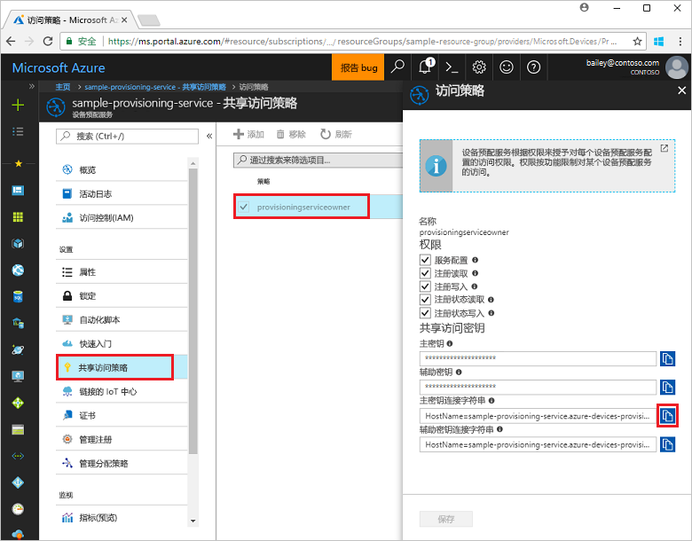
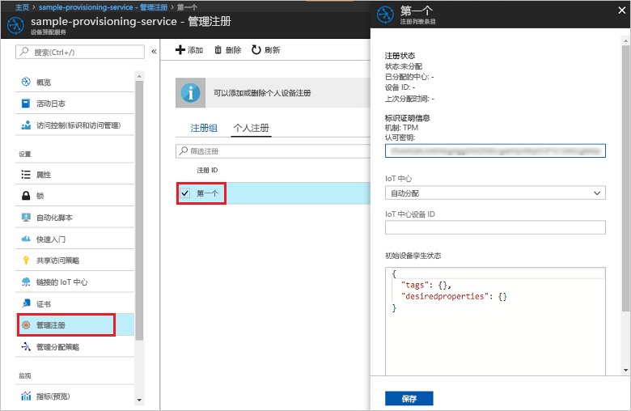

# <a name="enroll-tpm-device-to-iot-hub-device-provisioning-service-using-nodejs-service-sdk"></a>使用 Node.js 服务 SDK 将 TPM 设备注册到 IoT 中心设备预配服务

[!INCLUDE [iot-dps-selector-quick-enroll-device-tpm](../../includes/iot-dps-selector-quick-enroll-device-tpm.md)]


以下步骤演示了如何使用 [Node.js 服务 SDK](https://github.com/Azure/azure-iot-sdk-node) 和示例 Node.js 应用程序，在 Azure IoT 中心设备预配服务中以编程方式为 TPM 设备创建单个注册。 可以通过该单个注册项，选择性地将模拟的 TPM 设备注册到预配服务。 虽然这些步骤在 Windows 和 Linux 计算机上均适用，但在本文中，我们将使用 Windows 开发计算机。

## <a name="prerequisites"></a>先决条件

- 在继续操作之前，请确保完成[通过 Azure 门户设置 IoT 中心设备预配服务](./quick-setup-auto-provision.md)中的步骤。 
-  请确保已在计算机上安装 [Node.js v4.0 或更高版本](https://nodejs.org)。
- 如需在本快速入门教程末尾注册模拟的设备，请执行[创建和预配模拟的设备](quick-create-simulated-device.md)中的步骤，一直到获取设备的认可密钥那一步。 请记下认可密钥，本快速入门教程后面会用到它。 **请勿执行通过 Azure 门户创建单个注册的步骤。**
 
## <a name="create-the-individual-enrollment-sample"></a>创建单个注册示例 

 
1. 在工作文件夹的命令窗口中，运行以下命令：
  
    ```cmd\sh
    npm install azure-iot-provisioning-service
    ```  

2. 使用文本编辑器，在工作文件夹中创建 **create_individual_enrollment.js** 文件。 将以下代码添加到文件并进行保存：

    ```
    'use strict';

    var provisioningServiceClient = require('azure-iot-provisioning-service').ProvisioningServiceClient;

    var serviceClient = provisioningServiceClient.fromConnectionString(process.argv[2]);
    var endorsementKey = process.argv[3];

    var enrollment = {
      registrationId: 'first',
      attestation: {
        type: 'tpm',
        tpm: {
          endorsementKey: endorsementKey
        }
      }
    };

    serviceClient.createOrUpdateIndividualEnrollment(enrollment, function(err, enrollmentResponse) {
      if (err) {
        console.log('error creating the individual enrollment: ' + err);
      } else {
        console.log("enrollment record returned: " + JSON.stringify(enrollmentResponse, null, 2));
      }
    });
    ````

## <a name="run-the-individual-enrollment-sample"></a>运行单个注册示例
  
1. 若要运行示例，需要适用于预配服务的连接字符串。 
    1. 登录到 Azure 门户，单击左侧菜单上的“所有资源”按钮，打开设备预配服务。 
    2. 单击“共享访问策略”，然后单击需要用来打开其属性的访问策略。 在“访问策略”窗口中，复制并记下主密钥连接字符串。 

     


2. 此外还需适用于设备的许可密钥。 如果已按照[创建和预配模拟的设备](quick-create-simulated-device.md)快速入门教程创建模拟的 TPM 设备，请使用为该设备创建的密钥。 否则，若要创建示例性的单个注册，可以使用 SDK 随附的以下许可密钥：

    ```
    AToAAQALAAMAsgAgg3GXZ0SEs/gakMyNRqXXJP1S124GUgtk8qHaGzMUaaoABgCAAEMAEAgAAAAAAAEAxsj2gUScTk1UjuioeTlfGYZrrimExB+bScH75adUMRIi2UOMxG1kw4y+9RW/IVoMl4e620VxZad0ARX2gUqVjYO7KPVt3dyKhZS3dkcvfBisBhP1XH9B33VqHG9SHnbnQXdBUaCgKAfxome8UmBKfe+naTsE5fkvjb/do3/dD6l4sGBwFCnKRdln4XpM03zLpoHFao8zOwt8l/uP3qUIxmCYv9A7m69Ms+5/pCkTu/rK4mRDsfhZ0QLfbzVI6zQFOKF/rwsfBtFeWlWtcuJMKlXdD8TXWElTzgh7JS4qhFzreL0c1mI0GCj+Aws0usZh7dLIVPnlgZcBhgy1SSDQMQ==
    ```

3. 若要为 TPM 设备创建单个注册，请运行以下命令（包括命令参数的引号）：
 
     ```cmd\sh
     node create_individual_enrollment.js "<the connection string for your provisioning service>" "<endorsement key>"
     ```
 
3. 成功创建以后，命令窗口会显示新的单个注册的属性。

     

4. 验证是否已创建单个注册。 在 Azure 门户的设备预配服务摘要边栏选项卡上，选择“管理注册”。 选择“单个注册”选项卡，单击新的注册项 (*first*)，验证认可密钥和该项的其他属性。

     
 
为 TPM 设备创建单个注册以后，如果需要注册模拟的设备，则可继续执行[创建和预配模拟的设备](quick-create-simulated-device.md)中的剩余步骤。 请确保跳过该快速入门中通过 Azure 门户创建单个注册的步骤。

## <a name="clean-up-resources"></a>清理资源
如果打算学习 Node.js 服务示例，请勿清除本快速入门中创建的资源。 如果不打算继续学习，请通过以下步骤删除通过本快速入门创建的所有资源。

1. 关闭计算机上的 Node.js 示例输出窗口。
1. 如果已创建模拟的 TPM 设备，请关闭 TPM 模拟器窗口。
2. 在 Azure 门户中导航到设备预配服务，单击“管理注册”，然后选择“单个注册”选项卡。选择通过本快速入门创建的注册项的“注册 ID”，然后单击边栏选项卡顶部的“删除”按钮。 
 
## <a name="next-steps"></a>后续步骤
本快速入门介绍了如何以编程方式为 TPM 设备创建单个注册项，以及如何选择性地在计算机上创建 TPM 模拟设备，并使用 Azure IoT 中心设备预配服务将其预配到 IoT 中心。 若要深入了解设备预配，请继续学习本教程有关如何在 Azure 门户中进行设备预配服务设置的内容。 
 
> [!div class="nextstepaction"]
> [Azure IoT 中心设备预配服务教程](./tutorial-set-up-cloud.md)