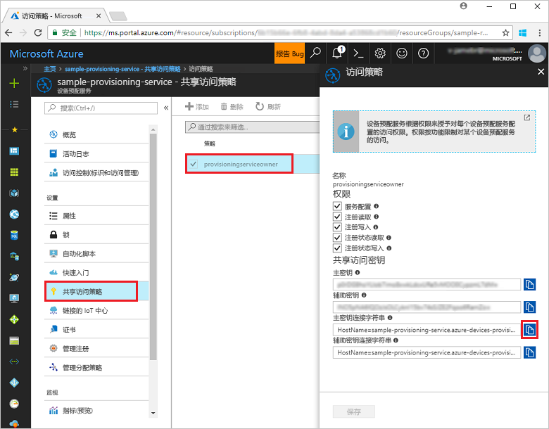
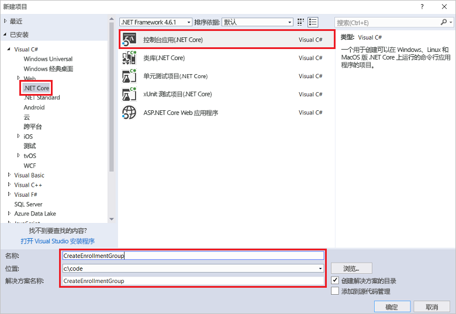
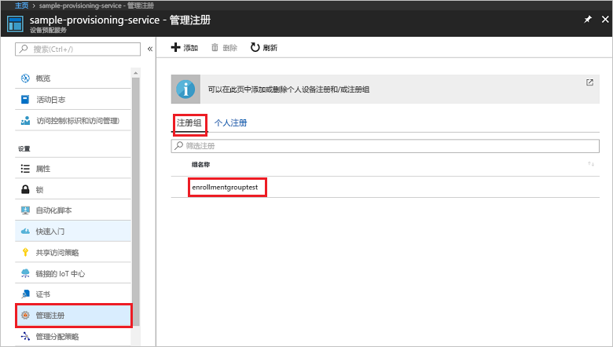

# <a name="enroll-x509-devices-to-iot-hub-device-provisioning-service-using-c-service-sdk"></a>使用 C# 服务 SDK 将 X.509 设备注册到 IoT 中心设备预配服务

[!INCLUDE [iot-dps-selector-quick-enroll-device-x509](../../includes/iot-dps-selector-quick-enroll-device-x509.md)]


以下步骤演示了如何使用 [C# 服务 SDK](https://github.com/Azure/azure-iot-sdk-csharp) 和 C# .NET Core 应用程序示例，以编程方式为中间或根 CA X.509 证书创建注册组。 注册组可以控制对设备的预配服务的访问，此类设备在其证书链中共享常用签名证书。 若要了解详细信息，请参阅[使用 X.509 证书控制设备对预配服务的访问](./concepts-security.md#controlling-device-access-to-the-provisioning-service-with-x509-certificates)。 若要详细了解如何将基于 X.509 证书的公钥基础结构 (PKI) 与 Azure IoT 中心和设备预配服务配合使用，请参阅 [X.509 CA 证书安全概述](https://docs.microsoft.com/azure/iot-hub/iot-hub-x509ca-overview)。 虽然本文中的步骤在 Windows 和 Linux 计算机上均适用，但本文使用 Windows 开发计算机。

## <a name="prepare-the-development-environment"></a>准备开发环境

1. 确保已在计算机上安装 [Visual Studio 2017](https://www.visualstudio.com/vs/)。 
2. 确保已在计算机上安装 [.NET Core SDK](https://www.microsoft.com/net/download/windows)。 
3. 在继续操作之前，请确保完成[通过 Azure 门户设置 IoT 中心设备预配服务](./quick-setup-auto-provision.md)中的步骤。
4. 需要一个 .pem 或 .cer 文件，其中包含的中间或根 CA X.509 证书的公用部分已上传到预配服务并通过该服务进行验证。 [Azure IoT C SDK](https://github.com/Azure/azure-iot-sdk-c) 包含的工具有助于创建 X.509 证书链、从该链上传根证书或中间证书，以及通过服务执行所有权证明操作，对证书进行验证。 若要使用此工具，请将 [azure-iot-sdk-c/tools/CACertificates](https://github.com/Azure/azure-iot-sdk-c/tree/master/tools/CACertificates) 文件夹的内容下载到计算机上的某个工作文件夹，然后按 [azure-iot-sdk-c\tools\CACertificates\CACertificateOverview.md](https://github.com/Azure/azure-iot-sdk-c/blob/master/tools/CACertificates/CACertificateOverview.md) 中的步骤操作。 除了 C SDK 中的工具，还可以使用 **C# 服务 SDK** 中的[组证书验证示例](https://github.com/Azure/azure-iot-sdk-csharp/tree/master/provisioning/service/samples/GroupCertificateVerificationSample)，通过现有的 X.509 中间或根 CA 证书演示如何执行所有权证明操作。 

  > [!IMPORTANT]
  > 根据设计，使用 SDK 工具创建的证书只能用于开发。 若要了解如何获取适用于生产代码的证书，请参阅 Azure IoT 中心文档中的[如何获取 X.509 CA 证书](https://docs.microsoft.com/azure/iot-hub/iot-hub-x509ca-overview#how-to-get-an-x509-ca-certificate)。

## <a name="get-the-connection-string-for-your-provisioning-service"></a>获取适用于预配服务的连接字符串

对于本快速入门中的示例，需要适用于预配服务的连接字符串。
1. 登录到 Azure 门户，单击左侧菜单上的“所有资源”按钮，打开设备预配服务。 
2. 单击“共享访问策略”，然后单击需要用来打开其属性的访问策略。 在“访问策略”窗口中，复制并记下主密钥连接字符串。 

    

## <a name="create-the-enrollment-group-sample"></a>创建注册组示例 

此部分的步骤演示如何创建一个 .NET Core 控制台应用，以便向预配服务添加注册组。 进行一些修改后，还可以按这些步骤创建 [Windows IoT Core](https://developer.microsoft.com/en-us/windows/iot) 控制台应用，以便添加注册组。 若要详细了解如何使用 IoT Core 进行开发，请参阅 [Windows IoT Core developer documentation](https://docs.microsoft.com/windows/iot-core/)（Windows IoT Core 开发人员文档）。
1. 在 Visual Studio 中，使用“控制台应用(.NET Core)”项目模板将 Visual C# .NET Core 控制台应用项目添加到新解决方案。 确保 .NET Framework 版本为 4.5.1 或更高。 将项目命名为 **CreateEnrollmentGroup**。

    

2. 在解决方案资源管理器中，右键单击“CreateEnrollmentGroup”项目，然后单击“管理 NuGet 包”。
3. 在“NuGet 包管理器”窗口中，选择“浏览”，搜索 **Microsoft.Azure.Devices.Provisioning.Service**，选择“安装”以安装 **Microsoft.Azure.Devices.Provisioning.Service** 包，然后接受使用条款。 此过程会下载、安装 [Azure IoT 预配服务客户端 SDK](https://www.nuget.org/packages/Microsoft.Azure.Devices.Provisioning.Service/) NuGet 包及其依赖项并添加对它的引用。

    

4. 在 **Program.cs** 文件顶部其他 `using` 语句之后添加以下 `using` 语句：
   
   ```csharp
   using System.Security.Cryptography.X509Certificates;
   using System.Threading.Tasks;
   using Microsoft.Azure.Devices.Provisioning.Service;
   ```
    
5. 将以下字段添加到 **Program** 类。  
   - 将 **ProvisioningConnectionString** 占位符值替换为需要为其创建注册的预配服务的连接字符串。
   - 将 **X509RootCertPath** 占位符值替换为 .pem 或 .cer 文件的路径，该路径代表中间或根 CA X.509 证书的公用部分，而该证书此前已通过预配服务上传和验证。
   - 也可选择性地更改 **EnrollmentGroupId** 值。 字符串只能包含小写字符和连字符。 

   > [!IMPORTANT]
   > 在生产代码中，请注意以下安全注意事项：
   >
   > - 为预配服务管理员硬编码连接字符串不符合安全最佳做法。 与硬编码相反，连接字符串应采用安全方式进行存储，例如存储在安全配置文件或注册表中。
   > - 确保只上传签名证书的公用部分。 不要将包含私钥的 .pfx (PKCS12) 或 .pem 文件上传到预配服务。
        
   ```csharp
   private static string ProvisioningConnectionString = "{Your provisioning service connection string}";
   private static string EnrollmentGroupId = "enrollmentgrouptest";
   private static string X509RootCertPath = @"{Path to a .cer or .pem file for a verified root CA or intermediate CA X.509 certificate}";
   ```
    
6. 将以下方法添加到 **Program** 类。 此代码创建一个注册组条目，然后调用 **ProvisioningServiceClient** 上的 **CreateOrUpdateEnrollmentGroupAsync** 方法，将注册组添加到预配服务。
   
   ```csharp
   public static async Task RunSample()
   {
       Console.WriteLine("Starting sample...");
 
       using (ProvisioningServiceClient provisioningServiceClient =
               ProvisioningServiceClient.CreateFromConnectionString(ProvisioningConnectionString))
       {
           #region Create a new enrollmentGroup config
           Console.WriteLine("\nCreating a new enrollmentGroup...");
           var certificate = new X509Certificate2(X509RootCertPath);
           Attestation attestation = X509Attestation.CreateFromRootCertificates(certificate);
           EnrollmentGroup enrollmentGroup =
                   new EnrollmentGroup(
                           EnrollmentGroupId,
                           attestation)
                   {
                       ProvisioningStatus = ProvisioningStatus.Enabled
                   };
           Console.WriteLine(enrollmentGroup);
           #endregion
 
           #region Create the enrollmentGroup
           Console.WriteLine("\nAdding new enrollmentGroup...");
           EnrollmentGroup enrollmentGroupResult =
               await provisioningServiceClient.CreateOrUpdateEnrollmentGroupAsync(enrollmentGroup).ConfigureAwait(false);
           Console.WriteLine("\nEnrollmentGroup created with success.");
           Console.WriteLine(enrollmentGroupResult);
           #endregion
 
       }
   }
   ```

7. 最后，将 **Main** 方法的主体替换为以下行：
   
   ```csharp
   RunSample().GetAwaiter().GetResult();
   Console.WriteLine("\nHit <Enter> to exit ...");
   Console.ReadLine();
   ```
        
8. 生成解决方案。

## <a name="run-the-enrollment-group-sample"></a>运行注册组示例
  
1. 运行 Visual Studio 中的示例，创建注册组。
 
2. 成功创建以后，命令窗口会显示新的注册组的属性。

    

3. 若要验证注册组是否已创建，请在 Azure 门户的设备预配服务摘要边栏选项卡中选择“管理注册”，然后选择“注册组”选项卡。此时会看到一个新的注册条目，对应于示例中使用的注册 ID。 单击该条目即可验证证书指纹以及该条目的其他属性。

    
 
## <a name="clean-up-resources"></a>清理资源
如果打算学习 C# 服务示例，请勿清理本快速入门中创建的资源。 如果不打算继续学习，请通过以下步骤删除通过本快速入门创建的所有资源。

1. 关闭计算机上的 C# 示例输出窗口。
2. 在 Azure 门户中导航到设备预配服务，单击“管理注册”，然后选择“注册组”选项卡。选择通过本快速入门创建的注册项的“注册 ID”，然后单击边栏选项卡顶部的“删除”按钮。  
3. 在 Azure 门户的设备预配服务中单击“证书”，然后单击为本快速入门上传的证书，再单击“证书详细信息”窗口顶部的“删除”按钮。  
 
## <a name="next-steps"></a>后续步骤
本快速入门介绍了如何使用 Azure IoT 中心设备预配服务为 X.509 中间或根 CA 证书创建注册组。 若要深入了解设备预配，请继续学习本教程有关如何在 Azure 门户中进行设备预配服务设置的内容。 
 
> [!div class="nextstepaction"]
> [Azure IoT 中心设备预配服务教程](./tutorial-set-up-cloud.md)
