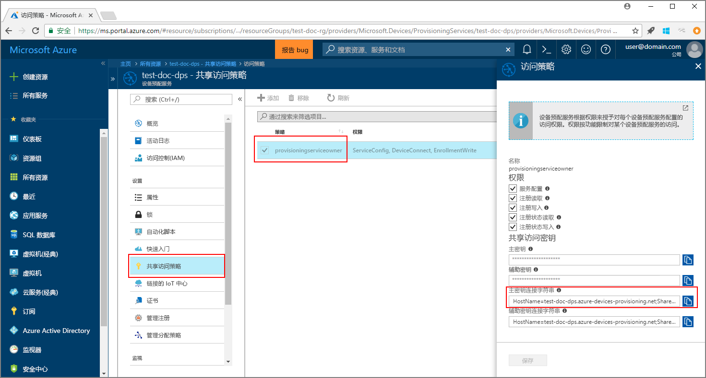

# <a name="enroll-x509-devices-to-iot-hub-device-provisioning-service-using-java-service-sdk"></a>使用 Java 服务 SDK 将 X.509 设备注册到 IoT 中心设备预配服务

[!INCLUDE [iot-dps-selector-quick-enroll-device-x509](../../includes/iot-dps-selector-quick-enroll-device-x509.md)]

以下步骤借助一个示例 Java 应用程序，演示了如何使用 [Java 服务 SDK](https://azure.github.io/azure-iot-sdk-java/service/) 通过编程方式将一组 X.509 模拟设备注册到 Azure IoT 中心设备预配服务。 虽然 Java 服务 SDK 在 Windows 和 Linux 计算机上均适用，但本文使用 Windows 开发计算机来演示注册过程。

在继续操作之前，请确保[通过 Azure 门户设置 IoT 中心设备预配服务](./quick-setup-auto-provision.md)。

<a id="setupdevbox"></a>

## <a name="prepare-the-development-environment"></a>准备开发环境 

1. 确保已在计算机上安装 [Java SE 开发工具包 8](http://www.oracle.com/technetwork/java/javase/downloads/jdk8-downloads-2133151.html)。 

2. 设置 Java 安装的环境变量。 `PATH` 变量应包括 *jdk1.8.x\bin* 目录的完整路径。 如果这是计算机的首次 Java 安装，则请创建名为 `JAVA_HOME` 的新的环境变量，将其指向 *jdk1.8.x* 目录的完整路径。 在 Windows 计算机上，该目录通常位于 *C:\\Program Files\\Java\\* 文件夹中。可以通过在 Windows 计算机的“控制面板”上搜索“编辑系统环境变量”来创建或编辑环境变量。 

  可以在命令窗口中运行以下命令，查看 Java 是否已成功安装在计算机上：

    ```cmd\sh
    java -version
    ```

3. 将 [Maven 3](https://maven.apache.org/download.cgi) 下载并解压缩到计算机上。 

4. 编辑环境变量 `PATH`，使之指向 Maven 解压缩时所在文件夹中的 *apache-maven-3.x.x\\bin* 文件夹。 可以在命令窗口中运行以下命令，确认 Maven 已成功安装：

    ```cmd\sh
    mvn --version
    ```

5. 确保在计算机上安装 [git](https://git-scm.com/download/) 并将其添加到环境变量 `PATH`。 


<a id="javasample"></a>

## <a name="download-and-modify-the-java-sample-code"></a>下载并修改 Java 示例代码

此部分演示如何向示例代码添加 X.509 设备的预配详细信息。 

1. 打开命令提示符。 使用 Java 服务 SDK 克隆设备注册代码示例的 GitHub 存储库：
    
    ```cmd\sh
    git clone https://github.com/Azure/azure-iot-sdk-java.git --recursive
    ```

2. 在下载的源代码中，导航到示例文件夹 **_azure-iot-sdk-java/provisioning/provisioning-samples/service-enrollment-group-sample_**。 在所选编辑器中打开文件 **_/src/main/java/samples/com/microsoft/azure/sdk/iot/ServiceEnrollmentGroupSample.java_**，添加以下详细信息：

    1. 在门户中为预配服务添加 `[Provisioning Connection String]`，如下所示：
        1. 在 [Azure 门户](https://portal.azure.com)中导航到预配服务。 
        2. 打开“共享访问策略”，选择具有 *EnrollmentWrite* 权限的策略。
        3. 复制“主密钥连接字符串”。 

              

        4. 在示例代码文件 **_ServiceEnrollmentGroupSample.java_** 中，将 `[Provisioning Connection String]` 替换为“主密钥连接字符串”。

            ```Java
            private static final String PROVISIONING_CONNECTION_STRING = "[Provisioning Connection String]";
            ```

    2. 添加此组设备的根证书。 如需示例根证书，请使用 _X.509 证书生成器_工具，如下所示：
        1. 在命令窗口中，导航到文件夹 **_azure-iot-sdk-java/provisioning/provisioning-tools/provisioning-x509-cert-generator_**。
        2. 通过运行以下命令来生成工具：

                ```cmd\sh
                mvn clean install
                ```

        4. 使用以下命令来运行工具：

                ```cmd\sh
                cd target
                java -jar ./provisioning-x509-cert-generator-{version}-with-deps.jar
                ```

        5. 出现提示时，可以选择性地为证书输入“公用名称”。
        6. 此工具在本地生成“客户端证书”、“客户端证书私钥”和“根证书”。
        7. 复制“根证书”，包括 **_-----BEGIN CERTIFICATE-----_** 行和 **_-----END CERTIFICATE-----_** 行。 
        8. 将“根证书”的值指定给参数 **PUBLIC_KEY_CERTIFICATE_STRING**，如下所示：

                ```Java
                private static final String PUBLIC_KEY_CERTIFICATE_STRING =
                        "-----BEGIN CERTIFICATE-----\n" +
                        "XXXXXXXXXXXXXXXXXXXXXXXXXXXXXXXXXXXXXXXXXXXXXXXXXXXXXXXXXXXXXXXX\n" +
                        "XXXXXXXXXXXXXXXXXXXXXXXXXXXXXXXXXXXXXXXXXXXXXXXXXXXXXXXXXXXXXXXX\n" +
                        "XXXXXXXXXXXXXXXXXXXXXXXXXXXXXXXXXXXXXXXXXXXXXXXXXXXXXXXXXXXXXXXX\n" +
                        "XXXXXXXXXXXXXXXXXXXXXXXXXXXXXXXXXXXXXXXXXXXXXXXXXXXXXXXXXXXXXXXX\n" +
                        "XXXXXXXXXXXXXXXXXXXXXXXXXXXXXXXXXXXXXXXXXXXXXXXXXXXXXXXXXXXXXXXX\n" +
                        "XXXXXXXXXXXXXXXXXXXXXXXXXXXXXXXXXXXXXXXXXXXXXXXXXXXXXXXXXXXXXXXX\n" +
                        "XXXXXXXXXXXXXXXXXXXXXXXXXXXXXXXXXXXXXXXXXXXXXXXXXXXXXXXXXXXXXXXX\n" +
                        "XXXXXXXXXXXXXXXXXXXXXXXXXXXXXXXXXXXXXXXXXXXXXXXXXXXXXXXXXXXXXXXX\n" +
                        "XXXXXXXXXXXXXXXXXXXXXXXXXXXXXXXXXXXXXXXXXXXXXXXXXXXXXXXXXXXXXXXX\n" +
                        "XXXXXXXXXXXXXXXXXXXXXXXXXXXXXXXXXXXXXXXXXXXXXXXXXXXXXXXXXXXXXXXX\n" +
                        "-----END CERTIFICATE-----\n";
                ```

        9. 关闭命令窗口，或者在系统提示输入“验证码”时输入 。 
 
    3. 也可选择通过示例代码配置预配服务：
        - 若要将此配置添加到示例，请执行以下步骤：
            1. 在 [Azure 门户](https://portal.azure.com)中导航到已链接到预配服务的 IoT 中心。 打开中心的“概览”选项卡，复制“主机名”。 将该“主机名”指定给 *IOTHUB_HOST_NAME* 参数。

                ```Java
                private static final String IOTHUB_HOST_NAME = "[Host name].azure-devices.net";
                ```
            2. 为 *DEVICE_ID* 参数指定一个友好名称，并保留 *PROVISIONING_STATUS* 的默认值 *ENABLED*。 

        - 或者，如果选择不配置预配服务，请确保注释掉或删除 _ServiceEnrollmentGroupSample.java_ 文件中的以下语句：

            ```Java
            enrollmentGroup.setIotHubHostName(IOTHUB_HOST_NAME);                // Optional parameter.
            enrollmentGroup.setProvisioningStatus(ProvisioningStatus.ENABLED);  // Optional parameter.
            ```

    4. 研究示例代码。 此代码用于创建、更新、查询和删除 X.509 设备的组注册。 若要验证是否已在门户中成功注册，请暂时性地注释掉 _ServiceEnrollmentGroupSample.java_ 文件末尾的以下代码行：

        ```Java
        // ************************************** Delete info of enrollmentGroup ***************************************
        System.out.println("\nDelete the enrollmentGroup...");
        provisioningServiceClient.deleteEnrollmentGroup(enrollmentGroupId);
        ```

    5. 保存 _ServiceEnrollmentGroupSample.java_ 文件。 
 

<a id="runjavasample"></a>

## <a name="build-and-run-sample-group-enrollment"></a>生成并运行示例组注册

1. 打开命令窗口，导航到文件夹 **_azure-iot-sdk-java/provisioning/provisioning-samples/service-enrollment-group-sample_**。

2. 使用以下命令生成示例代码：

    ```cmd\sh
    mvn install -DskipTests
    ```

   此命令将 Maven 包 [`com.microsoft.azure.sdk.iot.provisioning.service`](https://www.mvnrepository.com/artifact/com.microsoft.azure.sdk.iot.provisioning/provisioning-service-client) 下载到计算机。 此包包括示例代码需要生成的适用于 Java 服务 SDK 的二进制文件。 如果在上一部分运行了 _X.509 证书生成器_工具，则此包已下载到计算机上。 

3. 运行示例，方法是在命令窗口使用以下命令：

    ```cmd\sh
    cd target
    java -jar ./service-enrollment-group-sample-{version}-with-deps.jar
    ```

4. 在成功注册后观察输出窗口。

5. 在 Azure 门户中导航到预配服务。 单击“管理注册”。 请注意，X.509 设备组显示在“注册组”选项卡下，带有自动生成的“组名称”。 

      

## <a name="modifications-to-enroll-a-single-x509-device"></a>注册单个 X.509 设备所需的修改

若要注册单个 X.509 设备，请修改[使用 Java 服务 SDK 将 TPM 设备注册到 IoT 中心设备预配服务](quick-enroll-device-tpm-java.md#javasample)一文中使用的单个注册示例代码，如下所示：

1. 将 X.509 客户端证书的“公用名称”复制到剪贴板。 如果希望使用[上一示例代码部分](#javasample)所示的 X.509 证书生成器工具，请输入证书的“公用名称”，或者使用默认的 **microsoftriotcore**。 将该“公用名称”用作 *REGISTRATION_ID* 变量的值。 

    ```Java
    // Use common name of your X.509 client certificate
    private static final String REGISTRATION_ID = "[RegistrationId]";
    ```

2. 将变量 *TPM_ENDORSEMENT_KEY* 重命名为 *PUBLIC_KEY_CERTIFICATE_STRING*。 复制你的客户端证书或者“X.509 证书生成器”工具的输出中的“客户端证书”，作为 *PUBLIC_KEY_CERTIFICATE_STRING* 变量的值。 

    ```Java
    // Rename the variable *TPM_ENDORSEMENT_KEY* as *PUBLIC_KEY_CERTIFICATE_STRING*
    private static final String PUBLIC_KEY_CERTIFICATE_STRING =
            "-----BEGIN CERTIFICATE-----\n" +
            "XXXXXXXXXXXXXXXXXXXXXXXXXXXXXXXXXXXXXXXXXXXXXXXXXXXXXXXXXXXXXXXX\n" +
            "XXXXXXXXXXXXXXXXXXXXXXXXXXXXXXXXXXXXXXXXXXXXXXXXXXXXXXXXXXXXXXXX\n" +
            "XXXXXXXXXXXXXXXXXXXXXXXXXXXXXXXXXXXXXXXXXXXXXXXXXXXXXXXXXXXXXXXX\n" +
            "XXXXXXXXXXXXXXXXXXXXXXXXXXXXXXXXXXXXXXXXXXXXXXXXXXXXXXXXXXXXXXXX\n" +
            "XXXXXXXXXXXXXXXXXXXXXXXXXXXXXXXXXXXXXXXXXXXXXXXXXXXXXXXXXXXXXXXX\n" +
            "XXXXXXXXXXXXXXXXXXXXXXXXXXXXXXXXXXXXXXXXXXXXXXXXXXXXXXXXXXXXXXXX\n" +
            "XXXXXXXXXXXXXXXXXXXXXXXXXXXXXXXXXXXXXXXXXXXXXXXXXXXXXXXXXXXXXXXX\n" +
            "XXXXXXXXXXXXXXXXXXXXXXXXXXXXXXXXXXXXXXXXXXXXXXXXXXXXXXXXXXXXXXXX\n" +
            "XXXXXXXXXXXXXXXXXXXXXXXXXXXXXXXXXXXXXXXXXXXXXXXXXXXXXXXXXXXXXXXX\n" +
            "XXXXXXXXXXXXXXXXXXXXXXXXXXXXXXXXXXXXXXXXXXXXXXXXXXXXXXXXXXXXXXXX\n" +
            "-----END CERTIFICATE-----\n";
    ```
3. 在 **main** 函数中，将 `Attestation attestation = new TpmAttestation(TPM_ENDORSEMENT_KEY);` 行替换为以下内容，以便使用 X.509 客户端证书：
    ```Java
    Attestation attestation = X509Attestation.createFromClientCertificates(PUBLIC_KEY_CERTIFICATE_STRING);
    ```

4. 使用[生成并运行单个注册的示例代码](quick-enroll-device-tpm-java.md#runjavasample)部分的步骤保存、生成和运行单个注册示例文件。


## <a name="clean-up-resources"></a>清理资源
如果打算学习 Java 服务示例，请勿清除本快速入门中创建的资源。 如果不打算继续学习，请通过以下步骤删除通过本快速入门创建的所有资源。

1. 关闭计算机上的 Java 示例输出窗口。
1. 关闭计算机上的“X509 证书生成器”窗口。
1. 在 Azure 门户中导航到设备预配服务，单击“管理注册”，然后选择“注册组”选项卡。选择通过本快速入门注册的 X.509 设备的“组名称”，然后单击边栏选项卡顶部的“删除”按钮。  

## <a name="next-steps"></a>后续步骤
在本快速入门中，你将模拟的 X.509 设备组注册到了设备预配服务。 若要深入了解设备预配，请继续学习本教程有关如何在 Azure 门户中进行设备预配服务设置的内容。 

> [!div class="nextstepaction"]
> [Azure IoT 中心设备预配服务教程](./tutorial-set-up-cloud.md)
