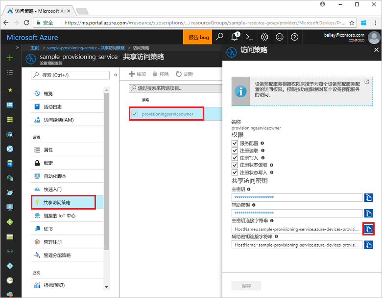
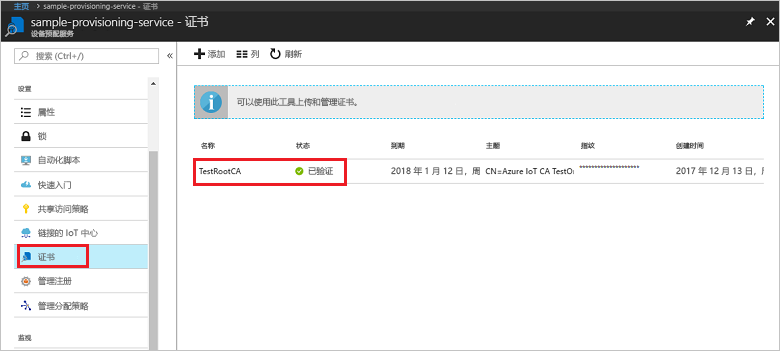
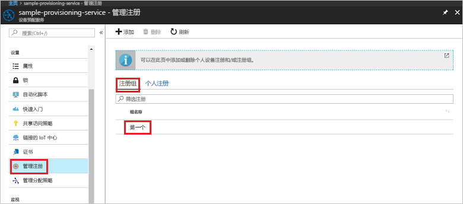

# <a name="quickstart-enroll-x509-devices-to-the-device-provisioning-service-using-nodejs"></a>快速入门：使用 Node.js 将 X.509 设备注册到设备预配服务

[!INCLUDE [iot-dps-selector-quick-enroll-device-x509](../../includes/iot-dps-selector-quick-enroll-device-x509.md)]

本快速入门展示了如何使用 Node.js 以编程方式创建使用中间或根 CA X.509 证书的[注册组](concepts-service.md#enrollment-group)。 该注册组是使用 [IoT SDK for Node.js](https://github.com/Azure/azure-iot-sdk-node) 和一个示例 Node.js 应用程序创建的。 注册组可以控制对设备的预配服务的访问，此类设备在其证书链中共享常用签名证书。 若要了解详细信息，请参阅[使用 X.509 证书控制设备对预配服务的访问](./concepts-security.md#controlling-device-access-to-the-provisioning-service-with-x509-certificates)。 若要详细了解如何将基于 X.509 证书的公钥基础结构 (PKI) 与 Azure IoT 中心和设备预配服务配合使用，请参阅 [X.509 CA 证书安全概述](https://docs.microsoft.com/azure/iot-hub/iot-hub-x509ca-overview)。 

本快速入门假设你已创建了 IoT 中心和设备预配服务实例。 如果尚未创建这些资源，请先完成[使用 Azure 门户设置 IoT 中心设备预配服务](./quick-setup-auto-provision.md)快速入门，然后再继续学习本文。

虽然本文中的步骤在 Windows 和 Linux 计算机上均适用，但本文是针对 Windows 开发计算机编写的。

[!INCLUDE [quickstarts-free-trial-note](../../includes/quickstarts-free-trial-note.md)]


## <a name="prerequisites"></a>先决条件

- 安装 [Node.js v4.0 或更高版本](https://nodejs.org)。
- 安装 [Git](https://git-scm.com/download/)。


## <a name="prepare-test-certificates"></a>准备测试证书

对于本快速入门，必须具有一个包含中间或根 CA X.509 证书的公共部分的 .pem 或.cer 文件。 此证书必须上传到预配服务，并由该服务进行验证。 

[Azure IoT C SDK](https://github.com/Azure/azure-iot-sdk-c) 包含的测试工具可以帮助你创建 X.509 证书链、从该链上传根证书或中间证书，以及通过服务执行所有权证明操作，对证书进行验证。 根据设计，使用 SDK 工具创建的证书只能用于**开发测试**。 这些证书**不得在生产环境中使用**。 它们包含硬编码的密码（“1234”），在 30 天后过期。 若要了解如何获取适用于生产用途的证书，请参阅 Azure IoT 中心文档中的[如何获取 X.509 CA 证书](https://docs.microsoft.com/azure/iot-hub/iot-hub-x509ca-overview#how-to-get-an-x509-ca-certificate)。

若要使用此测试工具来生成证书，请执行以下步骤： 
 
1. 打开命令提示符或 Git Bash shell，并切换到计算机上的某个工作文件夹。 执行以下命令克隆 [Azure IoT C SDK](https://github.com/Azure/azure-iot-sdk-c) GitHub 存储库：
    
  ```cmd/sh
  git clone https://github.com/Azure/azure-iot-sdk-c.git --recursive
  ```

  此存储库的大小目前大约为 220 MB。 应该预料到此操作需要几分钟才能完成。

  测试工具位于你克隆的存储库的 *azure-iot-sdk-c/tools/CACertificates* 中。    

2. 根据[管理示例和教程的测试 CA 证书](https://github.com/Azure/azure-iot-sdk-c/blob/master/tools/CACertificates/CACertificateOverview.md)中的步骤进行操作。 


## <a name="create-the-enrollment-group-sample"></a>创建注册组示例 

 
1. 在工作文件夹的命令窗口中，运行以下命令：
  
     ```cmd\sh
     npm install azure-iot-provisioning-service
     ```  

2. 使用文本编辑器，在工作文件夹中创建 **create_enrollment_group.js** 文件。 将以下代码添加到文件并进行保存：

    ```
    'use strict';
    var fs = require('fs');

    var provisioningServiceClient = require('azure-iot-provisioning-service').ProvisioningServiceClient;

    var serviceClient = provisioningServiceClient.fromConnectionString(process.argv[2]);

    var enrollment = {
      enrollmentGroupId: 'first',
      attestation: {
        type: 'x509',
        x509: {
          signingCertificates: {
            primary: {
              certificate: fs.readFileSync(process.argv[3], 'utf-8').toString()
            }
          }
        }
      },
      provisioningStatus: 'disabled'
    };

    serviceClient.createOrUpdateEnrollmentGroup(enrollment, function(err, enrollmentResponse) {
      if (err) {
        console.log('error creating the group enrollment: ' + err);
      } else {
        console.log("enrollment record returned: " + JSON.stringify(enrollmentResponse, null, 2));
        enrollmentResponse.provisioningStatus = 'enabled';
        serviceClient.createOrUpdateEnrollmentGroup(enrollmentResponse, function(err, enrollmentResponse) {
          if (err) {
            console.log('error updating the group enrollment: ' + err);
          } else {
            console.log("updated enrollment record returned: " + JSON.stringify(enrollmentResponse, null, 2));
          }
        });
      }
    });
    ````

## <a name="run-the-enrollment-group-sample"></a>运行注册组示例
 
1. 若要运行示例，需要适用于预配服务的连接字符串。 
    1. 登录到 Azure 门户，单击左侧菜单上的“所有资源”按钮，打开设备预配服务。 
    2. 单击“共享访问策略”，然后单击需要用来打开其属性的访问策略。 在“访问策略”窗口中，复制并记下主密钥连接字符串。 

     


3. 如[准备测试证书](quick-enroll-device-x509-node.md#prepare-test-certificates)中所述，还需要一个 .pem 文件，其中包含的 X.509 中间或根 CA 证书此前已上传并通过预配服务进行验证。 若要查看证书是否已上传并验证，请在 Azure 门户的设备预配服务摘要页中单击“证书”。 找到要用于组注册的证书，确保其状态值为“已验证”。

     

1. 若要为证书创建注册组，请运行以下命令（包括命令参数的引号）：
 
     ```cmd\sh
     node create_enrollment_group.js "<the connection string for your provisioning service>" "<your certificate's .pem file>"
     ```
 
3. 成功创建以后，命令窗口会显示新的注册组的属性。

     

4. 验证注册组是否已创建。 在 Azure 门户的设备预配服务摘要边栏选项卡上，选择“管理注册”。 选择“注册组”选项卡，验证新注册项 (*first*) 是否存在。

     
 
## <a name="clean-up-resources"></a>清理资源
如果打算学习 Node.js 服务示例，请勿清除本快速入门中创建的资源。 如果不打算继续学习，请通过以下步骤删除通过本快速入门创建的所有 Azure 资源。
 
1. 关闭计算机上的 Node.js 示例输出窗口。
2. 在 Azure 门户中导航到设备预配服务，单击“管理注册”，然后选择“注册组”选项卡。选择通过本快速入门创建的注册项的“注册 ID”，然后单击边栏选项卡顶部的“删除”按钮。  
3. 在 Azure 门户的设备预配服务中单击“证书”，然后单击为本快速入门上传的证书，再单击“证书详细信息”窗口顶部的“删除”按钮。  
 
## <a name="next-steps"></a>后续步骤
本快速入门介绍了如何使用 Azure IoT 中心设备预配服务为 X.509 中间或根 CA 证书创建组注册。 若要深入了解设备预配，请继续学习本教程有关如何在 Azure 门户中进行设备预配服务设置的内容。 
 
> [!div class="nextstepaction"]
> [Azure IoT 中心设备预配服务教程](./tutorial-set-up-cloud.md)