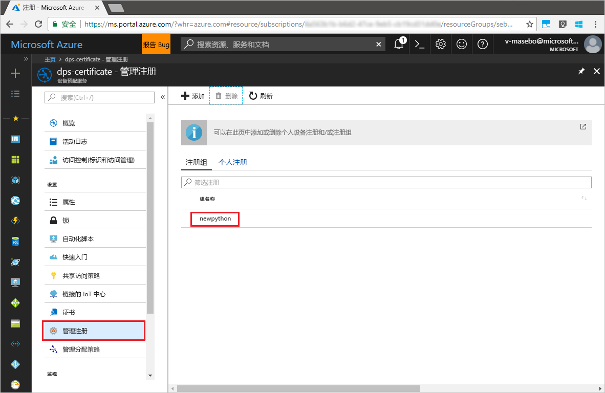

# <a name="enroll-x509-devices-to-iot-hub-device-provisioning-service-using-python-provisioning-service-sdk"></a>使用 Python 预配服务 SDK 将 X.509 设备注册到 IoT 中心设备预配服务
[!INCLUDE [iot-dps-selector-quick-enroll-device-x509](../../includes/iot-dps-selector-quick-enroll-device-x509.md)]

以下步骤借助一个示例 Python 应用程序，演示了如何使用 [Python 预配服务 SDK](https://github.com/Azure/azure-iot-sdk-python/tree/master/provisioning_service_client) 通过编程方式将一组 X.509 模拟设备注册到 Azure IoT 中心设备预配服务。 虽然 Java 服务 SDK 在 Windows 和 Linux 计算机上均适用，但本文使用 Windows 开发计算机来演示注册过程。

在继续操作之前，请确保[通过 Azure 门户设置 IoT 中心设备预配服务](./quick-setup-auto-provision.md)。

> [!NOTE]
> 本快速入门仅支持**注册组**。 通过 _Python 预配服务 SDK_ 进行的**单个注册**是正在进行的工作。
> 

<a id="prepareenvironment"></a>

## <a name="prepare-the-environment"></a>准备环境 

1. 下载并安装 [Python 2.x 或 3.x](https://www.python.org/downloads/)。 请确保根据安装程序的要求，使用 32 位或 64 位安装。 在安装过程中出现提示时，请确保将 Python 添加到特定于平台的环境变量中。 

1. 选择以下选项之一：

    - 生成并编译 **Azure IoT Python SDK**。 按照[这些说明](https://github.com/Azure/azure-iot-sdk-python/blob/master/doc/python-devbox-setup.md)生成 Python 包。 如果使用 Windows OS，则另请安装 [Visual C++ 可再发行组件包](http://www.microsoft.com/download/confirmation.aspx?id=48145)，以便使用 Python 中的本机 DLL。

    - [安装或升级 *pip*（Python 包管理系统）](https://pip.pypa.io/en/stable/installing/)，然后通过以下命令安装该包：

        ```cmd/sh
        pip install azure-iothub-provisioningserviceclient
        ```

1. 需要一个 .pem 文件，其中包含的中间的或根的 CA X.509 证书已上传到预配服务并通过该服务进行验证。 **Azure IoT C SDK** 包含的工具有助于创建 X.509 证书链、从该链上传根证书或中间证书，以及通过服务执行所有权证明操作，对证书进行验证。 若要使用该工具，请在计算机上克隆 [Azure IoT C SDK](https://github.com/Azure/azure-iot-sdk-c) 并按 [azure-iot-sdk-c\tools\CACertificates\CACertificateOverview.md](https://github.com/Azure/azure-iot-sdk-c/blob/master/tools/CACertificates/CACertificateOverview.md) 中的步骤操作。


## <a name="modify-the-python-sample-code"></a>修改 Python 示例代码

此部分演示如何向示例代码添加 X.509 设备的预配详细信息。 

1. 使用文本编辑器，新建一个 **EnrollmentGroup.py** 文件。

1. 在 **EnrollmentGroup.py** 文件的开头添加以下 `import` 语句和变量： 然后，将 `dpsConnectionString` 替换为你的连接字符串，该字符串位于 **Azure 门户**的**设备预配服务**的“共享访问策略”下。 将证书占位符替换为此前在[准备环境](quick-enroll-device-x509-python.md#prepareenvironment)中创建的证书。 最后，创建唯一的 `registrationid`，确保其只包含小写字母数字和连字符。  
   
    ```python
    from provisioningserviceclient import ProvisioningServiceClient
    from provisioningserviceclient.models import EnrollmentGroup, AttestationMechanism

    CONNECTION_STRING = "{dpsConnectionString}"

    SIGNING_CERT = """-----BEGIN CERTIFICATE-----
    XXXXXXXXXXXXXXXXXXXXXXXXXXXXXXXXXXXXXXXXXXXXXXXXXXXXXXXXXXXXXXXX
    XXXXXXXXXXXXXXXXXXXXXXXXXXXXXXXXXXXXXXXXXXXXXXXXXXXXXXXXXXXXXXXX
    XXXXXXXXXXXXXXXXXXXXXXXXXXXXXXXXXXXXXXXXXXXXXXXXXXXXXXXXXXXXXXXX
    XXXXXXXXXXXXXXXXXXXXXXXXXXXXXXXXXXXXXXXXXXXXXXXXXXXXXXXXXXXXXXXX
    XXXXXXXXXXXXXXXXXXXXXXXXXXXXXXXXXXXXXXXXXXXXXXXXXXXXXXXXXXXXXXXX
    XXXXXXXXXXXXXXXXXXXXXXXXXXXXXXXXXXXXXXXXXXXXXXXXXXXXXXXXXXXXXXXX
    XXXXXXXXXXXXXXXXXXXXXXXXXXXXXXXXXXXXXXXXXXXXXXXXXXXXXXXXXXXXXXXX
    XXXXXXXXXXXXXXXXXXXXXXXXXXXXXXXXXXXXXXXXXXXXXXXXXXXXXXXXXXXXXXXX
    XXXXXXXXXXXXXXXXXXXXXXXXXXXXXXXXXXXXXXXXXXXXXXXXXXXXXXXXXXXXXXXX
    XXXXXXXXXXXXXXXXXXXXXXXXXXXXXXXXXXXXXXXXXXXXXXXXXXXXXXXXXXXXXXXX
    XXXXXXXXXXXXXXXXXXXXXXXXXXXXXXXXXXXXXXXXXXXXXXXXXXXXXXXXXXXXXXXX
    XXXXXXXXXXXXXXXXXXXXXXXXXXXXXXXXXXXXXXXXXXXXXXXXXXXXXXXXXXXXXXXX
    XXXXXXXXXXXXXXXXXXXXXXXXXXXXXXXXXXXXXXXXXXXXXXXXXXXXXXXXXXXXXXXX
    XXXXXXXXXXXXXXXXXXXXXXXXXXXXXXXXXXXXXXXXXXXXXXXXXXXXXXXXXXXXXXXX
    XXXXXXXXXXXXXXXXXXXXXXXXXXXXXXXXXXXXXXXXXXXXXXXXXXXXXXXX
    -----END CERTIFICATE-----"""

    GROUP_ID = "{registrationid}"
    ```

1. 添加以下函数和函数调用，以便执行组注册创建操作：
   
    ```python
    def main():
        print ( "Initiating enrollment group creation..." )

        psc = ProvisioningServiceClient.create_from_connection_string(CONNECTION_STRING)
        att = AttestationMechanism.create_with_x509_signing_certs(SIGNING_CERT)
        eg = EnrollmentGroup.create(GROUP_ID, att)

        eg = psc.create_or_update(eg)
    
        print ( "Enrollment group created." )

    if __name__ == '__main__':
        main()
    ```

1. 保存并关闭 **EnrollmentGroup.py** 文件。
 

## <a name="run-the-sample-group-enrollment"></a>运行示例组注册

1. 打开命令提示符并运行此脚本。

    ```cmd/sh
    python EnrollmentGroup.py
    ```

1. 观察成功注册后的输出。

1. 在 Azure 门户中导航到预配服务。 单击“管理注册”。 请注意，X.509 设备组显示在“注册组”选项卡下，带有此前创建的名称 `registrationid`。 

      


## <a name="clean-up-resources"></a>清理资源
如果打算学习 Java 服务示例，请勿清除本快速入门中创建的资源。 如果不打算继续学习，请通过以下步骤删除通过本快速入门创建的所有资源。

1. 关闭计算机上的 Java 示例输出窗口。
1. 关闭计算机上的“X509 证书生成器”窗口。
1. 在 Azure 门户中导航到设备预配服务，单击“管理注册”，然后选择“注册组”选项卡。选择通过本快速入门注册的 X.509 设备的“组名称”，然后单击边栏选项卡顶部的“删除”按钮。  


## <a name="next-steps"></a>后续步骤
在本快速入门中，你将模拟的 X.509 设备组注册到了设备预配服务。 若要深入了解设备预配，请继续学习本教程有关如何在 Azure 门户中进行设备预配服务设置的内容。 

> [!div class="nextstepaction"]
> [Azure IoT 中心设备预配服务教程](./tutorial-set-up-cloud.md)
