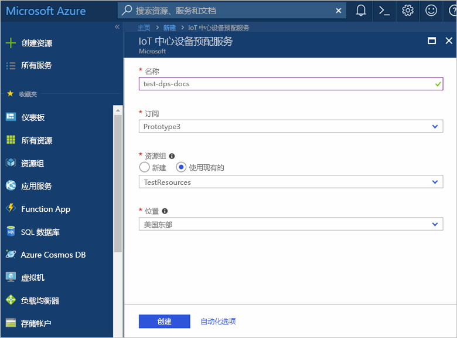
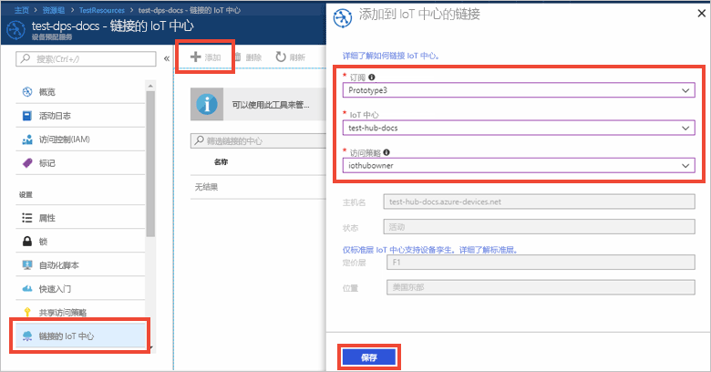

# 使用 Azure 门户设置 IoT 中心设备预配服务

以下步骤演示了如何在门户中设置用于预配设备的 Azure 云资源。 其中包括：如何创建 IoT 中心、如何创建新的 IoT 中心设备预配服务并将两个服务链接到一起。 

如果还没有 Azure 订阅，可以在开始前创建一个 [免费帐户](https://azure.microsoft.com/free/?WT.mc_id=A261C142F)。

## 登录到 Azure 门户

登录到 [Azure 门户](https://portal.azure.com/)。

## 创建 IoT 中心

1. 单击 Azure 门户左上角的“新建”按钮。

2. 选择“物联网”，选择“IoT 中心”，然后单击“创建”按钮。 

3. 为 IoT 中心命名。 从可用定价选项中进行选择，输入 [IoT 中心单位数](https://azure.microsoft.com/pricing/details/iot-hub/)，选择适用于设备到云消息的分区数，以及将用于此资源的订阅。 输入新的或现有的资源组的名称，然后选择位置。 完成后，单击“创建”。

      

4. 成功部署 IoT 中心以后，中心摘要边栏选项卡会自动打开。

## 为 IoT 中心设备预配服务创建新实例

1. 单击 Azure 门户左上角的“新建”按钮。

2. 搜索 Marketplace 中是否有设备预配服务。 选择“IoT 设备预配服务”，然后单击“创建”按钮。 

3. 为设备预配服务实例命名。 选择将用于此实例的订阅，然后命名新的或现有的资源组。 选择位置。 完成后，单击“创建”。

      

4. 成功部署服务以后，其摘要边栏选项卡会自动打开。

## 将 IoT 中心和设备预配服务相链接

1. 在 Azure 门户的左侧菜单中单击“所有资源”按钮。 选择在上一部分创建的设备预配服务实例。  

2. 在设备预配服务摘要边栏选项卡上，选择“链接的 IoT 中心”。 单击显示在顶部的“+ 添加”按钮。 

3. 在“添加 IoT 中心的链接”门户边栏选项卡中，选择当前订阅，或者输入另一订阅的名称和连接字符串。 从下拉列表中选择中心的名称。 完成后，单击“保存”。 

      

3. 此时会在“链接的 IoT 中心”边栏选项卡下看到所选中心。 可能需要单击“刷新”才能显示“链接的 IoT 中心”。

## 清理资源

本教程系列中的其他快速入门教程是在本文的基础上制作的。 如果打算继续学习后续的快速入门或相关教程，请不要清理在本快速入门中创建的资源。 如果不打算继续，请在 Azure 门户中执行以下步骤，删除本快速入门创建的所有资源。

1. 在 Azure 门户的左侧菜单中单击“所有资源”，然后选择设备预配服务。 在“所有资源”边栏选项卡的顶部单击“删除”。  
2. 在 Azure 门户的左侧菜单中单击“所有资源”，然后选择 IoT 中心。 在“所有资源”边栏选项卡的顶部单击“删除”。  

## 后续步骤

在本快速入门中，你已部署 IoT 中心和设备预配服务实例，并链接了这两个资源。 若要了解如何使用此设置来预配模拟设备，请继续学习本快速入门中关于如何创建模拟设备的内容。

> [!div class="nextstepaction"]
> [创建模拟设备快速入门](./quick-create-simulated-device.md)
