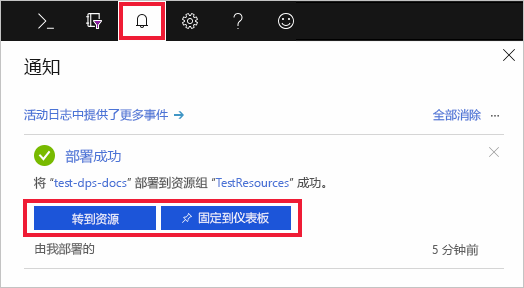

# 快速入门：使用 Azure 门户设置 IoT 中心设备预配服务

以下步骤演示了如何在门户中设置用于预配设备的 Azure 云资源。 本文包括用于以下操作的步骤：创建 IoT 中心、创建新的 IoT 中心设备预配服务，以及将两个服务链接到一起。 

如果没有 Azure 订阅，请在开始之前创建一个[免费帐户](https://azure.microsoft.com/free/?WT.mc_id=A261C142F)。

## 创建 IoT 中心

[!INCLUDE [iot-hub-include-create-hub](../../includes/iot-hub-include-create-hub.md)]

## 为 IoT 中心设备预配服务创建新实例

1. 再次选择“+ 创建资源”  按钮。

2. 在市场中搜索“设备预配服务”   。 选择“IoT 中心设备预配服务”，然后点击“创建”按钮   

3. 提供新的设备预配服务实例的以下信息，然后点击“创建”  。

    * **名称：** 为新的设备预配服务实例提供一个唯一名称。 如果输入的名称可用，会显示一个绿色复选标记。
    * **订阅：** 选择要用来创建此设备预配服务实例的订阅。
    * **资源组：** 此字段允许你创建新的资源组，或选择现有资源组来包含新实例。 选择包含你之前创建的 IoT 中心的同一资源组，例如 **TestResources**。 通过将所有相关资源都放在一个组中，可以一起管理它们。 例如，删除资源组会删除包含在该组中的所有资源。 有关详细信息，请参阅[管理 Azure 资源管理器资源组](../azure-resource-manager/manage-resource-groups-portal.md)。
    * **位置：** 选择离你的设备最近的位置。

        

4. 选择通知按钮可监视资源实例的创建过程。 成功部署服务以后，请选择“固定到仪表板”，然后选择“转到资源”   。

    

## 将 IoT 中心和设备预配服务相链接

在本部分中，你将向设备预配服务实例添加配置。 此配置设置将为其预配设备的 IoT 中心。

1. 在 Azure 门户的左侧菜单中选择“所有资源”按钮  。 选择在上一部分创建的设备预配服务实例。  

2. 在设备预配服务的菜单中，选择“链接的 IoT 中心”  。 点击顶部的“+ 添加”按钮  。 

3. 在“添加 IoT 中心的链接”  页面上，提供以下信息来将新的设备预配服务实例链接到 IoT 中心。 然后单击“保存”  。 

    * **订阅：** 选择包含要与新的设备预配服务实例进行链接的 IoT 中心的订阅。
    * **IoT 中心：** 选择要与新的设备预配服务实例进行链接的 IoT 中心。
    * **访问策略：** 选择“iothubowner”作为用于与 IoT 中心建立链接的凭据  。  

        

3. 此时会在“链接的 IoT 中心”边栏选项卡下看到所选中心。  可能需要点击“刷新”才能显示此内容  。

## 清理资源

本教程系列中的其他快速入门教程是在本文的基础上制作的。 如果打算继续学习后续的快速入门或相关教程，请不要清除在本快速入门中创建的资源。 如果不打算继续，请在 Azure 门户中执行以下步骤来删除此快速入门创建的所有资源。

1. 在 Azure 门户的左侧菜单中选择“所有资源”，然后选择设备预配服务  。 在设备详细信息窗格顶部，选择“删除”  。  
2. 在 Azure 门户的左侧菜单中选择“所有资源”，然后选择 IoT 中心  。 在中心详细信息窗格顶部，选择“删除”  。  

## 后续步骤

在本快速入门中，你已部署 IoT 中心和设备预配服务实例，并链接了这两个资源。 若要了解如何使用此设置来预配模拟设备，请继续学习本快速入门中关于如何创建模拟设备的内容。

> [!div class="nextstepaction"]
> [快速入门：创建模拟设备](./quick-create-simulated-device.md)
