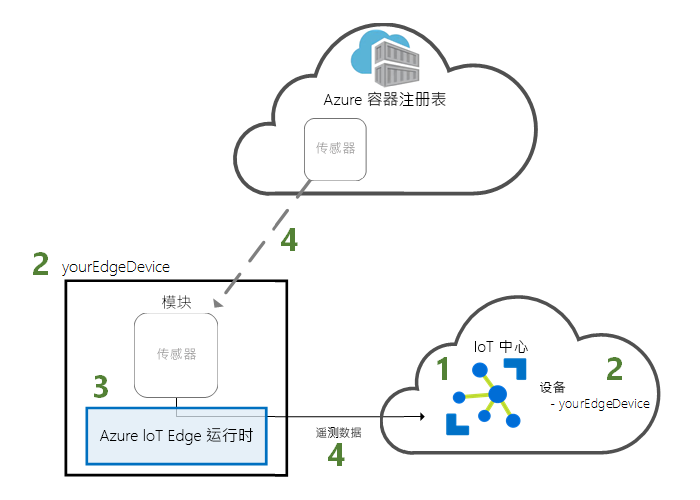
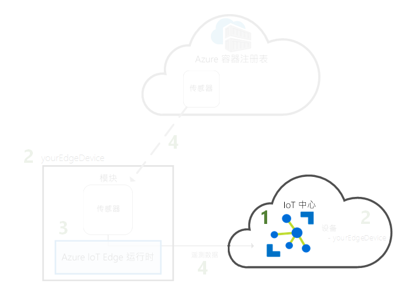
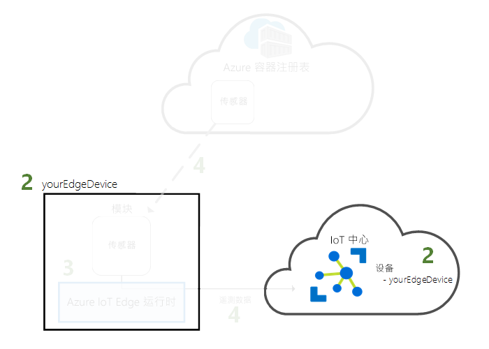
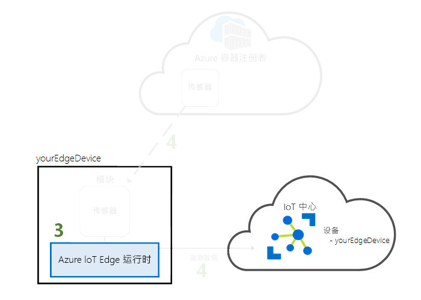
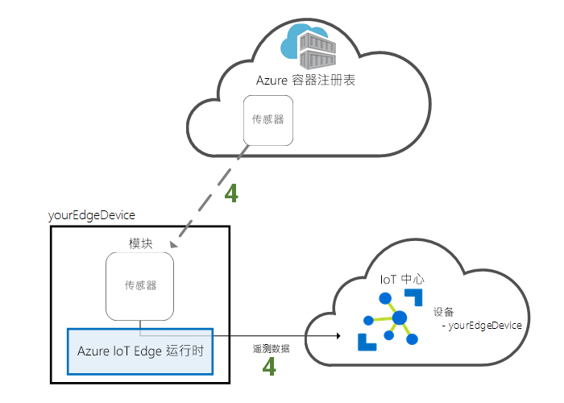

# <a name="quickstart-deploy-your-first-iot-edge-module-to-a-virtual-linux-device"></a>快速入门：将第一个 IoT Edge 模块部署到虚拟 Linux 设备

在本快速入门中通过将容器化代码部署到虚拟 IoT Edge 设备来测试 Azure IoT Edge。 IoT Edge 允许你远程管理设备上的代码，这样你就可以将更多工作负荷发送到 Edge。 对于本快速入门，我们建议使用 Azure 虚拟机作为 IoT Edge 设备，这样可以快速创建安装了所有必备组件的测试计算机，并在完成后将其删除。

此快速入门介绍如何：

1. 创建 IoT 中心。
2. 将 IoT Edge 设备注册到 IoT 中心。
3. 在虚拟设备上安装并启动 IoT Edge 运行时。
4. 以远程方式将模块部署到 IoT Edge 设备。



本快速入门指导你创建配置为 IoT Edge 设备的 Linux 虚拟机。 然后即可将模块从 Azure 门户部署到设备。 在本快速入门中部署的模块为模拟传感器，可以生成温度、湿度和压强数据。 其他 Azure IoT Edge 教程均以本教程中通过部署模块（这些模块通过分析模拟数据来获得业务见解）执行的操作为基础。

如果没有可用的 Azure 订阅，可以在开始前创建一个[免费帐户](https://azure.microsoft.com/free)。

[!INCLUDE [cloud-shell-try-it.md](../../includes/cloud-shell-try-it.md)]

请使用 Azure CLI 完成本快速入门中的多个步骤。Azure IoT 有一个可以启用其他功能的扩展。

将 Azure IoT 扩展添加到 Cloud Shell 实例。

   ```azurecli-interactive
   az extension add --name azure-iot
   ```
   
[!INCLUDE [iot-hub-cli-version-info](../../includes/iot-hub-cli-version-info.md)]

## <a name="prerequisites"></a>先决条件

云资源：

* 一个资源组，用于管理在本快速入门中使用的所有资源。

   ```azurecli-interactive
   az group create --name IoTEdgeResources --location westus2
   ```

IoT Edge 设备：

* 充当 IoT Edge 设备的 Linux 设备或虚拟机。 应使用 Microsoft 提供的 [Azure IoT Edge on Ubuntu](https://azuremarketplace.microsoft.com/marketplace/apps/microsoft_iot_edge.iot_edge_vm_ubuntu) 虚拟机，该虚拟机在设备上预先安装了运行 IoT Edge 所需的所有项。 接受使用条款并使用以下命令创建此虚拟机：

   ```azurecli-interactive
   az vm image terms accept --urn microsoft_iot_edge:iot_edge_vm_ubuntu:ubuntu_1604_edgeruntimeonly:latest
   az vm create --resource-group IoTEdgeResources --name EdgeVM --image microsoft_iot_edge:iot_edge_vm_ubuntu:ubuntu_1604_edgeruntimeonly:latest --admin-username azureuser --generate-ssh-keys
   ```

   可能需要几分钟才能创建并启动新的虚拟机。

   创建新的虚拟机时，请记下在 create 命令的输出中提供的 **publicIpAddress**。 在本快速入门中，稍后将使用此公共 IP 地址连接到虚拟机。

* 如果希望在自己的设备上运行 Azure IoT Edge 运行时，请遵循[在 Linux 上安装 Azure IoT Edge 运行时](how-to-install-iot-edge-linux.md)中的说明。

## <a name="create-an-iot-hub"></a>创建 IoT 中心

使用 Azure CLI 创建 IoT 中心，启动快速入门。



免费级的 IoT 中心适用于此快速入门。 如果曾经用过 IoT 中心并且已创建免费的中心，则可使用该 IoT 中心。 每个订阅仅能有一个免费 IoT 中心。

以下代码在资源组“IoTEdgeResources”中创建免费的“F1”中心 。 将 `{hub_name}` 替换为 IoT 中心的唯一名称。

   ```azurecli-interactive
   az iot hub create --resource-group IoTEdgeResources --name {hub_name} --sku F1 --partition-count 2
   ```

   如果由于订阅中已经有一个免费的中心而出现错误，请将 SKU 更改为 **S1**。 如果出现一条错误，指示 IoT 中心名称不可用，则表明他人已使用具有该名称的中心。 请尝试一个新名称。

## <a name="register-an-iot-edge-device"></a>注册 IoT Edge 设备

使用新创建的 IoT 中心注册 IoT Edge 设备。



为 IoT Edge 设备创建设备标识，以便它可以与 IoT 中心通信。 设备标识存在于云中，而将物理设备关联到设备标识时，则使用唯一的设备连接字符串。

由于 IoT Edge 设备的行为和托管方式与典型 IoT 设备不同，请使用 `--edge-enabled` 标志声明此标识，使之用于 IoT Edge 设备。

1. 在 Azure Cloud Shell 中输入以下命令，以便在中心创建名为 **myEdgeDevice** 的设备。

   ```azurecli-interactive
   az iot hub device-identity create --hub-name {hub_name} --device-id myEdgeDevice --edge-enabled
   ```

   如果收到有关 iothubowner 策略密钥的错误，请确保 Cloud Shell 正在运行最新版 azure-iot 扩展。

2. 检索设备的连接字符串，该字符串将物理设备与其在 IoT 中心的标识链接在一起。

   ```azurecli-interactive
   az iot hub device-identity show-connection-string --device-id myEdgeDevice --hub-name {hub_name}
   ```

3. 复制 JSON 输出中 `connectionString` 键的值并保存。 该值为设备连接字符串。 在下一部分配置 IoT Edge 运行时中，将用到此连接字符串。

   

## <a name="configure-your-iot-edge-device"></a>配置 IoT Edge 设备

在 IoT Edge 设备上启动 Azure IoT Edge 运行时。



IoT Edge 运行时部署在所有 IoT Edge 设备上。 它有三个组件。 每次 IoT Edge 设备启动并通过启动 IoT Edge 代理启动设备时，**IoT Edge 安全守护程序**就会启动。 **IoT Edge 代理**协助部署和监视 IoT Edge 设备（包括 IoT Edge 中心）的模块。 IoT Edge 中心管理 IoT Edge 设备模块之间以及设备和 Azure IoT 中心之间的通信。

在运行时配置期间，你提供设备连接字符串。 请使用从 Azure CLI 检索的字符串。 此字符串将物理设备与 Azure 中的 IoT Edge 设备标识关联在一起。

### <a name="set-the-connection-string-on-the-iot-edge-device"></a>在 IoT Edge 设备上设置连接字符串

如果使用的是先决条件中所述的 Azure IoT Edge on Ubuntu 虚拟机，则表示设备已安装 IoT Edge 运行时。 只需使用上一节中检索的设备连接字符串来配置设备即可。 可以在不连接虚拟机的情况下进行远程配置。 运行以下命令，将 `{device_connection_string}` 替换为自己的字符串。

   ```azurecli-interactive
   az vm run-command invoke -g IoTEdgeResources -n EdgeVM --command-id RunShellScript --script "/etc/iotedge/configedge.sh '{device_connection_string}'"
   ```

如果要在本地计算机或 ARM32 或 ARM64 设备上运行 IoT Edge，则需要在设备上安装 IoT Edge 运行时及其必备组件。 按照[在 Linux 上安装 Azure IoT Edge 运行时](how-to-install-iot-edge-linux.md)中的说明进行操作，然后返回到本快速入门。

### <a name="view-the-iot-edge-runtime-status"></a>查看 IoT Edge 运行时状态

此快速入门中的其余命令都在 Azure IoT Edge 上完成，以便查看设备发生的情况。 如果使用的是虚拟机，请立即使用创建命令输出的公共 IP 地址连接到该虚拟机。 也可在 Azure 门户中虚拟机的概述页面上找到公共 IP 地址。 使用以下命令连接到虚拟机。 如果所用用户名与先决条件中建议的用户名不同，请替换 `{azureuser}`。 将 `{publicIpAddress}` 替换为你的计算机地址。

   ```console
   ssh azureuser@{publicIpAddress}
   ```

验证是否已在 IoT Edge 设备上成功安装并配置运行时。

>[!TIP]
>需要提升权限才能运行 `iotedge` 命令。 安装 IoT Edge 运行时后从计算机中注销并第一次重新登录后，你的权限将自动更新。 在此之前，请在命令前使用 `sudo`。

1. 查看 IoT Edge 安全守护程序是否正作为系统服务运行。

   ```bash
   sudo systemctl status iotedge
   ```

   

2. 若需排查服务问题，请检索服务日志。

   ```bash
   journalctl -u iotedge
   ```

3. 查看在设备上运行的模块。

   ```bash
   sudo iotedge list
   ```

   

IoT Edge 设备现在已配置好。 它可以运行云部署型模块了。

## <a name="deploy-a-module"></a>部署模块

从云端管理 Azure IoT Edge 设备，部署将遥测数据发送到 IoT 中心的模块。


[!INCLUDE [iot-edge-deploy-module](../../includes/iot-edge-deploy-module.md)]

## <a name="view-generated-data"></a>查看生成的数据

此快速入门中，创建了新的 IoT Edge 设备，并在该设备上安装了 IoT Edge 运行时。 然后，使用了 Azure 门户部署 IoT Edge 模块，使其在不更改设备本身的情况下在设备上运行。

在这种情况下，推送的模块会创建可用于测试的样本数据。 模拟温度传感器模块会生成可用于以后测试的环境数据。 模拟传感器正在监视一台计算机和该计算机周围的环境。 例如，该传感器可能位于服务器机房中、工厂地板上或风力涡轮机上。 该消息包括环境温度和湿度、机器温度和压力以及时间戳。 IoT Edge 教程使用此模块创建的数据作为测试数据进行分析。

再次在 IoT Edge 设备上打开命令提示符，或者从 Azure CLI 使用 SSH 连接。 确认从云中部署的模块正在 IoT Edge 设备上运行：

   ```bash
   sudo iotedge list
   ```

   

查看从温度传感器模块发送的消息：

   ```bash
   sudo iotedge logs SimulatedTemperatureSensor -f
   ```

   >[!TIP]
   >引用模块名称时，IoT Edge 命令区分大小写。

   

也可使用 [Visual Studio Code 的 Azure IoT 中心扩展](https://marketplace.visualstudio.com/items?itemName=vsciot-vscode.azure-iot-toolkit)查看到达 IoT 中心的消息。

## <a name="clean-up-resources"></a>清理资源

若要继续学习 IoT Edge 教程，可以使用在本快速入门中注册并设置的设备。 否则，可删除已创建的 Azure 资源，避免产生费用。

如果是在新资源组中创建的虚拟机和 IoT 中心，则可删除该组以及所有关联的资源。 仔细检查资源组的内容，确保没有要保留的内容。 如果不希望删除整个组，则可改为删除单个资源。

删除 **IoTEdgeResources** 组。

```azurecli-interactive
az group delete --name IoTEdgeResources
```

## <a name="next-steps"></a>后续步骤

在本快速入门中，你创建了一个 IoT Edge 设备并使用 Azure IoT Edge 云接口将代码部署到该设备上。 现在，你有了一个可以生成其环境的原始数据的测试设备。

下一步是设置本地开发环境，使你可以开始创建运行业务逻辑的 IoT Edge 模块。

> [!div class="nextstepaction"]
> [开始为 Linux 设备开发 IoT Edge 模块](tutorial-develop-for-linux.md)
