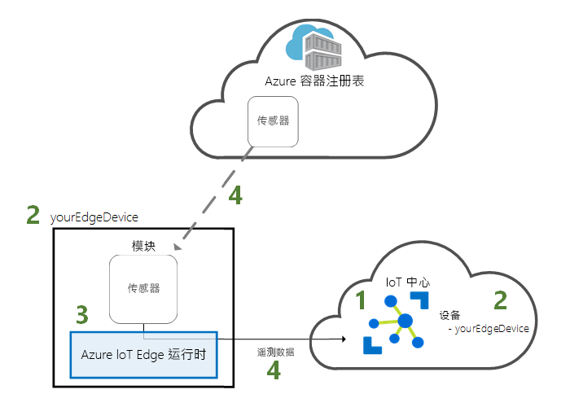
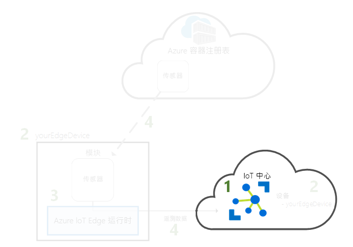
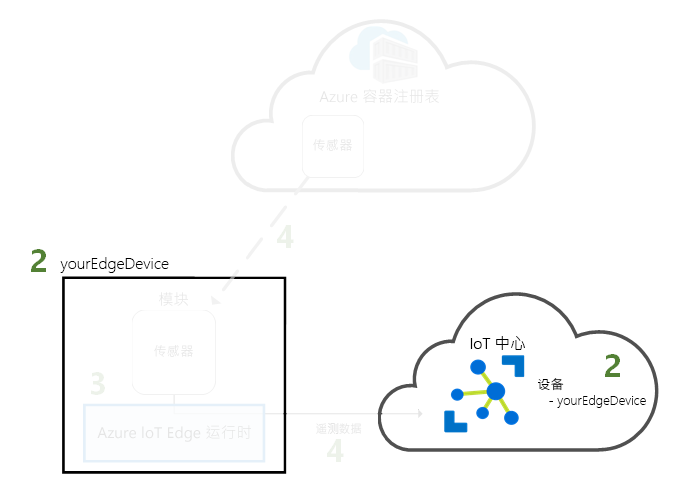
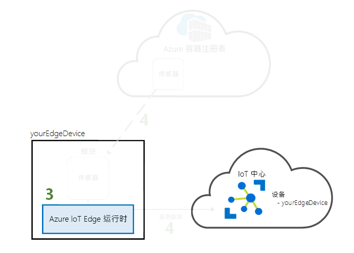
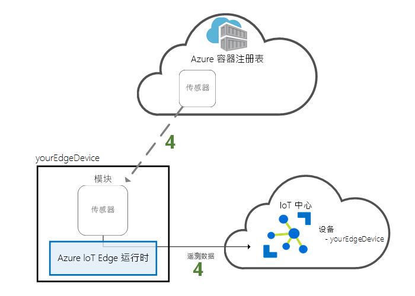

# <a name="quickstart-deploy-your-first-iot-edge-module-to-a-virtual-windows-device"></a>快速入门：将第一个 IoT Edge 模块部署到虚拟 Windows 设备

通过将容器化代码部署到虚拟 IoT Edge 设备来试用 Azure IoT Edge。 IoT Edge 允许你远程管理设备上的代码，这样你就可以将更多工作负荷发送到 Edge。 对于本快速入门，我们建议使用 Azure 虚拟机作为 IoT Edge 设备。 使用虚拟机可以快速创建测试计算机，安装必备组件，并在完成后将其删除。

此快速入门介绍如何：

1. 创建 IoT 中心。
2. 将 IoT Edge 设备注册到 IoT 中心。
3. 在虚拟设备上安装并启动 IoT Edge 运行时。
4. 以远程方式将模块部署到 IoT Edge 设备并将遥测数据发送到 IoT 中心。



本快速入门将指导你创建 Windows 虚拟机并将其配置为 IoT Edge 设备。 然后即可将模块从 Azure 门户部署到设备。 在本快速入门中部署的模块为模拟传感器，可以生成温度、湿度和压强数据。 其他 Azure IoT Edge 教程均以本教程中通过部署模块（这些模块通过分析模拟数据来获得业务见解）执行的操作为基础。

如果没有可用的 Azure 订阅，可以在开始前创建一个[免费帐户](https://azure.microsoft.com/free)。

[!INCLUDE [cloud-shell-try-it.md](../../includes/cloud-shell-try-it.md)]

你将使用 Azure CLI 完成本快速入门中的许多步骤。 Azure IoT 具有启用附加功能的扩展。

将 Azure IoT 扩展添加到 Cloud Shell 实例。

   ```azurecli-interactive
   az extension add --name azure-iot
   ```

[!INCLUDE [iot-hub-cli-version-info](../../includes/iot-hub-cli-version-info.md)]

## <a name="prerequisites"></a>先决条件

云资源：

* 一个资源组，用于管理在本快速入门中使用的所有资源。

   ```azurecli-interactive
   az group create --name IoTEdgeResources --location westus2
   ```

IoT Edge 设备：

* 充当 IoT Edge 设备的 Windows 虚拟机。 你可通过使用以下命令并将 `{password}` 替换为安全密码来创建此虚拟机：

  ```azurecli-interactive
  az vm create --resource-group IoTEdgeResources --name EdgeVM --image MicrosoftWindowsDesktop:Windows-10:rs5-pro:latest --admin-username azureuser --admin-password {password} --size Standard_DS1_v2
  ```

  可能需要几分钟才能创建并启动新的虚拟机。 然后，在连接到虚拟机时下载 RDP 文件进行使用：

  1. 导航到 Azure 门户中新的 Windows 虚拟机。
  1. 选择“连接”  。
  1. 在“RDP”选项卡上，选择“下载 RDP 文件”   。

  使用远程桌面连接打开此文件，以通过用 `az vm create` 指定的管理员姓名和密码连接到 Windows 虚拟机。

> [!NOTE]
> 为简单起见，本快速入门使用 Windows 桌面虚拟机。 要了解哪些 Windows 操作系统针对生产环境公开发布，请参阅 [Azure IoT Edge 支持的系统](support.md)。
>
> 如果你已准备好为 IoT Edge 配置自己的 Windows 设备，包括运行 IoT Core 的设备，请按照[在 Windows 上安装 Azure IoT Edge 运行时](how-to-install-iot-edge-windows.md)中的步骤进行操作。

## <a name="create-an-iot-hub"></a>创建 IoT 中心

使用 Azure CLI 创建 IoT 中心，启动快速入门。



免费级的 IoT 中心适用于此快速入门。 如果曾经用过 IoT 中心并且已创建免费的中心，则可使用该 IoT 中心。 每个订阅仅能有一个免费 IoT 中心。

以下代码将在资源组 `IoTEdgeResources` 中创建免费的 F1 中心  。 将 `{hub_name}` 替换为 IoT 中心的唯一名称。

   ```azurecli-interactive
   az iot hub create --resource-group IoTEdgeResources --name {hub_name} --sku F1 --partition-count 2
   ```

   如果由于订阅中已经有一个免费的中心而出现错误，请将 SKU 更改为 **S1**。 如果出现一条错误，指示 IoT 中心名称不可用，则表明他人已使用具有该名称的中心。 请尝试一个新名称。

## <a name="register-an-iot-edge-device"></a>注册 IoT Edge 设备

使用新创建的 IoT 中心注册 IoT Edge 设备。


为模拟设备创建设备标识，以便它可以与 IoT 中心通信。 设备标识存在于云中，而将物理设备关联到设备标识时，则使用唯一的设备连接字符串。

由于 IoT Edge 设备的行为和托管方式与典型 IoT 设备不同，请使用 `--edge-enabled` 标志声明此标识，使之用于 IoT Edge 设备。

1. 在 Azure Cloud Shell 中输入以下命令，以便在中心创建名为 **myEdgeDevice** 的设备。

   ```azurecli-interactive
   az iot hub device-identity create --device-id myEdgeDevice --hub-name {hub_name} --edge-enabled
   ```

   如果收到有关 iothubowner 策略密钥的错误，请确保 Cloud Shell 正在运行最新版 azure-iot 扩展。

2. 检索设备的连接字符串，该字符串将物理设备与其在 IoT 中心的标识链接在一起。

   ```azurecli-interactive
   az iot hub device-identity show-connection-string --device-id myEdgeDevice --hub-name {hub_name}
   ```

3. 复制 JSON 输出中 `connectionString` 键的值并保存。 该值为设备连接字符串。 在下一部分配置 IoT Edge 运行时中，将用到此连接字符串。

   

## <a name="install-and-start-the-iot-edge-runtime"></a>安装和启动 IoT Edge 运行时

在 IoT Edge 设备上安装 Azure IoT Edge 运行时，并使用设备连接字符串对其进行配置。


IoT Edge 运行时部署在所有 IoT Edge 设备上。 它有三个组件。 每次 IoT Edge 设备启动并通过启动 IoT Edge 代理启动设备时，**IoT Edge 安全守护程序**就会启动。 **IoT Edge 代理**管理 IoT Edge 设备上模块（包括 IoT Edge 中心）的部署和监视。 **IoT Edge 中心**处理 IoT Edge 设备模块之间以及设备和 IoT 中心之间的通信。

安装脚本还包含一个名为 Moby 的容器引擎，用于管理 IoT Edge 设备上的容器映像。

在运行时安装期间，系统会要求你提供设备连接字符串。 请使用从 Azure CLI 检索的字符串。 此字符串将物理设备与 Azure 中的 IoT Edge 设备标识关联在一起。

### <a name="connect-to-your-iot-edge-device"></a>连接到 IoT Edge 设备

本部分中的步骤均在 IoT Edge 设备上执行，因此需要立即通过远程桌面连接到此虚拟机。

### <a name="install-and-configure-the-iot-edge-service"></a>安装并配置 IoT Edge 服务

使用 PowerShell 下载并安装 IoT Edge 运行时。 使用从 IoT 中心检索的设备连接字符串来配置设备。

1. 如果还没有，请按照[注册新的 Azure IoT Edge 设备](how-to-register-device.md)中的步骤注册设备并检索设备连接字符串。

2. 在虚拟机中，以管理员身份运行 PowerShell。

   >[!NOTE]
   >使用 PowerShell 的 AMD64 会话安装 IoT Edge，不要使用 PowerShell (x86)。 如果不确定您使用的是什么会话类型，请运行以下命令：
   >
   >```powershell
   >(Get-Process -Id $PID).StartInfo.EnvironmentVariables["PROCESSOR_ARCHITECTURE"]
   >```

3. Deploy-IoTEdge 命令执行以下检查：Windows 计算机使用受支持版本、启用容器功能、下载 Moby 运行时并下载 IoT Edge 运行时  。

   ```powershell
   . {Invoke-WebRequest -useb aka.ms/iotedge-win} | Invoke-Expression; `
   Deploy-IoTEdge -ContainerOs Windows
   ```

4. 计算机可能会自动重新启动。 如果 Deploy-IoTEdge 命令提示你重启，请重启。

5. 再次以管理员身份运行 PowerShell。

6. Initialize-IoTEdge 命令在计算机上配置 IoT Edge 运行时  。 该命令默认为使用 Windows 容器手动预配。

   ```powershell
   . {Invoke-WebRequest -useb aka.ms/iotedge-win} | Invoke-Expression; `
   Initialize-IoTEdge -ContainerOs Windows
   ```

7. 当系统提示输入 **DeviceConnectionString** 时，请提供在上一部分复制的字符串。 请勿对连接字符串使用引号。

### <a name="view-the-iot-edge-runtime-status"></a>查看 IoT Edge 运行时状态

验证是否已成功安装并配置运行时。

1. 检查 IoT Edge 服务的状态。

   ```powershell
   Get-Service iotedge
   ```

2. 若需排查服务问题，请检索服务日志。

   ```powershell
   . {Invoke-WebRequest -useb aka.ms/iotedge-win} | Invoke-Expression; Get-IoTEdgeLog
   ```

3. 查看在 IoT Edge 设备上运行的所有模块。 由于此服务是第一次运行，因此只会看到 **edgeAgent** 模块在运行。 edgeAgent 模块会默认运行，用于安装并启动部署到设备的任何其他模块。

    ```powershell
    iotedge list
    ```

   

可能需要几分钟才能完成安装并启动 IoT Edge 代理模块。

IoT Edge 设备现在已配置好。 它可以运行云部署型模块了。

## <a name="deploy-a-module"></a>部署模块

从云端管理 Azure IoT Edge 设备，部署将遥测数据发送到 IoT 中心的模块。


[!INCLUDE [iot-edge-deploy-module](../../includes/iot-edge-deploy-module.md)]

## <a name="view-generated-data"></a>查看生成的数据

在本快速入门中，注册了 IoT Edge 设备，并在该设备上安装了 IoT Edge 运行时。 然后，使用了 Azure 门户部署 IoT Edge 模块，使其在不更改设备本身的情况下在设备上运行。

在这种情况下，推送的模块会创建可用于测试的样本数据。 模拟温度传感器模块会生成可用于以后测试的环境数据。 模拟传感器正在监视一台计算机和该计算机周围的环境。 例如，该传感器可能位于服务器机房中、工厂地板上或风力涡轮机上。 该消息包括环境温度和湿度、机器温度和压力以及时间戳。 IoT Edge 教程使用此模块创建的数据作为测试数据进行分析。

确认从云中部署的模块正在 IoT Edge 设备上运行。

```powershell
iotedge list
```

   

查看从温度传感器模块发送到云的消息。

```powershell
iotedge logs SimulatedTemperatureSensor -f
```

   >[!TIP]
   >引用模块名称时，IoT Edge 命令区分大小写。

   

也可使用 [Visual Studio Code 的 Azure IoT 中心扩展](https://marketplace.visualstudio.com/items?itemName=vsciot-vscode.azure-iot-toolkit)查看到达 IoT 中心的消息。

## <a name="clean-up-resources"></a>清理资源

若要继续学习 IoT Edge 教程，可以使用在本快速入门中注册并设置的设备。 否则，可删除已创建的 Azure 资源，避免产生费用。

如果是在新资源组中创建的虚拟机和 IoT 中心，则可删除该组以及所有关联的资源。 仔细检查资源组的内容，确保没有要保留的内容。 如果不希望删除整个组，则可改为删除单个资源。

删除 **IoTEdgeResources** 组。

```azurecli-interactive
az group delete --name IoTEdgeResources
```

## <a name="next-steps"></a>后续步骤

在本快速入门中，你创建了一个 IoT Edge 设备并使用 Azure IoT Edge 云接口将代码部署到该设备上。 现在，你有了一个可以生成其环境的原始数据的测试设备。

下一步是设置本地开发环境，使你可以开始创建运行业务逻辑的 IoT Edge 模块。

> [!div class="nextstepaction"]
> [开始为 Windows 设备开发 IoT Edge 模块](tutorial-develop-for-windows.md)
