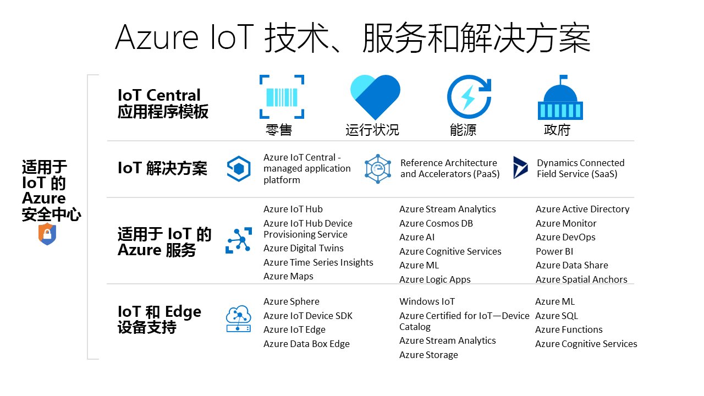

# 用于创建 IoT 解决方案的 Azure 技术和服务

Azure IoT 技术和服务提供的选项可以用来创建范围广泛的各种 IoT 解决方案，支持组织进行数字转型。 例如，你能够：

- 使用 [Azure IoT Central](https://apps.azureiotcentral.com)（一种托管的 IoT 应用程序平台）来构建并部署安全的企业级 IoT 解决方案。 IoT Central 提供一组特定于行业的应用程序模板（例如零售和医疗保健），用于加速解决方案开发过程。
- 扩展 Azure IoT [解决方案加速器](https://www.azureiotsolutions.com)的开源代码库，以便实现常见的 IoT 方案，例如远程监视或预测性维护。
- 使用 Azure IoT 平台服务（例如 [Azure IoT 中心](../iot-hub/about-iot-hub.md)和 [Azure IoT 设备 SDK](../iot-hub/iot-hub-devguide-sdks.md)），以便从头开始构建自定义 IoT 解决方案。

## Azure IoT Central

[IoT Central 应用程序平台](https://apps.azureiotcentral.com)可减轻开发、管理和维护企业级 IoT 解决方案的负担和成本。 IoT Central 的可自定义 Web UI 用于监视设备条件、创建规则并在其整个生命周期中管理数百万个设备及其数据。 可以通过 IoT Central 中的 API 图面以编程方式进行访问，以便配置 IoT 解决方案并与之交互。

Azure IoT Central 是完全托管的应用程序平台，可以用来创建自定义 IoT 解决方案。 IoT Central 使用应用程序模板来创建解决方案。 模块可以用于通用解决方案，还可以用于特定的行业（例如能源、医疗保健、政府以及零售）。 IoT Central 应用程序模板可以用来在数分钟内部署 IoT Central 应用程序，然后使用主题、仪表板和视图对其进行自定义。

从 [Azure IoT 认证设备目录](https://catalog.azureiotsolutions.com)中选择用于快速连接到解决方案的设备。 使用 IoT Central Web UI 监视并管理设备，使之始终正常运行并处于连接状态。 使用连接器和 API 将 IoT Central 应用程序与其他业务应用程序集成。

作为完全托管的应用程序平台，IoT Central 具有简单且可预测的定价模型。

## Azure IoT 解决方案加速器

[Azure IoT 解决方案加速器](https://www.azureiotsolutions.com)是一组可自定义的企业级解决方案。 可以按原样部署这些解决方案，也可以使用开源 Java 或 .NET 源代码开发自定义 IoT 解决方案。

Azure IoT 解决方案加速器可以对 IoT 解决方案进行高级控制。 解决方案加速器包含预生成的用于常见 IoT 方案的解决方案，可以在数分钟内将其部署到 Azure 订阅。 这些方案包括：

  - 远程监视
  - 连接工厂
  - 预见性维护
  - 设备模拟

所有解决方案加速器的开源代码库都在 GitHub 上提供。 下载代码即可根据具体的 IoT 要求来自定义解决方案加速器。

解决方案加速器使用 Azure 服务，例如，必须在 Azure 订阅中管理的 Azure IoT 中心和 Azure 存储。

## 自定义解决方案

若要从头构建 IoT 解决方案，或扩展使用 IoT Central 或解决方案加速器创建的解决方案，请使用一项或多项下述 Azure IoT 技术和服务：

### 设备

使用 [Azure IoT 初学者套件](https://catalog.azureiotsolutions.com/kits)之一开发 IoT 设备，或者从 [Azure IoT 认证设备目录](https://catalog.azureiotsolutions.com)选择要使用的设备。 使用开源[设备 SDK](../iot-hub/iot-hub-devguide-sdks.md) 实现嵌入代码。 设备 SDK 支持多种操作系统，例如 Linux、Windows 和实时操作系统。 有用于多种编程语言（例如 [C](https://github.com/Azure/azure-iot-sdk-c)、[Node.js](https://github.com/Azure/azure-iot-sdk-node)、[Java](https://github.com/Azure/azure-iot-sdk-java)、[.NET](https://github.com/Azure/azure-iot-sdk-csharp) 和 [Python](https://github.com/Azure/azure-iot-sdk-python)）的 SDK。

可以使用 [IoT 即插即用预览版](../iot-pnp/overview-iot-plug-and-play.md)服务进一步简化为设备创建嵌入代码的方式。 IoT 即插即用使解决方案开发人员能够将设备与其解决方案相集成，而无需编写任何嵌入代码。 IoT 即插即用的核心是描述设备功能的设备功能模型架构。  使用设备功能模型生成嵌入设备代码并配置基于云的解决方案，例如 IoT Central 应用程序。

可通过 [Azure IoT Edge](../iot-edge/about-iot-edge.md) 将部分 IoT 工作负载从 Azure 云服务下移至你的设备。 IoT Edge 可降低解决方案中的延迟、减少设备与云的数据交换量并支持脱机方案。 你可通过 IoT Central 和某些解决方案加速器来管理 IoT Edge 设备。

[Azure Sphere](https://docs.microsoft.com/azure-sphere/product-overview/what-is-azure-sphere) 是一个安全的高级应用程序平台，具有针对互连设备的内置通信和安全功能。 它包括一个安全的微控制器单元、一个自定义的基于 linux 的操作系统和一项基于云的安全服务（提供连续的可续订安全性）。

### 云连接

[Azure IoT 中心](../iot-hub/about-iot-hub.md)服务可在数百万个 IoT 设备和一个基于云的解决方案之间实现安全可靠的双向通信。 [Azure IoT 中心设备预配服务](../iot-dps/about-iot-dps.md)是用于 IoT 中心的帮助程序服务。 可以通过此服务将设备以零接触的方式实时预配到适当的 IoT 中心，不需要人为干预。 有了这些功能，客户就可以通过安全且可缩放的方式预配数百万台设备。

IoT 中心是解决方案加速器的核心组件，可以用来克服 IoT 实现难题，例如：

* 大容量设备连接和管理。
* 大容量遥测引入。
* 设备的命令和控制。
* 设备安全措施实施。

### 弥合物理世界和数字世界之间的差距

[Azure 数字孪生](../digital-twins/about-digital-twins.md)是一种 IoT 服务，用于为物理环境建模。 它使用的空间智能图可以对人员、空间和设备之间的关系建模。 通过跨数字和物理世界关联数据，可以创建上下文感知的解决方案。

Iot Central 使用数字孪生将现实世界中的设备和数据与用户用来监视和管理这些连接设备的数字模型同步。

### 数据和分析

IoT 设备通常生成大量时序数据，例如从传感器读取的温度数据。 [Azure 时序见解](../time-series-insights/time-series-insights-overview.md)可以连接到某个 IoT 中心，从设备读取遥测流，存储该数据，然后我们就可以查询它并将它可视化。

[Azure Maps](/azure/azure-maps) 是一系列地理空间服务，这些服务使用新鲜的地图数据为 Web 和移动应用程序提供准确的地理上下文。 可以使用 REST API、基于 Web 的 JavaScript 控件或 Android SDK 来构建应用程序。

## 后续步骤

如需实践体验，请尝试以下快速入门之一：

- [创建 Azure IoT Central 应用程序](../iot-central/core/quick-deploy-iot-central.md)
- [将遥测数据从设备发送到 IoT 中心](../iot-hub/quickstart-send-telemetry-cli.md)
- [尝试基于云的远程监视解决方案](../iot-accelerators/quickstart-remote-monitoring-deploy.md)
