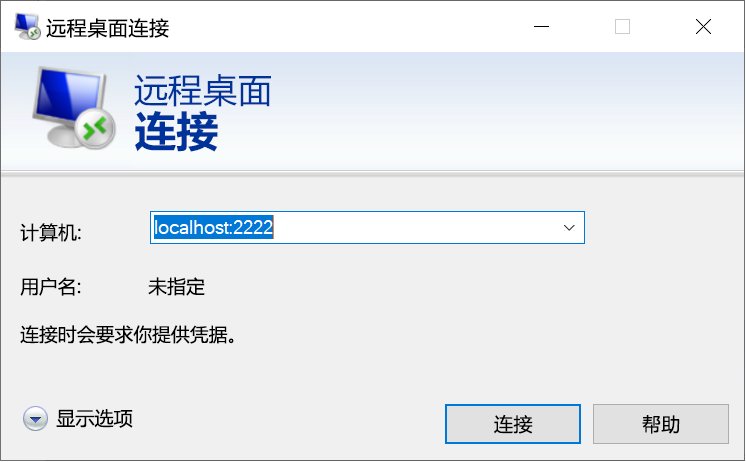

# <a name="quickstart-enable-ssh-and-rdp-over-an-iot-hub-device-stream-by-using-a-c-proxy-application-preview"></a>快速入门：使用 C# 代理应用程序通过 IoT 中心设备流实现 SSH 和 RDP 方案（预览）

[!INCLUDE [iot-hub-quickstarts-4-selector](../../includes/iot-hub-quickstarts-4-selector.md)]

Microsoft Azure IoT 中心目前支持设备流作为[预览版功能](https://azure.microsoft.com/support/legal/preview-supplemental-terms/)。

服务和设备应用程序可以使用 [IoT 中心设备流](iot-hub-device-streams-overview.md)以安全且防火墙友好的方式进行通信。 本快速入门指南涉及两个 C# 应用程序，在其中，可以使用通过 IoT 中心建立的设备流发送客户端-服务器应用程序流量（例如安全外壳 [SSH] 和远程桌面协议 [RDP]）。 有关设置概述，请参阅[适用于 SSH 或 RDP 的本地代理应用程序示例](iot-hub-device-streams-overview.md#local-proxy-sample-for-ssh-or-rdp)。

本文先介绍 SSH 的设置（使用端口 22），然后介绍如何修改 RDP 的设置端口。 由于设备流不区分应用程序和协议，因此，可以修改同一示例来适应其他类型的应用程序流量。 这种修改通常只涉及到将通信端口更改为目标应用程序所用的端口。

## <a name="how-it-works"></a>工作原理

下图演示了本示例中的设备本地和服务本地代理应用程序如何在 SSH 客户端与 SSH 守护程序进程之间实现端到端的连接。 此处假设守护程序在设备本地代理应用程序所在的同一台设备上运行。


1. 服务本地代理应用程序连接到 IoT 中心，并向目标设备发起设备流。

1. 设备本地代理应用程序完成流发起握手，并通过 IoT 中心的流式处理终结点与服务端建立端到端的流式处理隧道。

1. 设备本地代理应用程序连接到在设备上侦听端口 22 的 SSH 守护程序。 可按“运行设备本地代理应用程序”部分中所述对此设置进行配置。

1. 服务本地代理应用程序通过侦听指定的端口（在本例中为端口 2222），等待用户建立新的 SSH 连接。 可按“运行服务本地代理应用程序”部分中所述对此设置进行配置。 当用户通过 SSH 客户端连接时，该隧道使 SSH 应用程序流量可在 SSH 客户端与服务器应用程序之间进行传输。

> [!NOTE]
> 通过设备流发送的 SSH 流量将通过 IoT 中心的流式处理终结点以隧道方式进行传输，而不是直接在服务与设备之间发送。 有关详细信息，请参阅[使用 IoT 中心设备流的好处](iot-hub-device-streams-overview.md#benefits)。

[!INCLUDE [cloud-shell-try-it.md](../../includes/cloud-shell-try-it.md)]

如果还没有 Azure 订阅，可以在开始前创建一个[免费帐户](https://azure.microsoft.com/free/?WT.mc_id=A261C142F)。

## <a name="prerequisites"></a>先决条件

* 目前仅以下区域中创建的 IoT 中心支持设备流预览：

  * 美国中部
  * 美国中部 EUAP
  * 东南亚
  * 北欧

* 本快速入门中运行的两个示例应用程序是使用 C# 编写的。 开发计算机上需要有 .NET Core SDK 2.1.0 或更高版本。

  可以[从 .NET 下载适用于多个平台的 .NET Core SDK](https://www.microsoft.com/net/download/all)。

* 使用以下命令验证开发计算机上 C# 的当前版本：

    ```
    dotnet --version
    ```

* 运行以下命令将用于 Azure CLI 的 Azure IoT 扩展添加到 Cloud Shell 实例。 IOT 扩展会将 IoT 中心、IoT Edge 和 IoT 设备预配服务 (DPS) 特定的命令添加到 Azure CLI。

   ```azurecli-interactive
   az extension add --name azure-cli-iot-ext
   ```

* [下载示例 C# 项目](https://github.com/Azure-Samples/azure-iot-samples-csharp/archive/master.zip)并解压缩 ZIP 存档。

* 设备（Windows 或 Linux）上用于对用户进行身份验证的有效用户帐户和凭据。

## <a name="create-an-iot-hub"></a>创建 IoT 中心

[!INCLUDE [iot-hub-include-create-hub-device-streams](../../includes/iot-hub-include-create-hub-device-streams.md)]

## <a name="register-a-device"></a>注册设备

必须先将设备注册到 IoT 中心，然后该设备才能进行连接。 在本快速入门中，你将使用 Azure Cloud Shell 来注册模拟设备。

1. 若要创建设备标识，请在 Cloud Shell 中运行以下命令：

   > [!NOTE]
   > * 请将 *YourIoTHubName* 占位符替换为你为 IoT 中心选择的名称。
   > * 对于正在注册的设备的名称，建议使用 *MyDevice*，如下所示。 如果为设备选择其他名称，请在本文中从头至尾使用该名称，并在运行示例应用程序之前在其中更新设备名称。

    ```azurecli-interactive
    az iot hub device-identity create --hub-name {YourIoTHubName} --device-id MyDevice
    ```

1. 若要获取刚刚注册的设备的*设备连接字符串*，请在 Cloud Shell 中运行以下命令：

   > [!NOTE]
   > 请将 *YourIoTHubName* 占位符替换为你为 IoT 中心选择的名称。

    ```azurecli-interactive
    az iot hub device-identity show-connection-string --hub-name {YourIoTHubName} --device-id MyDevice --output table
    ```

    请记下返回的设备连接字符串，以便稍后在此快速入门中使用。 如以下示例所示：

   `HostName={YourIoTHubName}.azure-devices.net;DeviceId=MyDevice;SharedAccessKey={YourSharedAccessKey}`

1. 为了连接到 IoT 中心并建立设备流，还需要使用 IoT 中心的服务连接字符串启用服务端应用程序。  以下命令检索 IoT 中心的此值：

   > [!NOTE]
   > 请将 *YourIoTHubName* 占位符替换为你为 IoT 中心选择的名称。

    ```azurecli-interactive
    az iot hub show-connection-string --policy-name service --name {YourIoTHubName} --output table
    ```

    请记下返回的服务连接字符串，以便稍后在此快速入门中使用。 如以下示例所示：

   `"HostName={YourIoTHubName}.azure-devices.net;SharedAccessKeyName=service;SharedAccessKey={YourSharedAccessKey}"`

## <a name="ssh-to-a-device-via-device-streams"></a>使用 SSH 通过设备流连接到设备

在此部分，请建立一个端到端的流，通过隧道来传输 SSH 流量。

### <a name="run-the-device-local-proxy-application"></a>运行设备本地代理应用程序

在本地终端窗口中，导航到解压缩项目文件夹中的 `device-streams-proxy/device` 目录。 请保留以下信息：

| 参数名称 | 参数值 |
|----------------|-----------------|
| `DeviceConnectionString` | 前面创建的设备的设备连接字符串。 |
| `targetServiceHostName` | SSH 服务器侦听的 IP 地址。 如果设备本地代理应用程序在此 IP 地址中运行，则此地址为 `localhost`。 |
| `targetServicePort` | 应用程序协议使用的端口（默认情况下，对于 SSH 连接，此端口为端口 22）。  |

使用以下命令编译并运行代码：

```
cd ./iot-hub/Quickstarts/device-streams-proxy/device/

# Build the application
dotnet build

# Run the application
# In Linux or macOS
dotnet run ${DeviceConnectionString} localhost 22

# In Windows
dotnet run {DeviceConnectionString} localhost 22
```

### <a name="run-the-service-local-proxy-application"></a>运行服务本地代理应用程序

在另一个本地终端窗口中，导航到解压缩项目文件夹中的 `device-streams-proxy/service`。 请保留以下信息：

| 参数名称 | 参数值 |
|----------------|-----------------|
| `ServiceConnectionString` | IoT 中心的服务连接字符串。 |
| `MyDevice` | 前面创建的设备标识符。 |
| `localPortNumber` | SSH 客户端要连接到的本地端口。 本示例使用端口 2222，但也可以使用其他任意端口号。 |

使用以下命令编译并运行代码：

```
cd ./iot-hub/Quickstarts/device-streams-proxy/service/

# Build the application
dotnet build

# Run the application
# In Linux or macOS
dotnet run ${ServiceConnectionString} MyDevice 2222

# In Windows
dotnet run {ServiceConnectionString} MyDevice 2222
```

### <a name="run-the-ssh-client"></a>运行 SSH 客户端

现在，请使用 SSH 客户端应用程序并连接到端口 2222 上的服务本地代理应用程序（而不要直接连接到 SSH 守护程序）。

```
ssh {username}@localhost -p 2222
```

此时，SSH 登录窗口会提示输入凭据。

服务端中的控制台输出（服务本地代理应用程序侦听端口 2222）：


通过 *IP_address:22* 连接到 SSH 守护程序的设备本地代理应用程序中的控制台输出：


SSH 客户端应用程序的控制台输出。 SSH 客户端通过连接到服务本地代理应用程序侦听的端口 22 来与 SSH 守护程序通信：


## <a name="rdp-to-a-device-via-device-streams"></a>使用 RDP 通过设备流连接到设备

RDP 的设置与 SSH 的设置（如上所述）类似。 我们只需改用 RDP 目标 IP 和端口 3389，并使用 RDP 客户端（而不是 SSH 客户端）。

### <a name="run-the-device-local-proxy-application-rdp"></a>运行设备本地代理应用程序 (RDP)

在本地终端窗口中，导航到解压缩项目文件夹中的 `device-streams-proxy/device` 目录。 请保留以下信息：

| 参数名称 | 参数值 |
|----------------|-----------------|
| `DeviceConnectionString` | 前面创建的设备的设备连接字符串。 |
| `targetServiceHostName` | 运行 RDP 服务器的主机名或 IP 地址。 如果设备本地代理应用程序在此 IP 地址中运行，则此地址为 `localhost`。 |
| `targetServicePort` | 应用程序协议使用的端口（默认情况下，对于 RDP 连接，此端口为端口 3389）。  |

使用以下命令编译并运行代码：

```
cd ./iot-hub/Quickstarts/device-streams-proxy/device

# Run the application
# In Linux or macOS
dotnet run ${DeviceConnectionString} localhost 3389

# In Windows
dotnet run {DeviceConnectionString} localhost 3389
```

### <a name="run-the-service-local-proxy-application-rdp"></a>运行服务本地代理应用程序 (RDP)

在另一个本地终端窗口中，导航到解压缩项目文件夹中的 `device-streams-proxy/service`。 请保留以下信息：

| 参数名称 | 参数值 |
|----------------|-----------------|
| `ServiceConnectionString` | IoT 中心的服务连接字符串。 |
| `MyDevice` | 前面创建的设备标识符。 |
| `localPortNumber` | SSH 客户端要连接到的本地端口。 本示例使用端口 2222，但可以修改为其他任意端口号。 |

使用以下命令编译并运行代码：

```
cd ./iot-hub/Quickstarts/device-streams-proxy/service/

# Build the application
dotnet build

# Run the application
# In Linux or macOS
dotnet run ${ServiceConnectionString} MyDevice 2222

# In Windows
dotnet run {ServiceConnectionString} MyDevice 2222
```

### <a name="run-rdp-client"></a>运行 RDP 客户端

现在，请使用 RDP 客户端应用程序并连接到端口 2222（这是前面选择的任意可用端口）上的服务本地代理应用程序。



## <a name="clean-up-resources"></a>清理资源

[!INCLUDE [iot-hub-quickstarts-clean-up-resources](../../includes/iot-hub-quickstarts-clean-up-resources-device-streams.md)]

## <a name="next-steps"></a>后续步骤

在本快速入门中，我们设置了一个 IoT 中心、注册了一个设备、部署了用于通过 IoT 中心建立设备流的设备本地和服务本地代理程序，并已使用代理应用程序通过隧道传输了 SSH 或 RDP 流量。 相同的模式可以适应其他客户端-服务器协议，其中的服务器（例如 SSH 守护程序）在设备上运行。

若要详细了解设备流，请参阅：

> [!div class="nextstepaction"]
> [设备流概述](./iot-hub-device-streams-overview.md)
