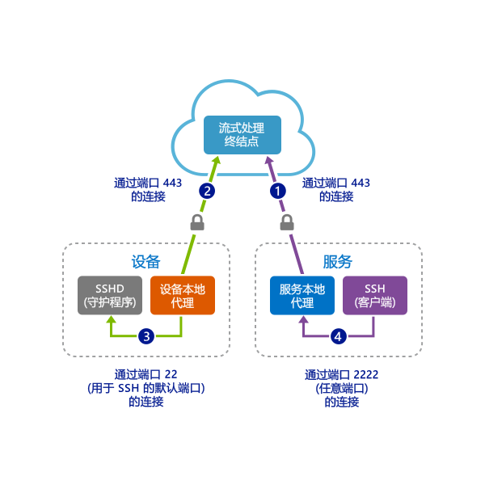
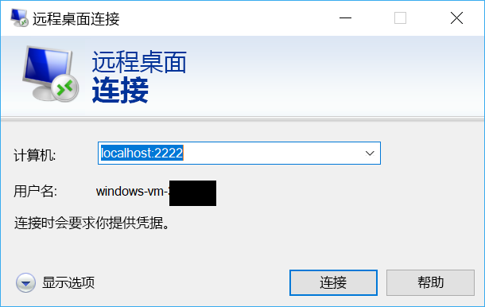

# <a name="quickstart-sshrdp-over-iot-hub-device-streams-using-c-proxy-applications-preview"></a>快速入门：使用 C# 应用程序代理通过 IoT 中心设备流实现 SSH/RDP 方案（预览）

[!INCLUDE [iot-hub-quickstarts-4-selector](../../includes/iot-hub-quickstarts-4-selector.md)]

服务和设备应用程序可以使用 [IoT 中心设备流](./iot-hub-device-streams-overview.md)以安全且防火墙友好的方式进行通信。 本快速入门指南涉及两个 C# 程序，在其中，可以使用通过 IoT 中心建立的设备流发送客户端/服务器应用程序流量（例如 SSH 和 RDP）。 有关设置概述，请参阅[此文](./iot-hub-device-streams-overview.md#local-proxy-sample-for-ssh-or-rdp)。

本文首先介绍 SSH 的设置（使用端口 22）。 然后介绍如何修改设置中的 RDP 端口。 由于设备流不区分应用程序和协议，因此，可以修改同一示例来适应其他类型的应用程序流量。 这通常只需将通信端口更改为目标应用程序所用的端口。


## <a name="how-it-works"></a>工作原理：

下图演示了此示例中的设备本地和服务本地代理程序设置如何在 SSH 客户端与 SSH 守护程序之间实现端到端的连接。 此处假设守护程序在设备本地代理所在的同一台设备上运行。



1. 服务本地代理连接到 IoT 中心，并使用其设备 ID 向目标设备发起设备流。

2. 设备本地代理完成流发起握手，并通过 IoT 中心的流式处理终结点与服务端建立端到端的流式处理隧道。

3. 设备本地代理连接到侦听设备端口 22（此端口可配置，[如下](#run-the-device-local-proxy)所述）的 SSH 守护程序 (SSHD)。

4. 服务本地代理通过侦听指定的端口（在本例中为端口 2222，此端口也可配置，[如下](#run-the-service-local-proxy)所述），等待用户建立新的 SSH 连接。 当用户通过 SSH 客户端连接时，该隧道使应用程序流量可在 SSH 客户端与服务器程序之间进行交换。

> [!NOTE]
> 通过该流发送的 SSH 流量将通过 IoT 中心的流式处理终结点以隧道方式进行传输，而不是直接在服务与设备之间发送。 这就带来了[这些优势](./iot-hub-device-streams-overview.md#benefits)。

[!INCLUDE [cloud-shell-try-it.md](../../includes/cloud-shell-try-it.md)]

如果还没有 Azure 订阅，可以在开始前创建一个[免费帐户](https://azure.microsoft.com/free/?WT.mc_id=A261C142F)。

## <a name="prerequisites"></a>先决条件

本快速入门中运行的两个示例应用程序是使用 C# 编写的。 开发计算机上需要有 .NET Core SDK 2.1.0 或更高版本。

可以从 [.NET](https://www.microsoft.com/net/download/all) 为多个平台下载 .NET Core SDK。

可以使用以下命令验证开发计算机上 C# 的当前版本：

```
dotnet --version
```

从 https://github.com/Azure-Samples/azure-iot-samples-csharp/archive/master.zip 下载示例 C# 项目并提取 ZIP 存档。


## <a name="create-an-iot-hub"></a>创建 IoT 中心

[!INCLUDE [iot-hub-include-create-hub](../../includes/iot-hub-include-create-hub-device-streams.md)]

## <a name="register-a-device"></a>注册设备

必须先将设备注册到 IoT 中心，然后该设备才能进行连接。 在本快速入门中，将使用 Azure Cloud Shell 来注册模拟设备。

1. 在 Azure Cloud Shell 中运行以下命令，以添加 IoT 中心 CLI 扩展并创建设备标识。 

   **YourIoTHubName**：将下面的占位符替换为你为 IoT 中心选择的名称。

   **MyDevice**：这是为注册的设备提供的名称。 如示例中所示使用 MyDevice。 如果为设备选择不同名称，则可能还需要在本文中从头至尾使用该名称，并在运行示例应用程序之前在其中更新设备名称。

    ```azurecli-interactive
    az extension add --name azure-cli-iot-ext
    az iot hub device-identity create --hub-name YourIoTHubName --device-id MyDevice
    ```

2. 在 Azure Cloud Shell 中运行以下命令，以获取刚注册设备的_设备连接字符串_：

   **YourIoTHubName**：将下面的占位符替换为你为 IoT 中心选择的名称。

    ```azurecli-interactive
    az iot hub device-identity show-connection-string --hub-name YourIoTHubName --device-id MyDevice --output table
    ```

    记下设备连接字符串，如以下示例所示：

   `HostName={YourIoTHubName}.azure-devices.net;DeviceId=MyDevice;SharedAccessKey={YourSharedAccessKey}`

    稍后会在快速入门中用到此值。

3. 此外，需要使用 IoT 中心的服务连接字符串才能让服务端应用程序连接到 IoT 中心并建立设备流。 以下命令检索 IoT 中心的此值：

   **YourIoTHubName**：将下面的占位符替换为你为 IoT 中心选择的名称。

    ```azurecli-interactive
    az iot hub show-connection-string --policy-name service --hub-name YourIoTHubName
    ```

    记下返回的值，如下所示：

   `"HostName={YourIoTHubName}.azure-devices.net;SharedAccessKeyName=service;SharedAccessKey={YourSharedAccessKey}"`
    

## <a name="ssh-to-a-device-via-device-streams"></a>使用 SSH 通过设备流连接到设备

### <a name="run-the-device-local-proxy"></a>运行设备本地代理

导航到解压缩的项目文件夹中的 `device-streams-proxy/device`。 需要准备好以下信息：

| 参数名称 | 参数值 |
|----------------|-----------------|
| `deviceConnectionString` | 前面创建的设备的连接字符串。 |
| `targetServiceHostName` | SSH 服务器侦听的 IP 地址（如果设备本地代理在同一 IP 上运行，则此地址为 `localhost`）。 |
| `targetServicePort` | 应用程序协议使用的端口（默认情况下，对于 SSH 连接，此端口为端口 22）。  |

按如下所示编译并运行代码：

```
cd ./iot-hub/Quickstarts/device-streams-proxy/device/

# Build the application
dotnet build

# Run the application
# In Linux/MacOS
dotnet run $deviceConnectionString localhost 22

# In Windows
dotnet run %deviceConnectionString% localhost 22
```

### <a name="run-the-service-local-proxy"></a>运行服务本地代理

导航到解压缩的项目文件夹中的 `device-streams-proxy/service`。 需要准备好以下信息：

| 参数名称 | 参数值 |
|----------------|-----------------|
| `iotHubConnectionString` | IoT 中心的服务连接字符串。 |
| `deviceId` | 前面创建的设备标识符。 |
| `localPortNumber` | SSH 客户端要连接到的本地端口。 本示例使用端口 2222，但可以修改为其他任意端口号。 |

按如下所示编译并运行代码：

```
cd ./iot-hub/Quickstarts/device-streams-proxy/service/

# Build the application
dotnet build

# Run the application
# In Linux/MacOS
dotnet run $serviceConnectionString MyDevice 2222

# In Windows
dotnet run %serviceConnectionString% MyDevice 2222
```

### <a name="run-ssh-client"></a>运行 SSH 客户端

现在，请使用 SSH 客户端程序并连接到端口 2222 上的服务本地代理（而不要直接连接到 SSH 守护程序）。 

```
ssh <username>@localhost -p 2222
```

此时会看到 SSH 登录提示，其中要求输入凭据。

服务端中的控制台输出（服务本地代理侦听端口 2222）：


通过 `IP_address:22` 连接到 SSH 守护程序的设备本地代理中的控制台输出：


SSH 客户端程序的控制台输出（SSH 客户端通过连接到服务本地代理侦听的端口 22 来与 SSH 守护程序通信）：


## <a name="rdp-to-a-device-via-device-streams"></a>使用 RDP 通过设备流连接到设备

RDP 的设置与 SSH 设置（如上所述）非常类似。 简单而言，我们只需改用 RDP 目标 IP 和端口 3389，并使用 RDP 客户端（而不是 SSH 客户端）。

### <a name="run-the-device-local-proxy-rdp"></a>运行设备本地代理 (RDP)

导航到解压缩的项目文件夹中的 `device-streams-proxy/device`。 需要准备好以下信息：

| 参数名称 | 参数值 |
|----------------|-----------------|
| `DeviceConnectionString` | 前面创建的设备的连接字符串。 |
| `targetServiceHostName` | 运行 RDP 服务器的主机名或 IP 地址（如果设备本地代理在同一 IP 上运行，则此地址为 `localhost`）。 |
| `targetServicePort` | 应用程序协议使用的端口（默认情况下，对于 RDP 连接，此端口为端口 3389）。  |

按如下所示编译并运行代码：

```
cd ./iot-hub/Quickstarts/device-streams-proxy/device

# Run the application
# In Linux/MacOS
dotnet run $DeviceConnectionString localhost 3389

# In Windows
dotnet run %DeviceConnectionString% localhost 3389
```

### <a name="run-the-service-local-proxy-rdp"></a>运行服务器本地代理 (RDP)

导航到解压缩的项目文件夹中的 `device-streams-proxy/service`。 需要准备好以下信息：

| 参数名称 | 参数值 |
|----------------|-----------------|
| `iotHubConnectionString` | IoT 中心的服务连接字符串。 |
| `deviceId` | 前面创建的设备标识符。 |
| `localPortNumber` | SSH 客户端要连接到的本地端口。 本示例使用端口 2222，但可以修改为其他任意端口号。 |

按如下所示编译并运行代码：

```
cd ./iot-hub/Quickstarts/device-streams-proxy/service/

# Build the application
dotnet build

# Run the application
# In Linux/MacOS
dotnet run $serviceConnectionString MyDevice 2222

# In Windows
dotnet run %serviceConnectionString% MyDevice 2222
```

### <a name="run-rdp-client"></a>运行 RDP 客户端

现在，请使用 RDP 客户端程序并连接到端口 2222（这是前面选择的任意可用端口）上的服务本地代理。



## <a name="clean-up-resources"></a>清理资源

[!INCLUDE [iot-hub-quickstarts-clean-up-resources](../../includes/iot-hub-quickstarts-clean-up-resources-device-streams.md)]

## <a name="next-steps"></a>后续步骤

在本快速入门中，你设置了一个 IoT 中心、注册了一个设备、部署了一个设备和一个用于通过 IoT 中心建立设备流的服务本地代理程序，并使用了代理通过隧道传输 SSH 或 RDP 流量。 相同的模式可以适应其他客户端/服务器协议（其中的服务器（例如 SSH 守护程序）在设备上运行）。

请使用以下链接详细了解设备流：

> [!div class="nextstepaction"]
> [设备流概述](./iot-hub-device-streams-overview.md)
