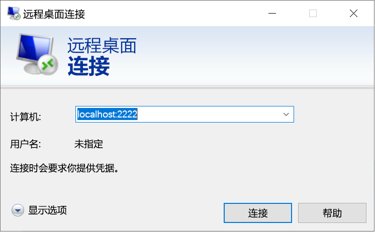

# <a name="quickstart-enable-ssh-and-rdp-over-an-iot-hub-device-stream-by-using-a-nodejs-proxy-application-preview"></a>快速入门：使用 Node.js 代理应用程序通过 IoT 中心设备流实现 SSH 和 RDP 方案（预览）

[!INCLUDE [iot-hub-quickstarts-4-selector](../../includes/iot-hub-quickstarts-4-selector.md)]

Microsoft Azure IoT 中心目前支持设备流作为[预览版功能](https://azure.microsoft.com/support/legal/preview-supplemental-terms/)。

服务和设备应用程序可以使用 [IoT 中心设备流](./iot-hub-device-streams-overview.md)以安全且防火墙友好的方式进行通信。 

本快速入门介绍如何执行一个在服务端运行的 Node.js 代理应用程序，以通过设备流将安全外壳 (SSH) 和远程桌面协议 (RDP) 流量发送到设备。 有关设置概述，请参阅[本地代理示例](./iot-hub-device-streams-overview.md#local-proxy-sample-for-ssh-or-rdp)。 

在公共预览期，Node.js SDK 仅支持服务端的设备流。 因此，本快速入门只会提供有关运行服务本地代理应用程序的说明。 若要运行设备本地代理应用程序，请参阅：  

   * [使用 C# 代理应用程序通过 IoT 中心设备流实现 SSH 和 RDP 方案](./quickstart-device-streams-proxy-c.md)
   * [使用 C 代理应用程序通过 IoT 中心设备流实现 SSH 和 RDP 方案](./quickstart-device-streams-proxy-csharp.md)

本文将介绍 SSH 的设置（使用端口 22），然后介绍如何修改 RDP 的设置（使用端口 3389）。 由于设备流不区分应用程序和协议，因此，可以修改同一示例（通常是修改通信端口）来适应其他类型的客户端/服务器应用程序流量。

[!INCLUDE [cloud-shell-try-it.md](../../includes/cloud-shell-try-it.md)]

如果还没有 Azure 订阅，可以在开始前创建一个[免费帐户](https://azure.microsoft.com/free/?WT.mc_id=A261C142F)。

## <a name="prerequisites"></a>先决条件

* 目前仅以下区域中创建的 IoT 中心支持设备流预览：

  * 美国中部
  * 美国中部 EUAP

* 若要运行本快速入门中所述的服务本地应用程序，需要在开发计算机上安装 Node.js v10.x.x 或更高版本。
  * 下载适用于多个平台的 [Node.js](https://nodejs.org)。
  * 使用以下命令验证开发计算机上 Node.js 的当前版本：

   ```
   node --version
   ```

* 运行以下命令，将用于 Azure CLI 的 Azure IoT 扩展添加到 Cloud Shell 实例。 IOT 扩展会将 IoT 中心、IoT Edge 和 IoT 设备预配服务 (DPS) 特定的命令添加到 Azure CLI。

    ```azurecli-interactive
    az extension add --name azure-cli-iot-ext
    ```

* [下载示例 Node.js 项目](https://github.com/Azure-Samples/azure-iot-samples-node/archive/streams-preview.zip)并解压缩 ZIP 存档（如果尚未这样做）。

## <a name="create-an-iot-hub"></a>创建 IoT 中心

如果已完成上一[快速入门：将遥测数据从设备发送到 IoT 中心](quickstart-send-telemetry-node.md)，则可以跳过此步骤。

[!INCLUDE [iot-hub-include-create-hub-device-streams](../../includes/iot-hub-include-create-hub-device-streams.md)]

## <a name="register-a-device"></a>注册设备

如果已完成[快速入门：将遥测数据从设备发送到 IoT 中心](quickstart-send-telemetry-node.md)，则可以跳过此步骤。

必须先将设备注册到 IoT 中心，然后该设备才能进行连接。 在本部分，我们将使用 Azure Cloud Shell 来注册模拟设备。

1. 若要创建设备标识，请在 Cloud Shell 中运行以下命令：

   > [!NOTE]
   > * 请将 *YourIoTHubName* 占位符替换为你为 IoT 中心选择的名称。
   > * 对于正在注册的设备的名称，建议使用 *MyDevice*，如下所示。 如果为设备选择其他名称，请在本文中从头至尾使用该名称，并在运行示例应用程序之前在其中更新设备名称。

    ```azurecli-interactive
    az iot hub device-identity create --hub-name {YourIoTHubName} --device-id MyDevice
    ```

1. 为使后端应用程序能够连接到 IoT 中心并检索消息，还需要一个服务连接字符串。  以下命令检索 IoT 中心的该字符串：

   > [!NOTE]
   > 请将 *YourIoTHubName* 占位符替换为你为 IoT 中心选择的名称。

    ```azurecli-interactive
    az iot hub show-connection-string --policy-name service --name {YourIoTHubName} --output table
    ```

   请记下返回的服务连接字符串，以便稍后在此快速入门中使用。 如以下示例所示：

   `"HostName={YourIoTHubName}.azure-devices.net;SharedAccessKeyName=service;SharedAccessKey={YourSharedAccessKey}"`

## <a name="ssh-to-a-device-via-device-streams"></a>使用 SSH 通过设备流连接到设备

在此部分，请建立一个端到端的流，通过隧道来传输 SSH 流量。

### <a name="run-the-device-local-proxy-application"></a>运行设备本地代理应用程序

如前所述，IoT 中心 Node.js SDK 仅支持服务端的设备流。 对于设备本地应用程序，请使用下述快速入门之一中提供的设备代理应用程序：

   * [使用 C 代理应用程序通过 IoT 中心设备流实现 SSH 和 RDP 方案](./quickstart-device-streams-proxy-c.md)
   * [使用 C# 代理应用程序通过 IoT 中心设备流实现 SSH 和 RDP 方案](./quickstart-device-streams-proxy-csharp.md) 

在继续下一步之前，请确保设备本地代理应用程序正在运行。

### <a name="run-the-service-local-proxy-application"></a>运行服务本地代理应用程序

当设备本地代理应用程序正在运行时，请在本地终端窗口中执行以下操作，以便运行以 Node.js 编写的服务本地代理应用程序：

1. 对于环境变量，请提供服务凭据、运行 SSH 守护程序的目标设备 ID，以及设备上运行的代理的端口号。

   ```
   # In Linux
   export IOTHUB_CONNECTION_STRING="{ServiceConnectionString}"
   export STREAMING_TARGET_DEVICE="MyDevice"
   export PROXY_PORT=2222

   # In Windows
   SET IOTHUB_CONNECTION_STRING={ServiceConnectionString}
   SET STREAMING_TARGET_DEVICE=MyDevice
   SET PROXY_PORT=2222
   ```

   更改 ServiceConnectionString 占位符以匹配服务连接字符串，并更改 **MyDevice** 以匹配设备 ID（如果你给自己的设备起了不同的名称）。

1. 导航到解压缩的项目文件夹中的 `Quickstarts/device-streams-service` 目录。 使用以下代码运行服务本地代理应用程序：

   ```
   cd azure-iot-samples-node-streams-preview/iot-hub/Quickstarts/device-streams-service

   # Install the preview service SDK, and other dependencies
   npm install azure-iothub@streams-preview
   npm install

   # Run the service-local proxy application
   node proxy.js
   ```

### <a name="ssh-to-your-device-via-device-streams"></a>使用 SSH 通过设备流连接到设备

在 Linux 中，请在终端上使用 `ssh $USER@localhost -p 2222` 运行 SSH。 在 Windows 中，请使用偏好的 SSH 客户端（例如 PuTTY）。

建立 SSH 会话后服务本地的控制台输出（服务本地代理应用程序侦听端口 2222）：


SSH 客户端应用程序的控制台输出（SSH 客户端通过连接到服务本地代理应用程序侦听的端口 22 来与 SSH 守护程序通信）：


### <a name="rdp-to-your-device-via-device-streams"></a>使用 RDP 通过设备流连接到设备

现在，请使用 RDP 客户端应用程序并连接到端口 2222（前面选择的任意端口）上的服务代理。

> [!NOTE]
> 请确保根据 RDP 设置正确配置设备代理，并在其中配置 RDP 端口 3389。



## <a name="clean-up-resources"></a>清理资源

[!INCLUDE [iot-hub-quickstarts-clean-up-resources](../../includes/iot-hub-quickstarts-clean-up-resources-device-streams.md)]

## <a name="next-steps"></a>后续步骤

在本快速入门中，我们设置了一个 IoT 中心、注册了一个设备，并部署了一个可在 IoT 设备上启用 RDP 和 SSH 的服务代理应用程序。 RDP 和 SSH 流量将在 IoT 中心通过设备流以隧道方式传输。 使用此过程就无需与设备建立直接连接。

若要详细了解设备流，请参阅：

> [!div class="nextstepaction"]
> [设备流概述](./iot-hub-device-streams-overview.md)
