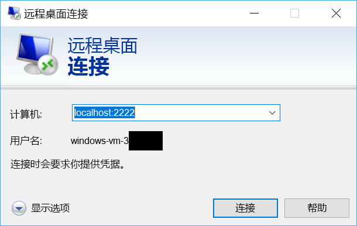

# <a name="quickstart-sshrdp-over-iot-hub-device-streams-using-nodejs-proxy-application-preview"></a>快速入门：使用 Node.js 应用程序代理通过 IoT 中心设备流实现 SSH/RDP 方案（预览）

[!INCLUDE [iot-hub-quickstarts-4-selector](../../includes/iot-hub-quickstarts-4-selector.md)]

Microsoft Azure IoT 中心目前支持设备流作为[预览版功能](https://azure.microsoft.com/support/legal/preview-supplemental-terms/)。

服务和设备应用程序可以使用 [IoT 中心设备流](./iot-hub-device-streams-overview.md)以安全且防火墙友好的方式进行通信。 本快速入门指南介绍如何执行一个在服务端中运行的 Node.js 代理应用程序，以通过设备流将 SSH 和 RDP 流量发送到设备。 有关设置概述，请参阅[此文](./iot-hub-device-streams-overview.md#local-proxy-sample-for-ssh-or-rdp)。 在公共预览期，Node.js SDK 仅支持服务端的设备流。 因此，本快速入门指南只会提供有关运行服务本地代理的说明。 应该运行 [C 快速入门](./quickstart-device-streams-proxy-c.md)或 [C# 快速入门](./quickstart-device-streams-proxy-csharp.md)指南中随附的设备本地代理。

本文首先介绍 SSH 的设置（使用端口 22）。 然后介绍如何修改 RDP 的设置（使用端口 3389）。 由于设备流不区分应用程序和协议，因此，可以修改同一示例（通常是修改通信端口）来适应其他类型的客户端/服务器应用程序流量。

[!INCLUDE [cloud-shell-try-it.md](../../includes/cloud-shell-try-it.md)]

如果还没有 Azure 订阅，可以在开始前创建一个[免费帐户](https://azure.microsoft.com/free/?WT.mc_id=A261C142F)。

## <a name="prerequisites"></a>先决条件

目前仅以下区域中创建的 IoT 中心支持设备流预览：

  - 美国中部
  - **美国中部 EUAP**

若要运行本快速入门中所述的服务本地应用程序，需要在开发计算机上安装 Node.js v4.x.x 或更高版本。

可从 [nodejs.org](https://nodejs.org) 为下载适用于多个平台的 Node.js。

可以使用以下命令验证开发计算机上 Node.js 当前的版本：

```
node --version
```

运行以下命令将用于 Azure CLI 的 Microsoft Azure IoT 扩展添加到 Cloud Shell 实例。 IOT 扩展会将 IoT 中心、IoT Edge 和 IoT 设备预配服务 (DPS) 特定的命令添加到 Azure CLI。

```azurecli-interactive
az extension add --name azure-cli-iot-ext
```

如果尚未进行此操作，请从 https://github.com/Azure-Samples/azure-iot-samples-node/archive/streams-preview.zip 下载示例 Node.js 项目并提取 ZIP 存档。

## <a name="create-an-iot-hub"></a>创建 IoT 中心

如果已完成上一[快速入门：将遥测数据从设备发送到 IoT 中心](quickstart-send-telemetry-node.md)，则可以跳过此步骤。

[!INCLUDE [iot-hub-include-create-hub](../../includes/iot-hub-include-create-hub-device-streams.md)]

## <a name="register-a-device"></a>注册设备

如果已完成上一[快速入门：将遥测数据从设备发送到 IoT 中心](quickstart-send-telemetry-node.md)，则可以跳过此步骤。

必须先将设备注册到 IoT 中心，然后该设备才能进行连接。 在本快速入门中，将使用 Azure Cloud Shell 来注册模拟设备。

1. 在 Azure Cloud Shell 中运行以下命令，以创建设备标识。

   **YourIoTHubName**：将下面的占位符替换为你为 IoT 中心选择的名称。

   **MyDevice**：这是为注册的设备提供的名称。 如示例中所示使用 MyDevice。 如果为设备选择不同名称，则可能还需要在本文中从头至尾使用该名称，并在运行示例应用程序之前在其中更新设备名称。

    ```azurecli-interactive
    az iot hub device-identity create --hub-name YourIoTHubName --device-id MyDevice
    ```

2. 还需一个服务连接字符串，以便后端应用程序能够连接到 IoT 中心并检索消息。 以下命令检索 IoT 中心的服务连接字符串：

    **YourIoTHubName**：将下面的占位符替换为你为 IoT 中心选择的名称。

    ```azurecli-interactive
    az iot hub show-connection-string --policy-name service --name YourIoTHubName
    ```

    记下返回的值，如下所示：

   `"HostName={YourIoTHubName}.azure-devices.net;SharedAccessKeyName=service;SharedAccessKey={YourSharedAccessKey}"`

## <a name="ssh-to-a-device-via-device-streams"></a>使用 SSH 通过设备流连接到设备

### <a name="run-the-device-local-proxy"></a>运行设备本地代理

如前所述，IoT 中心 Node.js SDK 仅支持服务端的设备流。 对于设备本地应用程序，请使用 [C 快速入门](./quickstart-device-streams-proxy-c.md)或 [C# 快速入门](./quickstart-device-streams-proxy-csharp.md)指南中随附的设备代理程序。 请继续下一步之前，请确保设备本地代理正在运行。

### <a name="run-the-service-local-proxy"></a>运行服务本地代理

假设[设备本地代理](#run-the-device-local-proxy)正在运行，请遵循以下步骤运行以 Node.js 编写的服务本地代理：

- 以环境变量的形式提供服务凭据、运行 SSH 守护程序的目标设备 ID，以及设备上运行的代理的端口号。
  ```
  # In Linux
  export IOTHUB_CONNECTION_STRING="<provide_your_service_connection_string>"
  export STREAMING_TARGET_DEVICE="MyDevice"
  export PROXY_PORT=2222

  # In Windows
  SET IOTHUB_CONNECTION_STRING=<provide_your_service_connection_string>
  SET STREAMING_TARGET_DEVICE=MyDevice
  SET PROXY_PORT=2222
  ```
  更改上述值以匹配设备 ID 和连接字符串。

- 导航到解压缩的项目文件夹中的 `Quickstarts/device-streams-service`，并运行服务本地代理。
  ```
  cd azure-iot-samples-node-streams-preview/iot-hub/Quickstarts/device-streams-service

  # Install the preview service SDK, and other dependencies
  npm install azure-iothub@streams-preview
  npm install

  # Run the service-local proxy application
  node proxy.js
  ```

### <a name="ssh-to-your-device-via-device-streams"></a>使用 SSH 通过设备流连接到设备

在 Linux 中，请在终端上使用 `ssh $USER@localhost -p 2222` 运行 SSH。 在 Windows 中，请使用偏好的 SSH 客户端（例如 PuTTY）。

建立 SSH 会话后服务本地的控制台输出（服务本地代理侦听端口 2222）：

SSH 客户端程序的控制台输出（SSH 客户端通过连接到服务本地代理侦听的端口 22 来与 SSH 守护程序通信）：

### <a name="rdp-to-your-device-via-device-streams"></a>使用 RDP 通过设备流连接到设备

现在，请使用 RDP 客户端程序并连接到端口 2222（这是前面选择的任意可用端口）上的服务代理。

> [!NOTE]
> 请确保根据 RDP 设置正确配置设备代理，并在其中配置 RDP 端口 3389。



## <a name="clean-up-resources"></a>清理资源

[!INCLUDE [iot-hub-quickstarts-clean-up-resources](../../includes/iot-hub-quickstarts-clean-up-resources-device-streams.md)]

## <a name="next-steps"></a>后续步骤

在本快速入门中，你设置了一个 IoT 中心、注册了一个设备，并部署了一个用于通过 RDP 和 SSH 连接到 IoT 设备的服务代理程序。 将使用设备流通过 IoT 中心以隧道方式传输 RDP 和 SSH 流量。 这样就无需与设备建立直接连接。

请使用以下链接详细了解设备流：

> [!div class="nextstepaction"]
> [设备流概述](./iot-hub-device-streams-overview.md)
